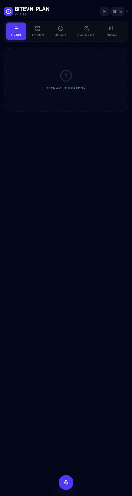
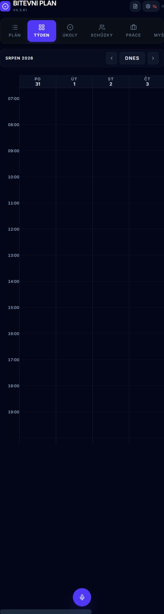
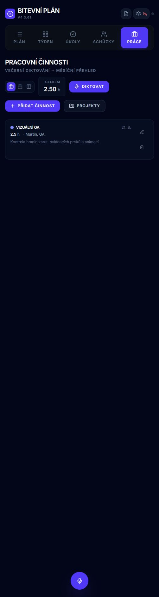
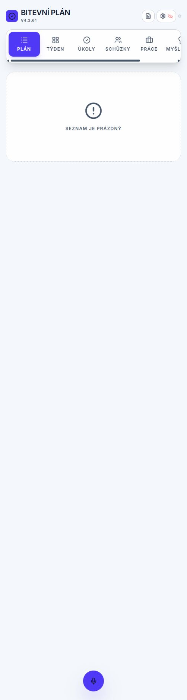
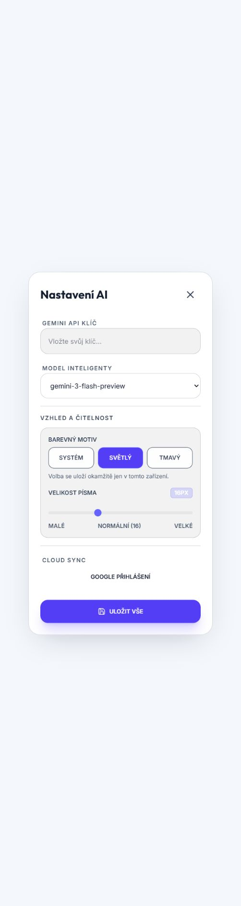
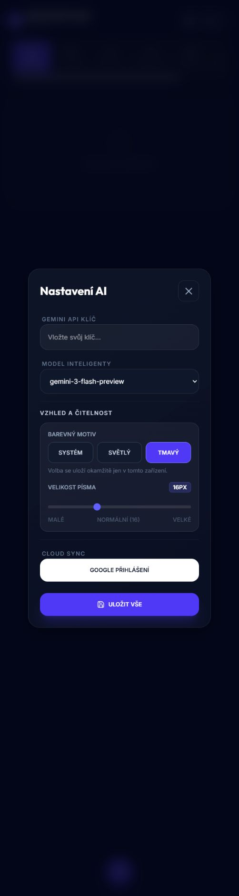

# Audit designu, ergonomie a barevného schématu

Datum: 2026-09-04

Větev: `codex/design-ergonomics-theme-audit`

Režim: kombinovaný UX + accessibility audit

## Rozsah auditu

Audit pokrývá hlavní mobilní shell, prázdný plán, týdenní kalendář, přehled pracovních činností a nastavení. Posuzuje rozmístění prvků, čitelnost, stavovou zpětnou vazbu, motion, responzivní chování a připravenost na systémový/světlý/tmavý motiv.

## Uživatelský cíl a accessibility target

Uživatel má rychle rozpoznat aktivní pracovní oblast, stav aplikace a dostupné akce bez závislosti na barvě nebo hoveru. Rozhraní má zůstat čitelné při zvětšení, úzkém viewportu, klávesnici a `prefers-reduced-motion`; text a ovládací prvky mají cílit alespoň na WCAG 2.2 AA.

## Zachycené kroky

### 1. Hlavní plán — stav vyžaduje zásah

- Silná stránka: aktivní sekce a globální hlasová akce jsou vizuálně zřetelné.
- UX riziko: horizontální navigace nekomunikuje, že obsahuje další položky; na zachycené šířce nejsou všechny sekce dostupné bez skrytého posunu.
- Accessibility riziko: sekundární popisky a empty state jsou velmi tlumené; v kódu používají kombinace `text-slate-500/600` na `slate-950`, které mohou být pod 4.5:1.
- Příležitost: přejít z pevně širokých položek na rovnoměrně dostupný, horizontálně posuvný rail se scroll hintem a bezpečným focus scrollováním.

### 2. Týdenní kalendář — stav vyžaduje zásah

- Silná stránka: časová mřížka a samostatný ovládací řádek týdne mají jasnou strukturu.
- UX riziko: uživatel vidí jen část týdne a současně část hlavní navigace; dvě horizontálně posuvné oblasti soutěží o gesto bez výrazného affordance.
- Accessibility riziko: názvy dnů, časové značky a mřížka mají nízký kontrast; samotná barva nesmí být jediným nositelem dne/stavu.
- Příležitost: zachovat horizontální kalendář, ale zřetelně oddělit jeho scroll affordance od hlavního navigačního railu a v obou motivech ověřit focus/kontrast.

### 3. Pracovní činnosti — převážně zdravé, potřebuje sjednocení

- Silná stránka: hlavní akce, součet a záznam tvoří srozumitelnou pracovní hierarchii; karta drží ovládání uvnitř hranic.
- UX riziko: horní přepínač zobrazení, dvě hlavní CTA a fixní mikrofon vytvářejí tři konkurenční akční zóny. Hlasová akce je navíc duplikovaná v obsahu a globálním FAB.
- Accessibility riziko: metadata, datum, popis a ikonové edit/delete akce jsou vizuálně příliš slabé. Globální mikrofon nemá ve všech stavech explicitní `aria-label`, `aria-busy` a stavové oznámení.
- Příležitost: sjednotit pracovní stavy `idle / recording / processing / success / error` do jedné sémantické mapy a ponechat motion pouze jako doprovod textu/ARIA stavu.

### 4. Nastavení — zdravý základ, chybí theme kontrakt

- Silná stránka: dialog má jasné skupiny, velké cíle a ovládání velikosti písma.
- UX riziko: sekce se jmenuje „Vzhled a čitelnost“, ale neobsahuje volbu motivu; uživatel nemůže respektovat systém ani vynutit light/dark.
- Accessibility riziko: accessibility strom obsahuje dva nadpisy „Nastavení AI“ a některé labely/slider popisky jsou příliš tmavé. Dokument zároveň zakazuje zoom přes viewport meta tag.
- Příležitost: přidat třípolohovou volbu `Podle systému / Světlý / Tmavý`, bez bliknutí při startu, s nativním `color-scheme` a per-theme kontrastní kontrolou.

## Nejvyšší priority

1. Zavést semantic theme tokeny a dvoustavové resolved schéma řízené třípolohovou preferencí.
2. Odstranit zákaz zoomu a opravit kontrast běžného textu, metadat, focus ringů a stavových barev v obou motivech.
3. Opravit mobilní navigační rail, aby žádná sekce nebyla zdánlivě odříznutá a aktivní/focusovaná položka se dostala do pohledu.
4. Sjednotit motion a pracovní stavy; odstranit široké `transition-all` v dotčených plochách a doplnit textové/ARIA ekvivalenty.
5. Ověřit téma, focus, reflow a reduced motion v reálném browseru; unit testy ponechat pro preference a sémantické mapování.

## Ověření implementačního řezu

### Světlý hlavní shell

- Navigace má viditelný scrollbar i okrajový fade a každá položka má stabilní minimální šířku. Focusovaná položka se automaticky odhalí.
- Canvas, karta prázdného stavu, text a hlavní hlasová akce zůstávají čitelné bez tmavého ostrova v obsahu.

### Světlé a tmavé nastavení

- Třípolohová volba `Systém / Světlý / Tmavý` se ukládá okamžitě a její stav je programově rozpoznatelný přes `aria-pressed`.
- Accessibility tree nyní obsahuje jediný dialogový nadpis. Ovládací prvky mají velké dotykové cíle a motiv přepíná i nativní `color-scheme` a browser chrome barvu.
- Zoom už není blokovaný viewport meta tagem. Reduced-motion nadále vypíná nekonečné animace a globální mikrofon má stavový accessible name, busy flag a polite status.

### Výsledek

Auditované P1 mezery (chybějící theme volba, zákaz zoomu, duplicitní dialogový nadpis, neoznačený mic stav a skrytá mobilní navigace) jsou v tomto řezu opravené. Širokou historickou paletu pokrývá přechodový theme bridge, takže light režim funguje napříč stávajícími route bez rizikové jednorázové přestavby všech doménových komponent. Nové UI má používat sémantické surface role; postupná interní tokenizace jednotlivých karet zůstává bezpečná následná údržba.

## Limity důkazů

- Screenshoty dokazují vizuální stav pouze v aktuálním mobilním viewportu interního prohlížeče Codexu.
- Ze screenshotů nelze potvrdit plnou WCAG shodu, screen-reader chování, první paint bez FOUC ani výkon animací. Tyto body vyžadují DOM/computed-style, klávesnicové a motion testy po implementaci.
- Stav s hustým task/meeting obsahem nebyl v této session dostupný; kalendářní collision a drag kontrakt proto zůstává opřený o existující testy a repo learnings.
