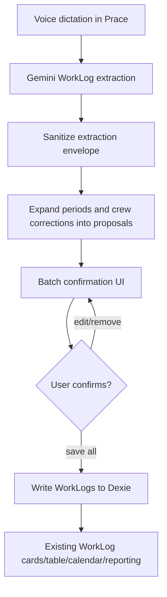

# WorkLog Batch Extraction - Plan

## Goal Capsule

| Field | Value |
| --- | --- |
| Objective | Extend Prace voice dictation so one natural Czech dictation can create multiple daily WorkLog entries from relative periods, crew descriptions, hours-per-person, and follow-up corrections. |
| Product authority | `docs/README.md`, `docs/AI_MANIFEST.md`, `logika_zaznamu.md`, and the accepted conversation rule that WorkLog hours should represent person-hours for reporting. |
| Execution profile | Feature work touching AI extraction, WorkLog confirmation UI, validation, tests, and documentation. |
| Stop conditions | Stop if implementation would require replacing WorkLog reporting entirely, changing Google Drive file ownership, or resolving payroll identity management beyond anonymous worker labels. |
| Tail ownership | Implementation should bump the app version as a minor release before production deploy because this adds a new WorkLog capability. |

---

## Product Contract

### Summary

This plan upgrades the Prace voice flow from single-row extraction to reviewable batch extraction. A dictation such as "minuly tyden na projektu Plaza jsme byli kazdy den ja, Sergej a jeho bratr, 10 hodin denne; ve stredu jeste jeden clovek navic" should produce one proposed WorkLog per affected day, with person-hours calculated for reporting and assumptions visible before save.

### Problem Frame

The current WorkLog extractor returns one object with one `date`, one `people` string, and one `hours` value. That shape works for simple dictation but loses information when the user describes an interval, a repeated crew, a per-day schedule, or a follow-up correction inside the same utterance.

Prace is evidence of real work, not a task list. The model should therefore preserve factual traceability: who was there, which dates were covered, which facts were inferred, and how total hours were calculated.

### Requirements

**Date and period extraction**

- R1. The extractor resolves Czech relative dates against the actual current date supplied at request time, including `dnes`, `vcera`, named weekdays, `minuly tyden`, and `tento tyden`.
- R2. `minuly tyden` defaults to Monday through Friday unless the dictation explicitly names weekend work.
- R3. `kazdy den` applies to each workday in the active period, not to calendar days outside the period.
- R4. A named day inside a period, such as `ve stredu`, modifies only that day.

**Crew and people handling**

- R5. Named people are preserved as spoken, with light normalization only for separators and whitespace.
- R6. The word `ja` maps to the local user label already used by the app when available; otherwise it remains `Ja` until profile support exists.
- R7. Relationship-only people are preserved as meaningful labels, such as `Sergejuv bratr`, instead of being discarded.
- R8. Unnamed counted people become stable anonymous labels within the extraction result, such as `Pracovnik 1` and `Pracovnik 2`.
- R9. A follow-up phrase like `jeste jeden clovek navic` adds an anonymous worker only to the date or period it modifies.

**Hours and reporting**

- R10. WorkLog `hours` represents reportable person-hours for new batch voice entries.
- R11. When the user says `10 hodin denne` for a crew, the extractor treats that as hours per person per affected day unless the dictation says otherwise.
- R12. The confirmation UI shows the calculation behind person-hours, such as `3 lide x 10 h = 30 h`, before saving.
- R13. Validation accepts person-hour totals above 24 when the total is explained by crew size and hours per person.

**Review and save**

- R14. Batch extraction opens a confirmation screen where the user can review, edit, remove, or save individual proposed daily entries before any WorkLog is written.
- R15. Missing or uncertain project matching still routes through project selection before save.
- R16. The user can save all valid proposed entries in one action after review.
- R17. The UI displays model assumptions and unresolved uncertainties in human-readable Czech.

**Uncertainty and safety**

- R18. The extractor returns `needsConfirmation` when the date range, project, people count, or hours meaning cannot be inferred safely.
- R19. The extractor must not silently invent project names, named people, or work descriptions.
- R20. Schuzka-like dictation remains excluded from work-hour totals unless the user clearly frames it as performed work.

### Acceptance Examples

- AE1. Given today's date is Tuesday 2026-06-30, when the user says `minuly tyden na projektu Plaza jsme byli kazdy den ja, Sergej a jeho bratr, 10 hodin denne`, then the confirmation screen proposes five entries for 2026-06-22 through 2026-06-26, each with three people and 30 reportable hours.
- AE2. Given AE1's dictation continues `ve stredu tam byl jeste jeden clovek navic`, then only the 2026-06-24 proposal gains `Pracovnik 1` and changes to 40 reportable hours.
- AE3. When the user says `vcera na Plaze dva lidi 8 hodin`, then the proposal uses `Pracovnik 1, Pracovnik 2`, 8 hours per person, and 16 reportable hours.
- AE4. When the user says `minuly tyden Plaza 10 hodin denne` without naming people or count, then the UI shows the inferred default as uncertain and requires confirmation before save.
- AE5. When the user says `ve stredu porada na Plaze`, then the extraction does not create reportable work hours unless the dictation also says work was performed.

### Scope Boundaries

#### Included

- Batch proposal extraction for voice dictation in the Prace tab.
- Person-hour calculation, editability, and save-all behavior.
- Current WorkLog reports continuing to sum `hours`.
- Documentation updates for the new WorkLog contract.

#### Deferred to Follow-Up Work

- Full worker identity management, payroll profiles, or contact records.
- Per-person timesheets as first-class database entities.
- Automatic reconciliation of duplicate batch entries with existing WorkLogs.
- Natural-language edits to already saved WorkLogs.

#### Outside This Product Identity

- Turning Prace into a task planner.
- Treating meetings as billable work by default.

---

## Planning Contract

### Key Technical Decisions

- KTD1. Store `hours` as reportable person-hours for batch voice entries. Existing reporting already sums `hours`, so this keeps project and monthly totals useful while making crew-based dictation billable.
- KTD2. Add optional calculation metadata rather than replacing the WorkLog table with per-person rows. Metadata can explain `hoursPerPerson`, `peopleCount`, and assumptions without exploding ordinary project reporting into many rows.
- KTD3. Parse into proposed entries before writing to Dexie. The confirmation screen remains the safety gate where the user can correct dates, people, hours, and projects before persistence.
- KTD4. Keep single-entry dictation backward compatible. Simple inputs should still feel like the current flow, with one proposed entry shown in the same confirmation surface.
- KTD5. Move date and crew expansion into testable pure helpers. The prompt can ask Gemini for structured intent, but deterministic expansion and validation should be locally testable.
- KTD6. Treat this as a minor release. The visible version and `battle-plan/package.json` should advance because the user-facing WorkLog capture model changes.

### High-Level Technical Design

### Data Shape Direction

The implementation should introduce a batch extraction envelope that can carry multiple proposed entries, shared assumptions, and confirmation flags. Persisted WorkLogs should keep current core fields so existing views continue to work, with optional metadata added only where it helps explain person-hour calculations.

### System-Wide Impact

- WorkLog validation changes from a hard `<= 24` rule to a context-aware rule for person-hours.
- WorkLog sync must tolerate any added optional metadata in `work_logs_data.json`.
- Existing cards, table, and calendar should continue summing `hours` without knowing whether an entry came from single or batch dictation.
- Documentation must explain that WorkLog `hours` are reportable person-hours for batch voice entries.

### Risks and Mitigations

- Risk: Gemini may return inconsistent batch structures for complex Czech corrections. Mitigation: keep local sanitize/expand validation strict and require confirmation for ambiguous results.
- Risk: Allowing `hours > 24` could hide an accidental parse error. Mitigation: accept above 24 only when backed by people count and hours-per-person metadata; otherwise surface an error.
- Risk: Anonymous worker labels could drift across entries. Mitigation: label anonymous workers per extraction result and keep labels stable across all proposals in that result.
- Risk: Existing sync consumers may ignore new metadata. Mitigation: make metadata optional and non-critical for totals.

---

## Implementation Units

### U1. Extraction Contract and Prompt Upgrade

- **Goal:** Change WorkLog AI extraction from a single object to a batch-capable envelope while preserving simple one-entry dictation.
- **Requirements:** R1-R4, R10-R11, R18-R20, AE1-AE5.
- **Files:** `battle-plan/src/services/workLogExtractor.ts`, `docs/AI_MANIFEST.md`, `logika_zaznamu.md`.
- **Approach:** Define TypeScript types for extraction envelopes, proposed entries, assumptions, and confirmation flags. Update `WORKLOG_SYSTEM_PROMPT` to request structured batch proposals with relative-date and correction semantics.
- **Test Scenarios:** Add extractor contract tests covering one simple entry, a five-day previous-week entry, a Wednesday-only correction, meeting-like rejection, and missing people uncertainty.
- **Verification:** Unit tests for sanitizer behavior pass and existing TypeScript build remains green.

### U2. Deterministic Date and Crew Expansion Helpers

- **Goal:** Put period expansion, anonymous worker labeling, and person-hour math into pure helpers independent of React and network calls.
- **Requirements:** R1-R13, AE1-AE4.
- **Files:** `battle-plan/src/services/workLogExtractor.ts` or a new helper under `battle-plan/src/utils/`, plus matching tests.
- **Approach:** Add helpers that resolve relative periods using an injected reference date, expand repeated workdays, apply date-scoped corrections, and calculate total person-hours from people count and hours-per-person.
- **Test Scenarios:** Reference date Tuesday 2026-06-30 resolves previous workweek to 2026-06-22 through 2026-06-26; Wednesday correction changes only 2026-06-24; unnamed people produce stable `Pracovnik N` labels; total hours above 24 require calculation metadata.
- **Verification:** Pure helper tests pass without Gemini or IndexedDB.

### U3. WorkLog Data and Validation Extension

- **Goal:** Allow person-hour WorkLogs while keeping existing reports and sync compatible.
- **Requirements:** R10-R13, R16.
- **Files:** `battle-plan/src/db.ts`, `battle-plan/src/components/worklogs/WorkLogForm.tsx`, `battle-plan/src/components/worklogs/WorkLogCard.tsx`, `battle-plan/src/components/worklogs/WorkLogTable.tsx`, `battle-plan/src/services/workLogsSync.ts`.
- **Approach:** Add optional WorkLog metadata for calculation source and update validation rules so `hours > 24` is valid only when derived from crew calculations. Preserve old entries without migration requirements beyond Dexie schema compatibility.
- **Test Scenarios:** Existing manual entry with 8 hours still saves; batch entry with 30 person-hours saves when explained by 3 people x 10 hours; direct manual 30-hour entry without explanation is blocked or requires explicit confirmation.
- **Verification:** TypeScript build passes and sync serialization retains optional metadata.

### U4. Batch Confirmation UI

- **Goal:** Replace the one-row voice confirmation modal with a batch review surface that can still handle one-row dictation naturally.
- **Requirements:** R12, R14-R18, AE1-AE4.
- **Files:** `battle-plan/src/components/worklogs/WorkLogVoiceConfirm.tsx`, `battle-plan/src/components/worklogs/WorkLogVoiceBar.tsx`, `battle-plan/src/components/worklogs/ProjectPicker.tsx`.
- **Approach:** Render a list of proposed entries with editable date, project, people, hours-per-person, total hours, and description fields. Provide remove-entry and save-all actions, plus an assumptions panel.
- **Test Scenarios:** User can edit a single proposed day; user can remove the Wednesday extra-worker proposal if wrong; missing project blocks save-all until selected; assumptions remain visible before save.
- **Verification:** Component tests or manual browser verification cover simple and batch flows.

### U5. Persistence and Logging Flow

- **Goal:** Save all confirmed proposals atomically enough for the user experience and report the saved count clearly.
- **Requirements:** R14-R17.
- **Files:** `battle-plan/src/components/worklogs/WorkLogVoiceConfirm.tsx`, `battle-plan/src/components/worklogs/WorkLogVoiceBar.tsx`, `battle-plan/src/pages/WorkLogsPage.tsx`.
- **Approach:** Write each confirmed proposal as a WorkLog with shared source metadata. Return a summary result so the page log can say how many entries and total hours were saved.
- **Test Scenarios:** Save-all creates five entries for a five-day dictation; cancellation creates none; partial invalid entries keep the modal open and identify the invalid rows.
- **Verification:** IndexedDB state after save matches proposal count and totals.

### U6. Tests, Docs, and Release Bump

- **Goal:** Lock the new WorkLog behavior into documentation and release discipline.
- **Requirements:** R1-R20.
- **Files:** `battle-plan/package.json`, `battle-plan/src/components/Sidebar.tsx`, `battle-plan/src/App.tsx`, `docs/README.md`, `docs/AI_MANIFEST.md`, `logika_zaznamu.md`, `navod.md`, `FUTURE_PLANS.md`.
- **Approach:** Add or extend the project test setup if needed, document person-hour semantics, update user-facing guidance, and bump to the next minor version before deploying.
- **Test Scenarios:** Documentation names person-hours and batch review; UI visible version matches `package.json`; production build succeeds before `gh-pages` deploy.
- **Verification:** `tsc -b`, production build, and focused WorkLog tests pass.

---

## Verification Contract

| Gate | Command or Check | Covers | Done Signal |
| --- | --- | --- | --- |
| TypeScript | `tsc -b` from `battle-plan/` | U1-U6 | No type errors. |
| Production build | `vite build` from `battle-plan/` | U1-U6 | Build emits a new `dist` bundle without fatal errors. |
| WorkLog extractor tests | Repo test command chosen during implementation | U1-U3 | Relative dates, batch expansion, anonymous workers, corrections, and person-hour validation pass. |
| UI verification | Browser check in Prace tab | U4-U5 | Simple dictation and batch dictation both reach confirmation and save expected WorkLogs. |
| Release check | Inspect package version, sidebar version, and deployed bundle | U6 | `package.json`, visible UI version, and `gh-pages` deployment refer to the same release. |

---

## Definition of Done

- The Prace voice flow accepts both simple single-entry dictation and multi-day crew dictation.
- Relative dates and periods are resolved using the real current date supplied to extraction or test helpers.
- Crew corrections inside one dictation modify only their intended dates.
- Anonymous workers are labeled consistently within one extraction result.
- Saved WorkLog totals use person-hours for batch voice entries.
- The confirmation UI makes person-hour calculations and assumptions visible before save.
- Ambiguous inputs require confirmation rather than silent invention.
- Existing WorkLog cards, table, calendar, and Drive sync continue to work for old entries.
- Focused extractor and expansion tests cover the acceptance examples.
- Documentation and visible app version are updated before GitHub Pages deployment.
