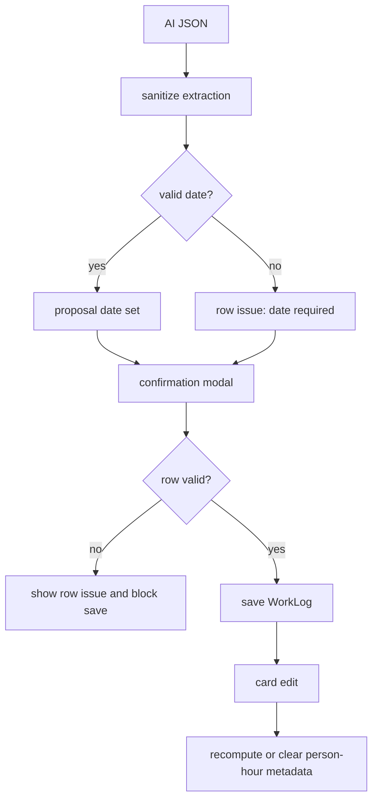

# WorkLog Validation Hardening 4.2.1 - Plan

## Goal Capsule

| Field | Value |
| --- | --- |
| Objective | Fix the three WorkLog 4.2.0 review findings so voice-created work records cannot silently save wrong dates, missing people, or stale person-hour metadata. |
| Product authority | `docs/plans/2026-06-30-001-feat-worklog-batch-extraction-plan.md`, `docs/solutions/design-patterns/worklog-batch-person-hour-extraction.md`, and the latest `ce-code-review` findings. |
| Execution profile | Small patch release touching extraction sanitization, confirmation validation, saved-card editing, tests, docs, and visible versioning. |
| Stop conditions | Stop if the fix would require payroll-grade worker profiles, per-person timesheets, natural-language edits to saved WorkLogs, or a redesign of Drive sync identity. |
| Tail ownership | Ship as `4.2.1`, verify on `main`, deploy to `gh-pages`, and confirm the public bundle exposes the patched version. |

---

## Product Contract

### Summary

This patch tightens the WorkLog voice flow after the `4.2.0` batch release. It keeps the batch/person-hour feature intact, but makes uncertain dates and missing people explicit blockers before save, and makes saved person-hour entries editable without stale calculation notes.

### Problem Frame

The `4.2.0` review found three moderate data-quality risks in the new WorkLog flow. Invalid AI dates can become today's date without a hard signal, voice proposals can save with no workers when hours are `<= 24`, and editing saved person-hour cards validates against old metadata while saving only the edited total.

These issues matter because `Prace` is not a task inbox. It is evidence of real work by date, project, people, and reportable hours. A convenient AI flow is only acceptable if uncertain facts stay visible and the user has to resolve them before persistence.

### Requirements

**Date Certainty**

- R1. A missing or invalid AI date must not silently become today's date in a saveable proposal.
- R2. A proposal with uncertain date must surface a human-readable Czech warning and block save until a valid date is selected.
- R3. Valid AI dates keep the current single-entry and batch behavior.

**People Completeness**

- R4. Voice-created WorkLog proposals require at least one worker label before save.
- R5. Unnamed counted workers remain supported as `Pracovník N`, but an empty `people` value is not saveable.
- R6. The confirmation UI must identify incomplete rows clearly enough that the user can fix them without guessing which field failed.

**Person-Hour Metadata**

- R7. Editing a saved person-hour WorkLog must keep `hours`, `hoursPerPerson`, `peopleCount`, and `calculationNote` consistent.
- R8. If a saved person-hour WorkLog is converted to a normal `<= 24` total by manual edit, stale calculation metadata must be cleared or recomputed rather than displayed as truth.
- R9. Totals above 24 remain saveable only when explained by `peopleCount x hoursPerPerson`.

**Release and Compatibility**

- R10. Existing manual WorkLogs with `hours <= 24` keep working without new metadata.
- R11. Drive sync continues to tolerate optional WorkLog metadata without a schema migration.
- R12. The visible app version, `battle-plan/package.json`, lockfile, docs, and deployed GitHub Pages bundle all advance to `4.2.1`.

### Acceptance Examples

- AE1. Given Gemini returns `date: "tomorrowish"` or no `date`, the confirmation modal shows the row with an unresolved date state and save-all is blocked until the user chooses a valid date.
- AE2. Given Gemini returns a project and `hours: 8` but `people: []`, the confirmation modal blocks save and tells the user to fill `Lidi`.
- AE3. Given a saved batch entry has `3 lidé x 10 h = 30 h`, when the user edits people to four workers and keeps `10` hours per person, the saved total becomes `40` and the calculation note updates.
- AE4. Given a saved batch entry has `30` person-hours, when the user changes total hours to `8` and does not keep per-person math, the entry saves as a normal `8` hour record without the old `3 x 10 = 30` note.
- AE5. Given a legacy manual WorkLog with `8` hours and no calculation metadata, editing date, people, project, hours, or description still works as before.

### Scope Boundaries

#### Included

- Hardening the existing voice confirmation and saved-card edit behavior.
- Adding pure validation/metadata helpers so edge cases are testable without Gemini or browser automation.
- Updating focused WorkLog tests and release version references.

#### Deferred to Follow-Up Work

- Full duplicate reconciliation against existing WorkLogs.
- Stable worker identity, payroll profiles, or per-person reporting.
- Natural-language edits to saved WorkLogs.
- A broader React component test setup if the current repo still lacks one.

#### Outside This Product Identity

- Treating meetings as reportable work by default.
- Turning WorkLogs into a task planner.

---

## Planning Contract

### Key Technical Decisions

- KTD1. Block uncertain dates instead of defaulting them. The safest fallback is an unsaveable empty date or equivalent row-level issue, because a visible but wrong "today" date is easy to overlook.
- KTD2. Require people for voice saves, not for all manual WorkLogs. The risk comes from AI extraction losing the crew; manual users may still create ordinary historical records within the existing form constraints.
- KTD3. Centralize WorkLog proposal validation in pure helpers. The confirmation modal and card edit path should share the same person-hour rules instead of each encoding a partial version.
- KTD4. Treat card edit as metadata maintenance, not only field update. If a person-hour record is edited, its calculation metadata must move with the edited people and hours or be removed.
- KTD5. Keep this as a patch release. No new product capability is added; the patch makes `4.2.0` safer and more traceable.

### High-Level Technical Design

### System-Wide Impact

- The WorkLog extraction contract gains stricter validity semantics, but the persisted WorkLog table remains backward compatible.
- Confirmation and card edit paths become stricter about person-hour consistency.
- Existing reports keep summing `hours`; the patch only improves whether those hours are trustworthy.
- `gh-pages` must be redeployed so testers see `4.2.1`, not a cached `4.2.0` bundle.

### Risks and Mitigations

- Risk: blocking missing people may feel stricter than the first `4.2.0` release. Mitigation: keep anonymous workers easy to type and make the row-level message plain.
- Risk: clearing metadata on manual total edit may remove useful audit context. Mitigation: only clear when the edited total no longer matches available per-person math; otherwise recompute.
- Risk: adding transient validation fields to extraction proposals could leak into saved Drive JSON. Mitigation: strip UI-only validation issues before writing WorkLogs.
- Risk: tests may remain helper-level rather than full React UI tests. Mitigation: encode validation and metadata derivation as pure helpers with Node tests, and cover UI wiring through TypeScript and focused lint.

### Sources

- Review finding #1: invalid AI date fallback in `battle-plan/src/services/workLogExtractor.ts`.
- Review finding #2: missing worker validation gap in `battle-plan/src/components/worklogs/WorkLogVoiceConfirm.tsx`.
- Review finding #3: stale card-edit metadata in `battle-plan/src/components/worklogs/WorkLogCard.tsx`.
- Existing WorkLog pattern: `docs/solutions/design-patterns/worklog-batch-person-hour-extraction.md`.

---

## Implementation Units

### U1. Proposal Validation and Date Certainty

- **Goal:** Make extraction sanitization preserve uncertainty instead of converting invalid dates into a saveable "today" record.
- **Requirements:** R1-R3, AE1.
- **Files:** `battle-plan/src/services/workLogExtractor.ts`, `battle-plan/src/utils/workLogBatch.ts`, `battle-plan/src/services/workLogExtractor.test.ts`.
- **Approach:** Add or extend pure validation helpers to return row-level issues for invalid dates and empty people. Change `sanitizeExtractedWorkLog` so invalid/missing dates produce an unresolved proposal state and set batch confirmation reasons.
- **Test Scenarios:** Invalid date creates a proposal that cannot pass row validation; missing date creates the same blocker; valid ISO date remains unchanged; legacy single-object extraction still sanitizes into a one-entry batch.
- **Verification:** WorkLog Node tests cover sanitizer behavior directly, not only helper-only examples.

### U2. Confirmation Modal Row Blocking

- **Goal:** Prevent save-all until every proposed voice row has project, valid date, people, positive hours, and valid person-hour math when needed.
- **Requirements:** R2, R4-R6, R9, AE1-AE2.
- **Files:** `battle-plan/src/components/worklogs/WorkLogVoiceConfirm.tsx`, `battle-plan/src/components/worklogs/WorkLogVoiceBar.tsx`, `battle-plan/src/utils/workLogBatch.ts`.
- **Approach:** Replace the current generic invalid-row check with shared row validation. Show row-level issue text near the affected row, and keep the existing batch assumptions panel for global warnings.
- **Test Scenarios:** Save is blocked for empty date; save is blocked for empty people; save is blocked for `hours > 24` without matching per-person metadata; after user fills missing date and people, save-all writes all valid rows.
- **Verification:** TypeScript and focused lint pass; pure validation tests cover the blocker cases; manual browser check confirms row messages are visible.

### U3. Saved WorkLog Person-Hour Edit Consistency

- **Goal:** Allow users to correct saved person-hour entries without stale metadata or false validation failures.
- **Requirements:** R7-R10, AE3-AE5.
- **Files:** `battle-plan/src/components/worklogs/WorkLogCard.tsx`, `battle-plan/src/utils/workLogBatch.ts`, `battle-plan/src/services/workLogExtractor.test.ts`.
- **Approach:** Add edit-state support for `hoursPerPerson` when a log already has person-hour metadata or total hours above 24. Recalculate `peopleCount`, `hours`, and `calculationNote` when people or per-person hours change. Clear calculation metadata when the user saves a normal `<= 24` total that no longer matches person-hour math.
- **Test Scenarios:** Three people at ten hours edits to four people at ten hours and saves forty hours; person-hour entry changed to eight total hours clears the old note; legacy manual eight-hour entry still edits without metadata.
- **Verification:** Helper tests cover metadata derivation and clearing; TypeScript confirms the `WorkLog` updates remain compatible.

### U4. Patch Release, Docs, and Deployment Check

- **Goal:** Ship the hardening as `4.2.1` and keep version traceability intact.
- **Requirements:** R11-R12.
- **Files:** `battle-plan/package.json`, `battle-plan/package-lock.json`, `battle-plan/src/components/Sidebar.tsx`, `battle-plan/src/App.tsx`, `README.md`, `docs/README.md`, `navod.md`, `zadani.md`, `FUTURE_PLANS.md`.
- **Approach:** Bump patch version, update visible version strings and docs that name the current WorkLog version, and keep `4.2.0` references only where they describe history.
- **Test Scenarios:** Sidebar and diagnostic logs show `4.2.1`; package and lockfile versions match; docs identify `4.2.1` as the hardened WorkLogs release.
- **Verification:** Production build emits a new bundle; deployed `gh-pages` `index.html` references that bundle; public JS contains `4.2.1`.

---

## Verification Contract

| Gate | Command or Check | Covers | Done Signal |
| --- | --- | --- | --- |
| WorkLog focused tests | `node --experimental-strip-types src/services/workLogExtractor.test.ts` from `battle-plan/` | U1, U3 | Date uncertainty, missing people, person-hour validation, and edit metadata helper tests pass. |
| TypeScript | `tsc -b` from `battle-plan/` | U1-U4 | No type errors. |
| Focused lint | `eslint src/services/workLogExtractor.ts src/utils/workLogBatch.ts src/services/workLogExtractor.test.ts src/components/worklogs/WorkLogVoiceConfirm.tsx src/components/worklogs/WorkLogVoiceBar.tsx src/components/worklogs/WorkLogCard.tsx` from `battle-plan/` | U1-U3 | No lint errors in touched runtime/test files. |
| Production build | `vite build` from `battle-plan/` | U1-U4 | Build completes and emits a new `dist` bundle. |
| Manual browser check | GitHub Pages or local dev in `Prace` tab | U2-U3 | Empty date/people rows block save; corrected person-hour card edits save expected totals. |
| Release check | Inspect `main`, `gh-pages`, public `index.html`, and public JS | U4 | `main` and `gh-pages` are pushed, public bundle is current, and visible app version is `4.2.1`. |

---

## Definition of Done

- U1 is done when invalid/missing AI dates no longer become silently saveable "today" records, and sanitizer tests cover the behavior.
- U2 is done when voice proposals cannot save without people, valid date, project, positive hours, and valid person-hour math.
- U3 is done when saved person-hour WorkLogs can be corrected without stale notes or false `hours > 24` failures.
- U4 is done when `4.2.1` is visible in code, docs, deployed assets, and GitHub Pages verification.
- No abandoned experiment code remains in the diff.
- Existing manual WorkLog creation and old `<= 24` entries still work.
- The focused verification gates in this plan pass before deploy.
