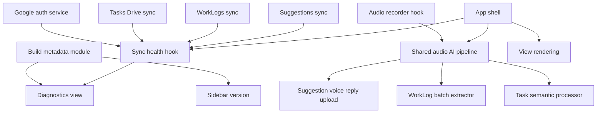

# Runtime Traceability and Architecture Cleanup - Plan

## Goal Capsule

| Field | Value |
| --- | --- |
| Objective | Turn the graphify findings into a sequenced cleanup that makes deployed builds identifiable, sync state diagnosable, voice processing reusable, and the application shell less coupled. |
| Product authority | Recent graphify output in `graphify-out/GRAPH_REPORT.md`, current WorkLogs concepts in `CONCEPTS.md`, and the release traceability rule in `docs/solutions/design-patterns/worklog-batch-person-hour-extraction.md`. |
| Execution profile | Standard cross-cutting refactor with small user-facing diagnostics and no database migration. |
| Stop conditions | Stop if the work requires changing Google OAuth console configuration, replacing Drive sync storage, redesigning WorkLogs, or rewriting the app shell in one pass. |
| Tail ownership | Ship as the next minor release, expected `4.3.0` if no other release lands first, and verify the deployed GitHub Pages bundle exposes the same version and build identity as the source. |

---

## Product Contract

### Summary

This work reduces the ambiguity that appeared during local, GitHub Pages, mobile, and desktop testing. The app should make it obvious which build is running, which origin it is running from, whether Google and Drive sync are healthy, and whether voice flows are using the same processing rules.

The code cleanup should be incremental. The plan does not ask for a full frontend rewrite; it extracts load-bearing seams from `App.tsx` and consolidates repeated audio and sync behavior behind smaller, testable modules.

### Problem Frame

Graphify surfaced `Google Sync`, `Sync`, `Deployment`, `Ai Audio`, `Frontend`, and `GoogleService` as the most connected areas. Some document-level edges were noisy because the semantic pass used a fallback extractor, but the codebase confirms the same pressure: `App.tsx` coordinates Google auth, Drive sync, WorkLogs sync, task operations, voice processing, navigation, and rendering.

This matters because recent user testing already hit the failure mode. A screenshot can show a stale version, a local OAuth origin can fail differently from GitHub Pages, and the WorkLogs tab can look wrong while it is unclear whether the tester is seeing old code, empty local data, a sync failure, or a real UI bug.

### Requirements

**Build and Runtime Traceability**

- R1. The app must expose a single build identity containing app version, build time, commit identifier when available, runtime origin, and deployment channel.
- R2. Sidebar and Diagnostics must read version/build information from the same source instead of hardcoded strings.
- R3. The Diagnostics view must show whether the user is testing local dev, GitHub Pages, or another origin.
- R4. A production deploy must be verifiable by comparing `package.json`, visible UI version, built asset content, and GitHub Pages output.

**Sync and OAuth Diagnostics**

- R5. Diagnostics must show Google auth readiness, signed-in state, active origin, last Drive sync, and WorkLogs sync status in one scan-friendly place.
- R6. OAuth origin mismatch should surface as a local diagnostic state or hint when detectable from the browser error context, not only as a failed Google page.
- R7. Tasks sync, WorkLogs sync, and Suggestions sync must keep separate health labels so a WorkLogs issue is not misread as a general Google failure.
- R8. Sync diagnostics must not expose access tokens, personal email details beyond what is already shown, or Drive file contents.

**Shared Voice Processing**

- R9. Task voice, WorkLog voice, and suggestion voice replies must share recording and Gemini audio preparation behavior where their needs overlap.
- R10. WorkLog extraction must keep its WorkLog-specific prompt, validation, and batch semantics separate from task semantic extraction.
- R11. Audio errors, retry notices, missing API key messages, and unsupported MIME handling must become consistent across voice flows.
- R12. The shared audio layer must stay browser-compatible and avoid server dependencies.

**Application Shell Boundaries**

- R13. `App.tsx` must stop owning all orchestration directly; sync, voice, and diagnostics logic should move into focused hooks or services.
- R14. The refactor must preserve current navigation, task behavior, WorkLogs behavior, Suggestions behavior, and Google task behavior.
- R15. Extracted modules must be small enough to test or reason about without rendering the whole app.

**Graphify Hygiene**

- R16. The repo must support a code-focused graphify run that excludes generated output and low-signal assets.
- R17. Graphify output must not be committed unless intentionally requested as an analysis artifact.
- R18. Future graphify recommendations should distinguish code AST evidence from document-semantic fallback evidence.

### Acceptance Examples

- AE1. Given the deployed GitHub Pages app is open, Diagnostics shows app version, build timestamp, commit identifier when available, `https://mhrabcik-design.github.io` origin, and a GitHub Pages channel label.
- AE2. Given the local dev app is open at `http://127.0.0.1:5173`, Diagnostics labels the runtime as local dev and shows whether this origin is likely to be accepted by Google OAuth.
- AE3. Given Google auth succeeds but WorkLogs Drive sync fails, Diagnostics shows Google auth as connected and WorkLogs sync as failed or stale instead of collapsing both into one generic error.
- AE4. Given a WorkLog voice dictation and a task voice dictation both fail because the Gemini API key is missing, both flows show the same class of Czech error message while keeping their own follow-up UI.
- AE5. Given a user navigates between Plan, Week, Tasks, Suggestions, WorkLogs, and Diagnostics after the refactor, each view renders the same data and actions as before.
- AE6. Given graphify is run for architecture review, the code-focused profile reports source files and code symbols without treating `graphify-out/` as input.

### Scope Boundaries

#### Included

- Runtime build identity and visible diagnostics.
- Sync health separation for Google auth, task sync, WorkLogs sync, and Suggestions sync.
- Shared browser audio preparation and error normalization for existing voice flows.
- Incremental extraction of `App.tsx` orchestration into focused hooks or services.
- Graphify ignore/profile hygiene for future architecture analysis.

#### Deferred for Later

- Replacing Google Drive as the persistence layer.
- Server-side sync, user accounts, or centralized logs.
- A full UI redesign of Diagnostics or Settings.
- Payroll-grade people identity for WorkLogs.
- Full React Testing Library setup if pure helper and hook-level tests cover this plan's risks.

#### Outside This Product Identity

- Turning Diagnostics into a developer console for arbitrary internals.
- Logging secrets, raw audio, or full Drive payloads for convenience.
- Using graphify output as a committed build artifact by default.

---

## Planning Contract

### Key Technical Decisions

- KTD1. Use one build identity source. Version strings should come from a small runtime/build metadata module consumed by Sidebar, Diagnostics, and release checks, because hardcoded UI labels already caused testing confusion.
- KTD2. Diagnose sync by subsystem, not by provider. Google auth can be healthy while WorkLogs Drive sync is stale, so Diagnostics should keep Google auth, Tasks, WorkLogs, and Suggestions separate.
- KTD3. Extract audio preparation before extracting product prompts. Recording, MIME normalization, base64 conversion, retry classification, and missing-key errors are shared; WorkLog batch semantics and task semantic editing are not.
- KTD4. Decompose `App.tsx` around orchestration boundaries. Moving sync, voice, and diagnostics state first reduces coupling without forcing a risky view rewrite.
- KTD5. Treat graphify as a scoped analysis tool. The fallback semantic graph is useful for hints, but code changes should be justified by source reads and code-focused graph runs.
- KTD6. Make this a minor release if user-facing diagnostics ship. The feature adds visible runtime state and improves operational traceability, so it should advance from `4.2.1` to the next minor version unless another release changes the baseline first.

### High-Level Technical Design

### Sequencing

1. Build identity and diagnostics come first because they make every later verification less ambiguous.
2. Sync diagnostics follow while the current `App.tsx` wiring is still intact, so behavior can be compared before and after extraction.
3. Shared audio preparation comes next because WorkLogs and task voice flows already have focused tests and clear behavior boundaries.
4. `App.tsx` decomposition happens after the extracted services are proven, keeping the riskiest movement last.
5. Graphify hygiene can land at the end or independently, but it should be verified before relying on another graph for refactor prioritization.

### System-Wide Impact

- Visible versioning becomes a runtime contract rather than a sidebar-only label.
- Diagnostics becomes the first place to inspect cross-surface problems before assuming a WorkLogs, OAuth, or deployment bug.
- Voice flows share failure handling, which reduces future drift between tasks and WorkLogs.
- `App.tsx` remains the shell, but lower-level state and side effects move to reusable modules.
- Graphify output remains local/generated unless intentionally promoted into docs.

### Risks and Mitigations

- Risk: Diagnostics could expose sensitive Google or Drive data. Mitigation: display status, timestamps, origins, and high-level errors only; never display tokens or raw payloads.
- Risk: Extracting audio behavior could accidentally change WorkLog batch prompting. Mitigation: keep WorkLog prompt and sanitizer in `services/workLogExtractor.ts`; only share audio preparation and error normalization.
- Risk: `App.tsx` refactor could create subtle task sync regressions. Mitigation: move orchestration in small units, keep props and view behavior stable, and verify existing navigation/actions after each unit.
- Risk: Build metadata may be unavailable in local dev or older deploys. Mitigation: render missing commit/build time as `unknown` or `local` without breaking the UI.
- Risk: Graphify configuration may over-filter useful docs. Mitigation: provide separate code-focused and full-repo profiles rather than one permanent broad exclusion.

### Sources

- Graphify report: `graphify-out/GRAPH_REPORT.md`.
- Versioning rule: `docs/solutions/design-patterns/worklog-batch-person-hour-extraction.md`.
- Runtime shell pressure point: `battle-plan/src/App.tsx`.
- Google integration boundary: `battle-plan/src/services/googleService.ts`.
- WorkLogs sync boundary: `battle-plan/src/services/workLogsSync.ts`.
- Suggestions sync boundary: `battle-plan/src/services/suggestionsSync.ts`.
- Task audio processor: `battle-plan/src/services/geminiService.ts`.
- WorkLog audio extractor: `battle-plan/src/services/workLogExtractor.ts`.
- Shared recording hook: `battle-plan/src/hooks/useAudioRecorder.ts`.

---

## Implementation Units

### U1. Build Identity Source and Release Traceability

- **Goal:** Replace hardcoded visible version strings with one build identity source that can be checked locally and after deploy.
- **Requirements:** R1-R4, AE1-AE2.
- **Files:** `battle-plan/package.json`, `battle-plan/package-lock.json`, `battle-plan/src/App.tsx`, `battle-plan/src/components/Sidebar.tsx`, `battle-plan/src/components/SettingsModal.tsx`, new `battle-plan/src/utils/buildInfo.ts` or equivalent, `README.md`, `docs/README.md`.
- **Approach:** Add a small build info module that reads package version through Vite-supported metadata and accepts optional build-time values for commit and timestamp. Replace sidebar/debug hardcodes with that module. Document the release check so GitHub Pages, mobile, and desktop testing always compare the same identity.
- **Test Scenarios:** Sidebar shows the same version as `package.json`; Diagnostics or system logs show build identity; local dev labels origin as local; production build includes the expected version string.
- **Verification:** `npm run build` from `battle-plan/`; inspect built JS for the target version; manual check in local dev and GitHub Pages after deploy.

### U2. Sync and OAuth Diagnostic Health Model

- **Goal:** Give Diagnostics a subsystem-level sync picture so Google auth, task sync, WorkLogs sync, and Suggestions sync failures are distinguishable.
- **Requirements:** R5-R8, AE2-AE3.
- **Files:** `battle-plan/src/App.tsx`, `battle-plan/src/services/googleService.ts`, `battle-plan/src/services/workLogsSync.ts`, `battle-plan/src/services/suggestionsSync.ts`, `battle-plan/src/pages/SuggestionsPage.tsx`, `battle-plan/src/components/SettingsModal.tsx`, new `battle-plan/src/hooks/useSyncDiagnostics.ts` or equivalent.
- **Approach:** Introduce a lightweight sync health shape with status, last success timestamp, last error label, and subsystem name. Feed it from existing Google init, Drive load/save, WorkLogs merge, and Suggestions load paths. Render the summary in Diagnostics and keep Settings focused on connection controls.
- **Test Scenarios:** Signed-out state reports Google auth disconnected; signed-in with stale WorkLogs sync reports WorkLogs stale while Google remains connected; failed Suggestions load does not mark WorkLogs failed; origin mismatch or unsupported origin renders a diagnostic hint when detectable.
- **Verification:** `npm run build`; focused manual checks for signed-out, local dev origin, and a simulated sync error by forcing a Drive call failure during local testing.

### U3. Shared Audio AI Pipeline

- **Goal:** Consolidate common recording-to-AI preparation and error handling while preserving task and WorkLog domain processors.
- **Requirements:** R9-R12, AE4.
- **Files:** `battle-plan/src/hooks/useAudioRecorder.ts`, `battle-plan/src/services/geminiService.ts`, `battle-plan/src/services/workLogExtractor.ts`, `battle-plan/src/components/worklogs/WorkLogVoiceBar.tsx`, `battle-plan/src/components/SuggestionCard.tsx`, new `battle-plan/src/services/audioAiPipeline.ts` or equivalent, `battle-plan/src/services/workLogExtractor.test.ts`, optional new `battle-plan/src/services/audioAiPipeline.test.ts`.
- **Approach:** Move shared MIME normalization, blob-to-base64 conversion, retry/error classification, and missing-key checks into a common browser service. Let `geminiService.processAudio` and `processWorkLogAudio` call that service with their own prompt/result parsers. Keep suggestion voice upload separate except for recording/MIME consistency.
- **Test Scenarios:** Unsupported audio MIME normalizes consistently; missing Gemini API key returns the same class of user-facing error in task and WorkLog flows; WorkLog batch JSON parsing still uses WorkLog sanitizer; task semantic processing still returns `Partial<Task>` behavior.
- **Verification:** `npm run test:worklogs`; any new audio helper tests; `npm run build`; manual voice smoke test for WorkLogs and task capture when an API key is configured.

### U4. App Shell Orchestration Extraction

- **Goal:** Reduce `App.tsx` coupling by moving sync, voice, and diagnostics orchestration behind focused hooks while preserving rendered behavior.
- **Requirements:** R13-R15, AE5.
- **Files:** `battle-plan/src/App.tsx`, `battle-plan/src/hooks/useSyncDiagnostics.ts`, new `battle-plan/src/hooks/useTaskSync.ts` or equivalent, new `battle-plan/src/hooks/useVoiceProcessing.ts` or equivalent, `battle-plan/src/services/semanticEngine.ts`, `battle-plan/src/types.ts`.
- **Approach:** Extract one orchestration concern at a time. Start with sync diagnostics state, then task/Drive sync operations, then voice processing dispatch. Keep view components and prop names stable where practical so the diff shows movement more than behavior change.
- **Test Scenarios:** Plan, Week, Tasks, Meetings, Suggestions, WorkLogs, Ideas, Proposals, Settings, and Diagnostics still mount; task toggle/delete/edit still works for local tasks; Google task refresh still works when signed in; WorkLogs voice and manual entry still open the same confirmation/edit flows.
- **Verification:** `npm run build`; manual navigation smoke test across all sidebar items; focused browser check for one task action and one WorkLog action.

### U5. Graphify Code-Focused Profile and Generated Output Hygiene

- **Goal:** Make future graphify architecture reviews less noisy and keep generated graph output out of accidental commits.
- **Requirements:** R16-R18, AE6.
- **Files:** `.gitignore`, optional `.graphifyignore` or graphify profile docs if supported, `README.md`, `docs/README.md`, `graphify-out/GRAPH_REPORT.md` as input only.
- **Approach:** Add ignore rules for `graphify-out/` if missing. Document two graphify modes: a code-focused scan for implementation refactor decisions and a full-repo scan for documentation/product vocabulary. Note that fallback semantic edges are hints until verified against source.
- **Test Scenarios:** `git status --short` does not show `graphify-out/` after generation; code-focused graphify command does not ingest generated graph output; README guidance tells future agents when to trust AST edges versus fallback document edges.
- **Verification:** Generate or inspect graphify output locally; run `git status --short`; confirm docs describe the intended workflow without committing generated files.

### U6. Release Bump, Deployment, and Cross-Surface Verification

- **Goal:** Land the completed cleanup as a traceable release and prove the public app matches the source.
- **Requirements:** R1-R4, R6, AE1-AE2.
- **Files:** `battle-plan/package.json`, `battle-plan/package-lock.json`, `battle-plan/src/utils/buildInfo.ts`, `battle-plan/src/components/Sidebar.tsx`, `README.md`, `docs/README.md`, `navod.md`, `zadani.md`, `FUTURE_PLANS.md`.
- **Approach:** Bump to the next minor version if diagnostics ship, update visible/docs references, build, deploy to `gh-pages`, and verify public assets expose the same version/build identity. Keep historical `4.2.1` references only where they describe history.
- **Test Scenarios:** Package version, visible UI, Diagnostics, docs, and public bundle all agree; GitHub Pages app identifies itself as GitHub Pages channel; local dev identifies itself as local channel.
- **Verification:** `npm run build`; `npm run deploy` when ready to publish; inspect `gh-pages` `index.html`; inspect deployed JS for the release version and build identity.

---

## Verification Contract

| Gate | Command or Check | Covers | Done Signal |
| --- | --- | --- | --- |
| WorkLogs focused tests | `npm run test:worklogs` from `battle-plan/` | U3 | Existing WorkLog extraction and validation tests still pass after shared audio extraction. |
| TypeScript and production build | `npm run build` from `battle-plan/` | U1-U6 | TypeScript and Vite production build complete with no errors. |
| Lint | `npm run lint` from `battle-plan/` | U1-U5 | ESLint passes or only pre-existing unrelated findings are documented before handoff. |
| Local browser smoke | Local dev or preview app | U1-U4 | Version/build identity, Diagnostics, navigation, one task action, and one WorkLog action behave as expected. |
| Sync diagnostic smoke | Local dev with signed-out and signed-in Google states | U2 | Diagnostics separates Google auth, Tasks, WorkLogs, and Suggestions health without exposing secrets. |
| Voice smoke | Local dev with Gemini key configured | U3-U4 | Task voice and WorkLog voice use consistent error handling and preserve their domain-specific outputs. |
| Graphify hygiene | `git status --short` after graph generation | U5 | Generated `graphify-out/` output is ignored or intentionally excluded from commit scope. |
| Release verification | GitHub Pages public app and built assets | U6 | Public UI, package version, docs, and deployed JS all identify the same release. |

---

## Definition of Done

- U1 is done when one build identity source drives visible versioning and Diagnostics.
- U2 is done when sync health is separated by subsystem and safe to show during user testing.
- U3 is done when shared audio preparation is reused without merging task and WorkLog domain logic.
- U4 is done when `App.tsx` no longer directly owns sync, voice, and diagnostics orchestration, and current views still behave the same.
- U5 is done when graphify output is treated as generated analysis and future code-focused runs are documented.
- U6 is done when the release is versioned, built, deployed when requested, and publicly verifiable.
- No access tokens, raw Drive payloads, or raw audio are shown in diagnostics or logs.
- No abandoned refactor scaffolding or duplicate old/new audio paths remain in the diff.
- The verification gates in this plan pass or any pre-existing unrelated failure is explicitly called out before handoff.
