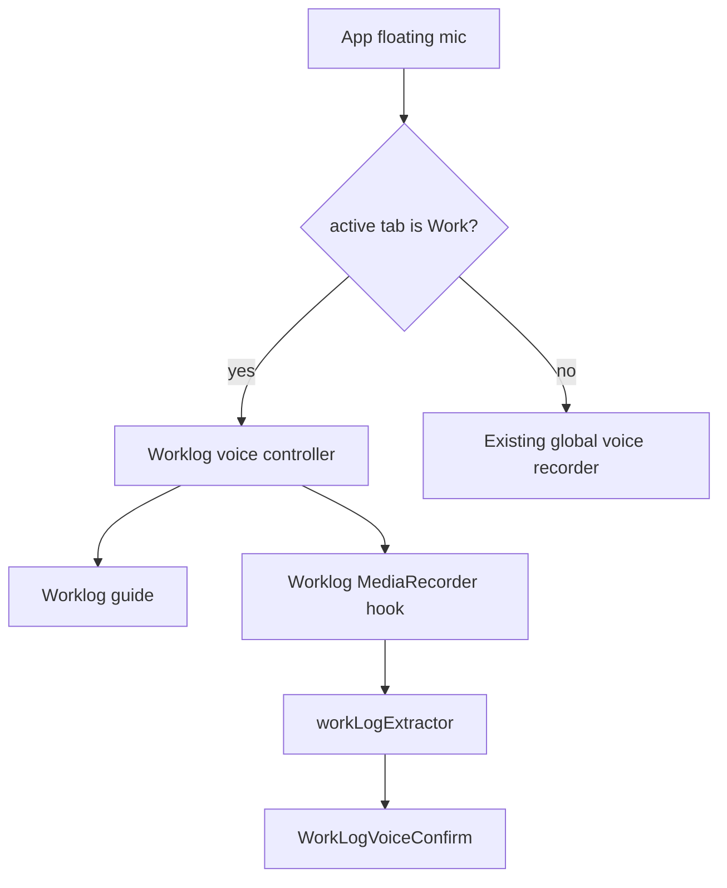

# Worklog Floating Mic Routing - Plan

## Goal Capsule

- **Objective:** Make the floating round microphone behave as worklog dictation when the user is on the Work tab, including the same recording guide, parsing, and confirmation flow as the `Diktovat` button in WorkLogVoiceBar.
- **Product authority:** The Work tab is for recording job work, people, hours, and activity monitoring; it must not create or surface task-like voice behavior from this entry point.
- **Execution profile:** Small UI behavior fix with cross-surface parity importance for desktop and mobile.
- **Stop condition:** Stop and ask if the current global microphone is required for another Work-tab-specific command that is not worklog recording.
- **Tail ownership:** The implementation should leave GitHub Pages versioning intact and bump the app patch version only when shipping the fix.

---

## Product Contract

### Summary

The Work tab currently has two microphone entry points with different behavior.
The rectangular `Diktovat` button under `Pracovni cinnosti` starts worklog dictation and shows the helpful guide, while the floating round microphone still starts the app-level voice recorder.
On the Work tab, both entry points should mean the same thing: record a worklog.

### Problem Frame

Users reasonably treat the floating microphone as the primary mobile voice action.
When that microphone does not show the worklog guide, the interface feels inconsistent and risks routing the dictated work content into the wrong voice workflow.
The fix should preserve the global microphone on other tabs while specializing it on the Work tab.

### Requirements

**Work-tab microphone behavior**

- R1. When the active tab is Work and no task editor is open, clicking the floating round microphone starts the same worklog dictation flow as the `Diktovat` button in WorkLogVoiceBar.
- R2. While worklog dictation starts from the floating microphone, the same worklog guidance panel appears immediately and remains visible during recording.
- R3. Stopping recording from either Work-tab microphone entry point sends the captured audio through worklog extraction and the same confirmation UI.
- R4. Worklog recording, processing, disabled, and error states stay consistent between the rectangular WorkLogVoiceBar button and the floating microphone.

**Non-work-tab behavior**

- R5. On tabs other than Work, the floating round microphone keeps the existing global voice behavior.
- R6. The fix must not reintroduce task cards, task creation, or general task voice behavior into the Work tab.

**Mobile and deployment clarity**

- R7. The behavior must work on both desktop and mobile viewport layouts.
- R8. The shipped app version must increment from 4.3.4 so the deployed fix is distinguishable from the currently verified build.

### Actors

- A1. Martin records work activity from the desktop Work tab.
- A2. Martin records work activity from the mobile app, where the floating microphone is the most natural control.

### Key Flows

- F1. Floating microphone starts worklog dictation on Work tab
  - **Trigger:** User is on Work tab and taps the round microphone.
  - **Actors:** A1, A2
  - **Steps:** The app starts worklog recording, shows the guide, captures audio, then stops and parses into worklog proposals.
  - **Outcome:** User sees the same confirmation path as if they had tapped `Diktovat`.
  - **Covered by:** R1, R2, R3, R4
- F2. Floating microphone remains global outside Work tab
  - **Trigger:** User is on Plan, Week, Tasks, Meetings, Ideas, Suggestions, Configuration, or Diagnostics and taps the round microphone.
  - **Actors:** A1
  - **Steps:** The existing app-level voice behavior runs.
  - **Outcome:** No Work-tab-specific guide appears outside Work.
  - **Covered by:** R5

### Acceptance Examples

- AE1. Given the Work tab is active, when the user taps the floating round microphone, then the worklog guide with categories like project, date, people, hours, and activity appears immediately.
- AE2. Given Work-tab recording was started from the floating microphone, when the user stops recording, then worklog extraction and WorkLogVoiceConfirm are used.
- AE3. Given any non-Work tab is active, when the user taps the floating round microphone, then the existing global voice flow runs and no worklog guide appears.
- AE4. Given the Work tab is active and microphone permission fails, when the user taps either worklog microphone entry point, then the user sees the same microphone error handling.

### Scope Boundaries

- In scope: routing the existing floating microphone to worklog recording on the Work tab, sharing state between Work-tab microphone controls, and bumping the patch version for deployment traceability.
- Out of scope: redesigning the worklog extraction prompt, changing Google Drive sync, changing task voice behavior on other tabs, and adding a new recorder engine.

---

## Planning Contract

### Key Technical Decisions

- KTD1. **Use one worklog recorder controller for both Work-tab controls.** The Work tab should not maintain two independent recorder instances, because that creates inconsistent guide, processing, and confirmation states.
- KTD2. **Keep the floating microphone global by default and specialize it by active tab.** This preserves existing behavior outside Work while giving the Work tab domain-specific semantics.
- KTD3. **Expose an imperative or callback bridge from WorkLogVoiceBar rather than duplicating extraction logic in App.** WorkLogVoiceBar already owns the worklog recorder, guide, extraction, and confirmation path; App should delegate to it on Work instead of copying that behavior.

### High-Level Technical Design

### Assumptions

- The current active tab identifier in `App.tsx` can reliably distinguish the Work tab.
- The floating microphone should remain visible on Work, but its behavior changes to worklog-specific recording.
- The WorkLogVoiceBar component can be adjusted to expose or accept a shared trigger without changing its user-facing layout.

### Sequencing

1. Establish a shared worklog voice control surface so App can trigger the same WorkLogVoiceBar toggle path.
2. Route the floating microphone through that worklog control only when the Work tab is active.
3. Preserve and verify the existing global microphone path on all other tabs.
4. Bump app patch version and run targeted validation.

---

## Implementation Units

### U1. Expose worklog voice control from WorkLogVoiceBar

- **Goal:** Let an external Work-tab control start and stop the same worklog dictation flow currently owned by WorkLogVoiceBar.
- **Requirements:** R1, R2, R3, R4
- **Files:** `battle-plan/src/components/worklogs/WorkLogVoiceBar.tsx`, `battle-plan/src/App.tsx`
- **Patterns:** Reuse the existing `handleToggle`, `showRecordingGuide`, `processing`, `probeError`, and WorkLogVoiceConfirm flow in WorkLogVoiceBar.
- **Approach:** Add a small controller bridge, ref callback, or controlled callback prop that exposes the current worklog voice toggle and state to App without duplicating extraction logic.
- **Test Scenarios:** Verify that external start shows the existing guide immediately; verify external stop processes the same audio path; verify processing disables both Work-tab controls together.
- **Verification:** `npm run lint` and targeted manual/browser check on Work tab.

### U2. Route floating microphone by active tab

- **Goal:** Make the floating microphone call the worklog controller on Work and preserve global voice behavior elsewhere.
- **Requirements:** R1, R5, R6
- **Files:** `battle-plan/src/App.tsx`
- **Patterns:** Follow the current floating microphone button structure near the bottom of App.tsx and keep existing global `startRecording` handling for non-Work tabs.
- **Approach:** Branch the floating microphone click handler on the active Work tab; delegate Work clicks to the worklog controller and leave the existing global recorder branch unchanged for every other tab.
- **Test Scenarios:** Verify Work tab click shows worklog guide; verify Tasks or Ideas tab click still uses global recorder; verify no Work-tab click creates or updates task voice state.
- **Verification:** `npm run lint` plus browser checks on Work and one non-Work tab.

### U3. Align UI state for the floating microphone on Work

- **Goal:** Ensure the floating microphone visually reflects worklog recording and processing state when it is acting as the Work-tab recorder.
- **Requirements:** R2, R4, R7
- **Files:** `battle-plan/src/App.tsx`, `battle-plan/src/components/worklogs/WorkLogVoiceBar.tsx`
- **Patterns:** Match the existing red recording state, disabled processing state, and microphone icon conventions already used by App and WorkLogVoiceBar.
- **Approach:** Feed minimal worklog voice state back to App so the floating button can show recording, stopping, disabled, and loading states accurately while Work is active.
- **Test Scenarios:** Verify recording started by rectangular button updates the floating button state; verify recording started by floating button updates the rectangular button state; verify mobile viewport keeps the guide visible above the floating button without unusable overlap.
- **Verification:** `npm run lint` and browser/mobile viewport check.

### U4. Version and deployment traceability

- **Goal:** Make the deployed fix distinguishable from 4.3.4.
- **Requirements:** R8
- **Files:** `battle-plan/package.json`, `battle-plan/package-lock.json`
- **Patterns:** Follow the existing patch-version convention used for recent releases.
- **Approach:** Bump the patch version after implementation and ensure the visible app version reflects the new build.
- **Test Scenarios:** Verify diagnostics/sidebar shows the new version locally after build; verify package metadata is consistent.
- **Verification:** `npm run build`.

---

## Verification Contract

| Gate | Command or check | Covers | Done signal |
|---|---|---|---|
| Type and lint | `npm run lint` from `battle-plan` | U1, U2, U3 | No lint errors |
| Production build | `npm run build` from `battle-plan` | U4 | Build completes and embeds new app version |
| Work-tab desktop check | Browser check on Work tab at desktop width | U1, U2, U3 | Floating microphone shows worklog guide and opens worklog confirmation |
| Work-tab mobile check | Browser check on Work tab at mobile width | U1, U2, U3 | Floating microphone remains usable and guide is visible |
| Non-Work regression check | Browser check on one non-Work tab | U2 | Floating microphone keeps existing global voice behavior |

---

## Definition of Done

- Both Work-tab microphone entry points use one worklog recording path.
- The worklog guide appears from the floating microphone on Work.
- WorkLogVoiceConfirm opens after Work-tab floating microphone recording is processed.
- The floating microphone behavior outside Work is unchanged.
- The app version is bumped above 4.3.4 and visible in the built app metadata.
- Lint and production build pass.
- No abandoned experimental bridge code or duplicated worklog extraction logic remains.
