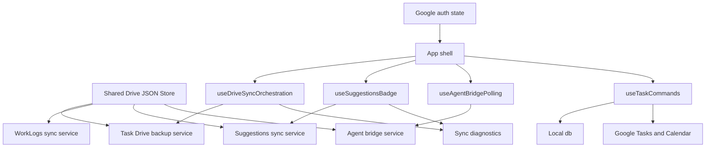

# Drive JSON Store and App Shell Simplification - Plan

## Goal Capsule

| Field | Value |
| --- | --- |
| Objective | Reduce architecture coupling by centralizing repeated Google Drive JSON file mechanics and moving high-volume orchestration out of `App.tsx` without changing user-facing behavior. |
| Product authority | Current graphify findings, the existing runtime traceability cleanup plan, `CONCEPTS.md`, and source reads of `battle-plan/src/App.tsx` plus Drive-backed services. |
| Execution profile | Standard cross-cutting refactor touching browser Google Drive integration, task sync, suggestions polling, agent bridge polling, and app-shell command wiring. |
| Stop conditions | Stop if the work requires changing OAuth scopes, replacing Drive storage, migrating IndexedDB schema, changing WorkLog merge identity, or redesigning navigation and voice UX. |
| Tail ownership | Land as an internal refactor release unless visible diagnostics or docs change require a patch bump under the repository release rule. |

---

## Product Contract

### Summary

The app already has useful extraction work from the prior runtime cleanup, including shared build identity, sync diagnostics, and shared audio preparation.
The remaining simplification is narrower: make Drive JSON persistence a shared primitive and let `App.tsx` behave like an application shell instead of the owner of every side effect.

This plan preserves behavior.
Users should still see the same navigation, same Google auth flow, same Drive sync results, same WorkLogs behavior, same suggestions badge, same agent write handling, and same task actions.

### Problem Frame

Graphify identifies `App.tsx` as the most connected source node in `battle-plan/src`.
Source review confirms why: it owns Google initialization, task Drive backup, WorkLogs sync, suggestions polling, agent pending writes, settings persistence, global voice routing, task mutations, Google Calendar sync, and rendering.

The Drive layer repeats the same low-level protocol in multiple services.
`googleService.ts`, `workLogsSync.ts`, `suggestionsSync.ts`, and `agentBridge.ts` each know about `/Anu-BattlePlan/`, cached folder IDs, Drive file lookup, `alt=media` downloads, and multipart uploads.
That duplication makes every future Drive-backed file feature more expensive and increases the chance that one service fixes a Drive edge case while the others drift.

### Requirements

**Shared Drive JSON Store**

- R1. Centralize shared Google Drive folder lookup, cached folder identity, file lookup, JSON download, JSON upload, and multipart body construction behind one browser-compatible service.
- R2. Keep domain services responsible for payload schema, merge policy, diagnostics labels, polling cadence, and user-facing error interpretation.
- R3. Preserve current Drive filenames and folder placement for `battle_plan_data.json`, `work_logs_data.json`, `agent-suggestions.json`, `agent-suggestion-replies.json`, agent voice reply blobs, and `agent-pending-writes.json`.
- R4. Preserve signed-out and missing-folder behavior unless the current behavior is demonstrably inconsistent across services and the plan names the chosen consistent outcome.

**App Shell Orchestration**

- R5. Move task Drive auto-sync out of `App.tsx` into a focused hook or service while preserving first-load, focus, and visibility-triggered sync.
- R6. Move suggestions badge polling out of `App.tsx` while preserving signed-out reset, 60-second polling, open-count semantics, and sync diagnostics updates.
- R7. Move agent pending-write polling out of `App.tsx` while preserving the delayed first check, 30-second interval, processed-write marking, and debug logs.
- R8. Move task command handlers out of `App.tsx` or behind a focused command hook while preserving local task updates, Google Task updates, Google Calendar side effects, and export behavior.
- R9. Keep global voice routing behavior stable, including the WorkLogs tab handoff to `processWorkLogAudio`, the task audio path through `geminiService.processAudio`, processing guards, and recorder cleanup.

**Release and Documentation**

- R10. Update docs only where the refactor changes durable architecture vocabulary or documented current state.
- R11. Fix the known version drift in current documentation if the implementation touches release docs in this plan.

### Acceptance Examples

- AE1. Given the user signs in to Google, task Drive sync still loads `battle_plan_data.json`, applies newer cloud tasks and settings, updates `last_drive_sync`, and reports task sync health.
- AE2. Given the user has local WorkLogs but no `work_logs_data.json`, WorkLogs sync still creates the Drive file through the existing local-to-cloud path.
- AE3. Given suggestions exist in `agent-suggestions.json`, the Suggestions badge still counts only `open` items and refreshes on the existing interval.
- AE4. Given `agent-pending-writes.json` contains unapplied writes, the app still applies supported create, update, and delete actions and marks applied IDs in Drive.
- AE5. Given the user edits, completes, deletes, exports, or syncs a task, the behavior matches the current UI and Google integration behavior.
- AE6. Given the user records audio outside WorkLogs and inside WorkLogs, the same domain-specific processing paths still run and cleanup still clears recording state.

### Scope Boundaries

#### Included

- Shared Drive JSON helper for existing Drive-backed JSON files and the existing suggestion voice blob upload pattern.
- Refactoring `App.tsx` orchestration into focused hooks or command modules.
- Focused tests for shared Drive metadata/body behavior and domain service adaptation.
- Documentation updates for architecture vocabulary and current version drift when touched.

#### Deferred for Later

- Stable client IDs for WorkLog projects and WorkLogs.
- Delta-based WorkLogs sync.
- Server-side sync or account-backed persistence.
- A new task sync conflict policy beyond the current newer-timestamp-wins behavior.
- A full state-management library migration.

#### Outside This Product Identity

- Exposing raw Drive payloads, tokens, raw audio, or private Google account data in diagnostics.
- Changing the user's Drive folder structure or OAuth scope set as part of a refactor.
- Rewriting WorkLogs extraction, task semantic extraction, or the visual design of the app shell.

---

## Planning Contract

### Key Technical Decisions

- KTD1. Build a shared Drive JSON Store before extracting more app-shell code, because it removes duplicated low-level behavior from four services and gives the later hooks a stable persistence primitive.
- KTD2. Keep `googleService` as the owner of authentication, Google Tasks, and Calendar APIs; the shared Drive helper should not become a general Google SDK wrapper.
- KTD3. Keep domain services as facades over their payloads, so `workLogsSync`, `suggestionsSync`, and `agentBridge` remain the places where merge rules, file names, reply semantics, and write semantics are understood.
- KTD4. Extract `App.tsx` by orchestration concern, not by view, because view components already exist and the remaining coupling is side-effect ownership.
- KTD5. Characterize current behavior before moving code where the effect has external state, especially Drive reads, uploads, polling intervals, and Google Calendar side effects.
- KTD6. Avoid introducing Redux, Zustand, or a new app-wide state architecture; the problem is duplicated service mechanics and shell side effects, not insufficient state tooling.
- KTD7. Keep access-token handling at the existing auth boundary; the shared Drive helper may consume the current token for requests, but it must not persist tokens, log tokens, or expose raw Drive payloads through diagnostics.

### High-Level Technical Design

### System-Wide Impact

- Drive-backed features share one implementation for folder and file mechanics, reducing future drift.
- `App.tsx` remains the visible shell, but fewer external side effects live inside the component body.
- Sync diagnostics remain subsystem-specific while relying on simpler service boundaries.
- Tests can cover Drive upload metadata and JSON store behavior without rendering the app.
- Future Drive-backed files can be added as small domain services instead of copying multipart boilerplate.

### Risks and Mitigations

- Risk: A shared Drive helper could accidentally change file placement or update semantics. Mitigation: add characterization tests for metadata, create-vs-update behavior, and file lookup before replacing service internals.
- Risk: Centralizing Drive errors could flatten domain-specific diagnostics. Mitigation: return low-level results from the helper and let each domain service map them to existing health states.
- Risk: Extracting `App.tsx` effects could create stale closures or duplicate intervals. Mitigation: move one concern at a time and test cleanup paths for visibility, focus, and polling effects.
- Risk: Task command extraction could break Google Task refresh or Calendar side effects. Mitigation: keep command hook dependencies explicit and smoke-test local and Google-backed tasks.
- Risk: Voice routing cleanup could regress WorkLogs confirmation flow. Mitigation: treat global voice extraction as the last unit and preserve the current WorkLogs controller behavior.

### Sequencing

1. Add Drive JSON Store helpers and tests without switching call sites.
2. Migrate WorkLogs, Suggestions, and AgentBridge services to the helper because they share the most duplicated Drive-file mechanics.
3. Migrate task backup Drive load/save through a focused task backup service while keeping Google auth, Tasks, and Calendar in `googleService`.
4. Extract `App.tsx` effects into hooks after persistence behavior is stable.
5. Extract task commands and optionally voice routing after side-effect hooks have reduced the shell surface.
6. Update docs and run the full verification contract.

### Sources

- `graphify-out/GRAPH_REPORT.md`
- `CONCEPTS.md`
- `README.md`
- `docs/README.md`
- `docs/plans/2026-06-30-003-refactor-runtime-traceability-and-architecture-plan.md`
- `battle-plan/src/App.tsx`
- `battle-plan/src/services/googleService.ts`
- `battle-plan/src/services/workLogsSync.ts`
- `battle-plan/src/services/suggestionsSync.ts`
- `battle-plan/src/services/agentBridge.ts`
- `battle-plan/src/services/workLogsDriveMetadata.ts`
- `battle-plan/src/services/audioAiPipeline.ts`

---

## Implementation Units

### U1. Shared Drive JSON Store Foundation

- **Goal:** Add a browser-side Drive helper that centralizes folder lookup, cached folder identity, file lookup, JSON media download, JSON multipart upload, and blob multipart upload primitives.
- **Requirements:** R1, R2, R3, R4.
- **Files:** `battle-plan/src/services/driveJsonStore.ts`, `battle-plan/src/services/driveJsonStore.test.ts`, `battle-plan/src/services/workLogsDriveMetadata.ts`, `battle-plan/src/services/workLogsSync.test.ts`.
- **Approach:** Extract the low-level mechanics currently repeated in Drive-backed services while keeping service-specific payload types outside the helper. Make create/update behavior preserve the existing rule that new files include `parents` and existing files do not get moved.
- **Test Scenarios:** New JSON file metadata includes the BattlePlan folder parent; existing JSON file metadata omits `parents`; multipart JSON body includes metadata and serialized payload; blob upload preserves supplied MIME type and folder parent; missing auth or missing Drive client returns a controlled failure rather than throwing from unrelated code; token values and raw payloads are never included in returned diagnostic messages.
- **Verification:** `npm run test:worklogs` from `battle-plan/`; `npm run build` from `battle-plan/`.

### U2. Drive-Backed Domain Services Migration

- **Goal:** Rewire WorkLogs sync, Suggestions sync, and AgentBridge to use the shared Drive helper without changing their public APIs or payload behavior.
- **Requirements:** R1, R2, R3, R4, AE2, AE3, AE4.
- **Files:** `battle-plan/src/services/workLogsSync.ts`, `battle-plan/src/services/suggestionsSync.ts`, `battle-plan/src/services/agentBridge.ts`, `battle-plan/src/services/driveJsonStore.ts`, `battle-plan/src/services/workLogsSync.test.ts`, optional `battle-plan/src/services/suggestionsSync.test.ts`, optional `battle-plan/src/services/agentBridge.test.ts`.
- **Approach:** Keep `workLogsSync.loadAll`, `workLogsSync.saveAll`, `suggestionsSync.fetchSuggestions`, `suggestionsSync.fetchReplies`, `suggestionsSync.updateSuggestion`, `suggestionsSync.updateSuggestionStatus`, `suggestionsSync.addReply`, `suggestionsSync.uploadVoiceReply`, `agentBridge.fetchPendingWrites`, and `agentBridge.markApplied` stable. Replace their duplicated folder/file/download/upload logic with the helper.
- **Test Scenarios:** WorkLogs save creates a file when no file ID is known; WorkLogs update patches the known file; Suggestions fetch returns empty arrays when files are missing; Suggestions status updates patch the same suggestions file; AgentBridge filters already applied writes and marks applied writes without changing unrelated writes.
- **Verification:** `npm run test:worklogs`; `npm run build`; manual signed-in smoke for WorkLogs sync, Suggestions badge, and AgentBridge write processing when fixture data is available.

### U3. Task Drive Backup Boundary

- **Goal:** Move task backup load/save behavior out of `googleService` into a focused task Drive backup module that uses the shared Drive helper.
- **Requirements:** R1, R2, R3, R4, R5, AE1.
- **Files:** `battle-plan/src/services/googleService.ts`, new `battle-plan/src/services/taskDriveBackup.ts`, `battle-plan/src/App.tsx`, optional `battle-plan/src/services/taskDriveBackup.test.ts`.
- **Approach:** Leave auth, Google Tasks, Calendar, sign-in, sign-out, and silent refresh in `googleService`. Move `battle_plan_data.json` payload wrapping, timestamp handling, load, and save into a dedicated module so task backup is not coupled to Calendar and Tasks APIs.
- **Test Scenarios:** Saving wraps tasks/settings in the existing payload shape with version and timestamp; loading returns the same payload shape `App.tsx` currently expects; missing backup file returns `null`; save failures surface enough information for existing task sync diagnostics.
- **Verification:** `npm run build`; manual signed-in task backup smoke for initial load and auto-save.

### U4. Drive Sync Orchestration Hook

- **Goal:** Extract the large task and WorkLogs auto-sync effect from `App.tsx` into a hook that owns startup, focus, and visibility-triggered synchronization.
- **Requirements:** R5, AE1, AE2.
- **Files:** `battle-plan/src/App.tsx`, new `battle-plan/src/hooks/useDriveSyncOrchestration.ts`, `battle-plan/src/services/taskDriveBackup.ts`, `battle-plan/src/services/workLogsSync.ts`, `battle-plan/src/utils/workLogsSyncStatus.ts`.
- **Approach:** Pass the hook only the state setters and callbacks it needs: Google auth status, task-list setter, settings setters, last-sync setter, sync-health updater, and logger. Keep WorkLogs local-to-cloud creation behavior in the hook path until a separate WorkLogs orchestration hook is warranted.
- **Test Scenarios:** Signed-out state resets task and WorkLogs diagnostics to idle; signed-in startup loads Drive backup; visibility and focus trigger sync once per event; newer cloud tasks update local IndexedDB; local WorkLogs create a cloud file when the cloud file is missing.
- **Verification:** `npm run build`; browser smoke for signed-out diagnostics, signed-in sync, tab visibility sync, and WorkLogs missing-file state.

### U5. Suggestions and Agent Polling Hooks

- **Goal:** Extract suggestions badge polling and agent pending-write polling from `App.tsx` into focused hooks with interval cleanup owned by the hooks.
- **Requirements:** R6, R7, AE3, AE4.
- **Files:** `battle-plan/src/App.tsx`, new `battle-plan/src/hooks/useSuggestionsBadge.ts`, new `battle-plan/src/hooks/useAgentBridgePolling.ts`, `battle-plan/src/services/suggestionsSync.ts`, `battle-plan/src/services/agentBridge.ts`.
- **Approach:** Keep polling intervals and delayed first run identical. The hooks should expose minimal UI state or side-effect callbacks: suggestions count, diagnostics updates, and debug log messages.
- **Test Scenarios:** Signed-out suggestions state clears the badge and marks diagnostics idle; signed-in suggestions polling refreshes the open count every 60 seconds; AgentBridge waits 3 seconds for the initial check, repeats every 30 seconds, and cancels work on unmount; no duplicate intervals survive auth changes.
- **Verification:** `npm run build`; browser smoke by signing out/in and watching diagnostics plus badge state.

### U6. Task Commands Hook

- **Goal:** Move task mutation handlers out of `App.tsx` while preserving local task, Google Task, Google Calendar, edit, delete, subtask, sync, and export behavior.
- **Requirements:** R8, AE5.
- **Files:** `battle-plan/src/App.tsx`, new `battle-plan/src/hooks/useTaskCommands.ts`, `battle-plan/src/services/googleService.ts`, `battle-plan/src/services/semanticEngine.ts`, `battle-plan/src/types.ts`.
- **Approach:** Build a hook that receives current auth, active Google task list, editing task state, and setter callbacks. Keep UI confirmation and alerts at the same interaction points, but move the persistence decisions into named command functions.
- **Test Scenarios:** Local task completion toggles `pending` and `completed`; Google Task completion uses `needsAction` and `completed`; deleting a local task soft-deletes it and removes Calendar event when present; saving a meeting updates or creates a Calendar event; exporting a task still opens the same mailto payload.
- **Verification:** `npm run build`; manual browser smoke for one local task edit, one completion toggle, one delete, one Google Task refresh when signed in, and one meeting sync.

### U7. Global Voice Routing Cleanup

- **Goal:** Optionally extract global voice processing from `App.tsx` after sync and command extraction reduce the shell, while preserving current task and WorkLogs audio paths.
- **Requirements:** R9, AE6.
- **Files:** `battle-plan/src/App.tsx`, new `battle-plan/src/hooks/useGlobalVoiceProcessing.ts`, `battle-plan/src/services/geminiService.ts`, `battle-plan/src/services/workLogExtractor.ts`, `battle-plan/src/services/semanticEngine.ts`, `battle-plan/src/components/worklogs/WorkLogVoiceConfirm.tsx`.
- **Approach:** Keep this unit last and skip it if prior units already make `App.tsx` small enough. If executed, the hook should own processing guard state, active update ID reset, AI result application, WorkLogs extraction handoff, error logging, alerts, and recorder cleanup.
- **Test Scenarios:** Task voice creates or updates a task through `applySemanticResult`; WorkLogs voice creates an extraction batch and opens confirmation; failed WorkLogs extraction clears processing state and recording state; failed task extraction clears processing state and recording state; rapid duplicate audio blobs do not start parallel processing.
- **Verification:** `npm run test:worklogs`; `npm run build`; manual task voice and WorkLogs voice smoke when a Gemini key is configured.

### U8. Documentation and Release Hygiene

- **Goal:** Keep architecture docs and version references consistent after the refactor.
- **Requirements:** R10, R11.
- **Files:** `CONCEPTS.md`, `docs/README.md`, `README.md`, optional `navod.md`, `battle-plan/package.json`, `battle-plan/package-lock.json`.
- **Approach:** Document Shared Drive JSON Store only as durable vocabulary, not as implementation minutiae. Fix documented version drift from `4.3.0` to the package version if release docs are touched. Bump version only if the implementation changes visible diagnostics or user-facing behavior under the repository release rule.
- **Test Scenarios:** Canonical docs describe the shared Drive JSON boundary accurately; docs do not claim stale version state; package version and visible runtime version remain aligned if a bump occurs.
- **Verification:** `npm run build`; inspect `docs/README.md`, `README.md`, and visible build identity if version files change.

---

## Verification Contract

| Gate | Command or Check | Covers | Done Signal |
| --- | --- | --- | --- |
| WorkLogs and helper tests | `npm run test:worklogs` from `battle-plan/` | U1, U2, U7 | Existing WorkLogs tests pass, and any added Drive helper tests pass under the same script or an updated test script. |
| Production build | `npm run build` from `battle-plan/` | U1-U8 | TypeScript and Vite build complete without errors. |
| Lint | `npm run lint` from `battle-plan/` | U1-U8 | ESLint passes, or pre-existing unrelated findings are documented before handoff. |
| Signed-out browser smoke | Local dev or preview app | U4, U5 | Diagnostics show idle signed-out states, suggestions badge clears, and no polling errors appear in the debug log. |
| Signed-in sync smoke | Local dev or preview app with Google auth | U2-U5 | Task backup, WorkLogs sync, Suggestions badge, and AgentBridge polling keep their current behavior. |
| Task action smoke | Local dev or preview app | U6 | Local task edit, completion, delete, export, and meeting Calendar sync work as before. |
| Voice smoke | Local dev or preview app with Gemini key | U7 | Task voice and WorkLogs voice route to their existing domain processors and clean up recorder state after success or failure. |
| Documentation check | Source review | U8 | `CONCEPTS.md` and canonical docs describe current architecture without stale version claims. |

---

## Definition of Done

- U1 is done when shared Drive folder, file, JSON, and multipart mechanics exist behind one helper with focused tests.
- U2 is done when WorkLogs, Suggestions, and AgentBridge no longer duplicate low-level Drive file mechanics and their public behavior is unchanged.
- U3 is done when task backup persistence no longer lives inside the same service that owns Google auth, Tasks, and Calendar.
- U4 is done when startup/focus/visibility task and WorkLogs sync orchestration no longer lives inline in `App.tsx`.
- U5 is done when suggestions badge and agent pending-write polling no longer live inline in `App.tsx` and intervals clean up on auth changes and unmount.
- U6 is done when task mutation handlers are grouped behind a command hook or equivalent module and view components receive the same commands.
- U7 is done when voice routing is either cleanly extracted or intentionally left in `App.tsx` with a documented reason that the shell is already small enough.
- U8 is done when durable architecture vocabulary and version references are current.
- `App.tsx` remains the app shell and should be materially smaller, with rendering and top-level state composition easier to scan.
- No OAuth scope, Drive folder structure, IndexedDB schema, WorkLog merge policy, or user-facing workflow changes ship unintentionally.
- No abandoned duplicate Drive helper path or partially migrated service remains in the diff.
- The Verification Contract gates pass, or any pre-existing unrelated failure is called out clearly before handoff.
