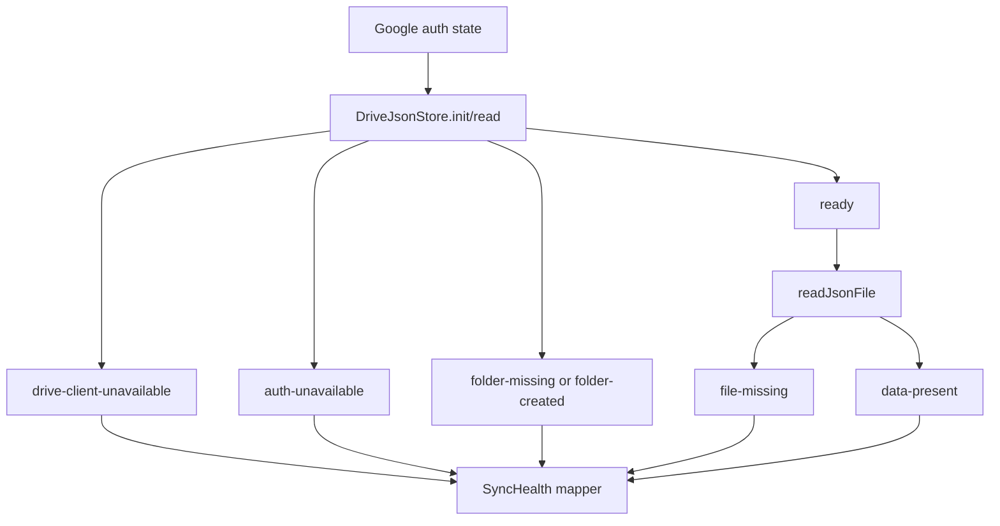

# Fix Drive Sync Diagnostic Stale States - Plan

## Goal Capsule

| Field | Value |
|---|---|
| Objective | Replace vague `STALE` diagnostics for Drive-backed sync with actionable readiness states that distinguish OAuth, Drive client, Drive folder, missing backup files, empty data, and real sync failures. |
| Authority | User screenshot and debug finding are primary; existing quiet-auth/offline-auth plans and `docs/solutions/` auth learnings constrain the implementation. |
| Execution profile | Bug fix across Drive storage services, sync orchestration hooks, diagnostics state, and focused tests. |
| Stop conditions | Stop if fixing this requires changing OAuth scopes, replacing Drive storage, or adding a server-side Google proxy. |
| Tail ownership | Implementation should include tests, build verification, and a short solution doc because this is a recurring auth/Drive integration pattern. |

---

## Product Contract

### Summary

The diagnostics page currently shows `TASKS DRIVE SYNC`, `WORKLOGS SYNC`, and `SUGGESTIONS SYNC` as `STALE` while `Google Auth` is OK.
That state is too coarse: OAuth can be healthy while Drive client initialization, Drive folder discovery, or JSON file discovery is not ready.
The fix should make those states precise enough for the user and future debugging: missing seed files are not failures, missing Drive readiness is a recoverable sync initialization issue, and real API errors remain errors.

### Problem Frame

`App.tsx` marks Google Auth OK when `googleAuth.state` is `SIGNED_IN` or `REFRESH_PENDING`.
Drive-backed sync goes through `DriveJsonStore.init()` and additionally needs `window.gapi.client.drive`, a usable access token, the `/Anu-BattlePlan/` folder, and sometimes a specific JSON file.
Today `taskDriveBackup.load()` returns `null` for multiple meanings, and `workLogsSync.init()` / `suggestionsSync.init()` only expose a boolean `initialized`.
The hooks then map those broad booleans to `stale`, producing the screenshot symptom without enough detail to tell whether the app is broken or simply has no cloud data yet.

### Requirements

**Diagnostic clarity**

- R1. Diagnostics must distinguish OAuth health from Drive store readiness; `Google Auth: OK` must not imply Drive sync is ready.
- R2. `Tasks Drive Sync` must not show `STALE` just because `battle_plan_data.json` is missing or empty on first use; it should show an idle/ok-empty state with a clear Czech detail.
- R3. `WorkLogs Sync` and `Suggestions Sync` must not show `STALE` for a generic `init()` false without the underlying reason; they must surface whether Drive client, auth, folder, or file data is missing.
- R4. Real failures from Google/Drive APIs must remain `error` with a preserved diagnostic `lastError`.

**Drive readiness model**

- R5. `DriveJsonStore.init()` must expose a structured result or inspectable last status instead of only `boolean`.
- R6. Services that read known optional JSON files must distinguish "store unavailable" from "file missing" and "file exists but contains zero records".
- R7. WorkLogs and Suggestions should ensure the `/Anu-BattlePlan/` folder exists when the user has usable auth, matching `taskDriveBackup` behavior unless implementation discovers a stronger reason not to.

**Regression safety**

- R8. Existing auth state behavior and silent-refresh dedup behavior must not regress.
- R9. Existing data merge/write behavior must not change beyond diagnostics and first-run folder/file handling.
- R10. Tests must cover the stale-state mappings that produced the screenshot.

### Acceptance Examples

- AE1. Given Google Auth is OK and Drive client is unavailable, when diagnostics refreshes, then Drive-backed sync cards show an error or unavailable detail tied to Drive readiness, not generic `STALE`.
- AE2. Given Google Auth is OK and `/Anu-BattlePlan/` exists but `battle_plan_data.json` is absent, when Tasks sync checks Drive, then the card shows a non-error "no Drive backup yet" state.
- AE3. Given Google Auth is OK and WorkLogs has no local records and no `work_logs_data.json`, when WorkLogs sync runs, then the card stays idle/ok-empty rather than stale.
- AE4. Given local WorkLogs data exists and the cloud file is missing, when sync runs, then the app attempts to create the file and reports OK on success or error on write failure.
- AE5. Given Suggestions files are missing, when the badge refreshes, then the badge is `0` and diagnostics say there are no cloud suggestions yet rather than "sync is not initialized".

### Scope Boundaries

- No OAuth scope changes, client ID changes, or Google consent UX changes.
- No new Google Drive folder layout.
- No data migration for existing Drive JSON files.
- No replacement of `DriveJsonStore` or the quiet-auth state machine.
- No new React test framework unless implementation decides it is already available; service-level tests are sufficient for most coverage.

---

## Planning Contract

### Key Technical Decisions

- KTD1. Add structured Drive readiness at the store boundary. `DriveJsonStore` is where folder/client/auth/file readiness collapses today, so the reason must originate there rather than being guessed in hooks.
- KTD2. Keep optional missing files as normal states. Missing `battle_plan_data.json`, `work_logs_data.json`, `agent-suggestions.json`, or `agent-suggestion-replies.json` is valid on first use and should not be treated as stale or error by itself.
- KTD3. Let all user-owned sync services create the Drive folder. `taskDriveBackup` already uses `init({ createFolder: true })`; WorkLogs and Suggestions should do the same so their diagnostics do not depend on Tasks having run first.
- KTD4. Keep `SyncHealth.state` small unless a new state is clearly needed. Prefer better details and a structured status-to-health mapper before expanding `idle | ok | stale | error`.
- KTD5. Test the mapping, not just Drive primitives. The regression is user-visible diagnostic state, so tests must prove service/store statuses map to the expected health outcomes.

### High-Level Technical Design

The implementation should preserve `DriveJsonStore` as the shared Drive I/O layer but add a small status vocabulary.
Service wrappers (`taskDriveBackup`, `workLogsSync`, `suggestionsSync`) translate that vocabulary into domain results.
Hooks translate domain results into `SyncHealth` entries with Czech details.

### Assumptions

- Existing unit tests use `node:test`, `node:assert/strict`, and mocked `globalThis.window`; new tests should follow that pattern.
- `hasUsableAuth(googleAuth)` remains the correct gate for starting Drive-backed sync.
- Missing Suggestions files mean "no agent suggestions yet", not "the app failed".
- Missing WorkLogs file plus local WorkLogs data should trigger cloud creation as it already does in `useDriveSyncOrchestration`.

### Sources

- `battle-plan/src/services/driveJsonStore.ts` collapses initialization failures to `false`.
- `battle-plan/src/services/taskDriveBackup.ts` creates the Drive folder before loading/saving Tasks backup.
- `battle-plan/src/services/workLogsSync.ts` and `battle-plan/src/services/suggestionsSync.ts` call `drive.init()` without `createFolder`.
- `battle-plan/src/hooks/useDriveSyncOrchestration.ts` maps empty Tasks payload and uninitialized WorkLogs sync to `stale`.
- `battle-plan/src/hooks/useSuggestionsBadge.ts` maps uninitialized Suggestions sync to `stale`.
- `docs/solutions/integration-issues/ensure-fresh-token-refresh-dedup-2026-07-04.md` documents the current single-flight refresh invariant.
- `docs/solutions/logic-errors/offline-auth-state-unreachable-2026-07-04.md` documents the auth state-machine invariants that must be preserved.

---

## Implementation Units

### U1. Structured DriveJsonStore readiness

- **Goal:** Expose why Drive store initialization/readiness failed without breaking existing callers.
- **Requirements:** R1, R3, R5, R8.
- **Files:** `battle-plan/src/services/driveJsonStore.ts`, `battle-plan/src/services/driveJsonStore.test.ts`.
- **Approach:** Add a compact status type such as `DriveStoreStatus` with values for `ready`, `drive-client-unavailable`, `auth-unavailable`, `folder-missing`, `folder-created`, and `init-error`. Preserve `init(): Promise<boolean>` for compatibility, but store the last status or add `initWithStatus()` so services can read the reason.
- **Patterns:** Follow existing `AuthUnavailableError` handling and mock-window tests in `driveJsonStore.test.ts`.
- **Test Scenarios:** GAPI client missing returns false and records `drive-client-unavailable`; auth unavailable records `auth-unavailable`; folder missing without `createFolder` records `folder-missing`; folder missing with `createFolder` records ready/folder-created; unexpected list failure records `init-error` with message.
- **Verification:** `node --experimental-strip-types src/services/driveJsonStore.test.ts`.

### U2. Domain read results for optional Drive JSON files

- **Goal:** Stop treating missing optional JSON files as the same thing as store failure.
- **Requirements:** R2, R3, R4, R6, R9.
- **Files:** `battle-plan/src/services/taskDriveBackup.ts`, `battle-plan/src/services/workLogsSync.ts`, `battle-plan/src/services/suggestionsSync.ts`, related tests.
- **Approach:** Add domain-level load results while keeping existing convenience methods if needed. Suggested shape: `{ kind: 'loaded', data } | { kind: 'missing-file' } | { kind: 'store-unavailable', status } | { kind: 'error', message }`. Use this internally in hooks; keep existing `load()` / `loadAll()` behavior stable for low-risk call sites if broad refactor is not needed.
- **Patterns:** Reuse `getMissingWorkLogsFileStatus()` for the WorkLogs no-file decision instead of duplicating policy.
- **Test Scenarios:** Tasks backup missing file returns `missing-file`; Tasks backup empty data returns `loaded` with empty domain data; WorkLogs missing file returns timestamp `0` plus a status reason; Suggestions missing file returns an empty list plus `missing-file`; API read error returns `error` with detail.
- **Verification:** `node --experimental-strip-types src/services/driveJsonStore.test.ts` plus any new service tests added for these wrappers.

### U3. Make WorkLogs and Suggestions initialize their Drive folder

- **Goal:** Let WorkLogs and Suggestions sync initialize on a clean Drive account without relying on Tasks backup to create `/Anu-BattlePlan/` first.
- **Requirements:** R3, R7, R9.
- **Files:** `battle-plan/src/services/workLogsSync.ts`, `battle-plan/src/services/suggestionsSync.ts`, tests if service seams allow.
- **Approach:** Change `this.drive.init()` to `this.drive.init({ createFolder: true })` for WorkLogs and Suggestions. If U1 exposes status, preserve the status after initialization so the hooks can report folder creation or failure.
- **Patterns:** Mirror `taskDriveBackup.save/load` folder creation.
- **Test Scenarios:** With no cached folder and Drive list returning no folder, `init()` creates `/Anu-BattlePlan/` and sets `initialized`; if create fails, `initialized` remains false and status carries the error.
- **Verification:** Existing WorkLogs tests plus any new DriveJsonStore or service test for create-folder behavior.

### U4. Map Drive/domain results to actionable SyncHealth

- **Goal:** Replace the screenshot's generic stale cards with correct, actionable health states and details.
- **Requirements:** R1, R2, R3, R4, R10.
- **Files:** `battle-plan/src/hooks/useDriveSyncOrchestration.ts`, `battle-plan/src/hooks/useSuggestionsBadge.ts`, `battle-plan/src/hooks/useSyncDiagnostics.ts` if helper extraction is useful.
- **Approach:** Add small pure mapper helpers, either in the hooks or a new utility, for Drive status to `SyncHealth` patch. Example mapping: auth unavailable -> `idle` or `error` depending on current `googleAuth.state`; drive client unavailable -> `error`; folder/file missing with no local data -> `idle`; missing WorkLogs file with local data -> attempt create then `ok`/`error`; empty Suggestions -> `ok` with `0 otevřených návrhů`.
- **Patterns:** Keep current Czech tone and existing `lastSuccess`/`lastError` semantics. Preserve `lastError: null` when the state is not an error.
- **Test Scenarios:** Each acceptance example maps to the expected state/detail; previous screenshot conditions no longer produce three unexplained `STALE` cards.
- **Verification:** Pure mapper tests if helpers are extracted; otherwise service tests plus manual diagnostics smoke.

### U5. Regression and build verification

- **Goal:** Prove the fix does not regress auth or Drive sync.
- **Requirements:** R8, R9, R10.
- **Files:** `battle-plan/package.json` only if new test files need script wiring; otherwise no package changes.
- **Approach:** Run the existing focused suite and build. Add tests to the current `test:worklogs` chain only if new test files are created.
- **Patterns:** Existing runner is `npm run test:worklogs`; build runner is `npm run build`.
- **Test Scenarios:** Existing `googleService.test.ts` remains green; existing DriveJsonStore tests remain green; new stale-state tests fail before the fix and pass after.
- **Verification:** `npm run test:worklogs`; `npm run build`.

### U6. Capture the durable learning

- **Goal:** Record the integration lesson so future Drive sync work does not collapse OAuth and Drive readiness again.
- **Requirements:** R10.
- **Files:** `docs/solutions/integration-issues/<new-drive-readiness-doc>.md`.
- **Approach:** Add a concise solution doc after implementation, covering the distinction between OAuth readiness, Drive client readiness, Drive folder readiness, and optional file presence.
- **Patterns:** Match `docs/solutions/integration-issues/ensure-fresh-token-refresh-dedup-2026-07-04.md`.
- **Test Scenarios:** Not applicable; documentation reviewed for accuracy against the final code.
- **Verification:** Solution doc exists and references the fixed files.

---

## Verification Contract

| Gate | Applies To | Command / Check | Done Signal |
|---|---|---|---|
| Drive store tests | U1, U2, U3 | `node --experimental-strip-types src/services/driveJsonStore.test.ts` from `battle-plan/` | Readiness statuses and existing store behavior pass. |
| Focused sync suite | U1-U5 | `npm run test:worklogs` from `battle-plan/` | Existing Google/Drive/WorkLogs tests and new stale-state tests pass. |
| Build | U1-U5 | `npm run build` from `battle-plan/` | TypeScript and Vite build complete. |
| Manual diagnostics smoke | U4 | Open deployed or local app with Google Auth OK and no seed Drive files | Diagnostics no longer shows unexplained `STALE` for Tasks, WorkLogs, and Suggestions. |
| Regression smoke | U3, U4 | Create or edit a task/worklog/suggestion path that triggers backup | Existing backup/write behavior still succeeds. |

---

## Definition of Done

- U1 exposes structured Drive readiness while preserving compatibility for existing boolean callers.
- U2 distinguishes missing optional files from unavailable Drive store and real errors.
- U3 allows WorkLogs and Suggestions to create or use `/Anu-BattlePlan/` on a clean Drive account.
- U4 maps Drive/domain states to clear diagnostics; the screenshot's three generic stale cards are no longer reproducible under normal first-run conditions.
- U5 verifies `npm run test:worklogs` and `npm run build` are green.
- U6 records a solution doc in `docs/solutions/integration-issues/`.
- No OAuth scopes, auth event payloads, Drive folder layout, or data schemas are changed unless implementation discovers a required compatibility bug and documents it.
- Any exploratory code or temporary instrumentation is removed before completion.
