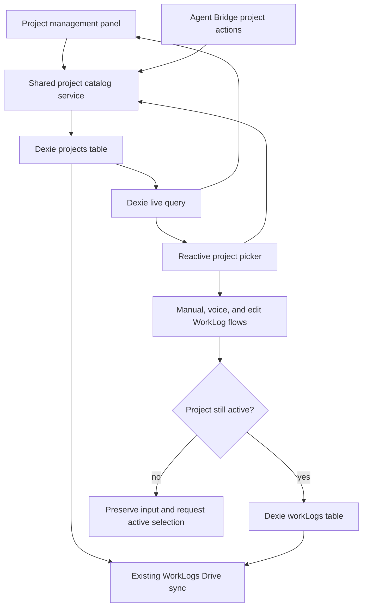
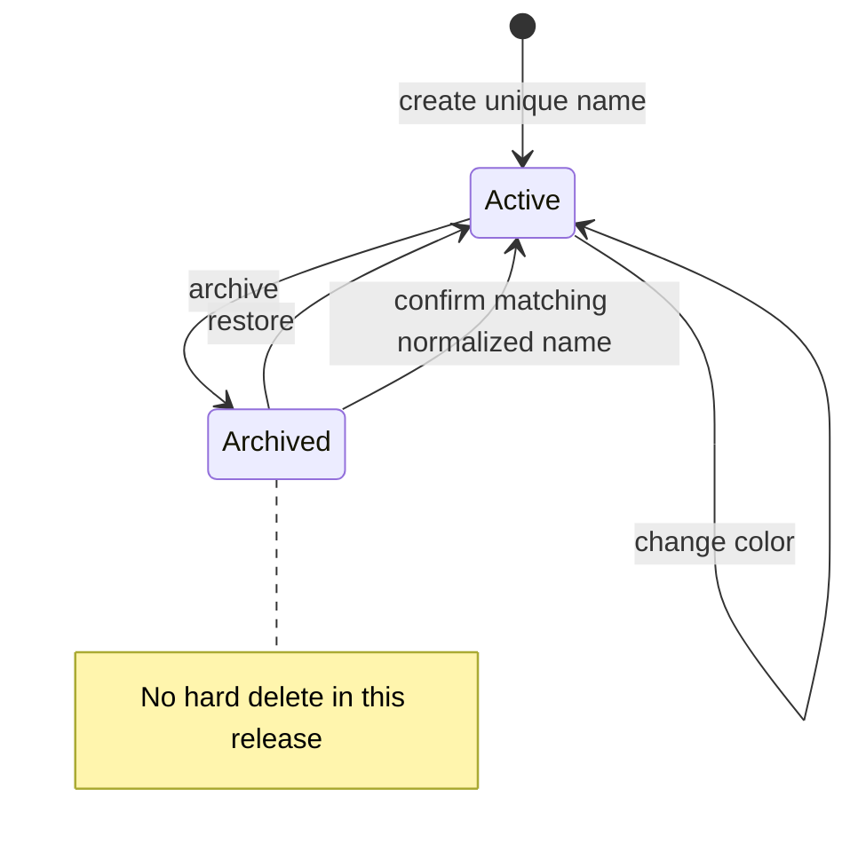

# WorkLog Project Management - Plan

> **Product amendment — 2026-08-08:** User validation established that repeated normalized names are always one project, including legacy “3 +1” WorkLog variants. The shipped follow-up supersedes the collision-preservation decisions below: Dexie v10 and Drive sync reconcile duplicate rows and relink WorkLogs to one catalog ID, while preserving each WorkLog's historical name snapshot. Calendar and table grouping use the same normalized identity.

## Goal Capsule

- **Objective:** Add one durable local project catalog to WorkLogs so a project such as "Liberec Plaza Banka" is created once, managed centrally, and selected repeatedly while work continues. Existing Drive sync remains best-effort and name-matched across devices.
- **Authority:** The user's reusable-project workflow is primary. Existing `Project`, `WorkLog`, Drive sync, voice proposal, and Agent Bridge contracts constrain the implementation.
- **Execution profile:** Protect catalog behavior with fake-IndexedDB service tests, preserve existing batch voice tests, and browser-test the management and selection flows.
- **Stop conditions:** Stop if implementation requires destructive history changes, a new cross-device project identity scheme, or rename semantics that alter the requested scope.
- **Tail ownership:** The shipping workflow owns implementation, review, browser verification, CI, and the pull request.

---

## Product Contract

### Summary

Add project management to the WorkLogs page and make the same persistent project catalog available in every WorkLog entry flow.

### Problem Frame

Projects already exist as durable Dexie records and are included in WorkLogs Drive sync, but their lifecycle is hidden inside each picker. The picker keeps its own snapshot, cannot restore archived projects, and checks new-name collisions only against active rows. As a result, project management is fragmented and UI behavior can diverge from Agent Bridge behavior.

The user needs a project to outlive an individual WorkLog. A two-month project must be created once, remain easy to select, and keep historical WorkLogs readable after the project is archived.

### Requirements

#### Durable project catalog

- R1. A user can create a named project once from the WorkLogs area and reuse the same project identity for later WorkLogs.
- R2. New project mutations preserve one normalized name across active and archived projects. If legacy local or Drive data already contains a normalized collision, the catalog reports an explicit conflict and does not guess, merge, or remap history.
- R3. The project catalog persists locally and continues to use the existing WorkLogs Drive payload and merge boundary.

#### WorkLog selection

- R4. Every new manual or voice WorkLog requires an active project selected from the shared catalog.
- R5. Editing an existing WorkLog can retain its snapshotted historical project even when the catalog row is archived, missing, or has a device-local ID collision; changing the assignment requires another active project.
- R6. A catalog change becomes visible in mounted project pickers without closing the form or reloading the page.

#### Lifecycle and history

- R7. A user can archive an active project and restore an archived project from central project management.
- R8. Archiving never deletes or rewrites existing WorkLogs, and historical views continue to display `WorkLog.projectName` when the catalog row is inactive or unavailable.
- R9. UI and Agent Bridge project mutations follow the same duplicate, restore, archive, and timestamp rules.

### Key Flows

- F1. **Create and reuse a project**
  - **Trigger:** The user opens project management or quick-create from a WorkLog picker.
  - **Steps:** The user enters a name and color; the catalog creates one active project; every mounted picker receives the update; later WorkLogs select that row.
  - **Outcome:** All WorkLogs for the engagement reference one durable project identity.
- F2. **Archive and restore a project**
  - **Trigger:** Work ends or resumes after a pause.
  - **Steps:** Project management archives the row; active pickers stop offering it; the archived list retains it; restore reactivates the same row.
  - **Outcome:** New entry is controlled without breaking historical reports or creating a duplicate identity.
- F3. **Resolve a dictated project**
  - **Trigger:** Voice extraction proposes one or more WorkLogs with a project name.
  - **Steps:** The confirmation flow matches only active catalog rows; a missing or archived match requires an active project selection before batch save.
  - **Outcome:** Voice input never persists an unregistered free-text project.

### Acceptance Examples

- AE1. **Create once, select later.** Given no matching project exists, when the user creates "Liberec Plaza Banka" and later opens another manual WorkLog, then the same project is selectable without entering its name again.
- AE2. **Prevent duplicate identity.** Given active project "Plaza", when the user submits " plaza " or "PLAZA", then no second project row is created and the UI identifies the existing project.
- AE3. **Restore an archived match deliberately.** Given archived project "Plaza", when the user explicitly restores it, or confirms the archived match while creating the same normalized name, then the original row becomes active and no new ID is allocated. A caller-supplied color replaces the stored color; explicit restore without a color preserves it. A distinct engagement must use a distinct project name.
- AE4. **Preserve history.** Given existing WorkLogs for a project, when the project is archived, then those WorkLogs still show their stored project name while new WorkLogs cannot select the archived row.
- AE5. **React while forms are open.** Given a WorkLog form is open, when project management or Agent Bridge changes the catalog, then mounted pickers reflect the persisted state without a page reload.
- AE6. **Block stale selection.** Given a selected project becomes archived before save, when the user submits a manual or voice WorkLog, then save is blocked, entered data remains, and the user can select or restore an active project.
- AE7. **Respect the cross-device boundary.** Given projects are synchronized through the existing Drive payload, when rows arrive from another device, then matching remains best-effort by normalized name; numeric project IDs are treated as device-local and never trusted alone when editing an imported WorkLog.

### Scope Boundaries

In scope are central project management, create, color selection, archive, restore, reactive pickers, active-project validation, Agent Bridge parity, and regression coverage for the existing Drive payload.

#### Deferred to Follow-Up Work

- Project renaming and any decision about whether historical `projectName` snapshots should change.
- Hard deletion, project merging, and bulk reassignment of WorkLogs.
- New cross-device IDs or a new Drive file dedicated to projects.
- Project budgets, dates, clients, billing, permissions, or task-to-project relationships.

---

## Planning Contract

### Assumptions

- "Project management" means create, choose a color, archive, and restore in this release. Rename and hard delete remain deferred.
- Active projects are the only valid choices for new WorkLogs. Archived and missing projects remain readable through historical WorkLog snapshots.
- Quick-create remains in the picker for fast entry, but archive and restore actions live in the central management surface.
- Creating a normalized name that belongs to an archived project returns an archived-match outcome. The UI requires confirmation before restoring it; an explicit Agent Bridge create action supplies that intent directly. An active duplicate remains a validation error.
- Existing normalized collisions are preserved without automatic merge or WorkLog reassignment. Mutations touching the collided name return a conflict that identifies the rows requiring later manual reconciliation.
- The existing `Project.isActive`, `updatedAt`, and WorkLogs Drive payload are sufficient; no Dexie version or cloud payload migration is required.

### Key Technical Decisions

- KTD1. **One transactional project catalog boundary.** A shared service owns name normalization, archived-match detection, confirmed create-or-restore, color changes, archive, restore, active validation, legacy-collision detection, and explicit mutation outcomes. Lookup and mutation run in one Dexie `rw` transaction on `db.projects`; UI and Agent Bridge call this boundary instead of reimplementing lifecycle rules.
- KTD2. **Reactive catalog consumers.** Project management and pickers observe Dexie through the existing reactive query pattern. Persisted changes drive UI state; components do not keep independent project snapshots.
- KTD3. **Stable row identity with historical snapshots.** Restore reuses the original project row. A supplied color is applied during confirmed create-or-restore, while explicit restore without a color preserves the stored color. Archive and color changes do not mutate `WorkLog.projectId` or `WorkLog.projectName`.
- KTD4. **Existing sync contract remains authoritative.** Project changes continue through `work_logs_data.json` with `updatedAt` winner-wins behavior. The feature adds regression proof instead of a second sync service.
- KTD5. **Lifecycle actions are separated from selection.** The WorkLogs page owns a central management panel. Pickers focus on active selection and quick-create, which avoids destructive archive controls inside data-entry dropdowns.
- KTD6. **Atomic save-time validation.** New manual, voice, and agent-created WorkLogs validate the current catalog row and persist inside one Dexie `rw` transaction over `db.projects` and `db.workLogs`; a voice batch aborts as a unit. An edit validates an active row only when its project assignment changes. An unchanged historical assignment remains valid when its catalog row is archived or unavailable.

### High-Level Technical Design

### Sequencing

Build and test the shared catalog rules first. Move Agent Bridge and picker mutations onto that boundary next. Add the central management UI and reactive selection after the catalog contract is stable, then close the work with save-time validation, sync regression tests, and browser verification.

### System-Wide Impact

- **Users:** Projects become visible long-lived objects rather than incidental picker entries.
- **Data integrity:** Archive and restore preserve identity and WorkLog history while eliminating active-versus-archived duplicate behavior.
- **Voice capture:** Batch proposals keep their current transaction and cleanup lifecycle; only project resolution and validation change.
- **Agent parity:** Agent-created and user-created projects share outcomes and appear in the same workspace immediately.
- **Sync:** The existing WorkLogs file remains the single remote payload for projects and WorkLogs.

### Risks and Mitigations

- **Cross-device name identity:** Current merge matches projects case-insensitively by name and numeric IDs remain device-local. Centralize normalization, reject ambiguous legacy collisions, compare both stored ID and snapshotted name in the editor, and avoid rename in this release.
- **Stale selections:** Another component or device can archive a selected project. Re-check the row before save and preserve unsaved form data on failure.
- **Historical display:** Inactive or missing catalog rows must not blank old WorkLogs. Keep the denormalized name authoritative for historical rendering.
- **Voice lifecycle regression:** Do not alter batch transaction or cancel cleanup. Extend existing extractor and proposal tests around project resolution only.
- **UI test gap:** The repository's current Node test runner does not mount TSX. Cover domain reactivity with fake IndexedDB and verify focus, keyboard, mobile layout, and cross-component updates in the required browser pass.

### Sources and Research

- `battle-plan/src/db.ts`
- `battle-plan/src/components/worklogs/ProjectPicker.tsx`
- `battle-plan/src/components/worklogs/WorkLogForm.tsx`
- `battle-plan/src/components/worklogs/WorkLogVoiceConfirm.tsx`
- `battle-plan/src/components/worklogs/WorkLogCard.tsx`
- `battle-plan/src/pages/WorkLogsPage.tsx`
- `battle-plan/src/services/workLogsSync.ts`
- `battle-plan/src/services/agentBridge.ts`
- `docs/solutions/design-patterns/worklog-batch-person-hour-extraction.md`
- `docs/solutions/ui-bugs/worklog-voice-proposal-cancel-reopen.md`
- `docs/solutions/integration-issues/drive-readiness-diagnostic-states-2026-07-05.md`

---

## Implementation Units

### U1. Centralize project catalog behavior

- **Goal:** Establish one tested project lifecycle contract for UI and agent callers.
- **Requirements:** R1-R3, R7-R9; F1, F2; AE2, AE3
- **Dependencies:** None
- **Files:** `battle-plan/src/services/projectCatalog.ts`, `battle-plan/src/services/projectCatalog.test.ts`, `battle-plan/src/services/agentBridge.ts`, `battle-plan/src/services/agentBridge.test.ts`
- **Approach:** Move normalization and project mutations behind a service that returns created, archived-match, restored, updated, archived, duplicate, conflict, or validation outcomes. Run normalized lookup plus add/restore in one Dexie transaction. Preserve source attribution when Agent Bridge delegates to it. Use Dexie rows and existing timestamps; do not add schema fields. A supplied color wins on confirmed create-or-restore; restore without one preserves the stored color.
- **Execution note:** Start with failing fake-IndexedDB tests for active duplicates and archived-name restoration before moving existing mutation paths.
- **Patterns to follow:** Agent Bridge already restores an archived case-insensitive match. WorkLogs sync already persists `isActive` and `updatedAt`.
- **Test scenarios:**
  1. Creating a unique trimmed name writes one active row with the selected color and timestamps.
  2. Covers AE2. Creating a case or whitespace variant of an active name returns a duplicate outcome and leaves row count unchanged.
  3. Covers AE3. Creating a case variant of an archived name first returns the original archived match; confirmed restoration reactivates that ID and applies the documented color rule.
  4. Archive and restore update `isActive` and `updatedAt` without changing `id`, `name`, or existing WorkLogs.
  5. UI-style and agent-style callers produce the same lifecycle outcome while preserving their source metadata.
  6. Empty names, missing IDs, and unknown project IDs return explicit validation failures without partial writes.
  7. Concurrent normalized-equivalent creates produce one row, and seeded legacy collisions return an explicit conflict without automatic merge or WorkLog remap.
- **Verification:** Catalog and Agent Bridge tests prove one row identity, equivalent UI/agent rules, and no schema migration.

### U2. Add central management and reactive project selection

- **Goal:** Give users a visible project catalog and make mounted pickers update from persisted state.
- **Requirements:** R1, R2, R6-R8; F1, F2; AE1-AE5
- **Dependencies:** U1
- **Files:** `battle-plan/src/components/worklogs/ProjectManager.tsx`, `battle-plan/src/components/worklogs/ProjectPicker.tsx`, `battle-plan/src/pages/WorkLogsPage.tsx`, `battle-plan/src/services/projectCatalog.test.ts`
- **Approach:** Add a mobile-friendly management panel under the WorkLogs header with separate active and archived groups, create/color controls, archive confirmation, and restore actions. Replace picker-owned loading with a reactive Dexie query and route quick-create through the catalog service. When quick-create finds an archived normalized match, show that project and require confirmation before restoration; announce whether a project was created or restored. Remove destructive archive controls from the selection dropdown.
- **Patterns to follow:** `WorkLogsPage` already owns page-level forms and view controls. Use the project's existing Tailwind, Lucide, and motion patterns without introducing a UI dependency.
- **Test scenarios:**
  1. Covers AE1. Creating "Liberec Plaza Banka" from management makes it selectable in a later manual entry without retyping.
  2. Covers AE5. A project created, archived, restored, or recolored while a picker is mounted updates the observed active list without remount.
  3. Active and archived empty states are distinct, and an archived project can be restored with the same ID and documented color behavior.
  4. Archive confirmation states that historical WorkLogs remain unchanged.
  5. Keyboard focus, labels, button names, and project text make management usable without relying on color alone.
  6. Narrow viewport keeps create, active, and archived controls usable without horizontal overflow.
- **Verification:** Fake-IndexedDB subscription coverage proves reactive catalog updates, and browser verification proves the central panel, picker, accessibility labels, and responsive layout.

### U3. Enforce active selection across WorkLog and sync flows

- **Goal:** Ensure every new WorkLog references a currently active catalog row while preserving historical and synchronized data.
- **Requirements:** R3-R9; F2, F3; AE3-AE6
- **Dependencies:** U1, U2
- **Files:** `battle-plan/src/components/worklogs/WorkLogForm.tsx`, `battle-plan/src/components/worklogs/WorkLogVoiceConfirm.tsx`, `battle-plan/src/components/worklogs/WorkLogCard.tsx`, `battle-plan/src/services/workLogExtractor.ts`, `battle-plan/src/services/workLogExtractor.test.ts`, `battle-plan/src/services/workLogsSync.test.ts`, `battle-plan/src/services/agentBridge.ts`, `battle-plan/src/services/agentBridge.test.ts`, `docs/solutions/design-patterns/worklog-project-catalog-management.md`
- **Approach:** Validate selected projects and persist new WorkLogs in one transaction over projects and WorkLogs; keep the existing voice batch all-or-nothing. Keep entered values and surface an unavailable-project correction state when a new-entry selection becomes inactive. In edit mode, show an archived or missing snapshotted project as a labeled retained value and permit it only while the assignment is unchanged; compare both `projectId` and `projectName` so an imported device-local ID cannot select an unrelated local row. Partial voice matching returns a project only when exactly one active normalized candidate matches. Add sync coverage for archive and restore without changing the Drive file shape.
- **Execution note:** Preserve the voice batch transaction and cancel lifecycle; add project-specific cases around those contracts rather than restructuring them.
- **Patterns to follow:** `WorkLogVoiceConfirm` writes accepted rows in one transaction. `WorkLogCard` already renders the denormalized name. `mergeCloudToLocal` already compares project `updatedAt` values.
- **Test scenarios:**
  1. Covers AE6. A manual form whose selected project becomes archived blocks save and preserves date, people, hours, and description.
  2. Covers AE6. A voice batch with an archived or missing match requires an active selection and writes no partial rows.
  3. Covers AE4. Archiving a project leaves existing WorkLog IDs and names unchanged and keeps card/table history readable.
  4. Voice exact and partial matching ignores archived projects and resolves an active catalog row when unambiguous.
  5. Drive merge applies a newer archive, restore, or color change to the existing local project without creating a duplicate or changing historical WorkLogs.
  6. Cancelling a voice proposal after project correction clears the proposal and recorder source state without reopening.
  7. An agent-created WorkLog with an inactive or unknown project is rejected inside the shared transaction without a partial write.
  8. An imported WorkLog whose numeric ID collides with a differently named local project shows its snapshotted historical assignment rather than the unrelated local row.
- **Verification:** Existing WorkLog extractor, sync, Agent Bridge, and batch tests pass with the new catalog cases; manual and voice browser flows preserve entry data and history.

---

## Verification Contract

| Gate | Applies to | Done signal |
|---|---|---|
| `npm run test` in `battle-plan` | U1-U3 | Catalog, Agent Bridge, extractor, sync, and existing WorkLog tests pass under fake IndexedDB. |
| `npm run lint` in `battle-plan` | U1-U3 | No React hook, accessibility, or TypeScript lint regression is introduced. |
| `npm run build` in `battle-plan` | U1-U3 | TypeScript and the production Vite PWA build complete with the existing build identity injection. |
| Browser management flow | U2 | Create, duplicate validation, archive, restore, live picker update, keyboard access, and mobile layout work. |
| Browser WorkLog flow | U2, U3 | A created project is reusable in manual entry; stale archived selection is blocked without losing input; historical records remain visible. |
| Existing Drive payload review | U1, U3 | `work_logs_data.json` remains backward-compatible and archive/restore converge through current timestamps. |

---

## Definition of Done

- A project can be created once from WorkLogs and selected repeatedly in later manual and voice records.
- WorkLogs has one central management surface for active and archived projects.
- Mounted pickers react to persisted create, archive, restore, and color changes without reload.
- New mutations do not create normalized duplicates; archived-name creation requires deliberate restoration of the original ID, and legacy collisions fail explicitly without guessed merges.
- New manual, voice, UI, and Agent Bridge records require an active project atomically. Editing may retain its unchanged historical assignment or move to another active project.
- Archiving never changes or deletes historical WorkLogs, and old records remain readable by their snapshotted project name.
- The existing Drive payload and merge path synchronize the catalog without a schema or file migration.
- Automated tests, lint, production build, and browser verification pass.
- The solution note records the shared catalog, reactive picker, historical snapshot, and archive/restore invariants.
- Abandoned experiments, duplicated project lifecycle logic, debug output, and obsolete picker-local state are removed.
