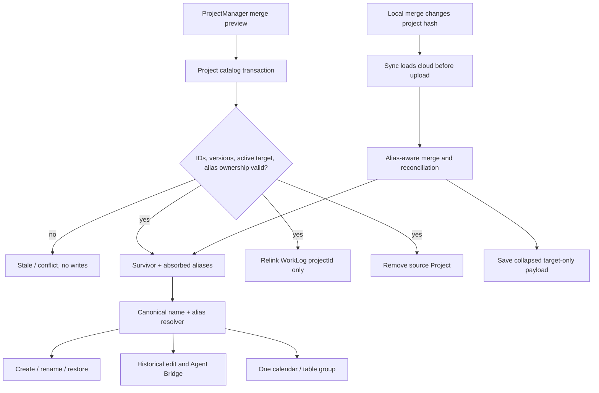

# Manual Project Merge - Plan

## Goal Capsule

- **Objective:** Let a user explicitly merge two differently named project rows into one durable project identity, including the concrete case “Komerční Banka” plus “Komerční banka Plaza”, without losing WorkLogs or letting the removed identity reappear after Drive sync.
- **Authority:** The user's manual correction workflow is primary. Existing historical WorkLog snapshots, local Dexie identity, best-effort Drive sync, and human-confirmation boundaries constrain the implementation.
- **Execution profile:** Prove the domain mutation and cross-device convergence with fake-IndexedDB tests, then browser-test the confirmation flow and the resulting catalog/report state on desktop and mobile widths.
- **Stop conditions:** Stop if a proposed implementation rewrites any WorkLog field other than `projectId`, deletes WorkLogs, depends on device-local project IDs in Drive, cannot roll back atomically on a stale/conflicting selection, or can resurrect the source project during pull-before-push sync.
- **Tail ownership:** The LFG pipeline owns implementation, review, browser verification, commit, push, PR, and CI follow-through.

---

## Product Contract

### Summary

Add a human-confirmed “Sloučit projekty” flow to project management. The user chooses the project to absorb and the active project that should survive; BattlePlan preserves one visible catalog identity while retaining the absorbed names as durable synchronized aliases.

### Problem Frame

Automatic reconciliation safely recognizes spacing and case variants, but it cannot infer that semantically different names such as “Komerční Banka” and “Komerční banka Plaza” refer to the same engagement. Those rows currently remain separate in project management and their WorkLogs remain separate in calendar/table aggregates.

A local `source Project delete + WorkLog.projectId update` is insufficient. Project IDs are device-local, Drive merge is add/update-only, and historical `WorkLog.projectName` intentionally retains the old name. Without a persistent alias/tombstone, an older cloud payload or another device can recreate the absorbed source project.

### Requirements

#### Explicit merge workflow

- R1. Project management exposes a dedicated merge control whenever at least two projects exist and at least one eligible active survivor can be selected.
- R2. The user explicitly selects a source project and a distinct active survivor. The source may be active or archived; an archived survivor is rejected so a successful merge cannot silently hide an active engagement.
- R3. Before mutation, the UI shows the direction `source → survivor`, both names, lifecycle state and color labels, the current number of source-linked WorkLogs, the survivor metadata that will remain, and that the merge has no undo in this release.
- R4. Confirmation is bound to a captured preview token covering both selected project identities/versions, merge direction, lifecycle state, and alias ownership. If either project or the identity graph changes after preview, the merge returns a stale outcome without writes and requires a refreshed confirmation. WorkLogs created in the meantime join the same source identity and are included in the committed count rather than invalidating the user's semantic choice.

#### Durable project identity

- R5. A successful merge preserves the survivor's `id`, canonical name, color, active state, `createdAt`, source attribution, and agent write attribution; it adds the source canonical name and all source aliases to the survivor, advances only the survivor's identity timestamp, and removes the source row.
- R6. The project alias contract is global identity, not display-only metadata: aliases are normalized and deduplicated, cannot equal the owner's canonical name, cannot be owned by a third project, and cannot be used to create or rename a different project. Renaming the owner moves its previous canonical name into its own alias set so historical snapshots and stale cloud rows remain attached.
- R7. All WorkLogs assigned to the source are relinked to the survivor by `projectId` in the same transaction. Their `projectName`, timestamps, sync identity, people, hours, descriptions, and extraction metadata remain byte-for-byte unchanged.
- R8. The merge does not rewrite the local Agent Inbox mirror. A subsequently fetched WorkLog command that carries the absorbed name resolves through the survivor alias; a Project lifecycle command aimed at the removed source ends with a terminal `project-merged`/not-found result and is never redirected onto the survivor.

#### Cross-device and consumer convergence

- R9. The optional alias metadata travels in the existing `work_logs_data.json` project payload; no new Drive file or portable numeric ID is introduced. The merge advances the survivor `updatedAt` and removes the source, so the existing `App.tsx` WorkLogs/project live hash observes the mutation and schedules the ordinary pull-reconcile-push backup.
- R10. Catalog create/restore/rename, automatic reconciliation, Drive project import, cloud WorkLog resolution, unchanged WorkLog editing, reporting, and existing Agent Bridge project/WorkLog paths resolve canonical names and aliases through one identity rule.
- R11. Pull-before-push sync cannot resurrect an absorbed source. A stale cloud source whose canonical name is a local alias collapses into the alias owner without overwriting the survivor's canonical name, color, state, or attribution.
- R12. Calendar and table reports group alias snapshots by the survivor's canonical local identity, name, and color, while individual WorkLog cards continue to display their original `projectName` snapshot.
- R13. Manual merge remains human-only. Agent Bridge gains alias-aware behavior for existing actions but no `merge_project` action or implicit semantic merge.

### Key Flows

- F1. **Preview and confirm a merge**
  - **Trigger:** The user opens “Sloučit projekty”, chooses “Převést z” and “Sloučit do”, then requests a preview.
  - **Steps:** The UI resolves both captured IDs, counts source-linked WorkLogs, shows survivor metadata and the irreversible direction, and enables the specifically named confirmation action.
  - **Outcome:** The user knows exactly which identity disappears and which identity remains.
- F2. **Commit one atomic identity change**
  - **Trigger:** The user confirms the unchanged preview.
  - **Steps:** One Dexie read/write transaction revalidates IDs, versions, state and alias ownership; updates survivor aliases and `updatedAt`; relinks every current source WorkLog; then deletes the source.
  - **Outcome:** Either every identity reference moves and the source disappears, or no table changes.
- F3. **Converge through Drive**
  - **Trigger:** A device syncs after a merge, or a second device still has the old source row.
  - **Steps:** Existing sync orchestration observes the changed WorkLogs/project hash, pulls cloud data, alias-aware import unions valid alias metadata and collapses stale sources, then uploads the target-only payload.
  - **Outcome:** Each device settles on one visible survivor while all WorkLogs and snapshots remain.
- F4. **Use an absorbed name later**
  - **Trigger:** Catalog create/rename, historical WorkLog edit, Agent Bridge, or Drive input refers to an old alias.
  - **Steps:** The shared identity resolver returns the survivor. Create/rename cannot allocate a new row under the absorbed name; an archived survivor is offered for deliberate restoration under existing catalog rules.
  - **Outcome:** The alias stays attached to the same durable identity instead of recreating duality.

### Acceptance Examples

- AE1. **The user's 3 + 1 case becomes one project.** Given three WorkLogs snapshotted as “Komerční Banka” and one as “Komerční banka Plaza”, when “Komerční banka Plaza” is merged into active “Komerční Banka”, then project management and pickers show one project and reports show one four-record aggregate with the survivor name/color; each individual WorkLog still shows its original snapshot text.
- AE2. **Metadata and history survive.** Given an active survivor and an active or archived source, when merge succeeds, then the survivor keeps its documented metadata, source is absent, every source WorkLog points to survivor, and no non-assignment WorkLog field changes.
- AE3. **Zero-log duplicate is valid.** Given a source with no WorkLogs, when it is merged, then its name/aliases are absorbed and its row is removed; the reported affected count is zero.
- AE4. **Stale confirmation is safe.** Given a merge preview, when either selected project is renamed, recolored, archived, restored, or otherwise advances its version before confirmation, then the merge is rejected as stale, no rows change, and the UI asks for a fresh preview.
- AE5. **Alias collision rolls back.** Given a source alias is already the canonical name or alias of an unrelated third project, when merge is attempted, then the service reports the conflicting project and writes nothing.
- AE6. **Old cloud state cannot revive source.** Given local source→survivor merge and a cloud payload that still contains source before or after survivor in its project array, when sync runs, then one survivor remains, aliases are preserved, and WorkLogs using either historical name reference it.
- AE7. **A second device converges.** Given another device still has separate source and survivor rows, when it receives the survivor alias payload, then alias-aware reconciliation removes the source and relinks local WorkLogs without changing snapshots.
- AE8. **Old name remains reserved, not a new identity.** Given the survivor owns an absorbed alias, when catalog or Agent Bridge create refers to that name, then it reports the existing survivor; rename into another project's alias is rejected terminally.
- AE9. **Malformed legacy data fails safely.** Given a legacy project with no aliases or malformed optional alias data, when the app opens or syncs, then missing data behaves as an empty alias set, invalid entries are ignored or rejected at the boundary, and sync does not crash or partially mutate the catalog.

### Scope Boundaries

In scope are one-way manual merge, preview/confirmation, alias-aware catalog and historical-assignment identity, safe later Agent Inbox processing, same-payload Drive convergence for updated clients, report unification, and regression documentation.

#### Deferred to Follow-Up Work

- Undo or splitting a previously merged project.
- Agent-initiated merge; this requires a future two-phase proposal plus verifiable user confirmation.
- Rewriting historical `WorkLog.projectName` values to the survivor name.
- A new cross-device UUID scheme, server-side transaction, dedicated project file, or general-purpose merge history UI.
- Voice input that deliberately uses an absorbed old name. Existing voice proposals continue to resolve canonical active names; alias speech matching can follow after the merge/sync contract is proven.
- Fully concurrent opposite offline merges between multiple devices. This release must detect/collapse acyclic alias chains deterministically and avoid resurrecting rows; an actual alias cycle or competing owners must stop with an explicit conflict rather than guess semantic intent.
- Guaranteed behavior from an already-open older PWA bundle that predates alias resolution. Because that bundle can overwrite the shared full payload without retaining aliases, every participating device must refresh to the alias-aware version before the user relies on cross-device merge convergence; a separate append-only merge ledger is explicitly outside this release.

---

## Planning Contract

### Assumptions

- The merge panel lives in the existing ProjectManager and uses two explicit selectors rather than row-level one-click actions.
- The canonical survivor must be active; users can restore an archived target before selecting it.
- Aliases use an optional, backward-compatible list of absorbed display names. Identity deduplicates by normalized name and serializes aliases in deterministic normalized order. Names remain portable because local numeric IDs are not shared between devices.
- Successful local mutation does not wait for Drive. The existing `App.tsx` live hash includes project count and `updatedAt`, so the merge automatically schedules the established pull-reconcile-push path and exposes failures through existing WorkLogs sync health.
- The preview count is informative; the success message reports the actual count committed inside the transaction.

### Key Technical Decisions

- KTD1 (session-settled: user-directed — chosen over automatic-only matching: semantically different names cannot be inferred safely). **Manual correction complements safe automatic matching.** The UI exposes explicit merge because semantic equivalence such as “Komerční Banka” versus “Komerční banka Plaza” cannot be inferred safely. Automatic-only handling is rejected because it leaves known dualities unresolved; broader fuzzy auto-merge is rejected because it can combine unrelated jobs.
- KTD2. **Aliases are synchronized identity tombstones.** The survivor stores absorbed canonical names and transitive aliases as a deterministic string list. Normalized aliases form one reserved namespace with canonical names and never include the owner's canonical name. A transient local delete without an alias is rejected because add/update-only Drive sync would resurrect the source.
- KTD3. **User-selected active survivor wins.** Manual merge preserves all survivor metadata named in R5, regardless of automatic reconciliation's active/newest heuristic. The source may be archived, but the survivor must be active so the result remains selectable.
- KTD4. **One guarded transaction owns the mutation.** The catalog service previews and commits against a token fingerprinting the selected Projects, direction, and alias ownership. Commit spans projects and WorkLogs; it makes survivor `updatedAt` strictly newer than both input rows and the current clock, relinks every current source WorkLog, and deletes source atomically. Component state never performs domain writes directly and the transaction performs no Drive I/O or local inbox rewrite.
- KTD5. **Historical snapshots stay immutable.** Merge changes only WorkLog catalog identity (`projectId`). Reporting and selection become alias-aware rather than rewriting the denormalized `projectName` audit value.
- KTD6. **Explicit unambiguous alias ownership outranks stale source metadata.** A pure identity resolver returns resolved, missing, or conflict rather than choosing the first match. Reconciliation and Drive import validate the complete canonical/alias graph before writes; an unambiguous stale source collapses into its owner without overwriting owner metadata even with a later device clock, while cycles or competing owners fail closed for the affected merge. Alias union and serialization are idempotent and project-array order cannot change the result.
- KTD7. **Human-only semantic merge, agent-aware identity.** Agent Bridge keeps its existing action union. Its ordinary project and WorkLog operations use the shared alias resolver and return terminal duplicate/conflict/not-found outcomes; a destructive bridge action is deferred until the protocol can carry explicit human confirmation.
- KTD8. **Publication reuses existing orchestration.** A merge succeeds locally even while offline. Advancing survivor `updatedAt` plus deleting the source changes the existing `App.tsx` WorkLogs/project hash, which schedules the same delayed pull-reconcile-push backup as ordinary WorkLog and project mutations. This avoids network work inside the merge transaction and introduces no parallel sync state.

### High-Level Technical Design

The diagram describes ownership and data flow, not implementation signatures. The identity resolver remains a small domain utility shared by catalog, sync, historical-assignment validation, Agent Bridge delegation, and report indexing.

### Sequencing

Define and test alias identity plus the guarded merge transaction first. Extend reconciliation and Drive convergence before exposing the UI, because a UI-only merge would be unsafe on the user's phone. Move every downstream lookup and report group onto the shared resolver, then add preview/confirmation and complete browser verification.

### System-Wide Impact

- **Projects table and Drive payload:** `Project` gains optional alias metadata without a new index or file. Legacy rows read as an empty alias set.
- **WorkLogs:** Source-linked rows change only `projectId`; the stable `syncId` and denormalized audit snapshot remain unchanged.
- **New WorkLogs:** Existing UI entry continues to select the survivor's canonical active row. An Agent Bridge WorkLog carrying an absorbed name resolves to that survivor and snapshots its canonical name; only pre-existing history retains the absorbed source text.
- **Agent Inbox:** The Dexie table remains a diagnostic mirror, not a second command authority. Later WorkLog commands resolve an absorbed name to the survivor at apply time; later Project mutations against the removed source terminate instead of changing survivor metadata.
- **Catalog and pickers:** Absorbed aliases cannot be recreated. If the survivor is archived later, create through any alias resolves to that same archived identity and uses the existing confirmation flow.
- **Historical edit:** An active survivor plus an absorbed historical snapshot remains a valid unchanged assignment after merge.
- **Calendar/table:** Canonical project identity becomes the aggregate key whenever a WorkLog resolves by ID, canonical name, or alias; true orphans retain snapshot-based fallback behavior.
- **Drive sync:** Import builds an order-independent canonical/alias index, unions aliases, collapses stale source rows, and remaps cloud WorkLogs by portable name identity rather than trusting remote numeric IDs. Existing hash-driven orchestration publishes the collapsed payload.
- **Agent parity:** Existing project actions become alias-aware, but semantic merging remains a visible human approval boundary and the public action count does not change.

### Risks and Mitigations

- **Source resurrection:** Add/update-only sync can re-add deleted rows. Mitigate with durable aliases, alias-aware import before addition, and second-device regression tests.
- **Partial destructive mutation:** Relink plus survivor update plus source delete crosses two tables. Mitigate with one Dexie transaction, project-version guards, exact rollback tests, and no Drive dependency inside commit.
- **Alias ownership conflict:** A name could connect unrelated projects through stale or concurrent data. Block third-party collisions locally; treat cyclic/competing imported ownership as an explicit conflict rather than silently choosing a business identity.
- **Clock skew and array order:** A stale source may have a larger `updatedAt`. Explicit alias ownership prevents it from overwriting survivor metadata, alias union is order-independent, and merge timestamps are used only to merge identical alias evidence or report conflicts.
- **Hidden duplicate reporting:** Historical names differ after IDs are relinked. Key resolved groups by survivor ID and test the user's 3 + 1 aggregate directly.
- **Stale UI intent:** Live query can change the selected Projects between preview and click. Bind preview to their IDs, versions, direction, and alias ownership; cancel preview on selector changes; include all current source WorkLogs at commit and report the actual count.
- **Backward compatibility:** Old payloads have no aliases and malformed external JSON is possible. Normalize at service/sync boundaries and treat absent aliases as empty.
- **Transactional implementation failure:** Validation-only tests do not prove rollback. Inject a failure after survivor update and WorkLog relink but before source removal; compare projects and WorkLogs deeply with their pre-merge snapshots.
- **Sync churn:** Rewriting aliases or timestamps on every import can create an endless backup loop. Sort/deduplicate aliases deterministically, advance timestamps only on a real identity change, and prove that repeated/alternating imports reach a byte-stable payload.
- **Older cached client:** A previous bundle can erase alias metadata when it rewrites the full payload. Make this rollout limitation explicit, verify the running version and refresh all participating devices before cross-device QA, and scope convergence claims to alias-aware clients; do not imply that lost semantic intent can be reconstructed automatically.
- **Agent safety:** A one-phase inbox write is not human confirmation. Do not add merge action; keep deterministic validation failures terminal.

### Sources and Research

- `battle-plan/src/components/worklogs/ProjectManager.tsx`
- `battle-plan/src/services/projectCatalog.ts`
- `battle-plan/src/services/projectCatalog.test.ts`
- `battle-plan/src/utils/projectIdentityReconciliation.ts`
- `battle-plan/src/utils/projectIdentityReconciliation.test.ts`
- `battle-plan/src/services/workLogsSync.ts`
- `battle-plan/src/services/workLogsSync.test.ts`
- `battle-plan/src/services/workLogPersistence.ts`
- `battle-plan/src/services/workLogExtractor.ts`
- `battle-plan/src/utils/workLogProjectGrouping.ts`
- `battle-plan/src/services/agentBridge.ts`
- `battle-plan/src/db.ts`
- `docs/solutions/design-patterns/worklog-project-catalog-management.md`
- `docs/solutions/integration-issues/drive-readiness-diagnostic-states-2026-07-05.md`
- `docs/plans/2026-08-08-001-feat-project-management-plan.md`
- Graphify query over the existing `graphify-out/graph.json`, used to confirm the Project/WorkLog/Drive/Agent Bridge dependency surface.

---

## Implementation Units

### U1. Define alias identity and atomic catalog merge

- **Goal:** Establish one tested domain contract for previewing and committing a user-selected merge.
- **Requirements:** R2-R7, R9, R10; F1, F2; AE2-AE5
- **Dependencies:** None
- **Files:** `battle-plan/src/db.ts`, `battle-plan/src/services/projectCatalog.ts`, `battle-plan/src/services/projectCatalog.test.ts`, `battle-plan/src/utils/projectIdentityReconciliation.ts`, `battle-plan/src/dbMigration.test.ts`
- **Approach:** Add optional string aliases and shared normalization/index helpers with resolved/missing/conflict outcomes. Extend catalog matching so canonical names and aliases are one reserved namespace. Add preview data and a guarded merge result family with explicit success, stale, conflict, and validation outcomes. The preview token covers selected Project state and alias ownership. Commit inside one transaction over projects and WorkLogs; union aliases, preserve survivor metadata, relink all current source WorkLogs, advance survivor `updatedAt`, then delete source. Keep legacy rows compatible and leave the diagnostic inbox mirror untouched.
- **Execution note:** Start with failing fake-IndexedDB tests for survivor preservation, byte-stable WorkLog snapshots, stale preview rollback, and third-project alias collision before implementing the mutation.
- **Patterns to follow:** `projectCatalog` owns transactional lifecycle rules; v10 reconciliation already returns project-ID remaps while preserving WorkLog snapshots; the `App.tsx` live WorkLogs/project hash already schedules backup after project count or `updatedAt` changes.
- **Test scenarios:**
  1. Covers AE2. Active source into active survivor relinks multiple WorkLogs, preserves every non-`projectId` field, removes source, and leaves survivor metadata unchanged except aliases and identity timestamp.
  2. Covers AE3. Archived source with zero WorkLogs merges successfully and returns an actual affected count of zero.
  3. Covers AE4. Same ID, missing ID, inactive survivor, changed Project state, or changed alias ownership returns a specific non-success outcome with projects and WorkLogs unchanged; a new source WorkLog is included successfully and changes only its `projectId`.
  4. Covers AE5. Canonical-name or alias collision with a third project rejects the merge and applies no alias, relink, or delete.
  5. Source aliases are transitively absorbed, normalized once, deduplicated, and never retain the survivor canonical name as its own alias.
-  6. Legacy rows without aliases and malformed alias values are normalized safely without a Dexie schema/index migration.
  7. An injected failure after survivor update and WorkLog relink but before source delete rolls back to deep-equal snapshots of projects and WorkLogs; no Drive or inbox call occurs inside the transaction.
- **Verification:** Focused catalog and migration tests prove atomicity, target-wins semantics, automatic hash publication triggers, and backward compatibility.

### U2. Make reconciliation and Drive sync converge on aliases

- **Goal:** Ensure an absorbed project cannot return from an old cloud payload or another device.
- **Requirements:** R6, R9-R11; F3; AE6, AE7, AE9
- **Dependencies:** U1
- **Files:** `battle-plan/src/utils/projectIdentityReconciliation.ts`, `battle-plan/src/utils/projectIdentityReconciliation.test.ts`, `battle-plan/src/services/workLogsSync.ts`, `battle-plan/src/services/workLogsSync.test.ts`, `battle-plan/src/hooks/useDriveSyncOrchestration.ts`, `battle-plan/src/utils/workLogsSyncStatus.ts`, `battle-plan/src/utils/workLogsSyncStatus.test.ts`, `battle-plan/src/db.ts`, `battle-plan/src/dbMigration.test.ts`
- **Approach:** Build and validate the complete canonical/alias graph before mutating any imported row. Union valid alias metadata independently of input order; when an incoming or local project's canonical name has one unambiguous alias owner, preserve that owner and collapse the stale source into it. Resolve cloud WorkLogs through canonical names and aliases, keep historical snapshot strings, and apply resulting ID remaps to WorkLogs and safe pending WorkLog payloads. Detect alias cycles or competing owners before write and return structured diagnostics without partially applying the affected component.
- **Patterns to follow:** Current Drive merge treats remote IDs as device-local, runs reconciliation inside a transaction, and preserves WorkLog snapshots. Alias ownership extends that portable name-based boundary.
- **Test scenarios:**
  1. Covers AE6. Stale cloud source before or after survivor does not reappear; order produces the same one-project result and alias set.
  2. Covers AE7. A device seeded with separate source/survivor consumes the survivor alias payload, removes source, and relinks local WorkLogs without changing snapshots.
  3. A cloud WorkLog using an absorbed historical name resolves directly to the local survivor rather than `-1` or a recreated project.
  4. Newer stale-source `updatedAt` never renames, recolors, archives, or reattributes the alias owner.
  5. Repeated sync is idempotent; alias union does not duplicate entries or advance timestamps without new information.
  6. Missing legacy aliases behave as empty; malformed aliases are ignored/rejected without aborting unrelated valid imports.
  7. Acyclic chained merges collapse to one owner; a cycle or competing owners returns an explicit conflict and preserves all WorkLogs.
  8. Applying the same payload a second and third time yields zero DB changes and the same serialized payload; alternating two device fixtures converges to target-only state even when the stale device adds a WorkLog under the absorbed name.
  9. A local merge changes the existing project hash through survivor `updatedAt` and source deletion, scheduling the established backup path; unavailable Drive or failed save remains observable through existing sync health and later orchestration retries.
- **Verification:** Reconciliation and sync tests demonstrate pull-before-push safety, second-device convergence, input-order independence, and no data loss.

### U3. Route WorkLog and agent consumers through canonical aliases

- **Goal:** Make every existing reader/writer treat an absorbed name as the survivor identity.
- **Requirements:** R8, R10, R12, R13; F4; AE1, AE8
- **Dependencies:** U1, U2
- **Files:** `battle-plan/src/services/workLogPersistence.ts`, `battle-plan/src/services/workLogPersistence.test.ts`, `battle-plan/src/utils/workLogProjectGrouping.ts`, `battle-plan/src/utils/workLogProjectGrouping.test.ts`, `battle-plan/src/services/agentBridge.test.ts`
- **Approach:** Reuse the shared resolver for unchanged WorkLog assignment and existing Agent Bridge persistence calls. Treat survivor ID plus an absorbed historical name as the same valid assignment. Change report grouping to use resolved canonical project ID as the group key and preserve snapshot fallback only for true orphans. Existing project actions inherit alias collision safety through `projectCatalog`; tests prove canonical duplicate/archived-match/conflict and terminal stale-source behavior without adding a Bridge action or voice-specific alias feature.
- **Patterns to follow:** `workLogPersistence` owns save-time validation, extractor matching is active-only and unambiguous, grouping already centralizes calendar/table aggregation, and Agent Bridge delegates ordinary project mutation to the catalog.
- **Test scenarios:**
  1. Covers AE1. Three “Komerční Banka” snapshots and one “Komerční banka Plaza” snapshot assigned to the survivor produce one four-record group with correct summed hours/people and survivor name/color.
  2. Individual WorkLog data and card rendering retain each original snapshot even though aggregate grouping is canonical.
  3. Editing an unchanged merged historical assignment does not falsely require project correction.
  4. Agent `create_project` using an active alias returns the canonical duplicate; an archived alias returns the canonical archived match; rename into a foreign alias is a terminal conflict through existing catalog delegation.
  5. A fetched WorkLog command using absorbed name plus stale local ID resolves to survivor; a Project action targeting removed source terminates and cannot enter a retry loop or mutate survivor; the bridge action union still contains no `merge_project`.
  6. A chained A→B then B→C merge leaves only C, carries aliases A+B, points all WorkLogs to C, preserves A/B snapshots, and reports one C aggregate.
- **Verification:** Focused persistence, extractor, grouping, and Agent Bridge tests prove consumer parity without altering historical snapshot display.

### U4. Add the mobile-safe merge preview and confirmation UI

- **Goal:** Give the user a clear, deliberate way to correct dualities from the existing project management surface.
- **Requirements:** R1-R4; F1, F2; AE1-AE5
- **Dependencies:** U1-U3
- **Files:** `battle-plan/src/components/worklogs/ProjectManager.tsx`, `battle-plan/src/pages/WorkLogsPage.tsx`
- **Approach:** Add a separate “Sloučit projekty” section with source and survivor selectors, status/color text, preview, cancel, and a confirmation button named for the target. Survivor stays disabled until source is chosen, lists only active projects, excludes source, explains archived exclusions, and clears/announces an invalidated survivor when source changes. Selector changes cancel an open preview. During commit, lock both project rows and merge controls; live query refreshes catalog lists after success. Put dynamic preview/error/success content in an appropriate live region, associate selector errors, and move focus to the preview heading, rejection summary, or stable success target as state changes.
- **Patterns to follow:** Existing ProjectManager uses live queries, captured IDs, per-project operation locks, accessible labels, status messages, and responsive Tailwind controls without a new UI dependency.
- **Test scenarios:**
  1. Covers AE1. Select “Komerční banka Plaza” → “Komerční Banka”, verify that preview distinguishes “Přesune se 1 záznam” from “Projekt bude mít celkem 4 záznamy”, confirm, then observe one catalog row and one picker/report identity.
  2. Fewer than two projects or no eligible survivor disables merge with an explanation; an archived source remains selectable and an archived target does not.
  3. Cancel writes nothing; changing either selector closes the preview; successful merge clears both selections.
  4. A selected Project or alias-ownership change after preview makes confirmation stale; it closes and invalidates the confirmed preview, disables confirmation, preserves the two selections, communicates the specific reason, and requires the user to request and review a fresh preview. A new source WorkLog remains in scope and the refreshed success count reflects it.
  5. Double click or concurrent archive/color action cannot submit twice or mutate either selected row during merge.
  6. Keyboard focus reaches preview, cancel, and target-named confirmation; live-region announcements and error associations are present in the accessibility tree; focus lands on preview/error/stable success targets; state and color are expressed as text; long names and source→target direction remain readable at phone width without horizontal overflow.
- **Verification:** Browser QA proves the full management flow, live catalog/report refresh, accessibility names, and responsive layout because the current Node harness does not mount TSX.

### U5. Capture the durable merge pattern

- **Goal:** Keep project identity rules discoverable after implementation.
- **Requirements:** R5-R13
- **Dependencies:** U1-U4
- **Files:** `CONCEPTS.md`, `docs/solutions/design-patterns/worklog-project-catalog-management.md`
- **Approach:** Amend the Project concept and catalog learning with human-confirmed semantic merge, alias tombstones, target-wins metadata, immutable WorkLog snapshots, report grouping by canonical identity, Drive resurrection protection, and the human-only Agent Bridge boundary. Remove or supersede stale statements that imply manual merge remains deferred.
- **Test expectation:** None; this unit documents already-tested behavior and introduces no runtime surface.
- **Verification:** Documentation matches the implemented data contract and names the exact source modules that enforce it.

---

## Verification Contract

| Gate | Applies to | Done signal |
|---|---|---|
| Focused Node tests for catalog, reconciliation, sync, persistence, extractor, grouping, migration, and Agent Bridge | U1-U3 | Atomic rollback, target metadata preservation, alias namespace, 3 + 1 grouping, stale cloud suppression, second-device convergence, and agent terminal outcomes pass under fake IndexedDB. |
| Full `npm run test` in `battle-plan` | U1-U3 | All WorkLog/project regression tests pass with no existing lifecycle or voice regression. |
| `npm run lint` in `battle-plan` | U1-U4 | No React hook, accessibility, TypeScript, or dead-code regression is introduced. |
| `npm run build` in `battle-plan` | U1-U4 | TypeScript and the production Vite PWA build complete with the optional alias payload shape. |
| Desktop browser merge flow | U4 | Preview, cancel, success, stale failure, precise messaging, keyboard-only flow, accessibility-tree announcements, live picker update, and one report aggregate work. |
| Phone-width browser flow | U4 | Direction, full names, state/color text, controls, and confirmation remain readable and operable without overflow. |
| Drive round-trip/second-device fixture | U2, U3 | A stale source cannot return, imported alias snapshots resolve to survivor, alternating updated clients converge, repeated sync produces a byte-stable payload, and the existing project hash schedules publication. |
| Diff and documentation review | U1-U5 | No `merge_project` action, no WorkLog snapshot rewrite, no new Drive file/portable numeric ID, and no superseded “merge deferred” guidance remains. |

---

## Definition of Done

- The user can explicitly merge two different project names from ProjectManager and choose which active identity survives.
- “Komerční Banka” plus “Komerční banka Plaza” appears as one catalog/picker/report project, including the concrete 3 + 1 WorkLog case.
- Survivor metadata is preserved, source identity becomes a durable alias, source row disappears, and all WorkLogs remain intact with original snapshot names.
- Merge is atomic and guarded against same/missing/inactive/stale/conflicting selections; failure writes nothing and produces actionable feedback.
- The stale guard covers the selected project identities, direction, and alias ownership; injected failures prove transaction rollback after every write phase, while newly added source WorkLogs are included at commit.
- Catalog create/rename/restore, historical WorkLog edit, grouping, reconciliation, Drive sync, and existing Agent Bridge paths share the alias-aware identity rule.
- Pull-before-push and second-device tests prove the absorbed source cannot be resurrected by old cloud data.
- Later inbox WorkLog references resolve through aliases, stale source Project actions terminate without touching survivor, and Agent Bridge exposes no semantic merge action.
- Automated tests, lint, production build, desktop browser QA, and phone-width browser QA pass.
- Concepts and the durable catalog learning describe aliases, manual merge, historical snapshots, cross-device convergence, and human-only approval.
- Temporary diagnostics, duplicated lookup logic, superseded documentation, and abandoned UI experiments are removed.
