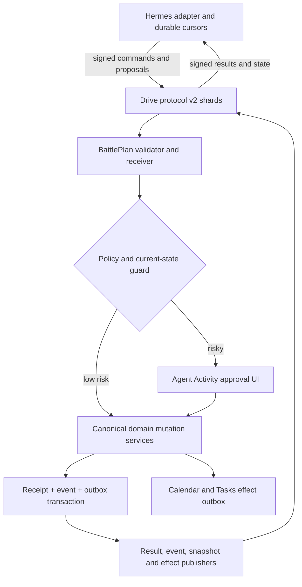
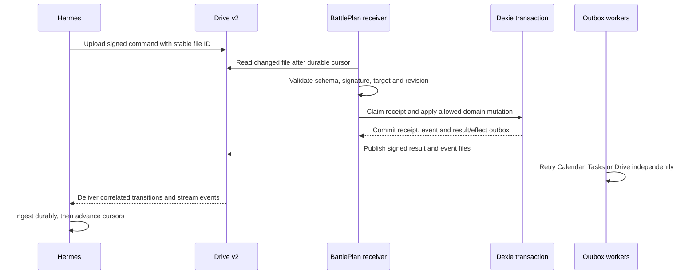
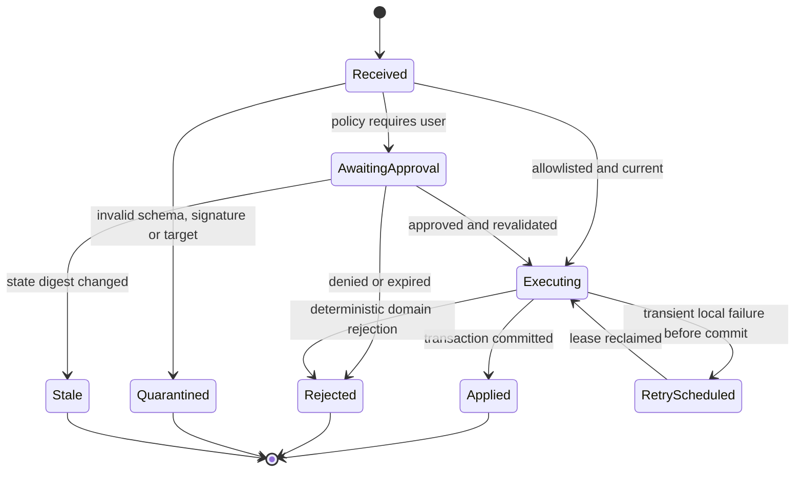
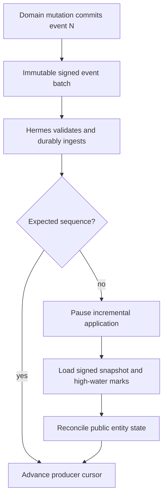

# Hermes Collaboration Protocol - Plan

## Goal Capsule

- **Objective:** Replace the ambiguous shared-file Agent Bridge with a paired, versioned BattlePlan-Hermes protocol that applies each accepted command once, returns machine-readable outcomes, and publishes every relevant BattlePlan change through a recoverable event stream.
- **Authority:** The confirmed user scope is primary. Google Drive remains the initial transport; the published protocol is the integration API; Suggestions remain a separate human conversation surface; low-risk commands may run automatically; destructive and merge commands require current human approval; Settings commands are forbidden in v2.0.
- **Execution profile:** Freeze the normative API, message authenticity rules, exact documentation, and source-independent conformance kit first. Build the transactional command receipt and outbox before enabling v2 mutations. Run the real cross-client Drive probe as soon as Hermes access exists; it gates live auto-execution, shadow traffic, and cutover rather than BattlePlan contract work.
- **Stop conditions:** Stop v2 auto-execution if BattlePlan and Hermes cannot read files created by the other OAuth client, producer signatures cannot be verified, one command can be claimed by more than one receiver, a domain mutation can commit without its receipt and outbox, or any secret can enter a protocol payload or change event.
- **Tail ownership:** Implementation owns BattlePlan code, the normative protocol API, exact integration documentation, fixtures, migration, and the Hermes conformance kit. Hermes adapter code is owned on the Hermes side and must be implementable without reading BattlePlan source. A live round trip is a later cutover gate when an authenticated Hermes CLI, workspace, or Drive channel is available, not a prerequisite for declaring the BattlePlan contract ready.

---

## Product Contract

### Summary

Add a bidirectional collaboration API in the existing BattlePlan Drive workspace. The first version is a file-message protocol rather than an HTTP service: Hermes sends signed proposals or commands and receives explicit results plus safe, ordered state changes. BattlePlan persists command intent, approval, mutation, event, and retry state so transport failures never require guessing whether work happened, and publishes a normative contract that a Hermes implementer can integrate without reading application source.

### Problem Frame

The current executable channel stores every Hermes write in `agent-pending-writes.json`. BattlePlan marks successful and terminally invalid writes with the same `applied_at`, rewrites the whole file to acknowledge them, and can start overlapping pollers. A Drive acknowledgement failure can therefore replay a committed create, while a concurrent Hermes write can disappear.

The Suggestions surface provides useful human review but commits the local task, reply, and suggestion status independently. Partial Drive failures can report success, reopen already-converted suggestions, or prevent the first reply. Neither channel publishes a reliable record of changes initiated inside BattlePlan, so Hermes cannot maintain current context without re-reading broad snapshots and inferring what changed.

### Actors

- A1. **BattlePlan user:** pairs an agent, reviews risky commands, resolves stale approvals, and can disable the receiver on a device.
- A2. **Hermes:** produces signed proposals and commands, consumes signed results and state events, and follows the published retry and resync rules.
- A3. **BattlePlan receiver:** validates, claims, authorizes, applies, records, and publishes protocol work for one explicit device identity.
- A4. **Google services:** provide Drive transport and optional Calendar or Tasks side effects after the local mutation has committed.

### Requirements

#### Contract, trust, and addressing

- R1. Every v2 message uses a published JSON Schema 2020-12 contract with a supported protocol version, message type, stable message ID, workspace ID, producer ID, target or stream identity, timestamps, correlation and causation IDs, and an integrity signature where the message can authorize or disclose data.
- R2. Pairing establishes the workspace identity, allowed producer and receiver identities, and two independently owned Ed25519 public keys outside Drive. Private signing keys, OAuth tokens, Gemini keys, raw settings secrets, and private diagnostic payloads never enter protocol files, task backups, events, logs, or schema fixtures.
- R3. Bootstrap verifies bidirectional file access with the actual BattlePlan and Hermes OAuth clients, verifies the expected Drive folder and parents without accepting an arbitrary same-name match, and keeps auto-execution disabled until the check passes.
- R4. Commands target one advertised BattlePlan receiver identity. Untargeted, expired, wrongly targeted, unsigned, ambiguously sourced, malformed, or unsupported-major messages are quarantined without domain mutation.

#### Command lifecycle and approval

- R5. A command ID plus canonical payload digest is the durable idempotency key. Replaying identical content returns the recorded lifecycle; reusing the ID for different content returns terminal `idempotency_conflict`.
- R6. The automatic allowlist contains create/update/complete task, create/update WorkLog, and create/update Project actions when their payload and preconditions are valid. Delete or archive actions and semantic Project merge enter `awaiting_approval` before domain mutation. Every Settings action is an unsupported command in v2.0 and fails before receipt creation.
- R7. Secret-setting actions, OAuth or pairing operations, bulk destructive actions, and unrecognized actions are never executable through the protocol. `gemini_api_key` remains a local human-only setting even when a command has approval metadata.
- R8. Update, complete, delete, archive, and merge commands carry a public entity ID and expected revision. Approval stores a human-readable preview and state digest; confirmation revalidates both and returns `approval_stale` without writes if the entity changed.
- R9. A short fenced Dexie transaction claims a command. A later transaction atomically commits the accepted domain mutation, receipt lifecycle update, emitted state events, and outbound result/effect records. Drive, Calendar, Tasks, token refresh, timers, and other external promises run only after commit from a retryable outbox.
- R10. Results distinguish received, awaiting approval, retry scheduled, applied, rejected, expired, blocked, and external-effect progress. A committed local mutation is never retried because Calendar, Tasks, or result publication failed.

#### Context parity and recovery

- R11. Task, Project, and WorkLog mutations from UI, voice, Hermes, Google import, and Drive sync pass through shared domain mutation boundaries that emit actor, origin, cause, public entity identity, revision, event type, and a safe changed-state projection. Settings are outside the v2 command and event model.
- R12. Task and Project gain stable public sync identities; existing WorkLog `syncId` is completed where missing. Protocol commands and events never rely on device-local Dexie numeric IDs, while internal foreign keys may remain numeric.
- R13. Each BattlePlan producer publishes an ordered event stream with its own monotonic sequence. Hermes advances a cursor only after durable ingestion, detects gaps, and loads a signed snapshot with a high-water mark before resuming incremental events.
- R14. Protocol diagnostics preserve the distinction between not paired, receiver disabled, missing bootstrap state, auth unavailable, transport error, schema rejection, signature rejection, target mismatch, retry scheduled, approval pending, cursor gap, and successful sync.

#### Conversation and migration

- R15. Suggestions remain visibly separate from executable commands. The v2 proposal/response message families preserve human discussion, accept/reject/defer actions, voice replies, and conversion intent without granting a proposal mutation authority.
- R16. Proposal-to-task conversion uses the proposal ID as a durable conversion key. Retrying after a partial response upload returns the existing task instead of creating a duplicate, and every UI success message reflects the durable local and outbound state.
- R17. Migration is dual-read and single-write: BattlePlan can drain v1 pending commands and Suggestions through adapters, but Hermes writes only v2 after the compatibility handshake. No rollout phase may dual-execute the same intent through v1 and v2.
- R18. The repository publishes a normative Hermes API package: versioned schemas for data-plane and control-plane messages; field-level semantics; lifecycle and state-transition tables; capability and policy matrices; error and terminal-versus-retry registries; idempotency, ordering, cursor, snapshot, timing, pairing, signing, redaction, and compatibility rules; valid and invalid examples; a changelog; and an executable conformance kit. The human integration guide is generated or tested against these artifacts and is sufficient for a Hermes implementer to build the adapter without reading BattlePlan source.

### Key Flows

- F1. **Pair BattlePlan and Hermes**
  - **Trigger:** The user enables agent collaboration on one BattlePlan device and provides Hermes access to the intended Drive workspace.
  - **Actors:** A1, A2, A3
  - **Steps:** BattlePlan validates the unique workspace, exchanges and verifies both Ed25519 public-key fingerprints outside Drive, proves create/read access in both directions, publishes receiver capabilities, and keeps execution disabled until Hermes returns a valid signed hello under the pinned key epoch.
  - **Outcome:** Both sides know the protocol range, identities, policy, and transport permissions before any command is trusted.
- F2. **Apply a low-risk command once**
  - **Trigger:** Hermes uploads a valid signed command targeted at an active receiver.
  - **Actors:** A2, A3, A4
  - **Steps:** BattlePlan validates and claims the command, checks policy and revision, commits the mutation with its receipt/events/outbox, then independently publishes result and external-effect transitions.
  - **Outcome:** Hermes receives the same durable outcome after initial delivery, replay, restart, or an ambiguous Drive response.
- F3. **Review a risky command**
  - **Trigger:** A valid command requests delete, archive, or Project merge. Settings commands never reach approval because v2.0 rejects them before receipt creation.
  - **Actors:** A1, A2, A3
  - **Steps:** BattlePlan records `awaiting_approval`, shows the exact effect and current-state digest, then revalidates policy and state on approve or records a signed rejection on deny/expiry.
  - **Outcome:** Risky work cannot occur without a current human decision, and Hermes learns why it applied or stopped.
- F4. **Keep Hermes context current**
  - **Trigger:** Any relevant BattlePlan domain mutation commits.
  - **Actors:** A2, A3
  - **Steps:** The same transaction appends a safe event to the producer stream. The publisher uploads ordered batches; Hermes durably ingests them and advances its per-stream cursor.
  - **Outcome:** Hermes knows what changed, who or what caused it, and the current public revision without inferring from whole-file snapshots.
- F5. **Recover from a cursor gap or stale client**
  - **Trigger:** Hermes detects a missing sequence, loses its cursor, sees an unsupported version, or returns after event retention.
  - **Actors:** A2, A3
  - **Steps:** Incremental application stops, Hermes loads the latest compatible signed snapshot and high-water marks, reconciles its state, then resumes after those marks.
  - **Outcome:** Recovery is explicit and repeatable; the consumer never silently skips unknown history.
- F6. **Discuss and convert a proposal**
  - **Trigger:** Hermes publishes a proposal and the user replies, defers, rejects, or accepts it as a task.
  - **Actors:** A1, A2, A3
  - **Steps:** The proposal remains non-executable. BattlePlan records the user response and, on conversion, atomically records the conversion identity with the task and outbound response.
  - **Outcome:** Hermes receives the human decision and a retry cannot create a second task.

### Acceptance Examples

- AE1. **Ambiguous create retry is safe.** Given a task command committed locally and its first result upload timed out, when polling or restart reads the command again, then BattlePlan returns the existing receipt/task and retries only outbox publication.
- AE2. **Conflicting replay fails closed.** Given an applied command ID, when another file reuses it with a different canonical payload digest, then no mutation occurs and Hermes receives `idempotency_conflict`.
- AE3. **Risky approval is current.** Given a pending WorkLog delete, when the WorkLog changes before approval, then approval returns `approval_stale`, preserves the WorkLog, and requires a new preview.
- AE4. **External failure does not duplicate local work.** Given an auto-applied meeting create, when Calendar fails after the local transaction, then the task remains singular, its result reports the pending/failed effect, and only the Calendar effect retries.
- AE5. **All mutation origins become context.** Given equivalent task or WorkLog changes from UI, voice, Hermes, Drive import, and Google sync, when each commits, then the event stream contains the correct origin, cause, public ID, revision, and safe projection.
- AE6. **Gap recovery is deterministic.** Given Hermes has processed sequence 40 and next sees 42, when it requests recovery, then it applies a snapshot through at least 42, stores the high-water mark, and does not apply 42 twice.
- AE7. **Tabs and devices do not double-execute.** Given interval, focus, and visibility triggers fire in two tabs, only one Dexie claim applies the targeted command; a different device rejects it as not targeted.
- AE8. **Malformed and future messages are inert.** Given invalid JSON, unknown required fields, bad signature, unsupported major, or unsupported action, then the item is quarantined with diagnostics and no domain or cursor state advances.
- AE9. **Drive ambiguity disables trust.** Given two same-name workspace folders, a stale cached folder from another account, or an unexpected parent/owner, then bootstrap reports ambiguity and automatic execution remains off.
- AE10. **v1 drains without dual execution.** Given a legacy unapplied command when Hermes switches to v2, the adapter maps its original ID to one receipt, publishes one v2 result, and a matching v2 intent cannot create a second entity.
- AE11. **Suggestion conversion reconciles partial delivery.** Given a proposal has already produced a local task but response publication failed, when the user retries or refreshes, then the existing conversion/task is shown and only the missing response is republished.

### Scope Boundaries

In scope are the Drive v2 transport, pairing and signatures, the normative integration API and documentation, versioned schemas, explicit receiver addressing, command receipt and outbox, public entity identities, shared mutation events, approval activity UI, result/effect lifecycle, snapshots/cursors, v1 adapters, proposal/response migration, the Hermes conformance kit, and diagnostics. The Hermes adapter implementation itself remains outside this repository and is validated later against the published kit.

#### Deferred to Follow-Up Work

- A hosted relay, webhook receiver, server database, or real-time push transport. The backendless PWA baseline polls in the foreground and on startup, focus, visibility, and online events.
- Guaranteed execution while every BattlePlan tab is closed or Google auth requires user interaction.
- Multiple independent agents writing commands before the Hermes pairing and policy contract is proven.
- Automated event-file deletion beyond checkpoint-aware retention and manual diagnostics cleanup.
- Undo for destructive actions or semantic Project merge; approval does not create a general undo system.
- A remote Codex-to-Hermes conversation channel. This plan defines the protocol and handoff, but live communication still requires the user to expose Hermes CLI/workspace or authenticated Drive access.

---

## Planning Contract

### Key Technical Decisions

- KTD1. **Google Drive remains the first transport.** (session-settled: user-approved — chosen over introducing a hosted relay now: the shared Drive workspace already exists and preserves offline-first deployment.) Domain correctness lives in receipts, ledgers, signatures, and outboxes rather than Drive list order or filename uniqueness.
- KTD2. **Conversation, commands, results, and changes are distinct message families.** (session-settled: user-approved — chosen over routing every agent interaction through Suggestions: proposals need human discussion while commands and events need machine lifecycle semantics.) Their schemas share an envelope but never inherit each other's authority.
- KTD3. **Policy is automatic by allowlist and human-gated by risk.** (session-settled: user-approved — chosen over all-automatic or all-manual execution: low-risk automation stays useful while destructive and merge work remains visible.) BattlePlan calculates policy; a risk label supplied by Hermes is advisory only. Settings commands are absent from the v2.0 schema and registry.
- KTD4. **Pairing signatures establish independent message provenance.** Drive public properties support search but are spoofable metadata. BattlePlan and Hermes each own a distinct Ed25519 keypair; public keys and fingerprints are verified out of band, while private keys never enter Drive. Each writer signs the domain-separated RFC 8785 canonical UTF-8 `signed` body, and SHA-256 digests the same bytes. The wire envelope carries matching `key_id` and `pairing_epoch`; unknown, mismatched, rolled-back, or revoked epochs fail closed. Rotation increments the epoch, uses an explicitly bounded overlap, and retains revocation history under KTD15.
- KTD5. **At-least-once transport plus idempotent application replaces simulated exactly-once delivery.** Every outbound file uses a stable pre-generated Drive file ID. A retry that receives `409` must fetch and verify the existing parent, MIME type, protocol properties, digest, and content before treating it as success.
- KTD6. **One explicit receiver owns each command.** Each installation has a stable device receiver ID and signed capability heartbeat. Hermes targets one active receiver; Web Locks reduce duplicate local work, while the Dexie receipt transaction and fencing token provide crash-safe cross-tab correctness.
- KTD7. **The database commit owns truth; external effects are sagas.** The outer Dexie transaction lists every domain, receipt, event, and outbox table it can touch. It performs IndexedDB work only. Calendar, Tasks, Drive, and token calls consume outbox rows after commit and publish effect progress without reopening the command.
- KTD8. **Stable public identities precede the event feed.** Task and Project gain portable sync IDs and WorkLogs backfill missing `syncId`; numeric IDs remain internal. Commands use public ID plus expected revision, and v1 adapters resolve legacy numeric IDs only at the compatibility boundary.
- KTD9. **Drive changes are a transport cursor, not domain ordering.** Initial sync captures a Drive start token, performs a paginated folder scan, replays changes from that token, and persists the final token only after durable processing. Protocol streams supply their own producer sequence and snapshots; list order and modified time never define event order.
- KTD10. **JSON Schema is the cross-language source of truth.** JSON Schema 2020-12 files and conformance fixtures are portable to Hermes. BattlePlan adds a direct Ajv v8 validator, compiles strict standalone validators during the build, and keeps TypeScript discriminated unions aligned through schema tests rather than trusting `as T` casts.
- KTD11. **State events use explicit safe projections.** Task, Project, and WorkLog events include the fields Hermes needs to reason about current work and tombstones for deletion. Settings events do not exist in v2.0; secrets, internal diagnostics, access tokens, raw audio, and pairing data are always redacted.
- KTD12. **Rollout is dual-read and single-write.** BattlePlan lands v2 in shadow mode, Hermes passes fixtures and a live handshake, then writes only v2. V1 readers drain by original ID and are disabled behind a durable migration marker; dual-writing the same intent is forbidden.
- KTD13. **The published protocol contract is the API.** (session-settled: user-directed — chosen over requiring Hermes to infer behavior from BattlePlan source or the legacy shared JSON files.) Drive is the v2 transport, while JSON Schemas, lifecycle tables, error registry, compatibility policy, examples, and conformance fixtures are normative. Human prose may explain but never override those artifacts; documentation drift fails contract tests.
- KTD14. **Revisions are content-addressed and conflicts never use silent last-writer-wins.** Every mutation cites one exact `base_revision`; concurrent heads form a deterministic conflict set. Canonical application pauses until a `conflict_resolved` event cites every sorted head or a signed snapshot exposes the same resolved state.
- KTD15. **Retention is part of idempotency and recovery.** Terminal receipts and migration tombstones remain for at least 400 days; event GC requires 90 days, coverage by a retained signed snapshot, and advancement by every active consumer; at least three snapshots and 30 days are retained. A consumer inactive for 90 days must resnapshot, quarantine payloads are bounded to 30 days, and revoked-key history remains for at least 400 days.
- KTD16. **Canonical bytes and lifecycle classifications have one normative meaning.** The RFC 8785 `signed` body is the sole signing/digest representation. Trust, schema, or addressing failures are `quarantined` before receipt; authenticated policy denial is terminal `blocked`; revision or approval mismatch is terminal `stale`; `retry_scheduled` is reserved for transient pre-mutation work under the same message ID.

### High-Level Technical Design

### Sequencing

First freeze the v2 envelope, signature, policy, documentation, and fixture contract. Add the ledger, public IDs, transaction-scoped outbox, and canonical mutation boundaries before enabling any v2 command. As soon as authenticated Hermes access exists, prove the two OAuth clients can exchange files. That probe gates approval/publisher shadow traffic, Hermes cutover, and final v1 disablement, while source-independent contract work can proceed before it.

### System-Wide Impact

- **Data model:** Dexie gains durable command receipts, event streams, protocol outbox/effects, local private signing-key references and paired public-key epochs, device identity, and cursor/retention state. Task and Project gain portable public IDs; WorkLog sync identity becomes complete.
- **Domain writes:** Direct writes in `App.tsx`, task commands, semantic voice handling, WorkLog cards, Agent Bridge, onboarding settings, and Drive import move behind shared mutation services or explicitly documented migration-only paths.
- **Google effects:** Calendar and Tasks operations no longer determine whether a local command is retried. Their independent state is visible in results and diagnostics.
- **Drive:** Protocol v2 uses verified workspace children, public namespaced properties, pre-generated file IDs, pagination, change tokens, producer/time shards, and immutable messages. Existing backup files remain separate.
- **UI:** A dedicated Agent Activity surface shows pairing, receiver state, pending approvals, stale/denied/applied commands, retries, effects, quarantine, and cursor health. Suggestions remain a separate navigation surface.
- **Hermes:** The runbook defines capability discovery, receiver targeting, signing, stable IDs, upload retry verification, result handling, cursor advancement, snapshot recovery, terminal versus retry behavior, and v1 cutover.
- **Privacy and trust:** Protocol files expose only safe public projections. Pairing secrets and credential material use a local-only store and never traverse the generic Settings backup.

### Risks and Mitigations

- **Cross-client OAuth access:** `drive.file` may prevent each OAuth app from reading files created by the other. Make a bidirectional live spike the first unit and stop before broader implementation if the intended Picker/folder onboarding cannot authorize both directions.
- **Message spoofing:** Drive properties and filenames do not authenticate a producer. Require signed bodies, verify workspace/parent/digest, and quarantine failures before receipt claim or cursor advancement.
- **Cross-device duplication:** Two devices can see the same folder. Require an explicit target receiver, stable per-installation identity, short fenced claims, transaction serialization, and multi-tab/device tests.
- **Partial external effects:** Calendar or Tasks can fail after local commit. Store each effect as its own outbox saga, publish progress, and never replay the domain mutation.
- **Incomplete event coverage:** Existing code writes several tables directly. Treat remaining direct feature writes as a failing parity audit and route every active mutation through the shared boundary before declaring the event feed complete.
- **Public-ID migration:** Legacy rows and pending v1 commands use numeric IDs. Backfill deterministic/stable IDs in a tested schema upgrade, preserve internal foreign keys, and publish the first snapshot only after migration completes.
- **Drive scan races and quotas:** Capture the start token before the initial scan, paginate fully, replay the captured changes, back off on quota errors, batch events, and shard folders before item counts become operational debt.
- **Drive request cost:** New Google Cloud projects use quota-unit accounting. Define foreground polling, page, batch-size, exponential-backoff, and daily warning budgets before live shadow traffic; surface throttling without tightening correctness cursors.
- **IndexedDB eviction:** Request persistent storage where supported, expose whether it was granted, and keep signed Drive results/events/snapshots as the remote recovery journal rather than assuming the local ledger is immortal.
- **Cached old PWA:** An older bundle can continue processing v1. Gate v2 activation by build/protocol capability, show incompatible active receivers, and require participating devices to refresh before cutover.
- **Proposal partial failure:** Conversion spans domain state and agent response. Record conversion plus response outbox atomically and make delete/defer/reply operations idempotent before migrating the UI.

### Sources and Research

- `battle-plan/src/services/agentBridge.ts`
- `battle-plan/src/hooks/useAgentBridgePolling.ts`
- `battle-plan/src/services/driveJsonStore.ts`
- `battle-plan/src/services/suggestionsSync.ts`
- `battle-plan/src/pages/SuggestionsPage.tsx`
- `battle-plan/src/db.ts`
- `battle-plan/src/services/projectCatalog.ts`
- `battle-plan/src/services/workLogPersistence.ts`
- `battle-plan/src/hooks/useDriveSyncOrchestration.ts`
- `docs/AI_MANIFEST.md`
- `docs/ARCHITECTURE.md`
- `docs/solutions/integration-issues/drive-readiness-diagnostic-states-2026-07-05.md`
- `docs/solutions/integration-issues/ensure-fresh-token-refresh-dedup-2026-07-04.md`
- `docs/solutions/design-patterns/worklog-project-catalog-management.md`
- [Google Drive generated IDs and idempotent upload retries](https://developers.google.com/workspace/drive/api/guides/manage-uploads#use_a_pre-generated_id_to_upload_files)
- [Google Drive OAuth scopes and cross-app file access](https://developers.google.com/workspace/drive/api/guides/api-specific-auth)
- [Google Drive change retrieval](https://developers.google.com/workspace/drive/api/guides/manage-changes)
- [Google Drive public and private custom properties](https://developers.google.com/workspace/drive/api/guides/properties)
- [Google Drive file and folder limits](https://developers.google.com/workspace/drive/api/guides/folder#file_and_folder_limits)
- [Google Drive release notes and quota-unit changes](https://developers.google.com/workspace/drive/release-notes)
- [Google Drive usage limits](https://developers.google.com/workspace/drive/api/guides/limits)
- [Dexie transaction contract](https://dexie.org/docs/Dexie/Dexie.transaction%28%29)
- [Dexie transaction best practices](https://dexie.org/docs/Tutorial/Best-Practices)
- [IndexedDB transaction scheduling](https://www.w3.org/TR/IndexedDB/#transaction-scheduling)
- [Web Locks API](https://w3c.github.io/web-locks/)
- [JSON Schema 2020-12](https://json-schema.org/draft/2020-12)
- [Ajv JSON Schema version support](https://ajv.js.org/json-schema.html)

---

## Implementation Units

### U1. Freeze the paired protocol API and define the Drive interoperability gate

- **Goal:** Establish an executable cross-language contract and an exact repeatable probe that must prove the selected BattlePlan/Hermes Drive authorization model before live execution depends on it.
- **Requirements:** R1-R4, R18; F1; AE8, AE9
- **Dependencies:** None
- **Files:** `docs/agent-protocol/v2/API_REFERENCE.md`, `docs/agent-protocol/v2/MESSAGE_LIFECYCLES.md`, `docs/agent-protocol/v2/ERROR_REGISTRY.md`, `docs/agent-protocol/v2/SECURITY_AND_PAIRING.md`, `docs/agent-protocol/v2/VERSIONING.md`, `docs/agent-protocol/v2/POLICY.md`, `docs/agent-protocol/v2/HERMES_RUNBOOK.md`, `docs/agent-protocol/v2/schemas/envelope.schema.json`, `docs/agent-protocol/v2/schemas/hello.schema.json`, `docs/agent-protocol/v2/schemas/capability.schema.json`, `docs/agent-protocol/v2/schemas/command.schema.json`, `docs/agent-protocol/v2/schemas/result.schema.json`, `docs/agent-protocol/v2/schemas/event-batch.schema.json`, `docs/agent-protocol/v2/schemas/snapshot.schema.json`, `docs/agent-protocol/v2/schemas/proposal.schema.json`, `docs/agent-protocol/v2/schemas/response.schema.json`, `docs/agent-protocol/v2/fixtures/`, `battle-plan/src/services/agentProtocol/contracts.ts`, `battle-plan/src/services/agentProtocol/validation.ts`, `battle-plan/src/services/agentProtocol/validation.test.ts`, `battle-plan/package.json`, `battle-plan/package-lock.json`
- **Approach:** Define one strict envelope and discriminated schemas for signed hello, receiver capability/health, command, result, event, snapshot, proposal, and response messages. Add direct Ajv v8 plus build-time standalone validation; encode temporal and UUID acceptance entirely in manifest-covered schema patterns without runtime format callbacks. Add Ed25519 verification over domain-separated RFC 8785 canonical bytes, independent key IDs/epochs and lifecycle, content-addressed revisions, fail-closed conflict semantics, executable retention constants, stable error codes, safe projections, policy, public-ID references, result/effect transitions, and fixtures for every supported and rejected case. Write the normative field semantics, message state machines, error registry, timing rules, compatibility policy, pairing/security contract, revision/conflict model, and retention/GC contract alongside the schemas; extract every documented JSON example and identifier into contract tests. Use the actual OAuth clients to prove BattlePlan-created and Hermes-created JSON can be listed, downloaded, and updated when authenticated Hermes access becomes available; no auto-execution or live cutover may proceed before that probe passes.
- **Execution note:** Start with invalid and future-version fixtures and prepare the bidirectional authorization probe. Contract and local-core work may proceed without Hermes access; do not enable command execution, shadow traffic, or cutover while cross-client access or signature verification remains ambiguous.
- **Patterns to follow:** `docs/AI_MANIFEST.md` already treats agent payload shape as a public contract; `DriveJsonStore.readJsonFileWithStatus()` establishes distinct transport outcomes.
- **Test scenarios:**
  1. Every valid hello, capability/health, command, result, event batch, snapshot, proposal, and response fixture compiles and validates against JSON Schema 2020-12 and narrows to the expected TypeScript variant.
  2. Missing required fields, unknown action, unsupported major, forbidden extra required content, invalid date/UUID, and oversized payload fail with stable protocol errors before any DB call.
  3. Signature verification accepts the canonical valid fixture and rejects body change, key mismatch, workspace mismatch, and signature removal.
  4. BattlePlan creates a probe that Hermes can list/get/download and Hermes creates a probe that BattlePlan can list/get/download using the intended real OAuth clients and parent folder.
  5. A `drive.file` authorization failure produces a documented bootstrap stop rather than silently widening scopes or falling back to a same-name folder.
  6. Every JSON example and status/error identifier in the human API documentation is validated in CI; an undocumented schema variant or documented-but-invalid example fails the contract gate.
- **Verification:** Schemas, normative reference pages, and fixtures are consumable without BattlePlan source, strict validators and drift tests pass, and the later live interoperability receipt names the OAuth scope/onboarding that worked.

### U2. Build the verified Drive v2 transport

- **Goal:** Replace filename-first whole-file mutation with a paginated, cursor-based, immutable message transport.
- **Requirements:** R1-R5, R13, R14; F1, F2, F5; AE1, AE8, AE9
- **Dependencies:** U1
- **Files:** `battle-plan/src/services/driveJsonStore.ts`, `battle-plan/src/services/driveJsonStore.test.ts`, `battle-plan/src/services/agentProtocol/driveTransport.ts`, `battle-plan/src/services/agentProtocol/driveTransport.test.ts`, `battle-plan/src/services/googleService.ts`, `battle-plan/src/utils/driveSyncDiagnostics.ts`, `battle-plan/src/utils/driveSyncDiagnostics.test.ts`
- **Approach:** Add exact folder/file metadata reads, account-scoped cache validation, ambiguity detection, nested protocol shards, namespaced public properties, generated Drive IDs, verified `409` replay handling, checksums, pagination, start-token-first bootstrap scan, and durable change-page consumption. Folder creation occurs only from explicit pairing/bootstrap. Apply bounded backoff and keep domain ordering in protocol sequences.
- **Patterns to follow:** The shared Drive store owns mechanics while domain services own payload and error meaning. Google token refresh already has a shared-promise single-flight boundary.
- **Test scenarios:**
  1. A unique expected folder and parent initializes; duplicate folders, stale cached ID, wrong account/drive/parent, trashed file, and missing folder return distinct non-ready outcomes.
  2. An upload timeout followed by create with the same generated ID receives `409`, fetches the existing file, and succeeds only when parent, MIME type, properties, size/checksum, producer, and digest match.
  3. Folder scans consume every page, reject `incompleteSearch`, and never use arbitrary list order as protocol sequence.
  4. Bootstrap captures a change token before the full scan, processes files found during scan and replay exactly once, and persists the final token only after the last page commits.
  5. Auth loss, quota/rate response, malformed body, missing file, and unsupported message remain distinguishable and do not advance the cursor.
- **Verification:** Transport tests prove no shared-array rewrite, no filename uniqueness assumption, retry-safe creation, full pagination, and gap-free initial synchronization.

### U3. Add the durable receipt, outbox, public identities, and receiver claim

- **Goal:** Make command ownership and outbound recovery survive overlapping tabs, reloads, crashes, and legacy rows.
- **Requirements:** R4, R5, R8-R10, R12-R14; F2, F5; AE1, AE2, AE6-AE8
- **Dependencies:** U1, U2
- **Files:** `battle-plan/src/db.ts`, `battle-plan/src/dbMigration.test.ts`, `battle-plan/src/services/agentProtocol/ledger.ts`, `battle-plan/src/services/agentProtocol/ledger.test.ts`, `battle-plan/src/services/agentProtocol/deviceIdentity.ts`, `battle-plan/src/services/agentProtocol/deviceIdentity.test.ts`, `battle-plan/src/services/agentProtocol/pollingCoordinator.ts`, `battle-plan/src/services/agentProtocol/pollingCoordinator.test.ts`, `battle-plan/src/hooks/useAgentProtocolPolling.ts`, `battle-plan/src/hooks/useAgentProtocolPolling.test.ts`
- **Approach:** Add tables for command receipts, event streams, protocol outbox/effects, consumer state, local private signing-key references, paired public-key epochs/revocations, and receiver capability state. Backfill stable public IDs without replacing internal numeric keys. Claim a targeted command in a short transaction with payload digest, lease owner, fencing token, attempts, and result history. Use one shared in-flight promise plus Web Lock as optimization, but make Dexie serialization and receipt state the correctness boundary. Request persistent browser storage and expose its result.
- **Execution note:** Add concurrent claim and injected-crash tests before connecting any domain handler.
- **Patterns to follow:** `agentInbox` supplies the migration source; `ensureFreshToken` supplies the shared-promise single-flight pattern; WorkLog `syncId` supplies the portable-identity pattern.
- **Test scenarios:**
  1. Ten concurrent claims for one targeted command across separate DB connections produce one executing owner and one receipt.
  2. Same ID and digest returns the existing lifecycle after reload; same ID and different digest records terminal conflict without changing the original receipt.
  3. A crashed lease is reclaimed with a newer fence, while the stale worker cannot finalize or publish over its successor.
  4. A command for another receiver, an expired command, and a disabled receiver never enter executing state.
  5. Migration backfills unique Task/Project/WorkLog public IDs, preserves numeric foreign keys and existing sync payloads, and is idempotent on reopen.
  6. Loss or denial of persistent storage is visible and does not silently claim exactly-once guarantees.
- **Verification:** Migration and ledger tests prove durable identity, replay, conflict, fencing, target isolation, and restart recovery.

### U4. Centralize Task and Google-effect mutations

- **Goal:** Make Task changes atomic with their state events and external-effect records regardless of caller. Settings remain outside the v2 protocol.
- **Requirements:** R6-R12, R14; F2-F4; AE1, AE4, AE5, AE7
- **Dependencies:** U3
- **Files:** `battle-plan/src/services/taskMutations.ts`, `battle-plan/src/services/taskMutations.test.ts`, `battle-plan/src/services/externalEffectOutbox.ts`, `battle-plan/src/services/externalEffectOutbox.test.ts`, `battle-plan/src/hooks/useTaskCommands.ts`, `battle-plan/src/services/semanticEngine.ts`, `battle-plan/src/App.tsx`, `battle-plan/src/services/onboarding.ts`, `battle-plan/src/hooks/useDriveSyncOrchestration.ts`
- **Approach:** Add typed create/update/complete/delete/import Task operations that accept actor, origin, causation, public ID, and expected revision. Each outer transaction includes domain, event, receipt when present, and outbox tables. Replace active direct writes in UI, voice, onboarding, Drive import, and legacy agent paths. Queue Calendar/Tasks effects after commit and publish their pending/completed/failed state without retrying the domain operation. Existing local Settings persistence is not routed through the collaboration protocol.
- **Execution note:** Characterize existing UI/voice/Google parity first, then prove transaction rollback and post-commit effect recovery.
- **Patterns to follow:** Task normalization remains in `semanticEngine`; Google auth remains in `googleService`; `useTaskCommands` continues to own user-facing orchestration while delegating persistence.
- **Test scenarios:**
  1. UI, voice, Hermes, and Drive-import versions of one Task mutation produce equivalent durable state with distinct origin/cause events.
  2. Task create plus event/effect outbox commits together; an injected failure before commit leaves all tables unchanged.
  3. Calendar or Tasks failure after commit leaves one Task, retries only the effect, and publishes the accurate effect transition.
  4. Expected-revision mismatch returns stale without Task or event change.
  5. Every Settings action is rejected as an unknown/forbidden v2 action before receipt creation; Gemini API key, OAuth, pairing keys, and other settings never appear in serialized fixtures, events, or logs.
  6. Existing soft-delete, meeting Calendar cleanup, Google Task completion, and user-visible errors remain behaviorally equivalent.
- **Verification:** Focused mutation/effect tests and a direct-write audit prove one shared Task boundary, no Settings protocol path, and no secret projection.

### U5. Emit Project and WorkLog changes through canonical transactions

- **Goal:** Give Hermes complete Project and WorkLog context without bypassing existing catalog, merge, sync, or active-project rules.
- **Requirements:** R6-R14; F2-F5; AE3-AE7
- **Dependencies:** U3
- **Files:** `battle-plan/src/services/projectCatalog.ts`, `battle-plan/src/services/projectCatalog.test.ts`, `battle-plan/src/services/workLogPersistence.ts`, `battle-plan/src/services/workLogPersistence.test.ts`, `battle-plan/src/services/workLogsSync.ts`, `battle-plan/src/services/workLogsSync.test.ts`, `battle-plan/src/components/worklogs/WorkLogCard.tsx`, `battle-plan/src/components/worklogs/WorkLogForm.tsx`, `battle-plan/src/components/worklogs/WorkLogVoiceConfirm.tsx`, `battle-plan/src/hooks/useDriveSyncOrchestration.ts`
- **Approach:** Extend catalog and WorkLog transactions with mutation context and event/outbox tables while preserving their typed outcomes and identity rules. Route active direct delete/edit/import sites through those services. Add public Project references, WorkLog tombstones, sync-origin events, and guarded merge approval tokens. Keep event projections byte-stable and avoid re-emitting unchanged sync imports.
- **Patterns to follow:** `projectCatalog` and `workLogPersistence` already own transactional lifecycle rules; merge preview revalidation supplies the stale-approval model; WorkLogs sync already compares timestamps and portable `syncId`.
- **Test scenarios:**
  1. Manual, voice, Hermes, and Drive-import WorkLog creates emit equivalent safe entity projections with correct origin and no duplicate on unchanged re-import.
  2. Project create/update/archive/restore/merge events use stable public IDs and preserve alias/canonical identity rules.
  3. Approved WorkLog delete or Project archive revalidates revision/digest and returns stale without mutation after a concurrent edit.
  4. Semantic merge remains impossible without approval; approved merge commits catalog mutation, WorkLog relinks, receipt, events, and outbox atomically.
  5. Transaction failure rolls back domain rows, receipt, event sequence, and outbox together.
  6. Safe projections exclude raw audio, secrets, internal diagnostics, and fields not required by the Hermes contract.
- **Verification:** Catalog, WorkLog persistence, sync, and migration tests prove complete event parity without weakening existing domain rules.

### U6. Execute v2 commands and expose human approval

- **Goal:** Turn validated targeted commands into a visible, policy-driven lifecycle with truthful results.
- **Requirements:** R4-R10, R14; F2, F3; AE1-AE4, AE7-AE9
- **Dependencies:** U2-U5
- **Files:** `battle-plan/src/services/agentProtocol/policy.ts`, `battle-plan/src/services/agentProtocol/policy.test.ts`, `battle-plan/src/services/agentProtocol/commandProcessor.ts`, `battle-plan/src/services/agentProtocol/commandProcessor.test.ts`, `battle-plan/src/pages/AgentActivityPage.tsx`, `battle-plan/src/components/AgentCommandCard.tsx`, `battle-plan/src/App.tsx`, `battle-plan/src/components/Sidebar.tsx`, `battle-plan/src/types.ts`, `battle-plan/src/hooks/useSyncDiagnostics.ts`
- **Approach:** Map schema variants onto the automatic, approval-required, and forbidden policy matrix. Process only a valid fenced receipt. Return typed terminal versus retry states from canonical domain services. Add an Agent Activity route for pairing/receiver state, exact approval previews, approve/reject, stale refresh, retries, quarantine, effect progress, and protocol health; Suggestions stays a separate route.
- **Patterns to follow:** Project merge preview binds confirmation to current state; Diagnostics already exposes subsystem health; lazy page boundaries keep new page code outside the initial bundle.
- **Test scenarios:**
  1. Every action variant maps to exactly one policy class; agent-supplied risk cannot downgrade BattlePlan policy.
  2. Low-risk valid command applies once and publishes received/applied transitions with public entity ID and revision.
  3. Delete, archive, settings, and merge commands remain awaiting approval until a human acts; deny and expiry are terminal without domain write.
  4. Approval after entity change returns stale and requires a fresh preview; double approval cannot execute twice.
  5. Secret-setting, unsupported action, invalid signature/schema/target, and quarantined item cannot reach a domain service.
  6. Desktop and phone-width browser flows expose accessible action names, exact target/effect, pending state, retry/effect status, and keyboard-operable confirmation without conflating proposals.
- **Verification:** Command/policy tests plus browser QA prove safe automation, deliberate approval, truthful lifecycle, and UI separation.

### U7. Publish results, events, snapshots, diagnostics, and the Hermes integration kit

- **Goal:** Complete the outbound half and publish an exact, self-contained integration kit so Hermes can reliably know command outcomes and reconstruct current BattlePlan state without BattlePlan source access.
- **Requirements:** R1-R5, R9-R14, R18; F1, F2, F4, F5; AE1, AE4-AE9
- **Dependencies:** U2-U6
- **Files:** `battle-plan/src/services/agentProtocol/publisher.ts`, `battle-plan/src/services/agentProtocol/publisher.test.ts`, `battle-plan/src/services/agentProtocol/snapshots.ts`, `battle-plan/src/services/agentProtocol/snapshots.test.ts`, `battle-plan/src/hooks/useAgentProtocolPublisher.ts`, `battle-plan/src/pages/DiagnosticsPage.tsx`, `battle-plan/src/components/AnuSelfDescription.tsx`, `docs/agent-protocol/v2/HERMES_INTEGRATION.md`, `docs/agent-protocol/v2/HERMES_RUNBOOK.md`, `docs/agent-protocol/v2/CONFORMANCE.md`, `docs/agent-protocol/v2/CHANGELOG.md`, `docs/agent-protocol/v2/fixtures/`
- **Approach:** Drain durable outbox rows into signed immutable result transitions and sharded event batches using stable Drive IDs. Publish receiver capability and health, generate safe snapshots with producer high-water marks, apply retry/backoff and retention checkpoints, and keep cursor/transport/command/effect diagnostics distinct. The integration guide defines the exact file layout, polling and upload algorithms, lifecycle transitions, retry and terminal classifications, cursor persistence, gap recovery, pairing, key handling, redaction, compatibility, and cutover sequence. The conformance kit runs valid and adversarial fixture vectors without BattlePlan source access; the live handshake checklist is an additional cutover gate when Hermes access is available.
- **Execution note:** Prove crash points between commit, upload response, outbox marking, and cursor advancement with deterministic fixtures before live Hermes shadow traffic.
- **Patterns to follow:** WorkLogs backup exposes a recoverable Drive snapshot; sync diagnostics already separates subsystem states; Drive token refresh remains outside protocol transactions.
- **Test scenarios:**
  1. Result/event upload succeeds, times out, returns verified `409`, or restarts without duplicate semantic messages or lost outbox rows.
  2. Event batches preserve per-producer sequence across size/time shards and never acknowledge local outbox rows before verified upload.
  3. Hermes fixture consumer advances only after durable ingest; gap, lost cursor, retained-away history, and incompatible snapshot all stop incremental processing safely.
  4. Snapshot includes every safe current Task/Project/WorkLog identity and redacted Settings state through its high-water marks, and replay after snapshot is idempotent.
  5. Diagnostics distinguish pairing, receiver, schema/signature, Drive, cursor, command, approval, retry, effect, and retention conditions without exposing payloads or keys.
  6. An independent fixture consumer built only from the published API package validates both directions, status/error exhaustiveness, retry behavior, and cursor/snapshot recovery without importing BattlePlan code.
  7. When the Hermes adapter is available, a live signed hello/command/result/event exchange passes before v2 write cutover; its absence does not weaken the contract-ready gate.
- **Verification:** Publisher/recovery tests and source-independent conformance prove the BattlePlan contract ready; a later live Hermes round trip proves cutover readiness.

### U8. Migrate Suggestions and retire v1 execution safely

- **Goal:** Standardize the human conversation channel and cut over legacy files without duplicating tasks or commands.
- **Requirements:** R15-R18; F6; AE10, AE11
- **Dependencies:** U1, U2, U6, U7
- **Files:** `battle-plan/src/services/suggestionCommands.ts`, `battle-plan/src/services/suggestionCommands.test.ts`, `battle-plan/src/services/suggestionsSync.ts`, `battle-plan/src/services/suggestionsSync.test.ts`, `battle-plan/src/pages/SuggestionsPage.tsx`, `battle-plan/src/components/SuggestionCard.tsx`, `battle-plan/src/services/agentBridge.ts`, `battle-plan/src/services/agentBridge.test.ts`, `battle-plan/src/hooks/useAgentBridgePolling.ts`, `docs/AI_MANIFEST.md`, `docs/ARCHITECTURE.md`, `docs/PRODUCT.md`, `docs/USER_GUIDE.md`, `CONCEPTS.md`, `docs/solutions/integration-issues/agent-collaboration-protocol-v2.md`
- **Approach:** Move new Hermes proposals and user responses onto immutable v2 message families while preserving the existing Suggestions UX and authenticated voice playback. Add a transactional conversion key and response outbox, truthful partial states, first-response bootstrap, and idempotent reject/defer/delete behavior. Adapt outstanding v1 commands/proposals by original ID, publish only v2 results/responses, record a cutover marker after backlog drain, then disable v1 polling and remove whole-file acknowledgement once incompatible receivers are absent.
- **Execution note:** Characterize v1 backlog, partial reply/status failures, and suggestion conversion before switching the producer. Keep rollback able to re-enable v1 read-only diagnostics, never v1 execution for already-migrated IDs.
- **Patterns to follow:** Detailed Drive result types preserve missing versus unavailable versus error; proposal review remains a separate page; the agent-native audit fix order starts with idempotency before contract cutover.
- **Test scenarios:**
  1. Covers AE11. Task conversion plus conversion receipt/response outbox is atomic; response upload failure and refresh reuse the same task and only retry publication.
  2. A missing legacy replies file accepts the first reply; failed reject/defer/delete reports partial state and remains safely retryable.
  3. Private voice reply downloads through authenticated Drive access, uses a temporary object URL, and cleans it up on replacement/unmount.
  4. V1 command adapter preserves original ID/digest, maps applied backlog to terminal receipt, and cannot execute an equivalent v2 command twice.
  5. Dual-read/single-write cutover processes mixed backlog deterministically; the migration marker disables v1 execution only after Hermes v2 conformance and drain.
  6. Old, malformed, or future proposal/response messages preserve the last complete Suggestions snapshot and surface diagnostics instead of replacing the UI with empty data.
- **Verification:** Suggestions, adapter, and browser tests prove truthful human conversation, idempotent conversion, authenticated voice, one command execution, and reversible read-only migration diagnostics.

---

## Verification Contract

The plan has two explicit completion levels. **Contract ready** means BattlePlan, the normative API package, documentation drift tests, and the source-independent conformance kit pass. **Cutover ready** additionally requires authenticated Hermes access, bidirectional Drive proof, the Hermes adapter passing the kit, a live round trip, and the v1 backlog drain. BattlePlan implementation may complete at contract ready; automatic execution and v1 retirement may not advance to cutover without the second gate.

| Gate | Applies to | Done signal |
|---|---|---|
| Protocol schema and fixture tests | U1 | Every message family validates cross-language fixtures; malformed, unsigned, incompatible, and forbidden cases fail before storage. |
| Live cross-client Drive probe (cutover gate) | U1, U2 | When Hermes access is available, BattlePlan and Hermes can each create and consume the other's signed probe using the documented OAuth scope/onboarding, with ambiguous folders rejected. |
| Focused Node tests for transport, ledger, mutations, policy, publisher, Suggestions, and migrations | U2-U8 | Pagination, generated-ID replay, one claim, rollback, stale approval, external-effect recovery, event ordering, snapshot recovery, conversion reconciliation, and v1 drain pass under fake IndexedDB and Drive fakes. |
| Full `npm run test` in `battle-plan` | U1-U8 | All existing and new TypeScript tests pass with no Task, Calendar, Google Tasks, WorkLog, Project, Drive sync, Suggestions, or Agent Bridge regression. |
| `npm run lint` in `battle-plan` | U1-U8 | No TypeScript, React hook, accessibility, unused contract, or unsafe-cast regression remains. |
| `npm run build` in `battle-plan` | U1-U8 | TypeScript and the Vite PWA build complete with standalone schema validators and no CSP relaxation. |
| Direct-write and safe-projection audit | U4, U5, U7 | Every active domain mutation origin emits one event through a shared boundary; protocol artifacts contain no credentials, raw audio, private diagnostics, or local-only numeric identity. |
| Concurrency and crash matrix | U2-U7 | Interval/focus/visibility overlap, two tabs, wrong device, reload, expired lease, commit/upload crash points, and ambiguous Drive responses never duplicate domain state or lose result/event recovery. |
| Desktop and phone-width browser QA | U6, U8 | Pairing, receiver health, approval/deny/stale, retries/effects, quarantine, Suggestions replies/conversion/voice, accessible announcements, and responsive layout work. |
| Source-independent API conformance | U1, U7 | A consumer using only the published package validates every message family, lifecycle, error, retry, idempotency, ordering, cursor, snapshot, pairing, and compatibility rule without importing BattlePlan source. |
| Hermes shadow and cutover conformance (cutover gate) | U7, U8 | When the adapter is available, signed hello, targeted command, approval, result/effect, event ingest, cursor gap/snapshot, proposal response, and v1 backlog drain pass before v1 execution is disabled. |
| Documentation review and drift tests | U1, U7, U8 | API reference, lifecycle tables, error registry, pairing/security guide, versioning policy, runbook, schemas, fixtures, AI manifest, architecture, product guide, concepts, and durable learning describe the implemented behavior without conflicting v1 instructions; every documented example and identifier is verified in CI. |

---

## Definition of Done

- BattlePlan reaches contract-ready status with a self-contained normative API package and source-independent conformance kit; a documented paired Hermes handshake and bidirectional Drive access probe remain mandatory before commands are enabled or v1 execution is retired.
- All protocol inputs are versioned, runtime-validated, signed, addressed to an explicit receiver target or stream identity as appropriate, and rejected or quarantined safely when trust or compatibility fails.
- Every accepted command has one durable receipt; replay, reload, overlapping polls, wrong-device delivery, and ambiguous upload cannot duplicate a Task, WorkLog, Project change, or merge.
- Low-risk allowlisted commands execute automatically; destructive and merge commands require a current human approval; every Settings, secret, pairing, OAuth, and bulk-destructive action remains forbidden.
- Domain mutation, receipt, safe state events, and outbox commit atomically, while Drive, Calendar, and Google Tasks effects retry independently and report their real state.
- Task, Project, and WorkLog have stable public identities, and every relevant UI, voice, Hermes, Drive, and Google mutation origin emits a safe ordered event.
- Hermes can advance per-producer cursors, detect gaps, recover from a signed snapshot, and reconcile without applying an event twice.
- Suggestions remain a separate human conversation surface while v2 proposal/response transport makes replies, actions, voice playback, and task conversion reliable and idempotent.
- V1 commands and Suggestions drain by original identity, Hermes writes only v2 after conformance, and v1 execution is disabled without a dual-write interval.
- Diagnostics expose pairing, transport, schema/signature, receiver, command, approval, retry, effect, cursor, snapshot, and retention health without exposing secrets or raw payloads.
- The normative API reference, lifecycle tables, error registry, schemas, fixtures, versioning policy, integration guide, and Hermes runbook are sufficient for a fresh Hermes implementation to send, retry, consume, resync, and classify every outcome without reading application source.
- Focused tests, full test suite, lint, production build, browser QA, source-independent API conformance, concurrency/crash matrix, and documentation drift checks pass for contract readiness; the live cross-client probe and Hermes shadow conformance pass before cutover readiness.
- Experimental duplicate handlers, temporary protocol probes, superseded v1 write paths, unsafe casts, stale documentation, and abandoned migration code are removed.
