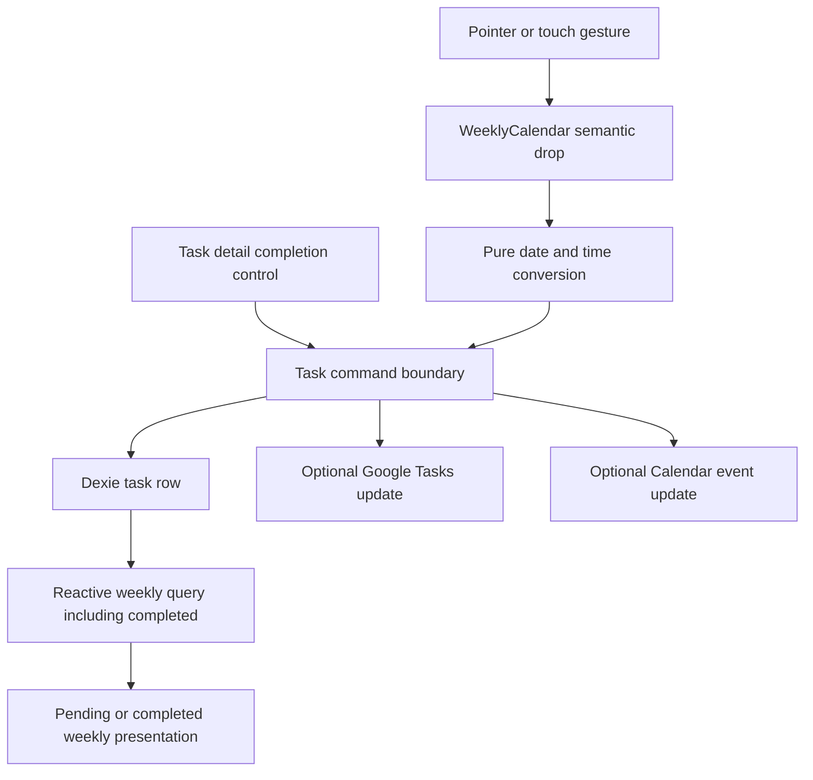
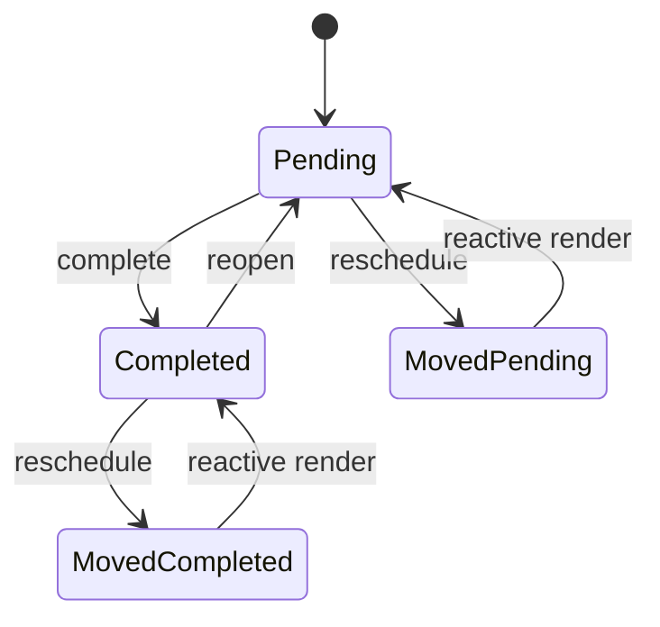

# Weekly Rescheduling and Completed History - Plan

## Goal Capsule

- **Objective:** Let users move tasks and meetings directly in the weekly overview, keep completed tasks visible in their scheduled historical week, and complete or reopen a task from its detail.
- **Authority:** The Product Contract and its session-settled decisions govern behavior. The Planning Contract governs implementation choices within those requirements.
- **Execution profile:** Standard UI, persistence, and optional Google integration change with proof-first tests and desktop plus touch browser verification.
- **Stop conditions:** Stop if direct manipulation cannot preserve the current task-versus-meeting time semantics, if completed history requires a destructive migration, or if Google updates cannot retain local state on remote failure.
- **Tail ownership:** LFG owns implementation, review, documentation, branch delivery, pull request creation, and CI convergence.

---

## Product Contract

### Summary

The weekly overview becomes an active planning surface. Scheduled tasks and meetings can be moved between days and time slots, while completed tasks remain in their original week as a clearly completed, still-openable record.

### Problem Frame

The weekly overview currently shows scheduled work but cannot change it. Rescheduling requires opening the detail and editing date or time fields, which interrupts planning across the week.

Completed local tasks are excluded from the weekly query and deleted after 30 days. The calendar already contains muted completed styles, but the data never reaches them. Users therefore lose the historical view of what they accomplished.

The detail editor can change task fields and subtasks, but it cannot complete or reopen the whole task. Completion exists elsewhere and must become available in the detail without introducing a second completion model.

### Requirements

**Weekly movement**

- R1. A user can directly move a local task or meeting to another day in the visible weekly overview.
- R2. A user can move a timed local task or meeting to a 15-minute slot within 07:00-19:00 while preserving its duration and current task-versus-meeting time meaning.
- R3. A user can move an all-day local item to another day without assigning it a time.
- R4. A Google Task shown in the weekly overview can move between day lanes by updating its date-only due value.
- R5. Moving an item persists only once when the gesture completes and leaves the item at its prior position when no valid drop target is chosen.
- R6. A synchronized local meeting updates its existing Google Calendar event after local persistence; a remote failure keeps the local move and is surfaced through the existing integration error behavior.

**Completed history**

- R7. Completing a local task preserves the same durable task row and its scheduled date so the task remains visible in its original weekly overview.
- R8. Completed local tasks are not removed by age-based cleanup while they remain active; soft deletion takes precedence and eligible tombstones follow the existing cleanup policy regardless of task status.
- R9. A completed task has an unmistakable completed treatment in both all-day and timed weekly lanes while remaining openable and movable.
- R10. Historical placement is based on the task's scheduled date because the current data model has no authoritative completion timestamp.

**Detail completion**

- R11. A task detail exposes an accessible control that completes a pending task and reopens a completed task through the existing completion command.
- R12. After the detail completion action succeeds, the open detail and every reactive overview show the same status without stale UI.
- R13. Google Task completion from detail uses the existing Google Tasks status update and preserves the current auth and optional-scope behavior.

**Documentation and compatibility**

- R14. Product, architecture, and user documentation describe weekly movement, completed history, persistence, and Google side effects without duplicating the app version.
- R15. Existing agent actions retain semantic parity: `update_task` and `complete_task` continue to operate on the same durable task entity without exposing pointer coordinates or adding a drag-specific command.

### Key Decisions

- **Direct weekly manipulation.** Users move items in the weekly overview rather than relying only on detail editing. **Governs R1-R6.** (session-settled: user-directed — chosen over edit-only relocation: the user explicitly requested moving items across the weekly overview.)
- **Completed work stays in place.** Completion changes the task's visual state but does not remove it from its scheduled historical week. **Governs R7-R10.** (session-settled: user-directed — chosen over hiding or archiving completed tasks away from the week: the user wants to see past accomplishments.)
- **Completion is available in task detail.** The detail can complete and reopen the whole task. **Governs R11-R13.** (session-settled: user-directed — chosen over list-only completion: the user explicitly requested completion from the opened task.)

### Acceptance Examples

- AE1. **Covers R1, R2, R5.** Given a 60-minute local meeting at Wednesday 10:00, when the user moves it to Thursday 14:00, then one persisted row has Thursday as `date`, 14:00 as `startTime`, and the same duration.
- AE2. **Covers R2.** Given a two-hour task whose deadline block ends at 15:00, when it is moved so the block ends at 11:00, then its stored `startTime` is 11:00 rather than the visual block's top edge.
- AE3. **Covers R3.** Given an all-day task on Monday, when it is moved to Friday's all-day lane, then only its scheduled day changes and it remains all-day.
- AE4. **Covers R6.** Given a local meeting with an existing `googleEventId`, when it is moved, then the local row commits and the Calendar integration updates that event identity rather than creating a second event.
- AE5. **Covers R7-R10.** Given a task scheduled three months ago, when it is completed and the old week is opened, then the same task remains visible with completed styling and opens in detail.
- AE6. **Covers R11-R13.** Given a pending local or Google Task is open in detail, when the user selects “Splněno”, then it becomes completed; selecting the control again reopens it and the detail status matches the overview.

### Scope Boundaries

- Do not add a new drag-and-drop dependency when Pointer Events and pure coordinate helpers cover desktop and touch behavior.
- Do not add `completedAt`; historical display uses the scheduled week in this change.
- Do not make completion of meetings a new product behavior; the detail completion control applies to task entities.
- Do not add Google Calendar read scope, collision detection, or arbitrary external Calendar event editing.
- Do not revise Agent Collaboration Protocol v2 schemas for meeting-specific scheduling. Its versioned date/time expansion remains separate work.

#### Deferred to Follow-Up Work

- Define a versioned protocol representation for meeting date, start time, duration, all-day state, and time zone across BattlePlan and Hermes.
- Consider a future completion-date view if the product adds a reliable `completedAt` field and migration policy.
- Design a durable retry/outbox for optional Google Tasks and Calendar writes. This feature preserves the current local-authoritative, surfaced-error behavior; it does not claim automatic convergence after a remote failure.

---

## Planning Contract

### Key Technical Decisions

- KTD1. **Use Pointer Events with semantic drop targets.** Weekly items preserve native touch scrolling until a documented drag-intent threshold wins, then use pointer capture, visible targets, and click-after-drag suppression. The existing detail date/time fields remain the keyboard and accessibility fallback for R1-R5.
- KTD2. **Convert positions through pure calendar helpers.** Date and time calculation lives in `calendarUtils.ts`, snaps to 15-minute increments within 07:00-19:00, preserves duration, and accounts for task blocks ending at `startTime` while meetings begin there. The preview announces the resulting day and time. This isolates the highest-risk arithmetic for proof-first tests under R1-R5.
- KTD3. **Persist through task commands, not calendar components.** `WeeklyCalendar` emits semantic reschedule intent. `useTaskCommands` owns local Dexie writes, Google Task due updates, refresh, and Calendar event updates under R4-R6.
- KTD4. **Keep completed rows in the canonical task store.** The weekly query includes active completed tasks, and startup cleanup excludes them unless they are soft-deleted tombstones eligible under the existing policy. No archive table or duplicate history object is introduced under R7-R10.
- KTD5. **Reuse the existing completion command.** `FocusEditor` calls `handleToggleTask` and reconciles its local editor snapshot after success. The implementation does not duplicate local or Google completion logic under R11-R13.
- KTD6. **Preserve narrow agent compatibility without changing behavior or v2.** Existing `update_task` and `complete_task` continue to operate on the same durable task entity. This feature adds regression coverage but no agent-triggered Calendar side effect, new action, pointer data, or protocol schema field under R15.

### High-Level Technical Design

### Assumptions

- Google Tasks remain date-only in the weekly overview and move only between all-day day lanes.
- A drag gesture changes lane semantics only when it ends over an explicit valid target; dropping a timed item into an all-day lane or the reverse is not inferred implicitly.
- Local persistence remains authoritative when an optional Google side effect fails, matching current command behavior.
- The weekly view may perform a scope-guarded Google Tasks fetch because it consumes those rows; a missing optional Tasks scope must prevent the network call without changing global Google auth state.

### Sequencing

Build and test the pure scheduling conversion and command boundary before wiring gestures. Then correct completed retention and query behavior, connect detail completion, add the pointer interaction and visual states, and finish with documentation plus browser QA.

### System-Wide Impact

- **Persistence:** Completed rows become durable history instead of 30-day cleanup candidates. Task Drive backup continues to carry the same rows and status values.
- **Google integrations:** Week becomes a legitimate Google Tasks consumer. Rescheduling can issue one Tasks due patch or one Calendar event update after a completed gesture.
- **Agent parity:** Existing semantic update and completion actions remain valid. Pointer state never crosses the UI boundary.
- **Accessibility:** Direct manipulation supplements rather than replaces the detail editor's form controls.

### Risks and Mitigations

- **Incorrect task time math:** A task's displayed top is its deadline minus duration. Pure helper tests cover this separately from meeting start-time behavior.
- **Duplicate click after drag:** The pointer state machine records whether a threshold was crossed and suppresses the following click only for a completed drag.
- **Rapid remote writes:** Network mutation occurs once on gesture completion, never on pointer movement.
- **Overlapping local writes:** Each item allows one in-flight reschedule. Repeat gestures stay disabled until local persistence settles; local failure restores the stored position and reports an accessible error.
- **Optional Tasks scope regression:** Week fetching and updates use the service's existing feature-level scope guard; a Tasks 403 does not invalidate Drive or Calendar auth.
- **Large completed history:** Cleanup queries the indexed `updatedAt` range and narrows it to soft-deleted tombstones instead of scanning every task at startup.
- **Remote divergence after an integration failure:** The local move remains authoritative and the user sees the failure. Automatic retry is explicitly deferred to a separately designed durable outbox so this feature does not smuggle in a new sync subsystem.
- **Unlimited completed history growth:** The requested history is retained. The plan does not invent a destructive retention limit; future storage policy must be an explicit product decision.

---

## Implementation Units

### U1. Define scheduling conversion and command behavior

- **Goal:** Create tested semantic rescheduling behavior for local items and Google-backed items.
- **Requirements:** R1-R6, R15; AE1-AE4; KTD2, KTD3, KTD6.
- **Dependencies:** None.
- **Files:** `battle-plan/src/utils/calendarUtils.ts`, `battle-plan/src/utils/calendarUtils.test.ts`, `battle-plan/src/hooks/useTaskCommands.ts`, `battle-plan/src/services/googleService.ts`, `battle-plan/src/services/googleService.test.ts`, `battle-plan/src/services/agentBridge.ts`, `battle-plan/src/services/agentBridge.test.ts`, `battle-plan/src/App.tsx`
- **Approach:** Add pure conversion from a semantic weekly target to the correct task or meeting patch. Add one UI reschedule command that persists local fields, patches Google Task `due` when applicable, and updates an existing Calendar event after local commit. Make the existing scope-guarded Google Tasks fetch serve both the Tasks and Week views, aggregating every `nextPageToken` before publishing the result. Keep AgentBridge behavior unchanged and cover compatibility through regression tests. Build Calendar all-day exclusive end dates by incrementing the `YYYY-MM-DD` value directly, never by converting local midnight through UTC.
- **Execution note:** Start with failing tests for task deadline positioning, meeting start positioning, all-day movement, remote payloads, and Calendar event identity before production changes.
- **Patterns to follow:** `useTaskCommands.handleToggleTask` owns UI mutation side effects; `googleService.addToCalendar` already selects Calendar update for an existing `googleEventId`; `agentBridge.test.ts` asserts durable identity and integration behavior.
- **Test scenarios:**
  1. Covers AE1. Moving a timed meeting returns a patch with target `date`, target `startTime`, and unchanged duration.
  2. Covers AE2. Moving a timed task calculates `startTime` from the target block end and does not shift it by its duration.
  3. Covers AE3. Moving an all-day item changes only its owning date field and preserves `isAllDay`.
  4. A target before 07:00 or after 19:00 clamps to the nearest valid position.
  5. A pointer between time slots snaps to the nearest 15-minute destination.
  6. A Google Task move sends a date-only `due` patch, refreshes the active list after success, and performs no request when Tasks scope is unavailable.
  7. Direct navigation to Week fetches the active Google Tasks list only when Google Tasks scope is usable.
  8. A multi-page Google Tasks response is fully aggregated before Week renders, including the page that omits `nextPageToken`.
  9. Covers AE4. A synchronized meeting persists locally once and updates its existing Calendar event once.
  10. An all-day Calendar event uses the next civil date as its exclusive end even in a positive UTC offset.
  11. A Calendar failure leaves the local schedule committed and follows the existing error-reporting path.
  12. Existing `update_task` and `complete_task` retain their current durable identity, source attribution, agent write identity, and side-effect behavior.
- **Verification:** Focused helper, Google service, and Agent Bridge tests prove the semantic patches, persistence order, optional-scope guard, and exactly-once remote effects.

### U2. Preserve and render completed weekly history

- **Goal:** Keep completed local tasks available in their scheduled weeks and render them as completed records.
- **Requirements:** R7-R10; AE5; KTD4.
- **Dependencies:** U1.
- **Files:** `battle-plan/src/App.tsx`, `battle-plan/src/components/WeeklyCalendar.tsx`, `battle-plan/src/utils/taskHistory.ts`, `battle-plan/src/utils/taskHistory.test.ts`
- **Approach:** Extract the weekly inclusion and cleanup predicates into tested pure helpers. Include completed tasks in weekly results, retain them during age cleanup, and strengthen both all-day and timed completed presentation without disabling detail opening or movement. Select cleanup candidates through the existing `updatedAt` index before filtering to eligible soft-deleted tombstones.
- **Execution note:** Add failing characterization around the current weekly exclusion and 30-day deletion before changing the query and cleanup predicates.
- **Patterns to follow:** Dexie `useLiveQuery` remains the reactive source; task status remains canonical; existing `TaskCard` uses opacity and grayscale for completed state but weekly styling must add clearer semantics.
- **Test scenarios:**
  1. Covers AE5. A completed task scheduled in a past selected week passes the weekly inclusion predicate.
  2. A pending task, completed task, thought, note, and soft-deleted row are classified according to the Product Contract.
  3. A completed row older than 30 days is not selected for physical cleanup.
  4. An eligible soft-deleted tombstone older than the existing retention threshold remains selected for cleanup.
  5. Completed all-day and timed items expose a check indicator, completed label, muted treatment, and title strike-through while remaining interactive.
  6. Cleanup over a large mixed set reads only the stale indexed range and deletes only eligible tombstones.
- **Verification:** Unit tests prove retention and week inclusion; browser QA proves completed rows remain visible after reload and when navigating to an old week.

### U3. Add whole-task completion to detail

- **Goal:** Complete and reopen a task from `FocusEditor` without stale detail state.
- **Requirements:** R11-R13, R15; AE6; KTD5, KTD6.
- **Dependencies:** U1, U2.
- **Files:** `battle-plan/src/components/FocusEditor.tsx`, `battle-plan/src/components/FocusEditor.test.ts`, `battle-plan/src/hooks/useTaskCommands.ts`, `battle-plan/src/App.tsx`
- **Approach:** Expose the existing completion command to the editor through an async callback. Show a status-aware task-only control, disable repeat activation and expose busy state while the command is pending, update the editor snapshot only from a successful result, and retain the prior status on failure. Keep Google Task completion on the established status and refresh path. Extend Google Task detail save to persist an edited date as its date-only RFC 3339 `due` value so the form is a real keyboard fallback for rescheduling. Test the existing hook and editor interaction boundaries without adding a single-consumer completion service.
- **Execution note:** Begin with failing state-transition tests for pending to completed and completed to pending; assert the returned and persisted state rather than only a click side effect.
- **Patterns to follow:** `TaskCard` already calls `handleToggleTask`; Focus Editor subtask controls provide accessible check styling; the existing Google Task path uses `updateGoogleTask` and feature-level auth handling.
- **Test scenarios:**
  1. Covers AE6. A pending local task becomes completed and the command returns the completed snapshot.
  2. Covers AE6. A completed local task becomes pending and the command returns the reopened snapshot.
  3. A Google Task toggles between `completed` and `needsAction`, refreshes once, and reports auth unavailability through the current path.
  4. Saving an edited Google Task date patches its date-only `due` value, refreshes once, and preserves optional-scope and auth-unavailable behavior.
  5. The detail control is present for tasks, absent for meetings, and exposes its current checked/status state to assistive technology.
  6. The open editor reflects the returned status immediately and the reactive weekly view converges on the same status.
  7. Rapid repeated activation triggers one command, exposes `aria-busy`, and retains the prior status when local or Google completion fails.
- **Verification:** Focused completion tests pass and browser QA proves complete and reopen actions from both current and historical weekly task details.

### U4. Wire accessible weekly direct manipulation

- **Goal:** Add desktop and touch movement to weekly all-day and timed items with visible feedback and safe click behavior.
- **Requirements:** R1-R5, R9; AE1-AE3; KTD1-KTD3.
- **Dependencies:** U1-U3.
- **Files:** `battle-plan/src/components/WeeklyCalendar.tsx`, `battle-plan/src/components/WeeklyCalendar.test.ts`, `battle-plan/src/App.tsx`, `battle-plan/src/index.css`
- **Approach:** Keep stable target geometry for every day's all-day and timed lanes, including empty lanes. Preserve native touch scrolling until movement crosses the documented drag-intent threshold; cancel the candidate when scrolling wins and capture the pointer only when dragging wins. Derive a semantic target from the current day and lane, preview and announce the snapped day/time, and call the reschedule command once on release. Keep the item in an accessible in-flight state and block repeat gestures until local persistence settles. Restore its stored position with an accessible error on local failure; keep the local move when only an optional remote side effect fails. Preserve ordinary click-to-detail and the detail form as non-pointer fallback.
- **Execution note:** Prove the gesture state transitions and callback payload before adding visual polish.
- **Patterns to follow:** Existing weekly day and all-day lane structure supplies target geometry; existing task buttons remain real buttons and retain their detail click behavior.
- **Test scenarios:**
  1. A pointer press and release below the threshold opens detail and does not reschedule.
  2. A drag across the threshold previews a valid target, suppresses the click, and emits one semantic reschedule on release.
  3. Releasing outside a valid lane emits no reschedule and returns the visual item to its stored position.
  4. Pointer cancellation clears capture and preview state without mutation.
  5. Touch and mouse pointer sequences produce the same semantic day and time result.
  6. A completed item can be moved and remains completed after the move.
  7. Weekly layout remains usable at desktop and mobile widths without text overlap or inaccessible controls.
  8. An item can move into an otherwise empty day because all-day and timed drop targets retain stable geometry.
  9. Ordinary vertical touch movement scrolls the calendar; a gesture that crosses drag intent moves the item; pointer cancellation clears either candidate safely.
  10. While persistence is pending, the item exposes busy state and ignores repeat gestures; a local failure restores its stored position and reports an accessible error.
- **Verification:** Component interaction tests pass; real-browser desktop and touch-emulation checks prove movement, cancellation, click-to-detail, and responsive presentation.

### U5. Document the delivered behavior and durable pattern

- **Goal:** Make current product behavior, architecture, usage, and the retention/sync pattern discoverable.
- **Requirements:** R14-R15.
- **Dependencies:** U1-U4.
- **Files:** `docs/PRODUCT.md`, `docs/ARCHITECTURE.md`, `docs/USER_GUIDE.md`, `docs/ROADMAP.md`, `docs/solutions/design-patterns/weekly-task-history-and-rescheduling.md`, `CONCEPTS.md`
- **Approach:** Update the current product contract and user steps, document the semantic command flow and optional Google effects, remove any now-delivered roadmap item if present, and capture the reusable rule that completion is durable state while direct manipulation emits semantic mutations only. Correct the stale schema-version statement in architecture documentation if still present. Add glossary terms only when they are project-specific and reused beyond this feature.
- **Patterns to follow:** `docs/README.md` defines current-document ownership and requires shipped plans to leave durable knowledge in `docs/solutions/` rather than becoming a second source of truth.
- **Test scenarios:** Test expectation: none -- documentation changes describe already-tested behavior and are checked for consistency against the implementation.
- **Verification:** Documentation names the exact supported movement and completion behavior, current persistence semantics, accessibility fallback, Google side effects, and deferred protocol-v2 boundary without hard-coded version duplication.

---

## Verification Contract

| Gate | Applies to | Required outcome |
| --- | --- | --- |
| `npm test -- --test-name-pattern="calendar|history|completion"` in `battle-plan` | U1-U4 focused loop | New pure and command tests pass during implementation. |
| `npm run test:agent-protocol` in `battle-plan` | U1, U3, U5 | Existing v2 validators and conformance remain unchanged and green. |
| `npm run lint` in `battle-plan` | U1-U5 | ESLint reports no errors. |
| `npm test` in `battle-plan` | U1-U5 | Full Node test suite passes. |
| `npm run build` in `battle-plan` | U1-U5 | TypeScript and production Vite PWA build complete. |
| Browser QA at desktop width | U2-U4 | Mouse move, cancellation, historical completion, detail toggle, reload persistence, and week navigation work without console errors. |
| Browser QA with touch emulation and mobile width | U3-U4 | Touch movement and detail fallback work without stuck drag state, overflow, or inaccessible controls. |
| Documentation consistency review | U5 | Product, architecture, guide, roadmap, solution note, and implementation agree. |

---

## Definition of Done

- R1-R15 and AE1-AE6 are satisfied without a new drag-specific domain command or protocol-v2 schema change.
- U1 is complete when semantic scheduling tests prove task, meeting, all-day, Google Task, Calendar, and failure behavior.
- U2 is complete when completed tasks survive cleanup and remain visible, styled, clickable, and movable in historical weeks.
- U3 is complete when local and Google Tasks can be completed and reopened from detail with synchronized editor state.
- U4 is complete when desktop and touch gestures emit one valid mutation, cancellation is safe, and click-to-detail plus form fallback remain intact.
- U5 is complete when canonical documentation and a durable solution note describe the shipped behavior and boundaries.
- All verification gates pass or have a documented not-applicable reason backed by evidence.
- Code review has no unresolved actionable finding that is eligible for this change, and any downstream residual is recorded durably.
- Experimental or dead-end code from unsuccessful gesture, persistence, or sync approaches is absent from the final diff.
