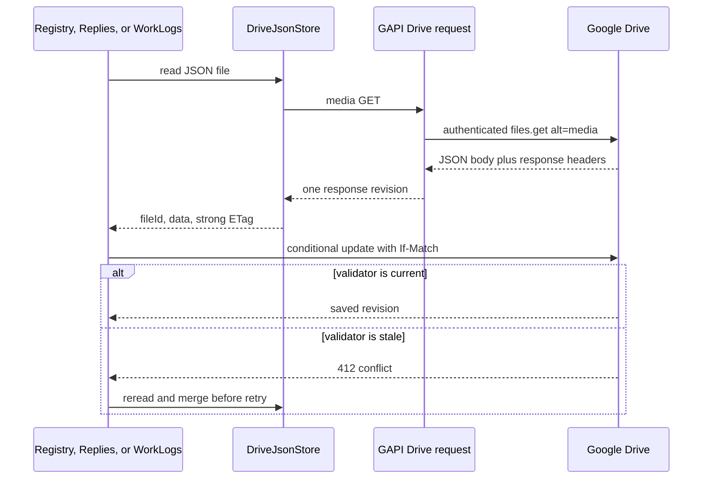

# Drive JSON ETag Read Repair - Plan

## Goal Capsule

- **Objective:** Restore safe publication of suggestion decisions by returning a coherent JSON payload and strong ETag from the shared Google Drive read transport.
- **Authority:** Preserve the existing fail-closed and bounded retry invariants. Do not replace the validator with Drive `version`, `modifiedTime`, `md5Checksum`, `headRevisionId`, or `If-Match: *`.
- **Execution profile:** Start from `origin/main` at or after deployed version 4.3.51. Protect the behavior with transport-first regression coverage before changing the read path.
- **Stop condition:** Do not ship if the target browser cannot read a strong ETag from the GAPI media response or Drive does not enforce the stale `If-Match` request with HTTP 412.
- **Tail ownership:** LFG owns implementation, review, browser verification, PR creation, and CI.

---

## Product Contract

### Summary

Use the existing authenticated GAPI request surface for Drive JSON media reads so content and its strong ETag cross the store boundary together. Keep every domain-level concurrency guard intact.

### Problem Frame

Production build 4.3.51 reads `agent-suggestion-decisions.json` successfully but receives no ETag through the direct browser `fetch` path. `SuggestionRegistrySync` correctly refuses the following whole-file update, producing “Registr rozhodnutí nemá ETag pro bezpečný souběžný zápis.” The same shared read path supplies validators to the reply journal and WorkLogs synchronization.

### Requirements

#### Coherent Drive reads

- R1. When an existing Drive JSON file response exposes a strong ETag, the read returns its file ID, parsed payload, and that ETag from the same GAPI response.
- R2. Header lookup is case-insensitive and preserves the validator byte-for-byte, including quotes.
- R3. Missing or weak ETags remain unavailable to concurrency-sensitive callers; they must never be fabricated or replaced with another Drive field.

#### Safe writes and failures

- R4. The suggestion registry and reply journal retain conditional writes, bounded 412 reread/merge/retry, post-write verification, and duplicate cleanup. WorkLogs retains its existing missing-ETag guard, conditional write, and outer full-reread retry; this change does not add registry-only verification or duplicate cleanup to WorkLogs.
- R5. Drive read failures remain structured errors and do not become missing-file or successful-with-empty-data states.

### Acceptance Examples

- AE1. Given a GAPI media response with JSON content and `ETag: "rev-8"`, when the store reads the file, then it returns the parsed content with exactly `"rev-8"`.
- AE2. Given an existing decision registry whose response has no strong ETag, when pending decisions publish, then no write is attempted and the existing fail-closed error remains visible.
- AE3. Given two clients that read the same revision, when one client updates first, then the second client receives 412 and rereads and merges instead of overwriting the first update.

### Scope Boundaries

- In scope: the shared Drive JSON media-read transport, its tests, cross-domain regression verification, and a durable integration learning.
- Out of scope: weakening domain guards, migrating to Drive API v2, using non-ETag revision fields as validators, or redesigning all journals as immutable event files.
- Deferred to follow-up work: a server-side CAS service or append-only Drive protocol if the browser contract gate proves strong ETags unavailable.

---

## Planning Contract

### Key Technical Decisions

- KTD1. **Read JSON and ETag from one GAPI media response.** This follows the repository's existing authenticated `gapi.client.request` transport and prevents pairing content from one revision with metadata from another. A separate metadata-after-content request was rejected because it creates a lost-update race.
- KTD2. **Keep ETag optional at the generic store boundary.** Legacy read-only consumers may use payloads without validators, while registry, reply, and WorkLogs services continue to enforce R3 and R4 at their write boundaries.
- KTD3. **Treat the browser/API behavior as a tested external contract.** Google documents GAPI response header maps, but Drive API v3 does not expose `etag` in the `File` schema or explicitly promise `If-Match` for `files.update`. The release gate must therefore prove a readable strong ETag and stale-write rejection without introducing an unsafe fallback.

### High-Level Technical Design

### Assumptions

- The production GAPI media response exposes the HTTP ETag in its documented response header map even though Drive API v3 omits `etag` from the `File` JSON resource.
- Existing store consumers that do not perform conditional writes may continue to accept a loaded payload without an ETag.
- The implementation branch starts from current `origin/main`; the local `main` working tree is older than the deployed code and is not a valid baseline.

### Risks and Dependencies

- **Undocumented Drive validator surface:** Unit tests cannot prove production header visibility or precondition enforcement. Mitigation: authenticated browser contract smoke before shipping; stop if it fails.
- **Shared transport regression:** The read path serves suggestions, replies, and WorkLogs. Mitigation: run focused cross-domain suites and the full repository gates.
- **Data loss from accidental fallback:** Replacing the missing ETag with another field would make stale overwrites possible. Mitigation: explicit tests for missing and weak validators and unchanged domain guards.

### Sources and Research

- `battle-plan/src/services/driveJsonStore.ts` owns the failing read transport and already uses GAPI requests for Drive protocol reads and JSON writes.
- `battle-plan/src/services/suggestionRegistrySync.ts`, `battle-plan/src/services/suggestionsSync.ts`, and `battle-plan/src/services/workLogsSync.ts` contain the existing conditional-write invariants.
- `docs/solutions/architecture-patterns/durable-suggestion-decision-registry.md` requires ETag-less writes to fail closed.
- [Google API JavaScript client response contract](https://google.github.io/google-api-javascript-client/docs/promises.html) documents raw body, parsed result, headers, and status on one response.
- [Drive files.get](https://developers.google.com/workspace/drive/api/reference/rest/v3/files/get) and [download guidance](https://developers.google.com/workspace/drive/api/guides/manage-downloads) define `alt=media` content reads.
- [Drive v2-to-v3 reference](https://developers.google.com/workspace/drive/api/guides/v2-to-v3-reference) confirms that the v3 `File` resource has no `etag` field.
- [RFC 9110 If-Match](https://www.rfc-editor.org/rfc/rfc9110.html#name-if-match) defines strong comparison and 412 lost-update protection.

---

## Implementation Units

### U0. Prove the external Drive contract before implementation

- **Goal:** Falsify the two undocumented assumptions that the chosen browser-only repair depends on before production code changes begin.
- **Requirements:** R1, R2, R3, R4; AE1, AE3.
- **Dependencies:** None.
- **Files:** No repository change; use an authenticated browser session and a uniquely named disposable Drive JSON file.
- **Approach:** Through the app's loaded GAPI client, create a disposable JSON file, fetch its media response, and verify that JavaScript can read an exact strong ETag. Update the scratch file once, then submit the original validator in a second conditional update and verify HTTP 412 with the first update preserved. Delete only the exact scratch file after recording the result.
- **Test scenarios:**
  - The GAPI media response exposes a non-empty, non-weak ETag to browser JavaScript.
  - A current validator permits a conditional update.
  - Reusing the stale validator returns HTTP 412 and does not overwrite the newer scratch content.
- **Verification:** Proceed to U1 only if all three observations hold. Otherwise stop this shipping path and plan the deferred server-side CAS or immutable-file protocol.

### U1. Restore coherent ETag reads in DriveJsonStore

- **Goal:** Make the shared Drive JSON read return content and its strong validator through the existing GAPI response surface.
- **Requirements:** R1, R2, R3, R5; AE1.
- **Dependencies:** U0.
- **Files:** `battle-plan/src/services/driveJsonStore.ts`, `battle-plan/src/services/driveJsonStore.test.ts`.
- **Approach:** Add characterization coverage that fails on the direct-fetch implementation, then route the media read through the existing GAPI client. Reuse the common response parsing, status validation, and case-insensitive ETag extraction patterns. Preserve access-token refresh and structured store errors.
- **Execution note:** Start with a failing transport test for the production contract represented by the screenshot.
- **Patterns to follow:** `GapiDriveProtocolApi.downloadFile`, `getDriveResponseEtag`, `responseObject`, and `ensureDriveRequestOk` in `battle-plan/src/services/driveJsonStore.ts`.
- **Test scenarios:**
  - Covers AE1. A mixed-case ETag header and JSON result produce one loaded object with exact payload and validator.
  - A raw JSON body is parsed when the GAPI result field is unavailable.
  - A missing or weak ETag remains absent and does not become a fabricated validator.
  - A non-success GAPI response becomes a structured error with the Drive status context.
- **Verification:** The focused store suite proves request path, response parsing, validator preservation, and failure mapping.

### U2. Prove conditional-write consumers remain safe

- **Goal:** Demonstrate that the transport repair unblocks Suggestions while preserving concurrency safety across all shared consumers.
- **Requirements:** R3, R4, R5; AE2, AE3.
- **Dependencies:** U1.
- **Files:** `battle-plan/src/services/suggestionRegistrySync.test.ts`, `battle-plan/src/services/suggestionsSync.test.ts`, `battle-plan/src/services/workLogsSync.test.ts`.
- **Approach:** Keep domain implementations unchanged unless a test exposes a transport integration gap. Add only the smallest seam coverage needed to prove that the canonical read ETag reaches `If-Match`. Preserve each consumer's current safety protocol rather than imposing registry-specific verification or duplicate cleanup on WorkLogs.
- **Test scenarios:**
  - Covers AE2. An existing registry without a strong ETag performs zero writes and keeps the local decision pending.
  - Covers AE3. A stale conditional update rereads current data, merges it, and does not lose the competing change.
  - A reply journal preserves bounded 412 merge retries, post-write canonical verification, and duplicate cleanup after the shared transport change.
  - A WorkLogs snapshot preserves its missing-ETag guard, conditional update, and outer full-reread retry without gaining unrelated duplicate-cleanup behavior.
- **Verification:** Focused registry, reply, and WorkLogs suites pass without weakening any missing-ETag assertion.

### U3. Record and smoke-test the external contract

- **Goal:** Make the production-only constraint and its safe fallback boundary durable.
- **Requirements:** R1, R3, R4.
- **Dependencies:** U0, U1, U2.
- **Files:** `docs/solutions/integration-issues/drive-json-etag-browser-contract.md`.
- **Approach:** Document the root cause, the coherent GAPI-response pattern, rejected validator substitutes, and the stop condition that requires a server-side CAS or immutable protocol if the browser cannot expose a strong ETag.
- **Test scenarios:** An authenticated browser contract run verifies a readable strong ETag, successful decision publication, a healthy next polling cycle, and HTTP 412 rejection of a stale validator without overwriting newer content.
- **Verification:** The U0 scratch-file probe passes, then the repaired app shows Suggestions sync as OK, persists a decision, remains healthy after the next polling cycle, and retains healthy WorkLogs and task sync diagnostics.

---

## Verification Contract

| Gate | Scope | Done signal |
|---|---|---|
| Focused transport and sync tests | U1, U2 | DriveJsonStore, registry, replies, and WorkLogs suites pass with missing-ETag and 412 coverage intact. |
| `npm test` from `battle-plan/` | U1, U2 | Full Node test suite passes. |
| `npm run lint` from `battle-plan/` | U1, U2, U3 | ESLint reports no errors. |
| `npm run build` from `battle-plan/` | U1, U2, U3 | TypeScript and Vite production build complete. |
| Pre-implementation Drive contract probe | U0 | A disposable file proves browser-readable strong ETags and HTTP 412 rejection of a stale validator before production code changes begin. |
| Authenticated browser contract smoke | U3 | A strong ETag is observable through the repaired app transport, a decision publishes, the next poll stays green, and a stale validator is rejected rather than overwriting. |

---

## Definition of Done

- U0 proves the browser-visible strong-ETag and stale-`If-Match` contracts before implementation begins.
- U1 returns a coherent Drive JSON payload and any available strong ETag from one GAPI response with regression coverage.
- U2 preserves each domain's existing fail-closed and conflict-handling invariants without expanding WorkLogs semantics.
- U3 records the integration learning and the authenticated browser contract gate passes.
- The full test, lint, and build gates pass from the current production baseline.
- No blind overwrite fallback, fake validator, obsolete experimental code, or unrelated `.worktrees/` change remains in the diff.

