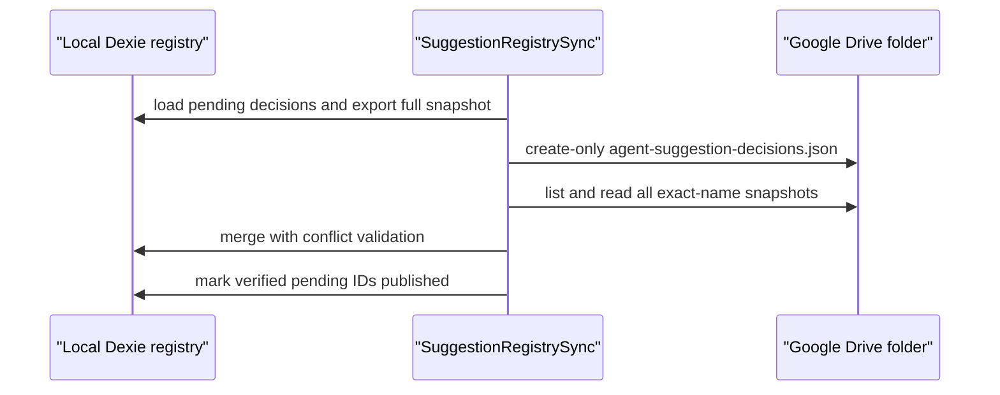

# Backendless Suggestion Registry Repair - Plan

## Goal Capsule

Remove the production Suggestions Sync ETag failure without adding a backend. Publish the existing decision registry as create-only Drive snapshots, merge every snapshot deterministically, and never overwrite or delete shared registry data.

This is a bounded production repair. The plan is authoritative after the user-directed GitHub Pages constraint and repository safety invariants. LFG owns implementation, review, browser verification, PR creation, and CI follow-through.

## Product Contract

### Summary

BattlePlan will keep the existing durable local suggestion registry and complete snapshot schema. Each publish creates a new `agent-suggestion-decisions.json` file in `/Anu-BattlePlan/`. Readers already discover all files with that exact name and will merge their contents. Legacy and new snapshots remain readable; current code stops updating a canonical file and stops trashing duplicates.

### Problem Frame

Drive API v3 media downloads do not expose a documented, usable ETag to the browser. Version 4.3.52 therefore reaches the correct fail-closed guard whenever pending suggestion decisions are published. Removing the guard would permit lost updates. Create-only snapshots avoid the read-modify-write race while preserving the static GitHub Pages deployment.

### Key Decisions

- **Keep the deployment browser-only on GitHub Pages.** Governs R1-R7. (session-settled: user-directed — chosen over server-side CAS/backend: preserves the static GitHub Pages deployment)
- **Ship the diagnosed registry repair before broader Drive migration.** Governs R2-R7. Replies, producer overlays, WorkLogs, task backup, and `agentBridge` remain explicit follow-ups instead of delaying a user-testable fix.

### Requirements

- R1. The production application remains a static GitHub Pages build with browser Google OAuth and Drive access.
- R2. Registry publication uses only `createJsonFile(..., { createOnly: true })`; it must not require ETag, `If-Match`, PATCH, overwrite, or trash.
- R3. A published snapshot contains the complete local registry: decisions, subjects, and occurrences, so same-occurrence and distinct-subject identity changes converge.
- R4. Registry reads merge every exact-name file with the existing conflict checks; identical records are idempotent and conflicting immutable decision data fails closed.
- R5. Pending decisions are marked published only after a complete reread proves every pending ID exists in the merged remote projection.
- R6. With no pending decisions, multiple snapshots are a healthy loaded state and must not trigger compaction or a new write.
- R7. Diagnostics stop reporting the ETag error after a successful publish and do not append the same unchanged error every polling cycle.

### Acceptance Examples

- AE1. Covers R2-R5: two devices publish different first decisions concurrently; each creates a file and both decisions appear after reread, with no update or trash request.
- AE2. Covers R3-R5: same-occurrence and distinct-subject actions publish their changed identity graph because each shard contains the full snapshot.
- AE3. Covers R4-R6: a legacy registry plus several create-only snapshots loads deterministically; a second poll with no pending decisions performs no write.
- AE4. Covers R5, R7: a create or verification failure keeps the decision pending and reports one actionable health transition; a later retry succeeds and clears the error.

### Scope Boundaries

This release changes only the suggestion decision registry and its diagnostics. `agent-suggestion-replies.json`, producer suggestion edits, WorkLogs and tombstones, task backup, and `agentBridge` retain their existing contracts and are documented follow-ups. A green WorkLogs card proves only that reading succeeded; it does not prove the next write is ETag-safe. This release must not claim that every Drive writer is concurrency-safe.

## Planning Contract

### Key Technical Decisions

- KTD1. Reuse `DriveJsonStore` exact-name pagination and `createJsonFile` create-only behavior instead of introducing a new sync framework. Governs R2, R4, R6.
- KTD2. Publish a full registry snapshot for each pending batch. File growth is acceptable for this repair because it preserves identity projections and removes migration work; automatic compaction is deferred. Governs R3-R6.
- KTD3. Verify success against the merged union of all remote files, not a designated canonical file. Governs R4-R5.
- KTD4. Preserve the existing fail-closed schema and immutable decision conflict validation. Do not weaken it to tolerate malformed or contradictory registry files. Governs R4-R5.
- KTD5. Treat all clients authorized through the same BattlePlan OAuth workspace as trusted writers. Drive immutability is an application convention, not cryptographic authorship. Governs R1-R4.

### High-Level Technical Design

### Risks and Dependencies

- Snapshot count grows with user decision batches. Diagnostics and documentation must name this debt; no automatic deletion is safe without cross-device acknowledgements.
- A stale 4.3.52 client can see multiple files, but its missing-ETag guard fails before overwrite or duplicate cleanup. The production smoke test must still refresh the service worker before mutation.
- Drive create can fail ambiguously. A retry may create a duplicate full snapshot, which is safe because registry merge is idempotent by stable decision ID.

### Sources and Research

- `battle-plan/src/services/suggestionRegistrySync.ts` contains the current ETag guard, merge, retry, verification, and duplicate cleanup.
- `battle-plan/src/services/driveJsonStore.ts` already provides paginated exact-name reads and create-only JSON creation.
- `docs/solutions/architecture-patterns/durable-suggestion-decision-registry.md` defines the conflict and identity invariants.
- [Drive media downloads](https://developers.google.com/workspace/drive/api/guides/manage-downloads) do not promise a response ETag.
- [Drive file creation](https://developers.google.com/workspace/drive/api/guides/create-file) supports the existing store's create-only approach.

## Implementation Units

### U1. Replace registry CAS with create-only snapshots

**Goal:** Publish and verify pending registry state without ETags or mutable Drive requests.

**Requirements:** R2-R6. **Decisions:** KTD1-KTD4.

**Files:** `battle-plan/src/services/suggestionRegistrySync.ts`; `battle-plan/src/services/suggestionRegistrySync.test.ts`.

**Approach:** Merge all existing files, return loaded immediately when no decisions are pending, create one full snapshot when pending data exists, reread and merge all files, verify the union contains every pending ID, then mark them published. Remove canonical-file selection, ETag update, 412 retry, and duplicate trash from this path.

**Test scenarios:** missing ETag still publishes; concurrent create preserves both decision sets; multiple files with no pending work cause no write; union verification succeeds when the new decision is not in the first file; create and reread failures keep pending state; conflicting decision IDs fail closed; zero update/trash calls.

**Verification:** focused registry suite passes and request doubles prove only create/list/read operations.

### U2. Diagnostics and durable learning

**Goal:** Report the repaired protocol honestly and preserve the failed-ETag lesson.

**Requirements:** R7. **Decisions:** KTD2, KTD5. **Depends on:** U1.

**Files:** suggestion health/logging code and tests as needed; `docs/solutions/integration-issues/drive-json-media-read-loses-etag.md` or a superseding solution document.

**Approach:** Ensure successful publication returns Suggestions Sync to OK. Suppress identical consecutive registry error log entries without hiding state changes. Correct the previous learning so it no longer claims GAPI media reads provide a dependable validator. Document snapshot growth and the deferred reply/WorkLog migrations.

**Test scenarios:** unchanged failure is logged once; recovery is logged and clears health; subsequent regression logs again; documentation matches create-only behavior.

**Verification:** diagnostics tests pass and no documentation claims browser ETag support.

## Verification Contract

Run from `battle-plan/`:

1. `node --import fake-indexeddb/auto --experimental-strip-types --test src/services/suggestionRegistrySync.test.ts src/services/driveJsonStore.test.ts`
2. `npm test`
3. `npm run lint`
4. `npm run build`
5. Inspect the diff and tests: registry publication issues zero update, `If-Match`, or trash calls.
6. Before merge, run the production-origin OAuth contract against a non-destructive test workspace when available. After merge and GitHub Pages deployment, refresh the service worker, create/reject/defer a suggestion decision, wait for two polling intervals, and confirm Suggestions Sync stays OK. If the post-merge smoke fails, immediately use the repository's non-force-push revert procedure.

## Definition of Done

- U1-U2 meet their test scenarios and verification statements.
- Requirements R1-R7 are satisfied.
- Pending registry decisions publish without a readable ETag.
- Multiple registry snapshots merge without compaction or lost decisions.
- Focused tests, full tests, lint, build, and PR CI pass.
- Post-merge production smoke succeeds or the change is reverted.
- No temporary junctions, debug artifacts, abandoned experiments, or unrelated user changes remain in the branch.
