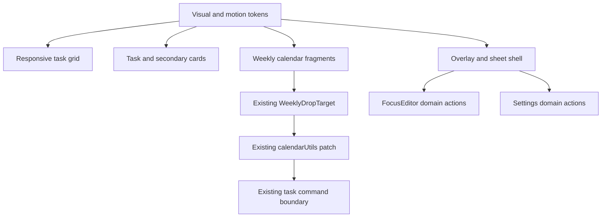
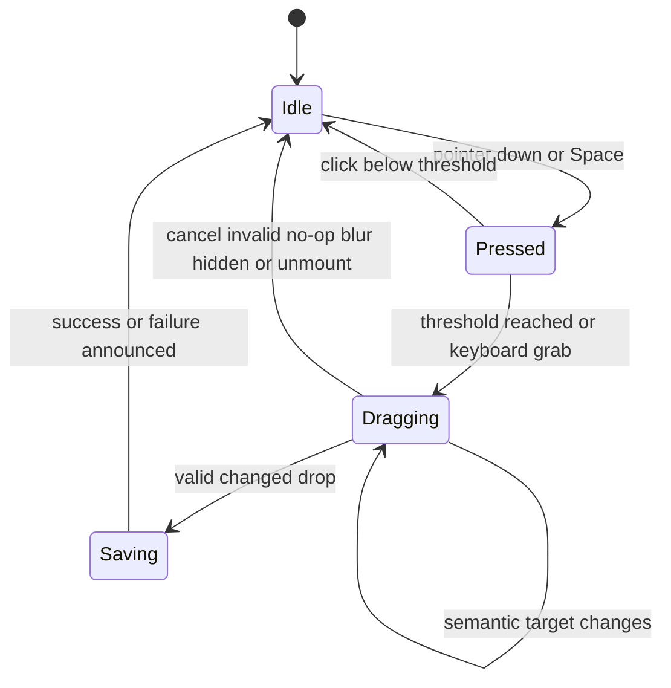

# Visual Interaction Polish - Plan

## Goal Capsule

- **Objective:** Karty, kalendářní bloky a overlaye se vizuálně chovají jako jeden promyšlený systém, drží ovládací prvky uvnitř svých hranic a zůstávají čitelné při dotyku, klávesnici, úzkém viewportu i uživatelském škálování.
- **Means:** Zavést malou sdílenou vrstvu povrchů a motion pravidel, převést vnitřní layout na container-aware chování a rozšířit stávající sémantický drag o plynulou prezentační vrstvu (KTD1-KTD7).
- **Authority:** Produktový kontrakt a R-ID pravidla mají přednost před KTD. KTD řídí mechanismus. Implementační jednotky nesmějí měnit doménovou sémantiku tasků, meetingů, WorkLogs ani Google integrací.
- **Execution profile:** Deep UI refactor s browser-first ověřením a čistými testy pro novou výpočtovou logiku.
- **Stop conditions:** Zastavit, pokud by polish vyžadoval změnu uložených dat, významu task/meeting času, Google lane omezení nebo voice lifecycle.
- **Tail ownership:** LFG vlastní zjednodušení, review, browser QA, commit, PR a CI.

---

## Product Contract

### Summary

Aplikace dostane konzistentní vizuální hierarchii pro tasky, meetingy, karty a dialogy. Ovládací prvky se přizpůsobí reálné šířce svého elementu a animace budou plynulé, účelné a respektující reduced-motion preference.

### Problem Frame

Současné UI skládá většinu hranic, barev, stínů a přechodů přímo v jednotlivých komponentách. Výsledkem jsou rozdílné významy barev, hover-only akce, absolutně umístěné badge, nezalamující se action bary a několik neslučitelných overlay vzorů. Root font scale zároveň mění `rem`, zatímco některé fragmenty zůstávají v pevných pixelech.

Týdenní kalendář má správně oddělenou sémantiku dropu od perzistence, ale jeho vizuální feedback a hustota bloků neřeší pointer-following ghost, překryv souběžných položek, klávesnicový přesun ani všechny cleanup cesty. Focus editor se vizuálně otevírá jako panel, ale neplní celý dialogový a focus kontrakt.

### Requirements

#### Card containment and hierarchy

- R1. Každá task/meeting karta drží metadata, badge a akce uvnitř svého boxu bez překryvu při šířce 320 px a při `uiScale` 12, 16 i 24 px.
- R2. Čas a stavová metadata jsou dostupná bez hoveru; ikonové akce jsou trvale dostupné na touch zařízení a při `focus-within`.
- R3. Action rail používá minimální dotykový cíl 44 × 44 px, při šířce kontejneru pod 320 px přejde do dvou řádků, při větší šířce používá čtyři sloupce `44px minmax(0, 1fr) minmax(0, 1fr) 44px` a neobsahuje duplicitní destruktivní nebo hlasové akce. Grid používá `repeat(auto-fit, minmax(min(100%, 20rem), 1fr))`.
- R4. Task používá indigo, meeting oranžovou, completed emerald a over-capacity červenou s pořadím precedence over-capacity > completed > typ. Stejný 3px vnitřní akcent a doprovodný text/ikona se používají napříč gridem, týdenním kalendářem a editorem, aby barva nebyla jediným nositelem významu.

#### Motion and feedback

- R5. Enter, exit a kolekční layout animace mění pouze opacity a transform; jedinou výjimkou jsou aktivní inline disclosure fragmenty podle R19, které mohou animovat vlastní výšku. Interaktivní přechody explicitně animují jen potřebné vlastnosti.
- R6. Reduced-motion režim odstraní posuny, scale springy, pulsy a smooth scroll, ale zachová okamžitou barevnou, hraniční a opacity zpětnou vazbu.
- R7. Hlavní view přechody jsou jemné a nesmí transformovat aktivní týdenní kalendář během drag operace.

#### Weekly planning

- R8. Pointer drag zachová 8px práh, 15minutový snap, Google Task omezení na all-day lane a právě jeden save po platném změněném dropu. Pointer capture začne už při pointerdown a idempotentní reset jej vždy uvolní; potlačí se pouze syntetický click patřící právě dokončenému dragu.
- R9. Drag zobrazuje pointer-following ghost, zvýrazněný sémantický cíl a kompaktní stavový HUD bez rerenderu celého kalendáře na každý pixel. Po dropu zůstane neinteraktivní pending blok v cíli; úspěch jej nahradí uloženými daty a chyba jej vrátí ke zdroji, zachová fokus a jednou oznámí výsledek.
- R10. Klávesnice umožní uchopit položku přes `Space`, měnit sémantický cíl šipkami, potvrdit přes `Enter` nebo `Space` a zrušit přes `Escape`. Handlery zabrání nativní aktivaci tlačítka, `aria-grabbed` zůstane true do cleanupu a fokus zůstává na logickém zdroji; po úspěchu přejde na přesunutý blok, po cancelu nebo chybě na původní blok.
- R11. Pointer cancel, lost capture, blur, skrytí stránky, unmount a změna týdne odstraní všechny dočasné drag vrstvy a nepolknou další legitimní click.
- R12. Souběžné timed položky se rozdělí do čitelných collision sloupců; pod minimální použitelnou šířkou se použije kaskáda s indikátorem dalších položek. Indikátor je focusovatelný disclosure control, otevře navigovatelný seznam skrytých položek a po Escape dostane fokus zpět.
- R13. Obsah kalendářního bloku se řídí skutečnou výškou a šířkou fragmentu, takže 40px blok stále ukáže název, čas a drag affordance bez překryvu.
- R14. All-day lane ukáže explicitní počet skrytých položek místo závislosti na neviditelném scrollbaru; stejný dostupný disclosure seznam umožní položku otevřít ve FocusEditoru.

#### Dialogs and secondary surfaces

- R15. Focus editor a settings používají společný overlay/sheet základ s animovaným backdropem, focus trapem, počátečním fokusem, návratem fokusu a správnými dialogovými atributy.
- R16. Focus editor se na mobilu přeskupí do bezpečné action grid struktury a respektuje bottom safe area.
- R17. Dirty editor před zavřením žádá potvrzení; aktivní recording zachytí první `Escape` pro zastavení nahrávání místo zavření editoru.
- R18. Save a delete zavřou editor po potvrzeném lokálním úspěchu. Cancel nebo selhání lokální mutace ponechá editor otevřený s viditelným stavem; chyba volitelného Google syncu nezruší autoritativní lokální zápis, editor zavře a zobrazí neblokující varování.
- R19. Inline editace, delete confirmation, reply a defer fragmenty ve WorkLog a Suggestion kartách animují vlastní výšku bez skoku a bez vytažení ovládání mimo kartu.
- R20. WorkLog kalendář na úzkém viewportu zachová minimální denní šířku 112 px a nabídne zřetelný horizontální scroll místo stlačení sedmi sloupců pod použitelnost. Druhý agenda režim není součástí tohoto polish releasu.

#### Accessibility and performance

- R21. Každá ikonová akce má dostupný název a každá interaktivní hranice má viditelný `:focus-visible` stav.
- R22. Drag live region oznamuje pouze změnu snapnutého sémantického cíle a jeden konečný výsledek.
- R23. Opakované karty nepoužívají drahý backdrop blur a `transition-all` jako výchozí animaci; blur zůstane jen na nízkopočetných overlay vrstvách.

### Acceptance Examples

- AE1. **Covers R1-R3:** Při viewportu 320 px a `uiScale` 24 px jsou všechny akce TaskCard uvnitř karty, text se nezlomí pod ikony a každý control má alespoň 44 px.
- AE2. **Covers R8, R11:** Pohyb o 7 px otevře položku jako click; pohyb o 8 px aktivuje drag a následný click editor neotevře.
- AE3. **Covers R8:** Platný změněný drop volá `onRescheduleTask` právě jednou; no-op, invalidní drop a cancel jej nevolají.
- AE4. **Covers R10, R22:** Uživatel uchopí blok klávesnicí, přesune jej po dnech a 15minutových krocích, slyší pouze změny cíle a potvrdí nebo zruší operaci.
- AE5. **Covers R12-R14:** Dva překrývající se meetingy zůstanou rozlišitelné a 40px blok zobrazí název, čas a grip bez překryvu.
- AE6. **Covers R15-R18:** Focus editor zachytí fokus, nezavře se při odmítnutém delete ani chybě save a po úspěšném zavření vrátí fokus na původní kartu.
- AE7. **Covers R6:** Při `prefers-reduced-motion: reduce` nejsou žádné springy, pulsy ani posuny, ale hover, focus, drag target a stavové barvy zůstávají čitelné.

### Scope Boundaries

- V rozsahu jsou primární task/meeting karty, týdenní drag, Focus editor, Settings a sekundární card/inline fragmenty WorkLogs a Suggestions.
- V rozsahu je prezentační výpočet collision sloupců a klávesnicový drag nad existujícím `WeeklyDropTarget`.
- Mimo rozsah jsou změny Dexie schématu, Google API kontraktů, sync orchestrace, významu `startTime`, `deadline`, `date` a voice processing pipeline.
- Mimo rozsah je nový světlý motiv, rebranding, výměna Tailwindu nebo Framer Motion a zavedení nové end-to-end testovací závislosti.

---

## Planning Contract

### Key Technical Decisions

- KTD1. **Small domain-blind UI foundation.** Rozšířit `index.css` a přidat malé `components/ui/` moduly závislé jen na Reactu, Framer Motion a CSS tokenech. Doménový stav se mapuje před touto hranicí. Odmítnutá univerzální `Surface` nad celým task objektem by spojila prezentaci s Dexie, hooks a službami.
- KTD2. **Element-driven responsiveness.** Task grid použije auto-fit minimum a samotné karty container queries, protože viewport breakpoint nezná šířku sidebaru ani dopad root font scale.
- KTD3. **Presentation stays outside domain persistence.** Ghost, keyboard target a collision layout se převádějí na existující `WeeklyDropTarget`; `calendarUtils` a `useTaskCommands` zůstávají jedinými vlastníky časové a save sémantiky pod R8-R14.
- KTD4. **Opt-in motion vocabulary with user preference.** Root `MotionConfig` vlastní pouze `reducedMotion="user"`. Pojmenované varianty a paralelní CSS tokeny se aplikují surface po surface. Odmítnutý globální spring by bez auditu změnil voice, palette, sidebar a lazy-page animace pod R5-R7.
- KTD5. **One overlay stack owns interaction order.** U1 nejdřív porovná nativní `<dialog>` s tenkou sdílenou vrstvou na reálném TaskCard + overlay řezu; platformní modality a focus chování se použije všude, kde splní nested overlay, sidebar-inset, recording-aware Escape a exit-animation kontrakt. Sdílený stack doplní jen chybějící portal, topmost Escape, `inert` pozadí, focus return a referenčně počítaný scroll lock. FocusEditor, Settings, WorkLog detail, WorkLog voice confirmation a SlashCommandPalette projdou stejnou migrací nebo kompatibilitním auditem.
- KTD6. **Pure normalized calendar layout math.** Doménová časová logika nejdřív vytvoří prezentační interval `{startMinute, endMinute}`. Collision helper přijímá pouze intervaly, řeší sort+sweep nejvýše v `O(n log n)` a znovu neinterpretuje `UnifiedTask`. Odmítnuté párové porovnávání i raw-task helper by duplikovaly časovou sémantiku.
- KTD7. **Explicit async editor outcomes.** Save a delete vracejí rozlišitelný výsledek pro cancel, lokální úspěch, lokální úspěch s chybou volitelného syncu a skutečné selhání. Odmítnuté řízení jen přes výjimky nerozlišuje autoritativní lokální zápis od Google side effectu pod R17-R18.

### High-Level Technical Design

### Assumptions

- Plný vizuální polish zahrnuje i sekundární karty a overlaye, ne pouze TaskCard a WeeklyCalendar.
- Současný tmavý indigo/orange vizuální charakter zůstává; změna sjednotí významy a hloubku, nikoli značku.
- Klávesnicový drag je nutná součást kvalitního interakčního polish, přestože jej uživatel nejmenoval samostatně.
- Stávající Framer Motion 12, React 19 a Tailwind 4 stačí; nová UI nebo animation dependency není potřeba.
- Browser QA je hlavní důkaz vizuálního výsledku; čisté Node testy pokryjí novou layout a interaction logiku bez zavedení React test runneru.

### Sequencing

U1 vytvoří sdílený základ a ověří jej vertikálním řezem na jedné TaskCard a jednom overlayi. U2, U3, U4 a U5 na něm mohou běžet odděleně. U6 uzavírá celý řetězec browser QA a regresním hardeningem.

### System-Wide Impact

- App shell vlastní pouze reduced-motion provider a overlay stack; jednotlivé lazy stránky si dál drží své doménové controllery a lifecycle.
- Sdílené UI moduly zůstávají doménově slepé. Task, meeting, WorkLog a Suggestion význam se mapuje v jejich prezentačních vrstvách.
- Kalendářní prezentace končí na `WeeklyDropTarget`. `calendarUtils` a command boundary zůstávají jedinými vlastníky časové interpretace a zápisu.
- Collision a weekly bucket výpočet se invalidují jen změnou tasks, týdne nebo box geometrie. Pixelový pointer pohyb nesmí invalidovat seznam bloků.
- Overlay stack zajistí, že nested dialog nevyvolá dvojí Escape, předčasný focus return ani odemčení scrollu před zavřením poslední vrstvy.

### Risks and Mitigations

- **Příliš mnoho blur a shadow vrstev:** Omezit animované vlastnosti a blur ponechat pouze overlayům.
- **Drag rerender jank:** Při grabu snapshotovat lane geometrii, pointer pohyb coalescovat přes `requestAnimationFrame` a React state měnit jen při změně snapnutého target klíče.
- **Focus trap versus recording:** Overlay shell nesmí sám ukončovat doménový stav; FocusEditor určí, zda `Escape` zastaví recording nebo žádá o zavření.
- **Collision layout na úzkých dnech:** Vynutit minimální použitelnou šířku a degradovat do kaskády s `+N`, ne do nečitelných sloupců.
- **UI scale versus pevné časové řádky:** Density pravidla odvozovat z reálného boxu; časovou geometrii kalendáře neměnit bez testu sémantických patchů.
- **Layout projection napříč kolekcí:** Výšku animuje pouze právě otevřený inline fragment. Sourozenci používají position/transform animaci a drag hot path nepoužívá shared `layoutId`.

### Sources and Research

- `battle-plan/src/components/TaskCard.tsx` ukazuje hover-only metadata, absolutní capacity badge a nezalamující action rail.
- `battle-plan/src/components/WeeklyCalendar.tsx` je zdroj správného pointer/drop kontraktu a současných vizuálních limitů.
- `docs/solutions/design-patterns/weekly-task-history-and-rescheduling.md` vyžaduje jeden command po dropu a browser ověření click-versus-drag.
- `docs/solutions/architecture-patterns/lazy-page-lifecycle-boundaries.md` chrání route-owned controllers a overlay cleanup hranice.
- `docs/solutions/ui-bugs/worklog-voice-proposal-cancel-reopen.md` dokládá, že exit animace nesmí nahradit lifecycle cleanup.

---

## Implementation Units

### U1. Shared surface and motion foundation

- **Goal:** Zavést jednotné surface, semantic accent, action rail, focus a reduced-motion stavebnice.
- **Requirements:** R4-R7, R21, R23.
- **Dependencies:** Žádné.
- **Files:** `battle-plan/src/index.css`, `battle-plan/src/App.tsx`, `battle-plan/src/components/ui/Surface.tsx`, `battle-plan/src/components/ui/OverlayStack.tsx`, `battle-plan/src/components/ui/OverlaySurface.tsx`.
- **Approach:** Přidat malé skládací utility místo rozsáhlé komponentové knihovny. `MotionConfig reducedMotion="user"` použít přímo v `App.tsx`. Definovat opt-in tokeny: quick 120 ms, standard 180 ms, slow 240 ms, enter travel 6 px, sheet travel 24 px a spring `{stiffness: 420, damping: 36, mass: 0.7}`. Nahradit globální mobilní `!important` přebarvení tokenově řízeným kontrastem. Aplikovat explicitní transition properties a společné focus-visible styly.
- **Patterns to follow:** Existující `office-card`, `glass-card`, `AnimatePresence` a lazy-page hranice; KTD1, KTD4 a KTD5.
- **Test scenarios:**
  - Vertikální browser řez na jedné TaskCard a jednom overlayi ověří focus, reduced motion, container scaling, cleanup a zvolený nativní/custom dialog baseline před rozšířením do U2-U5.
- **Verification:** Běžné surface komponenty mají stejnou hloubku a focus jazyk. Reduced-motion větev vypne pohyb. Dotčené opakované karty neobsahují `transition-all`, animovaný shadow/filter/backdrop-filter ani trvalý `will-change`.

### U2. Responsive task and meeting cards

- **Goal:** Přestavět task grid a TaskCard tak, aby metadata i akce zůstaly uvnitř karty při každé podporované šířce a scale.
- **Requirements:** R1-R4, R21, R23; AE1.
- **Dependencies:** U1.
- **Files:** `battle-plan/src/App.tsx`, `battle-plan/src/components/TaskCard.tsx`, `battle-plan/src/utils/taskListPresentation.ts`, `battle-plan/src/utils/taskListPresentation.test.ts`.
- **Approach:** Grid převést na auto-fit minimum. Kartu udělat inline-size container s flow-based badge a metadaty. Odstranit horní duplicitní delete, přesunout export do action railu a použít container variantu action gridu s `min-width: 0`.
- **Execution note:** Nejdřív zachytit čistými testy sémantický mapping typu/stavu; responsivní layout ověřit v browseru.
- **Patterns to follow:** `SuggestionCard` už používá `flex-wrap`; completed treatment zůstává vlastněný `taskListPresentation`.
- **Test scenarios:**
  - Mapping vrátí stabilní task, meeting, completed a over-capacity akcent bez změny doménového typu.
  - Completed task zachová současné zobrazení a active task zůstane bez completed treatment.
  - Browser: 320/768/1440 px × scale 12/16/24 nemá overflow a touch varianta nezávisí na hoveru.
- **Verification:** AE1 projde a všechny action controls mají accessible name, focus ring a minimální touch target.

### U3. Weekly calendar drag and collision polish

- **Goal:** Doplnit plynulý drag ghost, robustní cleanup, klávesnicový přesun, collision layout a density pravidla bez změny save sémantiky.
- **Requirements:** R8-R14, R21-R23; AE2-AE5.
- **Dependencies:** U1.
- **Files:** `battle-plan/src/components/WeeklyCalendar.tsx`, `battle-plan/src/utils/weeklyCalendarLayout.ts`, `battle-plan/src/utils/weeklyCalendarLayout.test.ts`, `battle-plan/src/utils/calendarUtils.ts`, `battle-plan/src/utils/calendarUtils.test.ts`.
- **Approach:**
  1. Při grabu snapshotovat lane boxy v souřadnicích scroll obsahu, offset scrollu sledovat bez layout readu a pixelový pohyb coalescovat přes `requestAnimationFrame`; `ResizeObserver` při změně geometrie drag zruší a připraví nový snapshot. React se aktualizuje jen při změně snapnutého target klíče.
  2. Jedním průchodem bucketovat položky podle dne/lane a memoizovat normalizované intervaly mimo drag hot path.
  3. Zavést idempotentní drag reset pro pointer, window, visibility a lifecycle cesty.
  4. Převést keyboard gesto na stejný `WeeklyDropTarget` a stejnou save hranici.
  5. Vypočítat collision groups, sloupce, kaskádu a obsahovou density sort+sweep helperem.
- **Execution note:** Zachovat stávající time patch testy zelené před rozšířením prezentace; novou layout logiku implementovat test-first.
- **Patterns to follow:** `weekly-task-history-and-rescheduling.md`, existující `targetAtPoint`, `getWeeklyReschedulePatch`, `aria-live` a single save po dropu.
- **Test scenarios:**
  - Pohyb 7 px zůstane click; 8 px přejde do drag a potlačí pouze bezprostřední následný click.
  - Validní změněný drop vytvoří jeden patch; invalidní, no-op a cancel nevytvoří žádný save intent.
  - Keyboard posuny mění timed target o 15 minut, all-day target pouze o den a respektují Google Task lane omezení.
  - Collision helper rozdělí překrývající intervaly do sloupců a pod 56 px vrátí kaskádu s počtem skrytých položek.
  - Collision helper odliší task končící v `startTime` od meetingu začínajícího v `startTime`, ořízne interval na 7:00-19:00 a považuje dotýkající se intervaly za nepřekryté.
  - Fixture s 200 položkami v týdnu, 40 v jednom dni, 12 souběžnými a 30 all-day položkami zůstane v `O(n log n)`; stress s 1000 položkami neukáže superlineární růst.
  - Density helper pro 40, 48, 72 px vrátí očekávanou úroveň obsahu.
  - Lost capture, blur, hidden, Escape, unmount a změna týdne vrátí drag stav do idle.
  - Scroll během dragu zachová správný sémantický target; změna geometrie přes `ResizeObserver` drag bezpečně zruší.
  - Space grab/confirm neotevře editor a opuštění původního bloku před 8 px neztratí pointer sekvenci.
- **Verification:** AE2-AE5 projdou v čistých testech a browseru; live region neoznamuje změny mezi dvěma pixely se stejným snapnutým targetem.

### U4. Accessible and responsive overlay lifecycle

- **Goal:** Sjednotit FocusEditor a Settings na overlay shellu a opravit focus, close, dirty, save a delete kontrakty.
- **Requirements:** R15-R18, R21; AE6-AE7.
- **Dependencies:** U1.
- **Files:** `battle-plan/src/components/ui/OverlayStack.tsx`, `battle-plan/src/components/ui/OverlaySurface.tsx`, `battle-plan/src/components/FocusEditor.tsx`, `battle-plan/src/components/SettingsModal.tsx`, `battle-plan/src/components/worklogs/WorkLogCalendar.tsx`, `battle-plan/src/components/worklogs/WorkLogVoiceConfirm.tsx`, `battle-plan/src/components/SlashCommandPalette.tsx`, `battle-plan/src/App.tsx`, `battle-plan/src/hooks/useTaskCommands.ts`, `battle-plan/src/hooks/useTaskCommands.test.ts`, `battle-plan/src/utils/editorInteraction.ts`, `battle-plan/src/utils/editorInteraction.test.ts`.
- **Approach:** Overlay stack vlastní topmost dialog, focus trap, scroll containment, backdrop transition a focus return. FocusEditor vlastní snapshot/dirty politiku, recording-aware Escape a KTD7 outcome-based close. Responsivní CSS nahradí `window.innerWidth` a duplicitní voice control.
- **Execution note:** Nejprve přidat testy čisté close politiky a návratové hodnoty delete; browser potom ověří skutečný focus a klávesnici.
- **Patterns to follow:** `lazy-page-lifecycle-boundaries.md`, `worklog-voice-proposal-cancel-reopen.md` a existující `AnimatePresence` v `App.tsx`.
- **Test scenarios:**
  - Pristine draft se zavře bez potvrzení, dirty draft vrátí confirm intent a recording-aware Escape vrátí stop-recording intent.
  - Odmítnutý delete vrátí false a editor zůstane otevřený; úspěšný delete vrátí true a zavře se.
  - Lokální úspěch s Google sync chybou zavře editor nad uloženým lokálním stavem a zobrazí neblokující sync výsledek podle KTD7.
  - Opakovaný save během busy stavu nevytvoří druhou operaci.
  - Browser: Tab a Shift+Tab zůstanou uvnitř dialogu, Escape obslouží jen topmost dialog a po save/cancel se fokus vrátí na trigger. Po delete se vrátí na další kartu ve vizuálním pořadí, jinak na předchozí kartu a nakonec na heading aktuálního view.
  - Browser: WorkLog detail, voice confirmation a SlashCommandPalette respektují stejný topmost Escape, focus-return a scroll-lock kontrakt.
  - Browser: při 320 px a scale 24 žádná footer akce nepřeteče a safe-area padding zůstane uvnitř panelu.
- **Verification:** AE6 a AE7 projdou; overlay exit neoddálí ani neobejde recording cleanup.

### U5. Secondary card and calendar consistency

- **Goal:** Přenést stejný surface, action containment a layout motion kontrakt do WorkLog a Suggestion fragmentů.
- **Requirements:** R4-R7, R19-R21, R23.
- **Dependencies:** U1.
- **Files:** `battle-plan/src/components/SuggestionCard.tsx`, `battle-plan/src/components/worklogs/WorkLogCard.tsx`, `battle-plan/src/components/worklogs/WorkLogCalendar.tsx`, `battle-plan/src/pages/WorkLogsPage.tsx`.
- **Approach:** Použít sdílený surface a `AnimatePresence` pouze na aktivní inline edit/delete/reply/defer fragment. Akce zůstanou ve flow s wrap/grid containment. Kalendář zachová jediný interaktivní strom a minimální denní šířku 112 px uvnitř zřetelně scrollovatelného kontejneru.
- **Patterns to follow:** WorkLog doménová identita a projektová persistence zůstávají nedotčené; animace se připojí okolo současných save/delete handlerů.
- **Test scenarios:**
  - Inline fragmenty zachovají error, busy a confirmation stavy během layout animace.
  - Browser: otevření a zavření editace/reply/defer plynule mění výšku karty bez horizontálního overflow.
  - Browser: resize a zoom zachovají čitelné denní sloupce, vybraný den a jedinou sadu focus cílů; horizontální scroll je zřejmý a dosažitelný klávesnicí.
- **Verification:** Všechny sekundární surface používají stejný border, focus a reduced-motion jazyk a žádná doménová data se při pouhé změně prezentace nepřepočítají.

### U6. Visual regression hardening and durable learning

- **Goal:** Ověřit celý polish na reálných interakcích, odstranit experimentální styling a zachytit nový designový vzor.
- **Requirements:** R1-R23; AE1-AE7.
- **Dependencies:** U2-U5.
- **Files:** `battle-plan/src/index.css`, `battle-plan/src/components/TaskCard.tsx`, `battle-plan/src/components/WeeklyCalendar.tsx`, `battle-plan/src/components/FocusEditor.tsx`, `battle-plan/src/components/SettingsModal.tsx`, `docs/solutions/design-patterns/responsive-surface-motion-system.md`.
- **Approach:** Před U1 zaznamenat produkční gzip baseline. Pro browser/performance použít deterministický development-only fixture se 200 položkami, pevný browser profil, warm-up a stejný stroj před/po změně. Projít browser matici, opravit nalezené overflow/focus/motion regrese a sepsat pouze trvalý vzor: element-driven layout, semantic accents, motion limits, reduced motion a lifecycle hranice.
- **Test scenarios:**
  - Browser: task, meeting, completed, over-capacity, long title, dlouhé metadata, nulové i čtyři action controls.
  - Browser: click, pointer drag, invalid drop, no-op drop, keyboard drag, collision a all-day overflow.
  - Browser: FocusEditor a Settings open/close, dirty guard, recording-aware Escape, save/delete failure a focus return.
  - Browser: viewport 320/768/1440 px, scale 12/16/24, touch/no-hover emulace a reduced motion.
  - Performance trace: pětisekundový drag nad fixture s 200 položkami vytvoří nejvýše počet React commitů odpovídající odlišným snap targetům plus grab/drop, bez sync layout read po úvodním snapshotu.
  - Performance trace: proti baseline na stejném profilu se p95 frame ani počet long tasků nezhorší; 16,7 ms bez throttlingu, 33 ms při 4× CPU throttlingu a žádný long task nad 50 ms zůstávají diagnostické cíle.
- **Verification:** Žádný horizontální overflow, ztracený fokus, stale overlay ani nejasný drag target. Repaint během drag zasáhne jen ghost, preview a HUD. Gzip JS naroste nejvýše o 5 KB a nevznikne nová dependency. Odložené pokusy a nepoužité CSS jsou odstraněné.

---

## Verification Contract

| Gate | Scope | Done signal |
| --- | --- | --- |
| `npm test` z `battle-plan/` | Pure task presentation, editor interaction, calendar semantics, collision a density | Všechny testy projdou bez změny významu existujících patchů |
| `npm run lint` z `battle-plan/` | React hooks, TypeScript a accessibility-adjacent JSX | Bez lint chyb |
| `npm run build` z `battle-plan/` | TypeScript, Vite, Tailwind a PWA bundle | Produkční build projde |
| `ce-test-browser mode:pipeline` | AE1-AE7 na reálném DOM | Důkaz pro desktop, mobile, scale, keyboard a reduced motion |
| Browser performance trace | Verzionovaný 200-item fixture, pevný browser profil, warm-up a stejný stroj před/po; 4× CPU throttling | React commity odpovídají snap targetům, relativní p95/long-task výsledek se nezhorší; 16,7/33 ms a 50 ms zůstávají diagnostické cíle |
| Bundle comparison | Produkční gzip JS proti baseline před změnou | Nárůst nejvýše 5 KB a žádná nová dependency |
| Diff review | Výkon a scope | Žádné změny datového modelu, sync/API kontraktů ani ad hoc `transition-all` na opakovaných surface |

---

## Definition of Done

- R1-R23 jsou dohledatelné v U1-U6 a AE1-AE7 jsou ověřené.
- TaskCard, timed/all-day bloky a FocusEditor udrží všechny ovládací prvky uvnitř hranic při 320 px a scale 24.
- Pointer i keyboard drag používají stejný sémantický target a právě jednu save hranici.
- Collision, density, close policy a semantické akcenty mají čisté automatické testy.
- Shared UI moduly neimportují doménové typy, Dexie, hooks ani služby.
- Všechny dialogy mají focus trap, focus return, accessible label a reduced-motion chování.
- Drag hot path nemění React state na každý pixel, nepočítá collision layout a nečte synchronně layout po úvodním snapshotu.
- `npm test`, `npm run lint`, `npm run build` a browser pipeline projdou.
- Z diffu jsou odstraněné mrtvé experimenty, duplicitní akce a nepoužité CSS.
- Trvalý surface/motion vzor je zachycen v `docs/solutions/design-patterns/responsive-surface-motion-system.md`.
