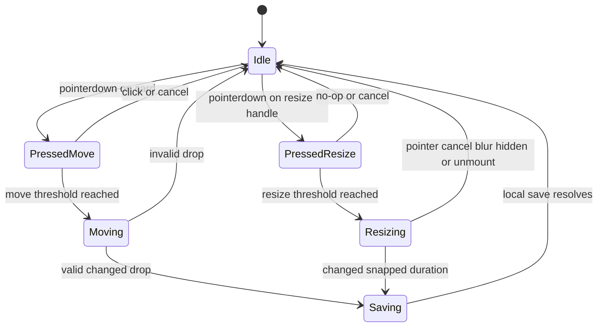

# Calendar Duration Resize - Plan

## Goal Capsule

- **Objective:** Uživatel může v týdenním kalendáři změnit délku časovaného úkolu nebo schůzky tažením spodní hrany a výsledek zůstane vizuálně i datově konzistentní.
- **Means:** Rozšířit stávající pointer lifecycle o samostatný resize režim a převést jeho finální polohu na sémantický schedule patch (KTD1-KTD4).
- **Authority:** Produktové požadavky R1-R8 mají přednost před technickými rozhodnutími. Implementace nesmí změnit význam času tasku, meetingu ani stávající move drag.
- **Execution profile:** Standardní UI změna s test-first pokrytím časové matematiky a browser ověřením pointer lifecycle.
- **Stop conditions:** Zastavit, pokud resize vyžaduje změnu Dexie schématu, Google API kontraktu nebo významu `duration`, `totalDuration` či `startTime` mimo tento plán.
- **Tail ownership:** LFG vlastní zjednodušení, review, browser QA, commit, PR a CI.

---

## Product Contract

### Summary

Týdenní kalendář nabídne viditelný spodní úchyt pro změnu délky nedokončených časovaných lokálních úkolů a schůzek. Tažení zobrazí průběžnou délku; puštění po skutečné změně uloží právě jeden snapnutý výsledek, zatímco bezezměnové gesto neuloží nic.

### Problem Frame

Kalendář nyní umožňuje položky přesouvat mezi dny a časy, ale délku lze upravit jen přes editor. Přímé prodloužení nebo zkrácení bloku proto vyžaduje přerušit plánování a zadat dobu ručně.

Úkol a schůzka mají rozdílnou časovou sémantiku. Schůzka ukládá v `startTime` začátek bloku, zatímco úkol ukládá jeho konec. Resize musí zachovat vizuální horní hranu obou typů a uložit správná doménová pole.

### Requirements

#### Gesture and feedback

- R1. Každý nedokončený časovaný lokální úkol a meeting má viditelný spodní resize úchyt, který je oddělený od otevření detailu a od přesunu celé položky.
- R2. Tažení úchytu mění délku v 15minutových krocích a průběžný preview ukazuje stejný blok, který by se uložil při aktuální poloze ukazatele.
- R3. Resize mění pouze spodní hranu aktuálního časovaného bloku a neaktivuje změnu dne, lane ani týdne.
- R4. `pointerup` uloží právě jeden změněný výsledek; no-op, `pointercancel`, blur, skrytí dokumentu a unmount neukládají nic.

#### Time and persistence semantics

- R5. Resize meetingu zachová jeho `startTime` a změní `duration` tak, aby odpovídala nové spodní hraně.
- R6. Resize úkolu zachová jeho vizuální začátek a změní `duration` i `startTime`, protože `startTime` úkolu představuje konec bloku.
- R7. Resize zachová `date`, `deadline`, `isAllDay`, `totalDuration`, `progress`, `status` a `type` s výjimkou pole `startTime` vyžadovaného R6.
- R8. Lokální změna projde stávající command hranicí. Pokud existující integrace vzdálený update skutečně spustí, synchronizovaný meeting po lokálním uložení použije současný Google Calendar update a jeho současné varování při vzdáleném selhání; chování při nedostupné autentizaci se touto změnou nemění.

### Acceptance Examples

- AE1. **Covers R1-R4:** Tažení spodní hrany časovaného meetingu z 10:00-11:00 na 11:30 ukáže 90minutový preview a po puštění zavolá save jednou; kliknutí nebo drag těla karty dál používá původní chování.
- AE2. **Covers R2, R5:** Meeting začínající v 10:00 při puštění mezi 11:07 a 11:22 skončí na nejbližším 15minutovém kroku, zachová `startTime` 10:00 a uloží odpovídající `duration`.
- AE3. **Covers R2, R6:** Dvouhodinový úkol končící v 11:00 má vizuální začátek v 09:00; prodloužení do 12:00 zachová horní hranu v 09:00 a uloží `duration` 180 a `startTime` 12:00.
- AE4. **Covers R3-R4:** Tažení resize úchytu k levé nebo pravé hraně kalendáře nepřepne týden; rychlý `pointerup` před dalším animation frame použije souřadnici z události a uloží správnou délku.
- AE5. **Covers R4, R7-R8:** Zrušené a bezezměnové gesto nemění Dexie ani Google; úspěšný resize meetingu s `googleEventId` zachová lokální změnu i při následném selhání vzdálené synchronizace.

### Scope Boundaries

- V rozsahu je resize spodní hrany v týdenním kalendáři pro časované lokální úkoly a meetingy.
- V rozsahu je trvale viditelný pointer úchyt s dostatečným hit targetem. Stávající editor zůstává klávesnicovou cestou pro změnu délky.
- Mimo rozsah je horní resize, změna dne během resize, resize all-day položek, Google Tasks a změna délky z jiných view.

#### Deferred to Follow-Up Work

- Změna `totalDuration` spolu s remaining `duration` vyžaduje samostatné produktové rozhodnutí o progress sémantice.
- Přímé klávesnicové ovládání resize úchytu je samostatné rozšíření; v této změně zůstává klávesnicovou cestou existující editor délky.
- Vlastní komponentový nebo end-to-end test runner není součástí této změny; pointer capture lifecycle ověří stávající browser pipeline.

---

## Planning Contract

### Key Technical Decisions

- KTD1. **One coordinated pointer state machine.** `WeeklyCalendar` rozliší režim `move` a `resize` v jednom lifecycle. Paralelní globální listenery by dovolily oběma gestům reagovat na stejný pointer.
- KTD2. **Canonical visual interval owns resize math.** Čistý helper odvodí fixní horní hranu přes stejnou task/meeting sémantiku jako `getWeeklyVisualInterval`, poté snapne a omezí novou spodní hranu. Sdílené hranice 07:00-20:00 odpovídají třinácti vykresleným hodinovým řádkům. Tím preview, kolizní interval a uložený patch používají stejný interval.
- KTD3. **Event-time completion.** Průběžné vykreslení se slučuje přes `requestAnimationFrame`, ale terminální výsledek se vždy dopočítá z aktuálního `pointerup`. Tím se zachová oprava stale-pointer race z aktuální větve.
- KTD4. **Existing persistence boundary remains authoritative.** `WeeklySchedulePatch` ponese `duration` a `handleRescheduleTask` zůstane jediným vlastníkem lokálního zápisu a volitelného Google side effectu.

### High-Level Technical Design

### Assumptions

- Minimální délka je 30 minut, protože současná minimální výška 40 px při `ROW_HEIGHT = 80` odpovídá 30 minutám; snap zůstává 15 minut.
- Nejzazší spodní hrana je 20:00, tedy skutečný konec třinácti vykreslených řádků 07:00-20:00. Stejnou exportovanou hranici použije resize i collision layout, aby položky v poslední hodině neměly záporné nebo nulové maximum.
- Chybějící nebo nulová `duration` se při zahájení resize interpretuje stejně jako dnes jako 60 minut.
- Horizontální pohyb se při resize ignoruje a dokončené položky resize úchyt nemají.
- `duration` při resize používá stejný význam zbývající práce jako dnešní FocusEditor. `totalDuration` a `progress` se nemění; pozdější přepočet délky při práci se subtasks zůstává současným chováním a není součástí této změny.

### Sequencing

U1 uzamkne doménovou matematiku a patch kontrakt. U2 nad ní rozšíří pointer lifecycle a UI. U3 ověří perzistenci, browser chování a zachytí trvalé poučení.

### Risks and Dependencies

- **Move/resize kolize:** Resize handle musí zastavit propagaci a založit diskriminovaný režim dřív, než karta zpracuje pointerdown.
- **Task top-edge drift:** Task resize nesmí měnit pouze `duration`; helper musí současně dopočítat nový `startTime` podle R6.
- **Visual minimum mismatch:** Preview, handle a hitbox musí vycházet z téhož 30minutového minima jako renderovaná výška.
- **Stale frame race:** `pointerup` nesmí číst pouze poslední React nebo animation-frame stav.
- **Layout change during gesture:** Změna geometrie vyvolá nové měření a preview přepočet, nikoli automatické zrušení resize.
- **Collision preview:** Během gesta zůstane okolní collision layout stabilní a aktivní blok se vykreslí jako transientní overlay s novou výškou. Po úspěšném uložení se běžný layout přepočítá z perzistentních dat.
- **Save failure:** Neúspěšný lokální save odstraní transientní preview, ponechá původní perzistentní geometrii, vrátí focus na zdrojovou položku a oznámí, že změna nebyla uložena.

### Sources and Research

- `battle-plan/src/components/WeeklyCalendar.tsx` vlastní pointer capture, drag lifecycle, geometry cache, transientní preview, announcement a single-save hranici UI.
- `battle-plan/src/utils/calendarUtils.ts` vlastní 15minutový snap, sémantický schedule patch a no-op kontrolu.
- `battle-plan/src/utils/weeklyCalendarLayout.ts` je autorita pro vizuální interval meetingu a úkolu.
- `battle-plan/src/hooks/useTaskCommands.ts` vlastní lokální Dexie save a následný Google Calendar update.
- `docs/solutions/design-patterns/weekly-task-history-and-rescheduling.md` vyžaduje sémantický patch a právě jeden zápis po dokončení gesta.
- `docs/solutions/design-patterns/responsive-surface-motion-system.md` vyžaduje transientní pointer preview a dostupný primární ovládací prvek.
- `docs/solutions/ui-bugs/weekly-calendar-cross-week-drag-pointer-authority.md` vyžaduje event-time autoritu a cleanup všech capture/frame cest.

---

## Implementation Units

### U1. Pure duration resize semantics

- **Goal:** Zavést čistý, testovaný převod spodní hrany na sémantický patch pro meeting i task.
- **Requirements:** R2, R5-R7; AE2-AE3.
- **Dependencies:** Žádné.
- **Files:** `battle-plan/src/utils/calendarUtils.ts`, `battle-plan/src/utils/calendarUtils.test.ts`, `battle-plan/src/utils/weeklyCalendarLayout.ts`, `battle-plan/src/utils/weeklyCalendarLayout.test.ts`.
- **Approach:** Rozšířit schedule patch o volitelné `duration`. Přidat resize transformaci, která snapshotne fixní vizuální začátek, snapne nový konec, aplikuje 30minutové minimum a sdílené maximum 20:00 a vytvoří typově správná pole. Move patch musí délku zachovat a no-op kontrola musí rozlišit změnu délky. Collision layout převezme stejné denní hranice.
- **Execution note:** Implementovat doménovou matematiku test-first před úpravou komponenty.
- **Patterns to follow:** `getWeeklyVisualInterval`, `snapWeeklyMinute`, `getWeeklyReschedulePatch`, `isWeeklyScheduleNoop` a KTD2.
- **Test scenarios:**
  - Meeting 10:00/60 při novém konci 11:30 vrátí `duration` 90 a zachová `startTime` 10:00.
  - Task končící v 11:00 s délkou 120 při novém konci 12:00 vrátí `duration` 180, `startTime` 12:00 a stejný vizuální top 09:00.
  - Pohyb mezi snap body zaokrouhlí konec na nejbližší čtvrthodinu; pokus o kratší blok skončí na 30 minutách a pokus za 20:00 skončí ve 20:00.
  - Položka v poslední vykreslené hodině má kladné maximum a hraniční interval 19:00-20:00 zůstane v layoutu validní.
  - Chybějící nebo nulová délka použije 60minutový vstupní fallback.
  - Resize se stejným snapnutým koncem je no-op; změna samotné délky no-op není.
  - Existující move testy zachovají původní délku a task/meeting význam času.
  - Výsledný task i meeting patch po průchodu layout helperem vytvoří očekávaný vizuální interval a collision end.
- **Verification:** Čisté testy dokazují AE2-AE3 a žádný patch nemění `totalDuration`, `progress`, status ani typ.

### U2. Coordinated resize interaction and preview

- **Goal:** Přidat spodní resize úchyt, live preview a bezpečný pointer lifecycle bez regrese move dragu.
- **Requirements:** R1-R4; AE1, AE4.
- **Dependencies:** U1.
- **Files:** `battle-plan/src/components/WeeklyCalendar.tsx`, `battle-plan/src/utils/calendarUtils.ts`, `battle-plan/src/utils/calendarUtils.test.ts`.
- **Approach:** Rozšířit stávající drag state o diskriminovaný režim. Resize handle bude pointer ovládací plocha oddělená od hlavního card tlačítka, zastaví propagaci a převezme capture. Resize větev ignoruje horizontální hit testing a edge dwell, zachová okolní collision layout, aktualizuje pouze overlay aktivního bloku a při terminálních cestách používá sdílený idempotentní cleanup.
- **Patterns to follow:** Stávající předání capture na stabilní `calendarRef`, imperativní animation-frame feedback, `busyTask`, live region a KTD1-KTD3.
- **Test scenarios:**
  - Handle se vykreslí pro nedokončený timed lokální task a meeting, ale ne pro dokončenou položku, all-day položku ani Google Task.
  - Pointerdown na handle neotevře FocusEditor, nevytvoří move ghost a drag těla karty nadále přesouvá položku.
  - Překročení prahu zahájí resize; průběžný preview mění pouze výšku, zachová horní hranu a oznámí novou délku nebo konec jen při změně snap hodnoty.
  - Rychlý `pointerup` před dalším frame uloží výsledek z event-time souřadnice právě jednou.
  - No-op, `pointercancel`, blur, hidden a unmount odstraní preview, uvolní capture a nevolají save.
  - Resize u obou vodorovných hran neaktivuje dwell ani přechod týdne; scroll nebo změna geometrie přepočítá preview bez zrušení session.
  - Busy položka odmítne druhé gesto; handle má dostatečný hit target bez zakrytí hlavního click/drag povrchu.
  - Zamítnutý nebo chybový lokální save odstraní preview, obnoví původní geometrii a focus a oznámí neuloženou změnu.
- **Verification:** Browser evidence potvrzuje AE1 a AE4 na reálném pointer capture lifecycle a původní click/move/cross-week scénáře zůstávají funkční.

### U3. Persistence and integration regression coverage

- **Goal:** Ověřit, že resize prochází stávající lokální a Google save hranicí právě jednou bez rozšíření command vrstvy nebo testovací infrastruktury.
- **Requirements:** R4, R7-R8; AE5.
- **Dependencies:** U1-U2.
- **Files:** `battle-plan/src/hooks/useTaskCommands.ts` pouze pokud typy odhalí nutnou propustnost patche; existující testy služby pouze pokud současný Google request builder postrádá pokrytí výpočtu konce.
- **Approach:** Propustit rozšířený schedule patch beze změny přes stávající command. Nezavádět nový command jen kvůli test seam: právě jeden save dokáže pointer lifecycle a čistá no-op matematika, zatímco existující service testy zůstávají autoritou pro skládání Google end z `duration`. Nový solution dokument vznikne jen tehdy, pokud implementace odhalí nové netriviální poučení, které současné learnings nepokrývají.
- **Patterns to follow:** Lokální-first save a non-blocking Google warning v `handleRescheduleTask`; KTD4.
- **Test scenarios:**
  - Browser instrumentace potvrdí jeden command call pro změněný resize a nula callů pro invalidní, no-op nebo zrušené gesto.
  - Meeting s `googleEventId` nadále používá stávající service cestu, která odvozuje konec z aktuální `duration`.
  - Selhání lokálního save obnoví UI; pokus o Google update po úspěšném lokálním save zachová současné varování při remote chybě.
  - Task resize nemění `totalDuration` ani `progress` a zůstává kompatibilní se současným pozdějším přepočtem při změně subtasku.
- **Verification:** AE5 prokáže browser QA společně s existujícími service testy; nový integrační harness není podmínkou této změny.

---

## Verification Contract

| Gate | Scope | Done signal |
| --- | --- | --- |
| `npm test` z `battle-plan/` | Resize matematika, layout regrese a existující Google integrace | Všechny testy projdou včetně meeting/task time semantics, no-op a boundary případů |
| `npm run lint` z `battle-plan/` | React hooks, pointer state a JSX | Bez lint chyb |
| `npm run build` z `battle-plan/` | TypeScript, Vite, Tailwind a PWA bundle | Produkční build projde |
| `ce-test-browser mode:pipeline` | Resize handle, preview, cancel, click-versus-move, event-time release a edge isolation | R1-R8 a AE1-AE5 jsou ověřené na reálném DOM |
| Diff review | Scope a persistence | Bez schema migrace, nové dependency nebo změny `totalDuration`/progress sémantiky |

---

## Definition of Done

- Časované lokální tasky a meetingy lze myší prodloužit i zkrátit přes spodní úchyt.
- Meeting zachová začátek a task zachová vizuální horní hranu podle R5-R6.
- Preview a finální patch sdílejí snap, minimum a maximum a neukládají průběžné pixely.
- Move drag, cross-week drag, click otevření a all-day/Google Task omezení zůstávají beze změny.
- Všechny terminal pointer cesty uklidí capture, frame a transientní UI; pouze změněný finální výsledek se uloží právě jednou.
- Lokální save a volitelný Google Calendar update zachovají existující autoritu a chybové chování.
- `npm test`, `npm run lint`, `npm run build` a browser pipeline projdou.
- Z diffu jsou odstraněné opuštěné experimenty a mrtvý kód.
- Pokud implementace odhalí nové netriviální poučení mimo současné solution dokumenty, je zachycené přes `ce-compound`.
