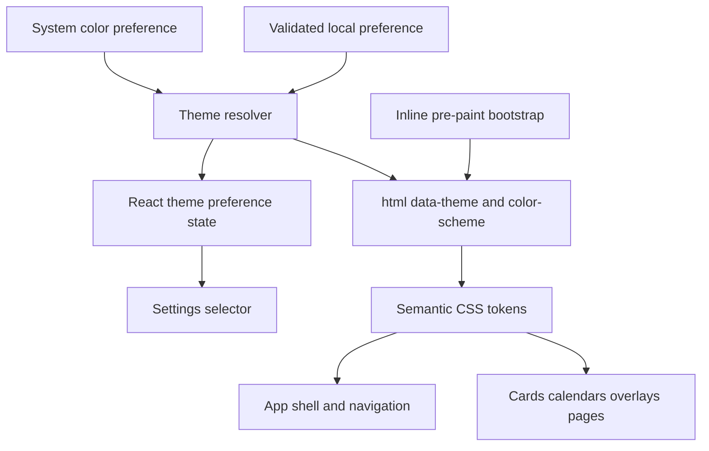
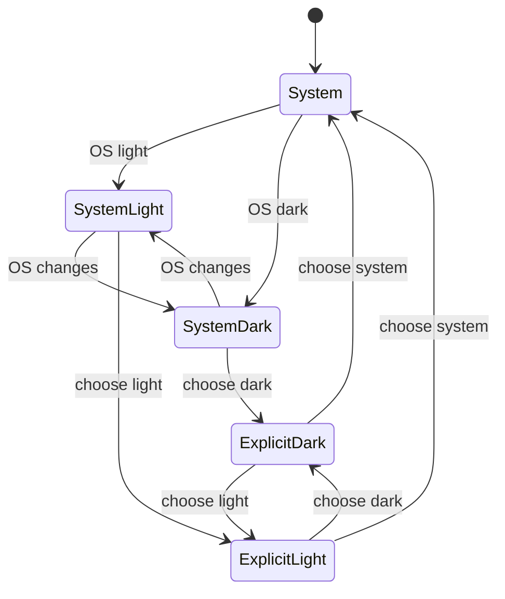
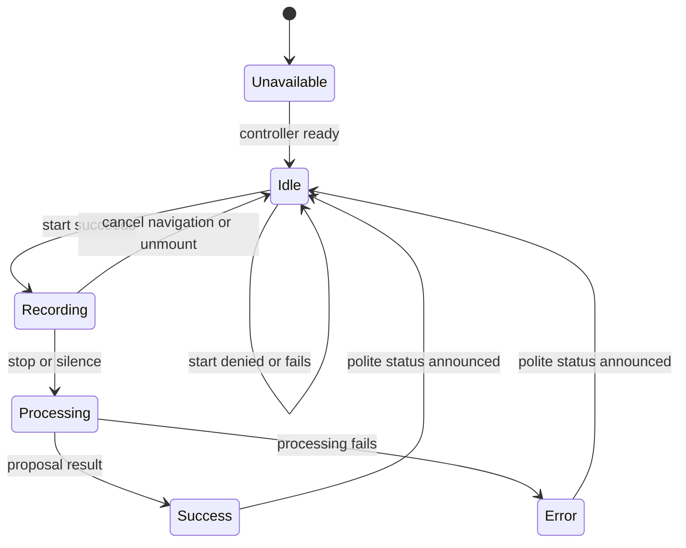

# Ergonomic Theme System - Plan

## Goal Capsule

- **Objective:** BattlePlan zůstane čitelný, ovladatelný a vizuálně konzistentní v úzkém i širokém rozhraní, při zvětšení, v tmavém i světlém motivu a při omezeném pohybu.
- **Means:** Zavést sémantické barevné tokeny, třípolohovou preferenci motivu, cílené motion/status kontrakty a opravit auditované ergonomické mezery (KTD2-KTD6).
- **Authority:** Produktové R-ID mají přednost před technickými KTD. Existující datové, sync, kalendářní drag a voice lifecycle kontrakty se nesmějí změnit.
- **Execution profile:** Cross-cutting UI změna s čistými testy pro preference a s browser-first ověřením vzhledu, focusu, reflow a motion.
- **Stop conditions:** Zastavit při nutnosti změnit Dexie schéma, Google API/sync kontrakty, význam task/meeting/WorkLog dat nebo voice ownership.
- **Tail ownership:** LFG vlastní implementaci, zjednodušení, code review, browser QA, commit, PR a CI.

---

## Product Contract

### Summary

BattlePlan dostane jednotný ergonomický základ pro tmavý a světlý motiv. Uživatel zvolí motiv podle systému, světlý nebo tmavý. Stejný základ opraví auditované problémy s kontrastem, zoomem, mobilní navigací a stavovou zpětnou vazbou při práci.

### Problem Frame

Aktuální aplikace je pevně tmavá a 24 uživatelských TSX povrchů používá konkrétní `slate` a `white` utility. Některé běžné texty mají pouze přibližně 2.66:1 až 4.24:1 kontrast. Jednoduché přepnutí pozadí by proto vytvořilo smíšené a místy nečitelné rozhraní.

Mobilní audit ukázal oříznutou hlavní navigaci, velmi tlumená metadata, duplicitní dialogový nadpis a neúplnou stavovou sémantiku globálního mikrofonu. Dokument navíc blokuje uživatelský zoom. Motion foundation a složité kalendářní/overlay lifecycle jsou už zavedené a mají se zpřesnit, ne přepsat.

### Requirements

**Theme a barvy**

- R1. Uživatel může zvolit preferenci `system`, `light` nebo `dark`; výchozí hodnota je `system`.
- R2. Aktivní motiv se aplikuje před prvním paintem a při reloadu nevznikne viditelný přechod mezi nesprávným a správným motivem.
- R3. Změna systémového motivu za běhu aktualizuje aplikaci pouze při preferenci `system`; explicitní volba zůstane stabilní.
- R4. Každý povrch dosažitelný z hlavní navigace používá společné sémantické tokeny pro canvas, surface, text, border, focus, action a status v obou motivech.
- R5. Běžný text splní kontrast 4.5:1 a velký text, významové ikony, focus indikátory a aktivní hranice 3:1 v obou motivech.
- R6. Stav tasku, meetingu, dokončení, urgence, Projectu, záznamu nebo synchronizace není předán pouze barvou.

**Ergonomie a přístupnost**

- R7. Dokument umožní browser zoom alespoň 200 % bez ztráty ovládacích prvků nebo nechtěného dvourozměrného scrollu.
- R8. Mobilní navigační rail zpřístupní všechny sekce, ukáže overflow affordance a udrží aktivní nebo focusovanou položku plně v pohledu.
- R9. Primární mobilní akce zachovají 44×44 CSS px cíle; všechny interaktivní prvky splní alespoň WCAG 2.2 minimum 24×24 px nebo odpovídající spacing výjimku.
- R10. Dialog Settings má jeden přístupný nadpis a theme control jasně komunikuje okamžité uložení volby.

**Pracovní stavy a motion**

- R11. Globální mikrofon rozlišuje `unavailable`, `idle`, `recording` a `processing` pomocí viditelného stavu, dostupného názvu a konzistentní busy/status sémantiky.
- R12. Stavové změny průběhu, dokončení a chyby mají textový nebo ARIA ekvivalent; spinner, pulse, glow ani barva nejsou jediným signálem.
- R13. Dotčené povrchy animují pouze potřebné vlastnosti a nepoužívají `transition-all`.
- R14. `prefers-reduced-motion` odstraní pulsy, spiny a pohybové transformace, ale zachová okamžitý focus, hover, barvu a textovou zpětnou vazbu.
- R15. Theme, layout a status změny nesmějí resetovat view, scroll, otevřený overlay, drag, recording ani doménová data.

### Key Decisions

- **Oddělená pracovní větev.** Změny vzniknou mimo `main`, aby stávající produkční stav zůstal nedotčený. Governs R1-R15.
- **Kompletní uživatelsky dosažitelný motiv.** Light režim pokryje všechny NAV-reachable povrchy; částečný preview by uživateli poskytl nekonzistentní produkt. Governs R4-R6.
- **Okamžitá lokální preference.** Volba motivu se uloží ihned a zavření Settings ji nevrací; odpovídá živému chování velikosti písma a požadavku na reload bez FOUC. Governs R1-R3, R10.

### Acceptance Examples

- AE1. **Covers R1-R3:** Bez uložené preference OS light/dark určí první paint; explicitní opačná volba přetrvá reload i pozdější změnu OS.
- AE2. **Covers R4-R6:** Plan, Week, Tasks, Meetings, WorkLogs, Ideas, Suggestions, Diagnostics a jejich overlaye jsou v obou motivech souvislé a jejich text/status/focus splní kontrastní hranice.
- AE3. **Covers R7-R10:** Při 320 px, 200% browser zoomu a největším app font scale jsou všechny navigační položky a Settings controls dosažitelné bez page-level horizontálního overflow.
- AE4. **Covers R11-R12:** Mikrofon během načítání controlleru, nahrávání a zpracování mění accessible name a status; WorkLogs nikdy nespadne do obecného recorderu.
- AE5. **Covers R13-R15:** Reduced-motion odstraní pulse/spin/travel, ale focus, pracovní stav, overlay lifecycle a weekly drag zůstávají srozumitelné a funkční.

### Scope Boundaries

- V rozsahu jsou shell, všechny položky hlavní navigace, sdílené overlaye, karty, kalendáře, WorkLogs, Suggestions, Diagnostics, Settings a PWA/browser chrome barvy.
- V rozsahu je odstranění `transition-all` v souborech dotčených touto změnou a oprava zjištěných accessible names/heading/state problémů.
- Mimo rozsah jsou změny Dexie schématu, Drive/Google kontraktů, doménové perzistence, kalendářní časové sémantiky a voice processing pipeline.
- Mimo rozsah jsou nové animation/theme dependency, rebranding, nový layout navigace a samostatné manifesty pro každý explicitní motiv.

### Deferred to Follow-Up Work

- Přehodnotit minimální hodnotu app font scale 12 px a migraci již uložených hodnot 12-13 px.
- Přidat trvalý DOM/E2E accessibility runner pouze tehdy, pokud browser QA prokáže, že současný čistý Node runner nestačí.

---

## Planning Contract

### Key Technical Decisions

- KTD1. **Isolated branch delivery.** (session-settled: user-directed — chosen over editing main directly: the current main must remain safe and unchanged) Veškeré commity, push a PR vycházejí z `codex/design-ergonomics-theme-audit`.
- KTD2. **One synchronous preference authority.** `localStorage` je jediný autoritativní zdroj theme preference, protože async Dexie nemůže splnit R2. Neplatná, odstraněná nebo nepřístupná hodnota bezpečně znamená `system`.
- KTD3. **Tri-state preference and two-state rendering.** UI pracuje s `system | light | dark`, zatímco `<html data-theme>` a CSS používají pouze resolved `light | dark`. System změny a cross-tab `storage` event aktualizují stejný resolver.
- KTD4. **Semantic tokens before surface migration.** Sémantické CSS proměnné vlastní canvas, surface, text, border, focus, action a status barvy. Konkrétní Tailwind palette utility zůstanou pouze tam, kde nesou doménový akcent ověřený v obou motivech.
- KTD5. **Status mapping stays presentation-only.** Dostupný název, busy flag a status text globálního mikrofonu se odvodí z existujícího controller/lifecycle stavu bez změny recorder ownership nebo domain callbacks.
- KTD6. **Preserve mature interaction machinery.** `MotionConfig`, `OverlaySurface` a `WeeklyCalendar` drag/week lifecycle se nemění strukturálně. Audit upraví tokeny a explicitní transition properties kolem nich.

### High-Level Technical Design

### Assumptions

- Theme preference je zařízení/origin-local a nesynchronizuje se přes Drive.
- `system` se ukládá odstraněním explicitního klíče; React a inline bootstrap sdílejí stejnou validační matici.
- Installed-PWA splash používá jeden neutrální tmavý manifest fallback; dokumentový `theme-color` a `color-scheme` reagují na resolved motiv.
- Mobilní navigace zůstane horizontální rail s overflow affordance a automatickým odhalením aktivní/focusované položky.
- Kritická metadata a pracovní stavy dostanou čitelný minimální styl, ale rozsah font slideru se v tomto PR nemění.

### Sequencing

U1 nejdřív vytvoří preference a pre-paint kontrakt. U2 na něm postaví tokeny a vertikální řez shellu. U6-U8 migrují doménové povrchy v samostatných dávkách. U3 a U4 dodají ergonomii a pracovní stavy hned po dostupnosti jejich tokenových hranic. U5 uzavře změnu browser QA a kontrastní/motion regresí.

### System-Wide Impact

- Root dokument nyní vlastní resolved motiv, nativní `color-scheme` a aktuální browser theme color.
- Všechny lazy view musí zdědit sémantické tokeny; žádná stránka nesmí při přepnutí motivu zůstat hard-coded dark.
- Theme změna je pouze prezentační. Nemění Dexie, sync, task/meeting/WorkLog význam ani Agent Collaboration Protocol.
- StrictMode nesmí vytvořit duplicitní media/storage listenery. Subscription musí mít symetrický cleanup.

### Risks and Mitigations

- **Smíšené surface po mechanické migraci:** Pokrýt každý soubor z inventáře hard-coded barev a ověřit všechny NAV routes v obou motivech.
- **FOUC nebo mismatch prvního renderu:** Sdílet přesnou validační a resolution logiku mezi inline bootstrap očekáváním a čistými parity testy.
- **Nečitelný doménový akcent:** Testovat computed composite kontrast v reálném povrchu, ne pouze samotný hex token.
- **Regrese drag/overlay/voice lifecycle:** Omezit změny na presentation boundary a znovu spustit existující unit i browser scénáře.
- **Příliš široký diff:** Rozdělit migraci do U2 a U6-U8; každá dávka musí projít mechanickým inventářem a oběma motivy před pokračováním.

### Sources and Research

- `docs/audits/design-ergonomics-theme-2026-09-04/README.md` obsahuje čerstvé screenshoty a auditní zjištění.
- `docs/solutions/design-patterns/responsive-surface-motion-system.md` vlastní existující surface, motion, reduced-motion a overlay pravidla.
- `docs/solutions/ui-bugs/weekly-calendar-cross-week-drag-pointer-authority.md` chrání event-time drag rozhodnutí a week-remount lifecycle.
- `docs/solutions/ui-bugs/worklog-voice-proposal-cancel-reopen.md` chrání Voice Proposal Lifecycle a WorkLogs controller ownership.
- [Tailwind CSS dark mode](https://tailwindcss.com/docs/dark-mode) doporučuje selector-driven manual/system theme a pre-paint inicializaci.
- [MDN color-scheme](https://developer.mozilla.org/en-US/docs/Web/CSS/color-scheme), [WCAG 2.2 contrast minimum](https://www.w3.org/WAI/WCAG22/Understanding/contrast-minimum), [WCAG status messages](https://www.w3.org/WAI/WCAG22/Understanding/status-messages) a [Motion accessibility](https://motion.dev/docs/react-accessibility) určují load-bearing přístupnostní hranice.

---

## Implementation Units

### U1. Theme preference and pre-paint runtime

- **Goal:** Zavést bezpečnou třípolohovou preferenci a shodný motiv před prvním React renderem.
- **Requirements:** R1-R3, R15; AE1.
- **Dependencies:** Žádné.
- **Files:** `battle-plan/index.html`, `battle-plan/src/utils/themePreference.ts`, `battle-plan/src/utils/themePreference.test.ts`, `battle-plan/src/hooks/useThemePreference.ts`, `battle-plan/src/App.tsx`, `battle-plan/vite.config.ts`.
- **Approach:** Přidat čistý validátor/resolver, synchronní inline bootstrap, media/storage subscription s cleanupem a dokumentovou aktualizaci `data-theme`, `color-scheme` a `theme-color`. Theme state zůstane mimo Dexie a doménové services podle KTD2-KTD3.
- **Execution note:** Nejprve přidat čisté testy preference/resolution matice a parity očekávání bootstrapu.
- **Patterns to follow:** Stávající `uiScale` preference jen jako UX precedent; subscription lifecycle podle React StrictMode kontraktu.
- **Test scenarios:**
  - Chybějící, neplatná a storage-denied preference vrátí `system` a resolved OS motiv.
  - Explicitní `light` nebo `dark` přebije opačný systémový motiv.
  - Media change změní resolved motiv pouze při `system`.
  - Storage event s validní hodnotou, odstraněním nebo neplatnou hodnotou se bezpečně promítne mezi taby.
  - Covers AE1. Hard reload s každou kombinací preference a OS nastaví správný root atribut před React mountem.
- **Verification:** První a první React-renderovaný frame mají shodný motiv, listenery se v StrictMode neduplikují a žádná theme volba nemění databázi.

### U2. Semantic token contract and shared shell migration

- **Goal:** Vytvořit jediný barevný kontrakt a prokázat jej na shellu a sdílených primitives.
- **Requirements:** R4-R6, R9; AE2.
- **Dependencies:** U1.
- **Files:** `battle-plan/src/index.css`, `battle-plan/src/App.tsx`, `battle-plan/src/components/Sidebar.tsx`, `battle-plan/src/components/SettingsModal.tsx`, `battle-plan/src/components/OnboardingCard.tsx`, `battle-plan/src/components/PageErrorBoundary.tsx`, `battle-plan/src/components/AnuSelfDescription.tsx`, `battle-plan/src/components/ui/OverlaySurface.tsx`, `battle-plan/src/components/syncIcon.tsx`, `battle-plan/src/utils/syncVisualState.test.ts`, `battle-plan/scripts/check-theme-contract.mjs`, `battle-plan/package.json`.
- **Approach:** CSS custom properties v `index.css` jsou jediný zdroj pravdy. Pokryjí canvas, elevated/subtle surface, overlay/backdrop, primary/muted/disabled text, border/divider, control/input, hover/pressed/selected, focus, icon, scrollbar a success/warning/danger/info kompozity. Checker ověří úplnost obou motivů, zakázané dark-only utility, duplicitní raw hodnoty a explicitně odůvodněný allowlist doménových akcentů podle KTD4.
- **Execution note:** Nejdřív dokončit vertikální řez shell + Settings + overlay a oba motivy; teprve potom pustit doménové dávky U6-U8.
- **Patterns to follow:** `surface-card`, `surface-action`, `surface-focus` a accent precedence z `taskListPresentation.ts`.
- **Test scenarios:**
  - Checker potvrdí úplnou dvojici light/dark hodnot pro všechny sémantické role a odmítne neodůvodněnou raw color alias.
  - Shell, Settings, overlay a sync indikátory nemají hard-coded dark ostrov v žádném motive.
  - Opaque token pairs splní 4.5:1 pro běžný text a 3:1 pro non-text/focus; translucent kompozity přebírá browser gate v U5.
- **Verification:** Mechanický theme contract gate a shell screenshoty projdou před U6-U8; nový component-specific alias existuje jen pro zdokumentovanou sémantickou roli.

### U6. Planner and task surface migration

- **Goal:** Převést plánovací, task, Ideas a calendar povrchy na společný theme kontrakt bez změny jejich interakční sémantiky.
- **Requirements:** R4-R6, R13-R15; AE2, AE5.
- **Dependencies:** U2.
- **Files:** `battle-plan/src/components/TaskCard.tsx`, `battle-plan/src/components/WeeklyCalendar.tsx`, `battle-plan/src/components/FocusEditor.tsx`, `battle-plan/src/components/SlashCommandPalette.tsx`, `battle-plan/src/components/ui/MonthDatePicker.tsx`, `battle-plan/src/utils/taskListPresentation.ts`, `battle-plan/src/utils/taskListPresentation.test.ts`, `battle-plan/src/utils/calendarUtils.ts`, `battle-plan/src/utils/calendarUtils.test.ts`.
- **Approach:** Nahradit konkrétní neutral palette za tokeny a ponechat pouze ověřené doménové akcenty. Class-producing utility musí vracet sémantické role nebo projít allowlistem; weekly drag, collision, week spring a editor lifecycle zůstávají pod KTD6.
- **Execution note:** Po každém planner povrchu spustit mechanický checker a smoke obou motivů před dalším souborem.
- **Patterns to follow:** Tone precedence z `taskListPresentation.ts` a drag authority z `weekly-calendar-cross-week-drag-pointer-authority.md`.
- **Test scenarios:**
  - Task, meeting, completed a over-capacity mapping zachová precedence a dostane čitelný text/ikonu v obou motivech.
  - Calendar all-day, timed, collision disclosure, drag ghost a pending state zůstanou vizuálně oddělené v light/dark.
  - Existing click, same-week/cross-week drag, no-op, cancel a keyboard reschedule testy zůstanou zelené.
  - Checker nenajde nový raw neutral alias ani neallowlistovanou dark-only utility v dávce U6.
- **Verification:** Planner route, Tasks, Meetings, Ideas a jejich overlaye projdou light/dark smoke bez změny save, focus nebo drag kontraktu; theme checker odmítne `transition-all` v celé změněné surface sadě.

### U7. Suggestions and diagnostics surface migration

- **Goal:** Převést Suggestions a Diagnostics na stejné surface, text, control a status role.
- **Requirements:** R4-R6, R12-R15; AE2, AE5.
- **Dependencies:** U2.
- **Files:** `battle-plan/src/components/SuggestionCard.tsx`, `battle-plan/src/pages/SuggestionsPage.tsx`, `battle-plan/src/pages/DiagnosticsPage.tsx`.
- **Approach:** Migrovat inline fragments, badges, filters, diagnostics rows a empty/loading/error states bez změny jejich callbacků nebo sync významu.
- **Execution note:** Ověřit otevřený inline fragment i prázdný a error stav v obou motivech.
- **Patterns to follow:** Shared surface/motion contract a `syncVisualState.ts`.
- **Test scenarios:**
  - Suggestion card open/close/defer/reply stavy zachovají textovou hierarchii a explicitní motion properties.
  - Diagnostics success/warning/error řádky používají sémantický text/ikonu vedle barvy.
  - Checker nenajde nový raw neutral alias ani neallowlistovanou dark-only utility v dávce U7.
- **Verification:** Suggestions a Diagnostics projdou oba motivy bez smíšených surface nebo regresí inline layoutu; theme checker odmítne `transition-all` v celé změněné surface sadě.

### U8. WorkLogs surface migration

- **Goal:** Převést WorkLogs views, forms a project controls na theme kontrakt při zachování Project identity a Voice Proposal Lifecycle.
- **Requirements:** R4-R6, R11-R15; AE2, AE4-AE5.
- **Dependencies:** U2.
- **Files:** `battle-plan/src/pages/WorkLogsPage.tsx`, `battle-plan/src/components/worklogs/ProjectManager.tsx`, `battle-plan/src/components/worklogs/ProjectPicker.tsx`, `battle-plan/src/components/worklogs/WorkLogCalendar.tsx`, `battle-plan/src/components/worklogs/WorkLogCard.tsx`, `battle-plan/src/components/worklogs/WorkLogForm.tsx`, `battle-plan/src/components/worklogs/WorkLogTable.tsx`, `battle-plan/src/components/worklogs/WorkLogVoiceBar.tsx`, `battle-plan/src/components/worklogs/WorkLogVoiceConfirm.tsx`, `battle-plan/src/utils/projectColors.ts`.
- **Approach:** Migrovat cards/calendar/table/form/dialog povrchy a zachovat Project barvu jako doménovou identitu s čitelným textovým kontextem. Voice UI používá KTD5 a nesmí obejít page-local controller.
- **Execution note:** Nejprve zachytit běžný WorkLog card view, potom form/project/voice overlay a nakonec calendar/table.
- **Patterns to follow:** `worklog-project-catalog-management.md` a `worklog-voice-proposal-cancel-reopen.md`.
- **Test scenarios:**
  - Project barva zůstane stabilní napříč cards/calendar/table a je doprovázena názvem projektu.
  - WorkLog form, project manager a voice confirmation projdou focus/error/busy stavy v obou motivech.
  - Cancel/save/navigation/unmount neobnoví stale voice proposal ani nezmění Project/WorkLog data.
  - Checker nenajde nový raw neutral alias ani neallowlistovanou dark-only utility v dávce U8.
- **Verification:** WorkLogs views a overlaye projdou light/dark smoke, pure WorkLog testy zůstanou zelené a voice lifecycle se nezmění.

### U3. Responsive navigation, zoom and Settings ergonomics

- **Goal:** Opravit auditované umístění prvků a zpřístupnit theme volbu bez změny navigační architektury.
- **Requirements:** R7-R10, R15; AE3.
- **Dependencies:** U1, U2.
- **Files:** `battle-plan/index.html`, `battle-plan/src/App.tsx`, `battle-plan/src/components/SettingsModal.tsx`, `battle-plan/src/index.css`.
- **Approach:** Odstranit blokaci zoomu, přidat overflow affordance a focus/active reveal do mobilního railu, přidat `aria-current` a vložit okamžitě ukládaný theme selector do stávající sekce Vzhled a čitelnost. Dialog má jeden exposed heading.
- **Patterns to follow:** Existující horizontální WeeklyCalendar jako samostatný scroll region a `surface-action` 44px target.
- **Test scenarios:**
  - Covers AE3. Při 320/375/768 px, 200% zoomu a scale 24 lze klávesnicí i pointerem dosáhnout poslední nav položky bez clipped focusu.
  - Aktivní nebo focusovaná nav položka se odhalí, ale rail se neauto-scrolluje na každý render.
  - Theme volba se uloží okamžitě a zůstane po Close, Escape i reloadu.
  - Settings accessibility tree obsahuje právě jeden dialogový nadpis a dostupný popis theme controlu.
- **Verification:** Page-level horizontální overflow nevznikne; intentional nav/calendar scroll regiony zůstanou ovladatelné a vzájemně rozlišitelné.

### U4. Working-state semantics and motion cleanup

- **Goal:** Sjednotit průběžnou zpětnou vazbu a odstranit motion jako jediný nositel významu.
- **Requirements:** R11-R15; AE4-AE5.
- **Dependencies:** U2, U6, U8.
- **Files:** `battle-plan/src/App.tsx`, `battle-plan/src/components/Sidebar.tsx`, `battle-plan/src/components/WeeklyCalendar.tsx`, `battle-plan/src/components/worklogs/WorkLogVoiceBar.tsx`, `battle-plan/src/pages/WorkLogsPage.tsx`, `battle-plan/src/utils/voiceActionPresentation.ts`, `battle-plan/src/utils/voiceActionPresentation.test.ts`, `battle-plan/src/index.css`.
- **Approach:** Zavést presentation-only mapping voice stavu, oddělit voice-specific processing od nesouvisejícího command/sync busy stavu a doplnit accessible name, busy/disabled a polite status text. `success` a `error` se jednorázově oznámí před návratem vizuálního stavu do `idle`, bez přesunu focusu. Při vstupu do WorkLogs se root recording bezpečně ukončí a globální FAB ustoupí page-local `WorkLogVoiceBar`. V dotčených souborech nahradit `transition-all` explicitními vlastnostmi a zajistit statickou reduced-motion variantu podle KTD5-KTD6.
- **Execution note:** Nejprve charakterizovat současné voice ownership a failure cesty; mapping testovat bez DOM.
- **Patterns to follow:** `syncVisualState.ts`, WeeklyCalendar `aria-busy`/live region a Voice Proposal Lifecycle learning.
- **Test scenarios:**
  - Covers AE4. `unavailable`, `idle`, `recording`, `processing`, jednorázový `success` a `error` vrátí správný label, disabled/busy flag a status message.
  - Permission/start failure nepřepne UI do falešného recording stavu.
  - WorkLogs controller loading zůstane fail-closed a nikdy nepoužije obecný recorder.
  - Covers AE5. Reduced-motion vypne pulse/spin/travel a ponechá textový stav, focus a okamžitou barvu.
  - Statická kontrola nenajde `transition-all` v souborech změněných touto implementací.
- **Verification:** Screen reader dostane srozumitelný průběh a dokončení bez přesunu focusu; existující overlay, drag a voice lifecycle zůstane funkční.

### U5. Browser verification and durable learning

- **Goal:** Prokázat ergonomický a theme výsledek na reálném DOM a zachytit nový kontrakt pro budoucí změny.
- **Requirements:** R1-R15; AE1-AE5.
- **Dependencies:** U1-U4, U6-U8.
- **Files:** `docs/audits/design-ergonomics-theme-2026-09-04/README.md`, `docs/audits/design-ergonomics-theme-2026-09-04/screenshots/`, `docs/solutions/design-patterns/semantic-theme-ergonomics.md`.
- **Approach:** Projít tři omezené matice: first-paint preference/OS na jedné route; všechny NAV routes a overlaye v light/dark na reprezentativním mobile/desktop; zoom/keyboard/reduced-motion na rizikových flow. Do auditu přidat computed composite výsledky pro default/hover/focus/disabled a translucent overlays, after screenshoty a trvalý theme lifecycle vzor.
- **Test scenarios:**
  - Covers AE1-AE2. First paint, route a overlay matice projde pro OS light/dark, explicitní light/dark a system změnu za běhu.
  - Covers AE3. Mobile rail, Settings a 200% zoom projdou bez ztráty akce nebo clipped focusu.
  - Covers AE4-AE5. Voice working stavy, reduced motion, overlay focus return a weekly pointer/keyboard drag projdou bez regresí.
  - Installed PWA/offline reload zachová koherentní fallback, document theme color a aktualizovaný CSS bundle.
- **Verification:** Audit obsahuje before/after důkazy a jasně odděluje vizuálně potvrzené body od screen-reader/performance limitů.

---

## Verification Contract

| Gate | Scope | Done signal |
| --- | --- | --- |
| `npm test` z `battle-plan/` | Theme preference, voice presentation a existující pure logic | Všechny testy projdou bez změny doménové sémantiky |
| `npm run lint` z `battle-plan/` | React hooks, TypeScript a JSX correctness | Bez lint chyb |
| `npm run check:theme` z `battle-plan/` | Token completeness, surface inventory, allowlist a raw color duplicace | Žádný neodůvodněný dark-only povrch nebo chybějící role |
| `npm run build` z `battle-plan/` | React 19.2.3, Tailwind 4.1.18, Motion 12.27.3 a PWA | Produkční build projde |
| Browser theme matrix | First paint, všechny NAV routes, overlaye a native controls | Žádný FOUC, mixed-theme surface ani mismatch prvního React renderu |
| Browser accessibility matrix | 320/375/768/desktop, 200% zoom, app scale 12/16/24, keyboard | Žádný ztracený control, clipped focus ani nechtěný page overflow |
| Browser semantic smoke | Accessibility tree, keyboard a status pro Settings, mobile nav, floating voice a overlay focus return | Jeden heading, správné names/states a stabilní focus |
| Contrast and motion check | Light/dark computed composites a reduced motion | Text 4.5:1, non-text/focus 3:1 a žádný význam závislý na animaci |
| Regression smoke | Weekly drag/week spring, overlays, WorkLogs voice lifecycle | Existing interaction contracts zůstanou funkční |

---

## Definition of Done

- R1-R15 jsou dohledatelné v U1-U8 a AE1-AE5 mají browser nebo čistý test důkaz.
- `system`, `light` a `dark` fungují bez FOUC; OS live change a cross-tab preference respektují explicitní override.
- Každý NAV-reachable povrch, overlay a karta je v obou motivech souvislá a splní stanovené kontrastní hranice.
- Browser zoom 200 %, app scale a úzký viewport neztratí navigaci, Settings control ani floating mic.
- Globální mic komunikuje unavailable, idle, recording a processing textem/ARIA i vizuálně a zachová WorkLogs ownership.
- Dotčené soubory neobsahují `transition-all`; reduced motion zachová význam bez pulse/spin/travel.
- Mechanický theme checker projde po každé migrační dávce a finální diff nepřidá duplicitní raw barvy nebo neodůvodněné aliases.
- Existující kalendářní, overlay, voice, sync a datové testy projdou bez změny jejich kontraktů.
- `npm test`, `npm run lint`, `npm run build` a browser pipeline projdou.
- Audit obsahuje before/after screenshoty a nový trvalý design pattern.
- Diff neobsahuje opuštěné experimenty, mrtvé compatibility utility ani nesouvisející pnpm artefakty.
