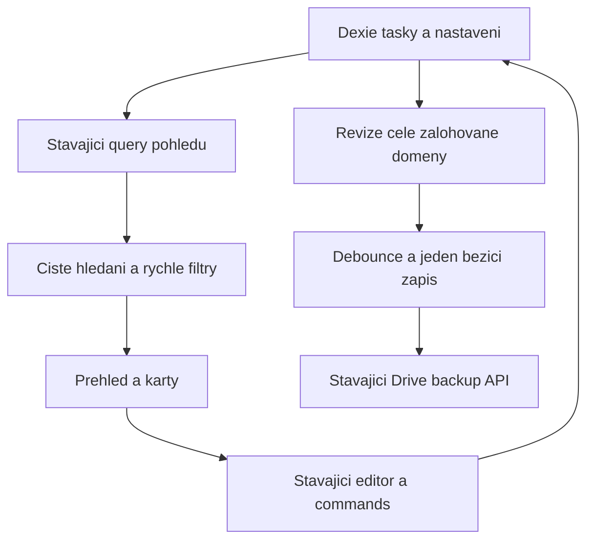
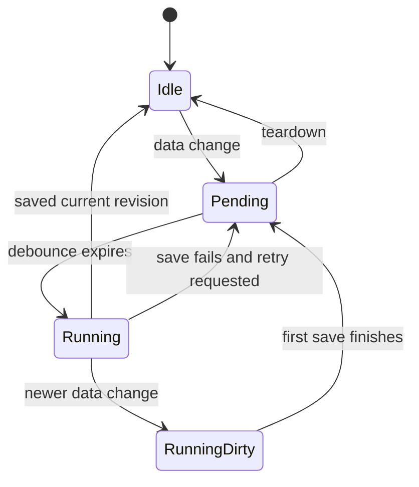

# Planning Experience Uplift - Plan

## Goal Capsule

- **Objective:** Uživatel se rychle zorientuje v práci, snadno najde a vytvoří záznam a může se spolehnout, že úpravy nezmizí při běžném používání.
- **Means:** Přehled a vyhledávání nad stávajícími seznamy, cílené opravy editace a koordinace existujících background operací (KTD1–KTD5).
- **Authority:** Uživatelské zadání a `AGENTS.md`, následně tento Product Contract; `docs/PRODUCT.md` zůstává autoritou pro význam úkolů, termínů, historie a WorkLogs.
- **Execution profile:** Samostatná implementace se třemi oddělenými pracovními proudy, CE kontrolou a principy Ponytail. Finální integraci, ověření a git operace vlastní hlavní implementující agent.
- **Stop conditions:** Neověřená záloha před změnami, nutnost migrace dat nebo změny externího formátu sync dat, anebo prokázané riziko ztráty dat zavedené navrženou změnou.
- **Landing:** Izolovaná pracovní větev, přezkoumatelný diff a obnovitelný výchozí stav. Zveřejnění a finální doručení řídí hlavní agent podle uživatelského oprávnění a pravidel repozitáře.

---

## Product Contract

### Summary

Denní plán nabídne čitelný přehled práce, rychlé filtry a vyhledávání. Jasná akce pro nový záznam odstraní nutnost používat hlas pro každé vytvoření. Cílené opravy zachovají změny z diktování i rozepsaná data editoru a omezí duplicitní práci na pozadí.

### Problem Frame

Současný přehled řadí otevřené položky, ale nenabízí rychlé nalezení konkrétní práce ani oddělení dnešních a prošlých termínů. Silné verzálky a více soupeřících akcentů ztěžují skenování husté pracovní obrazovky. Čtení kódu současně odhalilo ztrácení podúkolů při hlasové aktualizaci, chybný čistý stav rozepsaného editoru a zálohování odvozené od právě zobrazeného seznamu.

### Requirements

**Obnovitelnost a zachování chování**

- R1. Před produkčními změnami musí být uložen a ověřen obnovitelný stav verze 4.3.70 včetně původního git stavu a případných nezacommitovaných změn.
- R2. Zachovat existující záznamy, historii splnění, význam termínů, ruční editaci, týdenní přesouvání, hlasové vstupy a lokální úspěch při selhání volitelného Google side effectu.

**Orientace a ergonomie**

- R3. Denní plán nabídne volby Vše, Dnes, Po termínu a Bez termínu s počty otevřených nesmazaných položek; datum úkolu určuje `deadline`, datum schůzky `date`, hranici dne místní civilní datum.
- R4. Seznamové obrazovky Plán, Úkoly, Schůzky a Myšlenky nabídnou vyhledávání bez rozlišení velikosti písmen a diakritiky v názvu, popisu a názvech podúkolů, s viditelným zrušením filtru a rozlišením prázdného seznamu od nulových výsledků.
- R5. Tlačítko Nový záznam a klávesa N otevřou stávající editor s typem podle aktuální seznamové obrazovky; Ctrl/Cmd+K přesune fokus na vyhledávání a existující / příkazy zůstanou zachované. Nový draft vznikne v DB až po platném explicitním uložení; zrušení nevytvoří prázdný záznam a akce vyžadující uloženou identitu jsou do té doby nedostupné.
- R6. Nové zkratky nesmějí přebírat psaní v editovatelném prvku, kompozici vstupu, upravené klávesové kombinace ani interakci uvnitř otevřeného overlaye; tvorba nesmí obejít vlastnictví aktivního hlasového vstupu.
- R7. Zlepšit hierarchii sidebaru a karet, čitelnost názvů a primárních akcí při zachování funkčního světlého i tmavého režimu, úzkého viewportu, viditelného fokusu a omezení pohybu.

**Spolehlivost a efektivita**

- R8. Hlasová aktualizace uloží dodané podúkoly a odstraní čas při převodu na celodenní záznam; nesouvisející obsah a identita zůstanou zachovány.
- R9. Změna stavu dokončení v editoru nesmí označit jiné neuložené změny jako uložené; při zavření rozepsaného obsahu zůstane ochrana před ztrátou změn.
- R10. Automatická záloha tasků reaguje na změny všech zálohovaných tasků a nastavení bez závislosti na otevřené obrazovce; samotná navigace nevyvolá novou zálohu a současně běží nejvýše jeden zápis této automatické zálohy.
- R11. Překrývající se trigger pollingu agenta nesmí v jedné instanci aplikace souběžně aplikovat tentýž inbox; po chybě musí zůstat další pokus možný.
- R12. Kontext dnešní práce načítá jen příslušné datum a nejvýše deset WorkLogs se zachováním dosavadního pořadí podle ID a výsledného významu.
- R13. Sekundární kalendář a editory se načítají na vyžádání s viditelným pending stavem a lokální obnovou při selhání chunku; rozdělení nesmí změnit vlastnictví hlasového vstupu ani návrat fokusu.
- R14. Při importu tasků z Drive nesmí stejné lokální číselné ID přepsat jiný záznam s odlišným `publicId`; první automatický upload smí následovat až po dokončení úvodního načtení vzdálených dat.

### Acceptance Examples

- AE1. **Covers R3–R4:** Záznam s názvem „Příprava rozpočtu“ lze najít dotazem „priprava“; filtr Po termínu neukáže splněnou položku ani úkol s dnešním termínem.
- AE2. **Covers R5–R6:** N na seznamu Schůzky otevře novou schůzku; stejné písmeno v názvu editoru se normálně napíše a / nadále otevře paletu Anu.
- AE3. **Covers R8:** Diktování doplní existujícímu úkolu podúkol a přepne jej na celodenní; po novém načtení je podúkol přítomný a původní čas odstraněný.
- AE4. **Covers R9:** Uživatel změní název, označí záznam jako splněný a zavře editor; aplikace stále rozpozná neuložený název a nepředstírá jeho uložení.
- AE5. **Covers R10–R11:** Změna tasku v době otevřené obrazovky Práce vyvolá zálohu; souběžný focus a interval během pomalého zpracování inboxu nezaloží duplicitní záznam.

### Scope Boundaries

Součástí jsou úpravy pracovní obrazovky a přímo doložené chyby uvedené v R8–R12. Nezavádí se nová knihovna, databázové schéma, doménový model, sémantické vyhledávání ani redesign týdenních gest.

### Deferred to Follow-Up Work

- Souběžné nahrazení task snapshotů z více zařízení: `taskDriveBackup.save` nahrazuje celý snapshot bez záruky vzdálené atomické merge operace. R14 řeší záměnu lokální identity a pořadí úvodního načtení, nikoli tento zbývající konflikt. Trvalé řešení vyžaduje samostatný návrh vzdáleného souběhu.
- Trvalý outbox pro Google Tasks/Calendar, závislosti evidované v `docs/ROADMAP.md` a přepis agentního protokolu zůstávají samostatnými tématy.

---

## Planning Contract

### Assumptions

Zadání opravňuje k samostatnému výběru nejpřínosnějších úprav a jejich implementaci. Konkrétní vizuální směr, filtry a zkratky jsou prováděcí volby hlavního agenta, nikoli dříve uživatelem schválená specifikace. Vyhledávání má záměrně rozsah právě otevřeného seznamu, což musí být zřejmé z popisku. Filtry jsou pouze dočasný stav UI a nemění uložená data. Změna seznamové obrazovky zruší dotaz a aktivní rychlý filtr, aby skrytý filtr nepůsobil jako ztracená data.

### Key Technical Decisions

- KTD1. **Rozšířit stávající shell a editor.** Použít `App.tsx`, `Sidebar.tsx`, `TaskCard.tsx` a existující `FocusEditor`; nevytvářet druhý create/save tok. Čistá odvození vyhledávání a počtů budou v malém testovatelném utilu. Governs R3–R7.
- KTD2. **Respektovat existující datumové a overlay hranice.** Navázat na `taskListPresentation`, `calendarUtils`, `OverlaySurface` a `editorInteraction`; datumové filtry nesmějí používat UTC odvozené z lokálního dne. Klávesové zkratky musí respektovat již existující `/` listener v `SlashCommandPalette`. Governs R2–R6.
- KTD3. **Opravit místo ztráty informace.** `applySemanticResult` má použít normalizovanou aktualizaci včetně záměrně vyčištěné hodnoty a dodaných podúkolů. Čistý snapshot editoru má po toggle odrážet pouze skutečně uloženou změnu stavu. Governs R8–R9.
- KTD4. **Pozorovat zdroj dat a serializovat existující práci.** Revizi zálohy odvodit z kompletních tasků a relevantních nastavení, ne ze seznamu pro renderování. Debounce a in-flight řízení mají zachovat novější změnu vzniklou během zápisu a uvolnit zámek při selhání. Polling sdílí jeden běžící průchod a nesmí opakovat mutaci jen kvůli duplicitnímu triggeru. Governs R10–R11.
- KTD5. **Použít existující index.** `workLogs.date` je indexované; dnešní kontext omezit přímo query a odstranit celotabulkové čtení. Nevytvářet cache ani nový index. Governs R12.
- KTD6. **Měřit skutečný tok a držet malý diff.** Vizuální změny ověřit v prohlížeči a bugfixy přes skutečné uložené hodnoty v existující sadě Node + fake-indexeddb. Nová abstrakce je odůvodněná jen společným stavovým pravidlem nebo potřebou testovat skutečnou koordinaci, ne mechanickým přesunem kódu. Governs R1–R12.
- KTD7. **Rozšířit existující lazy hranice.** `WeeklyCalendar`, `SettingsModal`, `FocusEditor` a `WorkLogVoiceConfirm` mohou navázat na module-scoped lazy importy, `Suspense` a `PageErrorBoundary` používané sekundárními stránkami. Východisko změřené hlavním agentem je entry chunk 683,86 kB / gzip 215,22 kB; cílem je menší entry chunk bez přesunutí celé aplikace za nový blokující waterfall. Governs R13.
- KTD8. **Rozlišit přenosnou identitu od lokálního klíče.** Úzká oprava importu používá existující `publicId` a zachová lokální ID nalezené identity. Při kolizi číselného ID různých přenosných identit se cizí lokální klíč nepoužije pro update; nejasné legacy záznamy nesmějí tiše přepsat identifikovaný záznam. Úvodní hydratace publikuje explicitní readiness stav pro automatický backup. Governs R14.

### High-Level Technical Design

Revize ani in-flight guard samy neřeší konflikty mezi různými zařízeními. Tento rozdíl musí být zachovaný v testech i finálním reportu.

### Sequencing and Ownership

R1 je podmínkou všech jednotek. U1, U2 a U3 pak mohou běžet souběžně v oddělených souborech. `App.tsx` upravuje pouze vlastník U1; vlastník U2 dodá malý integrační kontrakt pro nahrazení původního zálohovacího effectu. Styly a `TaskCard.tsx` vlastní U1, `FocusEditor.tsx`, `editorInteraction.ts` a `editorInteraction.test.ts` vlastní U3. Případné společné scénáře zkratek předá U1 vlastníkovi U3. `WeeklyCalendar.tsx` se používá pro regresní kontrolu, bez plánované změny.

### Sources and Research

- `docs/PRODUCT.md` a `CONCEPTS.md`: význam dat, hodin a lokálních versus vzdálených hranic.
- `docs/solutions/design-patterns/responsive-surface-motion-system.md`: bounded cards, focus, overlay, omezený pohyb a lokální úspěch editoru.
- `docs/solutions/design-patterns/weekly-task-history-and-rescheduling.md`: termín tasku, historie dokončení a zachování pozdějších úprav.
- `docs/solutions/logic-errors/undated-tasks-missing-from-weekly-plan.md`: nové tasky normalizovat při zápisu, historická nedatovaná data nepřepisovat při renderování.
- `docs/solutions/architecture-patterns/lazy-page-lifecycle-boundaries.md`: route vlastní hlasovou doménu, připravenost controlleru není signál pro změnu vlastníka.
- `battle-plan/src/App.tsx`: `tasksHash` je odvozené od filtrovaných view dat, zatímco backup čte celou databázi.
- `battle-plan/src/services/semanticEngine.ts`: update ignoruje normalizované `subTasks` a přes `??` vrací původní čas po jeho záměrném vyčištění.
- `battle-plan/src/components/FocusEditor.tsx`: toggle označuje vrácený draft za výchozí snapshot, přestože command ukládá jen změnu stavu.

---

## Implementation Units

### U1. Daily overview, search and readable shell

**Goal:** Uživatel najde správnou práci a vytvoří záznam přímo ze seznamu.

**Requirements:** R1–R7, R13; AE1–AE2; KTD1–KTD2, KTD6–KTD7.

**Dependencies:** Ověřená záloha podle R1; pro finální integraci U2 kontrakt pro shell a U3 create-on-save kontrakt editoru.

**Files:** `battle-plan/src/App.tsx`, `battle-plan/src/components/Sidebar.tsx`, `battle-plan/src/components/TaskCard.tsx`, `battle-plan/src/index.css`; nové `battle-plan/src/utils/planningOverview.ts`, `battle-plan/src/utils/planningOverview.test.ts`; podle sdíleného keyboard kontraktu `battle-plan/src/components/SlashCommandPalette.tsx`. Vlastník U1 může upravit `battle-plan/src/components/PageErrorBoundary.tsx` nebo přidat malou loading boundary komponentu pro zavření pending/failed overlaye.

**Approach:** Odvodit počty a výsledky bez dalšího DB subscription pro každou kartu. Sjednotit stránkovou hlavičku, tlačítko pro tvorbu, search a přehledové filtry; názvy karet použít v přirozeném zápisu a urgentnost zobrazit statickým akcentem místo trvalého pulzu. Nový draft bez ID předat create-on-save toku U3. V `App.tsx` integrovat U2, odstranit nahrazený effect a rozdělit lazy importy podle KTD7.

**Patterns to follow:** `getTaskGridPresentation`, stávající `selectView`, theme proměnné, `OverlaySurface`, implicitní typy a `ensureTaskDeadline` při ukládání.

**Test scenarios:**

1. Covers AE1. Smíšené datumy, stav dokončení, smazaný a nedatovaný záznam dají přesné počty i výsledky; vstupní seznam zůstane nezměněný.
2. Dotaz s diakritikou či bez ní najde název, popis i podúkol; prázdný dotaz vrátí původní výběr.
3. Covers AE2. Nová položka dostane typ podle seznamu; N v editoru a Ctrl/Cmd+K uvnitř overlaye nezpůsobí souběžné otevření jiného toku.
4. Bez výsledků lze zrušit filtry; přechod na jinou stránku zruší neviditelný filtr a zachová běžnou navigaci.
5. Prohlížeč ověří uloženou položku po reloadu, / paletu, fokus a absenci horizontálního přetečení na 390 px i 1440 px v obou tématech.
6. Pomalé a odmítnuté načtení sekundárního chunku zachová shell i recovery UI; otevření/zavření editoru vrátí fokus a pending stav neaktivuje nesprávný mikrofon.

**Verification:** Výsledky helperů mají konkrétní regresní pokrytí. Reálný prohlížeč prokáže hledání, tvorbu, mobilní ovládání a zachování týdenního přesunu/undo. Čisté styly nevyžadují samostatné unit testy.

### U2. Background work follows real changes

**Goal:** Omezit zbytečné dotazy a odstranit souběžné aplikace a slepá místa automatické zálohy.

**Requirements:** R2, R10–R12, R14; AE5; KTD4–KTD6, KTD8.

**Dependencies:** Ověřená záloha podle R1; integraci do `App.tsx` provede U1.

**Files:** `battle-plan/src/hooks/useAgentBridgePolling.ts`, `battle-plan/src/hooks/useDriveSyncOrchestration.ts`, `battle-plan/src/services/appContext.ts`, `battle-plan/src/services/appContext.test.ts`; nové `battle-plan/src/hooks/useTaskBackup.ts`, `battle-plan/src/utils/taskBackupRevision.ts`, `battle-plan/src/utils/taskBackupRevision.test.ts`, `battle-plan/src/hooks/useTaskBackup.test.ts`, `battle-plan/src/hooks/useAgentBridgePolling.test.ts`, `battle-plan/src/services/taskMerge.ts`, `battle-plan/src/services/taskMerge.test.ts`. V případě potřeby jeden malý samostatný coordinator se skutečnými testy; názvy lze přizpůsobit existujícímu testovatelnému vzoru.

**Approach:** Zachovat stávající payload a `taskDriveBackup.save`; změnit detekci změn a životnost koordinace. Opravit import a počáteční readiness podle KTD8 bez změny formátu zálohy. Deduplikovat překrývající se polling triggery bez oslabení acknowledgement pravidel. Dnešní WorkLogs omezit query podle KTD5. Vlastník U2 nesahá do `App.tsx`, ale předá veřejné parametry hooku a seznam odstraňovaných effectů vlastníkovi U1.

**Execution note:** Nejdřív zachytit dvě praktické chyby: zápis tasku při otevřené vedlejší stránce a souběžný polling nad odloženým async průchodem. Testovat skutečný coordinator využitý produkčním hookem, nikoli paralelní model implementace.

**Patterns to follow:** `useAgentProtocolPolling` a jeho testy pro koordinaci, existující task backup API, `appContext.test.ts` fake-indexeddb data.

**Test scenarios:**

1. Covers AE5. Změna tasku i relevantního nastavení změní revizi při libovolném view; přeskupení stejných dat a přepnutí view ji nezmění.
2. Dva triggery během čekajícího backupu vedou k nejvýše jednomu souběžnému zápisu; změna během zápisu se později uloží a neztratí se při dokončení staršího snapshotu.
3. Rejection uvolní guard; odhlášení/unmount nevyvolá pozdější zápis či aktualizaci z ukončené instance. Bez auth se síť nevolá.
4. Covers AE5. Souběh interval/focus/visibility nad čekajícím inboxem aplikuje mutaci jednou; chyba umožní další pokus a zachová existující terminal versus retryable rozhodování.
5. Historické WorkLogs se do dnešního kontextu nedostanou; z více než deseti dnešních záznamů zůstane stejných prvních deset podle ID.
6. Dva tasky se stejným číselným ID a rozdílným `publicId` se importují jako dvě identity; shodné `publicId` s jiným číselným ID aktualizuje správný lokální záznam podle dosavadního `updatedAt` pravidla, včetně tombstone.
7. První backup neproběhne během čekajícího nebo neúspěšného úvodního načtení; legacy payload bez přenosné identity nevede k tichému přepsání jiného identifikovaného tasku.

**Verification:** Doložit konkrétní počet save/apply volání při souběhu a absenci uploadu vyvolaného samotnou navigací. Indexovaná query musí vracet shodný dnešní kontext. Nevydávat zrychlení bez měření ani tvrzení o multi-device bezpečnosti.

### U3. Preserve voice updates and editor drafts

**Goal:** Běžná editace neztratí dodané podúkoly ani neuložený text.

**Requirements:** R2, R5–R6, R8–R9; AE2–AE4; KTD1, KTD3, KTD6.

**Dependencies:** Ověřená záloha podle R1.

**Files:** `battle-plan/src/services/semanticEngine.ts`, nové `battle-plan/src/services/semanticEngine.test.ts`, `battle-plan/src/components/FocusEditor.tsx`, `battle-plan/src/hooks/useTaskCommands.ts`, `battle-plan/src/utils/editorInteraction.ts`, `battle-plan/src/utils/editorInteraction.test.ts`.

**Approach:** Zachovat rozdíl mezi vynechanou a normalizátorem záměrně vyčištěnou hodnotou při doménovém zápisu. Pro stav dokončení upravit baseline editoru jen o skutečně persistovaná pole; ostatní draft zůstává rozepsaný. Rozšířit `handleSaveEdit`, který nyní draft bez ID odmítá, o vytvoření platného lokálního záznamu s běžnou normalizací termínu a stávajícím save outcome kontraktem. Dokud draft nemá ID, skrýt diktování aktualizace, mazání, dokončení a cloud sync. Nepřidávat implicitní uložení všech polí při změně stavu.

**Execution note:** Regrese musí číst skutečně uložený záznam po `applySemanticResult`; samotný unit test normalizátoru by bug na navazujícím zápisu minul.

**Patterns to follow:** `taskNormalization.test.ts`, `editorInteraction.test.ts`, lokální save outcome kontrakt v `useTaskCommands`.

**Test scenarios:**

1. Covers AE3. Hlasový update přidá nebo nahradí podúkoly; vynechané podúkoly zachová a explicitní prázdné pole vyčistí.
2. Covers AE3. Převod časového záznamu na celodenní odstraní uložený čas; běžná aktualizace ponechá původní datum, identitu, vytvoření a nesouvisející metadata.
3. Covers AE4. Po změně názvu a toggle zůstane draft dirty, zatímco toggle původně čistého editoru je čistý; opakovaný toggle neztratí draft.
4. Neúspěšný toggle ani smazaný/nedostupný záznam neoznačí neuložený obsah za uložený a neposune baseline.
5. Prohlížeč ověří editaci, dokončení, zavření s ochranou před ztrátou a následné explicitní uložení stejného draftu.
6. Covers AE2. Uložení nového platného draftu vytvoří přesně jeden záznam s očekávaným typem a termínem; prázdný název se odmítne, zrušení nevytvoří řádek a opakovaný submit během save se nezdvojí.
7. Selhání lokálního uložení ponechá draft otevřený s chybou; selhání volitelné Google synchronizace po úspěšném uložení se řídí existujícím warning kontraktem.

**Verification:** Regresní testy prokáží persistovaná data a editor dirty state; ruční scénář pokryje skutečné propojení UI a commands.

---

## Verification Contract

V `battle-plan` musí projít existující `npm test`, `npm run lint`, `npm run build` a `npm run check:theme`. Nové regresní testy musí být zahrnuté v dosavadní Node testovací sadě, bez nového testovacího frameworku. Před finálním předáním provést review celého diffu a odstranit chyby vzniklé integrací pracovních proudů.

Prohlížečové ověření používá izolovaná lokální data bez změn uživatelova Google účtu. Pokryje R3–R9 v light/dark režimu a desktop/mobile rozměrech, týdenní přesun včetně undo a základní navigaci Práce/Návrhy. U výkonnosti doložit počet duplicitních operací před/po nebo omezení načtených řádků; nevymýšlet procenta zrychlení. Výsledný bundle nesmí bez zdůvodnění zavést novou těžkou závislost.

---

## Definition of Done

- Existuje ověřená návratová cesta k výchozímu stavu podle R1.
- U1–U3 naplňují své požadavky a testovací scénáře; kompletní dostupné kontroly z Verification Contract prošly.
- Prohlížeč prokáže přínos skutečného uživatelského toku a výsledný vzhled; screenshots a pozorování odpovídají právě předávanému buildu.
- V diffu nezůstaly nepoužité pokusy, duplicitní effecty, odložené scaffolding abstractions ani citlivá či uživatelská data.
- Trvalé poučení z netriviálních oprav je zaznamenáno v `docs/solutions/`; finální report rozlišuje dokončené opravy, ověřené výsledky a zbývající riziko task syncu mezi zařízeními.
