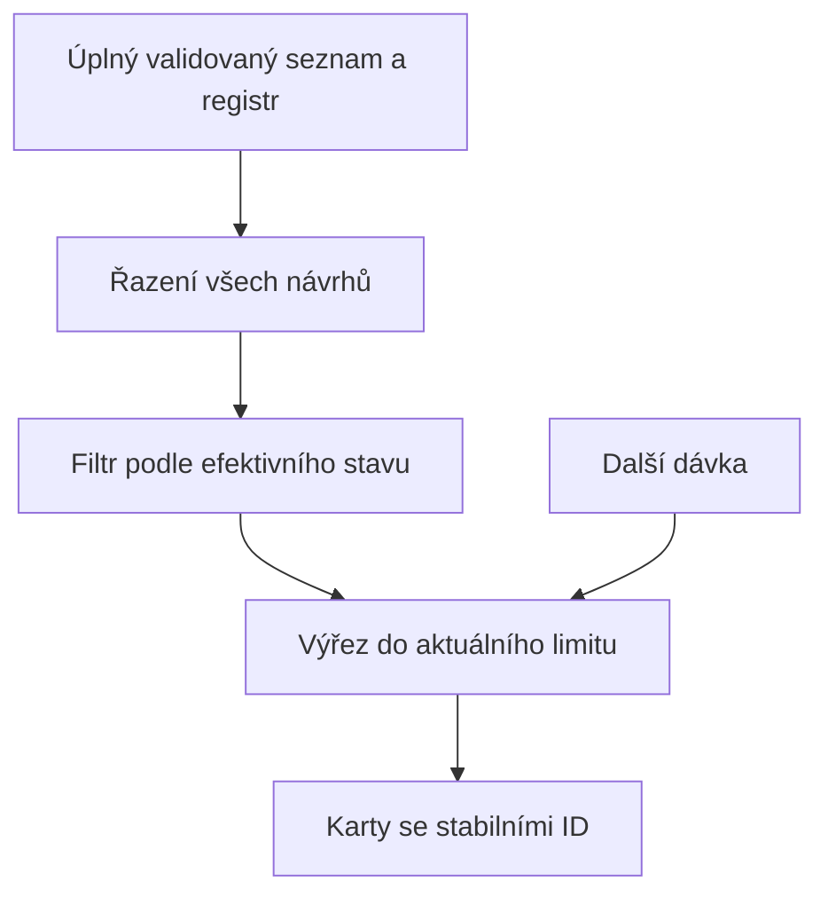

# Suggestions Visuals and Speed - Plan

## Goal Capsule

- **Objective:** Uživatel se v Návrzích rychleji zorientuje a může začít pracovat i s dlouhým seznamem bez zbytečného čekání.
- **Means:** Úprava stránky a karet, omezení počtu současně vykreslených karet a opakované využití identity při ingestování odpovědí (KTD1–KTD3).
- **Authority:** Uživatelský požadavek „zaměř se na vizuál a rychlost v části návrhy“, projektové instrukce a Product Contract tohoto plánu.
- **Execution:** Lokální implementace a ověření v odděleném worktree; výchozí commit `5eba54f49049a7fe728fb45a26057a8b885b22dc`.
- **Stop conditions:** Změna synchronizačního protokolu, rozhodovacího významu nebo identity návrhů vyžaduje nové vymezení práce.
- **Finish:** Implementující agent dokončí ověření a předá lokální výsledek. Push ani nasazení nejsou součástí této práce.

---

## Product Contract

### Summary

Zpřehlednit hlavičku, filtry a karty Návrhů a snížit práci při načítání většího počtu návrhů a odpovědí.

### Problem Frame

Stránka vykresluje celý filtrovaný seznam a každá karta provádí animaci rozložení. Hlavička, štítky a akce používají podobně výrazný drobný text, který ztěžuje rychlé skenování. První načítání současně ukazuje prázdný stav. Registr navíc znovu dohledává identitu pro každou odpověď, přestože ji již ověřil pro každý návrh.

### Requirements

**Vizuál a rychlost**

- R1. Zlepšit čitelnost, hierarchii a dostupnost akcí v části Návrhy.
- R2. Zrychlit práci s dlouhým seznamem Návrhů a jeho odpověďmi.

**Zachování chování**

- R3. Zachovat všechny současné akce a ochrany registru před opakováním rozhodnutí či vytvořením duplicitního úkolu.
- R4. Zachovat filtraci podle efektivního stavu návrhu a existující pořadí od nejnovějšího.

### Scope Boundaries

Práce se omezuje na stránku Návrhy, její karty a opakované dohledávání identity v `ingestLegacy`. Nezahrnuje změnu Google auth, Drive snapshotů, polling intervalu, datového schématu ani optimistického pořadí zápisů rozhodnutí a vzdálených zrcadel.

---

## Planning Contract

### Assumptions

Následující volby jsou pracovní předpoklady autonomní úpravy, nikoli nově potvrzené produktové požadavky:

- Výchozí dávka 20 karet a další dávky po 20 zachovají přístup ke všem návrhům a omezí počáteční vykreslení.
- Skutečná změna filtru vrátí limit na první dávku; opakovaný klik na aktivní filtr a obnova jej zachovají. Pokud nové položky při obnově posunou dříve viditelnou kartu za hranici, výřez se rozšíří tak, aby tato karta zůstala připojená a neztratila rozepsanou práci.
- Vizuální úprava použije současný motiv, čitelnější písmo, jasnější hlavní akci a klidnější metadata; nepřidá nové obrazovky.
- Výkonové přijetí se opře o počty vykreslených karet, počet dohledání identity a srovnatelný lokální benchmark. Číselné zrychlení času není před měřením tvrzeno.

### Key Technical Decisions

- KTD1. **Zobrazovat konečný výřez úplných výsledků.** Řazení závisí pouze na vstupním seznamu; filtrování používá celý seřazený seznam a efektivní stavy. Teprve z výsledku se vybírají viditelné karty (R2, R4). Celkové počty se neodvozují z výřezu. Jednoduché dávkování nevyžaduje novou virtualizační knihovnu ani samostatný helper pro samotné řazení a slice.
- KTD2. **Odstranit animaci rozložení celého seznamu.** Stabilní klíče karet zůstanou podle ID. Lokální interakce mohou zachovat střídmou animaci, ale přidání dávky ani filtrace nebudou měřit a animovat každou kartu (R1, R2). Viz `docs/solutions/design-patterns/responsive-surface-motion-system.md`.
- KTD3. **V jedné transakci znovu využít ověřenou identitu návrhu.** První průchod `ingestLegacy` uloží identifikátory subject/occurrence podle ID návrhu a průchod odpovědí je převezme (R2, R3). Poslední výskyt opakovaného ID musí zůstat zdrojem identity pro odpovědi, stejně jako současná mapa návrhů. Cache nepřežívá volání a neobchází detekci nejednoznačných aliasů.
- KTD4. **Rozlišit načítání, prázdný výsledek a chybu.** První loading nezobrazí hotový prázdný stav. Chyba se objeví přímo na stránce s možností obnovy; dostupná poslední validovaná data zůstávají podle současných pravidel. Nedostupný registr nadále blokuje nebezpečné akce (R1, R3).
- KTD5. **Ověřit jednoduchou UI změnu v prohlížeči.** Nevytvářet testovací závislosti ani produkční abstrakci jen pro test slice. Behaviorální regresní testy patří do existujícího registry testu; vizuál a renderování prokáže lokální browser fixture (R1–R4).

### High-Level Technical Design

### Risks and Evidence

Výchozí lokální browser fixture obsahuje 200 návrhů, z toho 150 otevřených. První pohled mountuje 150 karet a 10 620 DOM uzlů; medián pěti běhů React Profileru je 219,1 ms a pozorovaný medián prvního vykreslení 638,9 ms v dev režimu. Okno široké 390 px přetéká kvůli řádku filtrů na 486 px. Tato čísla popisují syntetický lokální workload, nikoli produkční síťovou latenci.

Při filtru či obnově se nesmí přehodit pořadí a počty ani bez důvodu remountovat karty s otevřeným editorem. Změna identity cache musí zachovat legacy ID rozhodnutí, čas odpovědí, validaci odkladu, task ID a published metadata.

`docs/solutions/performance-issues/suggestions-repeat-sync-cost.md` popisuje již hotovou cache neměnných snapshotů a sloučení souběžných požadavků; tato práce je zachová. Starší `docs/solutions/architecture-patterns/durable-suggestion-decision-registry.md` zůstává zdrojem rozhodovacích invariantů, ale jeho ETag recept je překonaný současnými create-only snapshoty. Motiv a focus respektují `docs/solutions/design-patterns/theme-prepaint-and-legacy-surface-bridge.md`.

---

## Implementation Units

### U1. Citelnější stránka a karty

**Goal:** Uspořádat hlavní informace a akce a jasně odlišit provozní stavy stránky.

**Requirements:** R1, R3.

**Dependencies:** Žádné.

**Files:** `battle-plan/src/pages/SuggestionsPage.tsx`, `battle-plan/src/components/SuggestionCard.tsx`.

**Approach:**

1. Zpřehlednit hlavičku a počty; filtrům dát dostatečný prostor, čitelný aktivní stav a přístupný název.
2. Posílit název návrhu a hlavní akci, zklidnit metadata a zachovat všechny editory, odpovědi a upozornění na duplicitu.
3. Doplnit stav stránky podle KTD4 a lokální focus/aria značení ovládacích prvků.

**Patterns to follow:** Současné semantické proměnné motivu, `MonthDatePicker`, `effectiveSuggestionStatus`, existující duplicate guard.

**Test expectation:** Nevytvářet nové unit testy pouze pro styling; ověřit níže uvedené scénáře v prohlížeči podle KTD5.

**Test scenarios:**

- Desktop a úzké mobilní okno: dlouhý název, zdroj, popis a odpověď nepřekrývají akce ani neroztahují stránku vodorovně.
- Světlý/tmavý motiv a klávesnice: aktivní filtr i focus jsou vidět, ovládací prvky mají názvy a dostatečnou aktivní plochu.
- První loading, skutečně prázdný filtr, chyba návrhů a chyba registru zobrazují odlišné smysluplné stavy.
- Possible duplicate zachovává volby stejné/nové a blokuje běžné rozhodovací akce; zpracovaný návrh nevytvoří další úkol.
- Textová odpověď, odklad, změna priority/termínu, hlas a smazání zůstávají dosažitelné.

**Verification:** Srovnat snímky před/po a projet uvedené stavy v lokálním browser fixture bez živých zápisů na Drive.

### U2. Mensi pocatecni vykresleni seznamu

**Goal:** Umožnit rychlý první pohled při zachování všech výsledků.

**Requirements:** R2, R4.

**Dependencies:** U1 pro společnou stránku; lze koordinovat v jednom editačním kroku.

**Files:** `battle-plan/src/pages/SuggestionsPage.tsx`, `battle-plan/src/components/SuggestionCard.tsx`.

**Approach:** Použít KTD1 a KTD2 s dávkovacími předpoklady výše. Zobrazit počet viditelných/všech výsledků a dostupné ovládání další dávky. Při skutečné změně filtru uzavřít stránkou vlastněný otevřený editor odpovědi.

**Patterns to follow:** Existující `useMemo`, ID klíče a efektivní stavy.

**Test expectation:** Browser scénáře podle KTD5; produkční helper ani nová UI testovací knihovna nejsou potřebné.

**Test scenarios:**

- Seznamy 0, 1, 20, 21, 40, 41 a 200 návrhů: první dávka odpovídá limitu, další dávka přidá správný počet a ovládání na konci zmizí.
- Po více dávkách jiný filtr resetuje limit, opětovný klik na aktivní filtr jej zachová a celkové počty zahrnují i skryté karty.
- Návrhy hledaného stavu za první dvacítkou původních dat zůstávají ve výsledku, protože filtrování předchází výřezu.
- Ruční a automatické obnovení zachovají počet načtených dávek i stabilní ID již viditelných karet.
- Při příchodu novějšího návrhu zůstane rozepsaná odpověď v původně poslední viditelné kartě zachována; limit se podle potřeby rozšíří. Změna filtru jej nadále resetuje.
- Po odchodu návrhu z filtru se výřez doplní dalším výsledkem; shodné časy zachovají dosavadní pořadí.

**Verification:** U 200 odpovídajících návrhů se zpočátku vykreslí nejvýše 20 karet místo 200; všech 200 zůstane dostupných. Změřit stejné lokální workloady před a po bez zaměňování DOM počtu za síťovou latenci.

### U3. Jedno dohledani identity na navrh pri ingestu

**Goal:** Zmenšit náklady historie odpovědí bez změny rozhodnutí.

**Requirements:** R2, R3.

**Dependencies:** Žádné; nezávislé na U1/U2.

**Files:** `battle-plan/src/services/suggestionRegistry.ts`, `battle-plan/src/services/suggestionRegistry.test.ts`.

**Approach:** Provést KTD3 v existující transakci. Nepřenášet cache do instance služby ani mimo transakci.

**Patterns to follow:** Současné `ensureIdentityRows`, `putLegacyDecision` a testy nad fake IndexedDB.

**Execution note:** Zachytit současné registry výsledky a workload před změnou, potom ověřit stejný snapshot a nižší počet dohledání.

**Test scenarios:**

- Více odpovědí stejného návrhu s již existujícím aliasem occurrence vytvoří totožná rozhodnutí a neztratí vazby.
- Opakované proposal ID používá pro odpovědi identitu posledního návrhu; neznámé ID odpovědi se ignoruje.
- Opakovaný ingest nemění published metadata ani uložené task ID a nevytváří nové duplicitní řádky.
- Terminální stav, komentář, platný/neplatný odklad, opakující se událost a nejednoznačný alias zachovají současné výsledky a rollback.
- Workload 100 návrhů a 500 odpovědí vyžaduje 100 dohledání identity místo 600.

**Verification:** Existující registry/sync/identity testy a doplněné regresní scénáře projdou; srovnat syntetický ingest benchmark se stejnými daty.

---

## Verification Contract

Z adresáře `battle-plan/` provést `npm run build`, `npm run lint`, `npm run check:theme` a `npm test`. Případné již existující selhání přesně oddělit od nové regrese. Tento projekt nemá příkaz `release:validate`.

Browser ověření U1/U2 má zahrnout loading/error/empty, filtraci, dávky a zachované akce v desktopu i úzkém okně. Uchovat měření a snímky bez osobních dat. Časový benchmark je implementační ověření; až do jeho dokončení se uvádějí pouze prokázané počty práce, nikoli odhadované zrychlení.

---

## Definition of Done

- U1: čitelnější rozvržení a rozlišené stavy prošly vizuálním a interakčním ověřením.
- U2: browser prokázal dávkování, správné počty, filtraci, pořadí a zachování limitu při obnově.
- U3: registr má stejné rozhodovací výsledky, regresní testy prošly a workload má cílový počet dohledání.
- Ověření výše je dokončené, experimentální a opuštěný kód odstraněný.
- Výsledek obsahuje přehled změn, důkazy a omezení měření; žádný push ani deploy.
