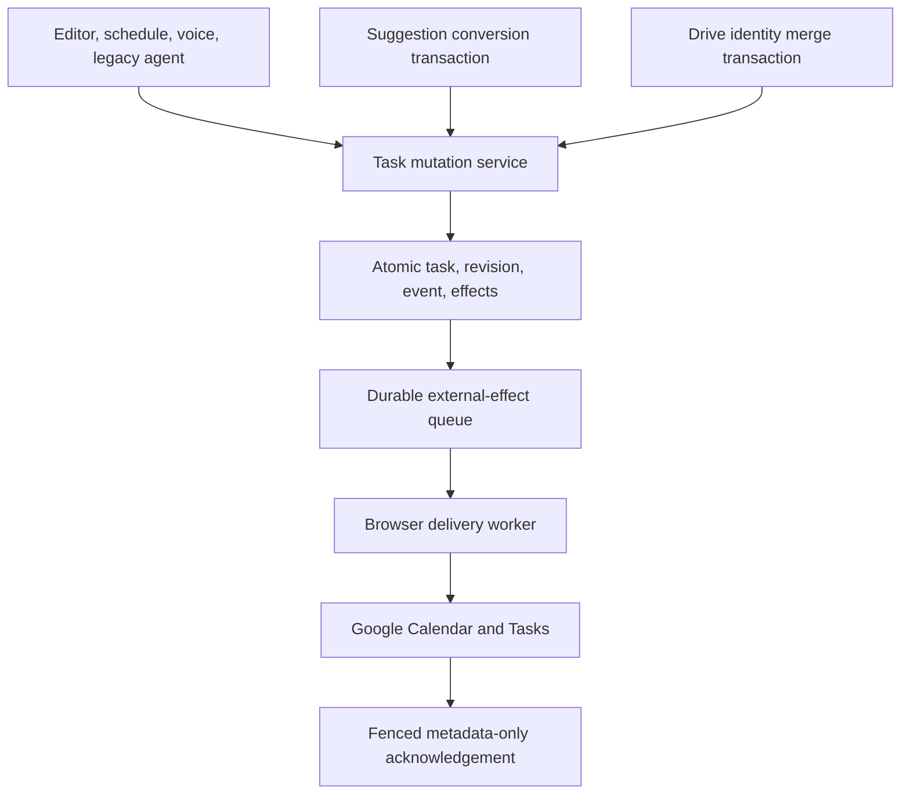
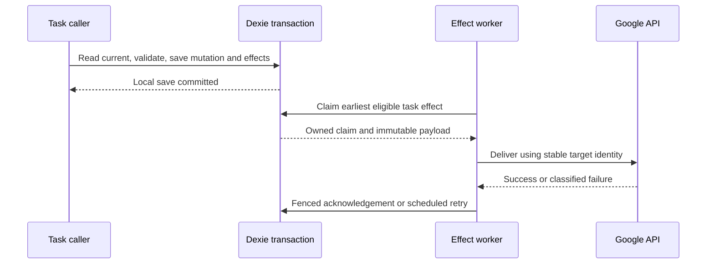
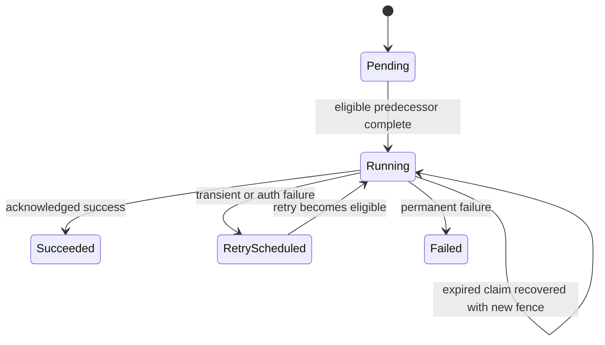

# Integrate Hermes U4 with current BattlePlan - Plan

## Goal Capsule

- **Objective:** Task edits survive temporary Google failures and reach the linked Google item without losing newer edits or creating duplicate calendar events.
- **Means:** Adapt the historic U4 task mutation and external-effect services to current BattlePlan (KTD1–KTD5).
- **Authority:** The user's integration request and current product behavior govern scope. This plan governs implementation; historical commit `ceba0d5a` is reference material.
- **Execution:** Implement against `09401ca1` / version `4.3.73` on `codex/integrate-hermes-u4`. The implementation owner completes integration, verification, review, and the authorized delivery workflow.
- **Stop conditions:** Stop for a reproducible data-loss risk that cannot be fixed within this scope, or an external dependency requiring new user authorization. Routine conflicts and obsolete U4 code are implementation work.

---

## Product Contract

### Summary

Integrate U4's common task mutation path and durable Google Calendar/Tasks effects with the current editor, scheduling, suggestions, voice processing, legacy agent bridge, and Drive import.
Preserve the changes shipped after U4 was written.

### Problem Frame

Current task writers save directly through several independent paths, while Google writes can fail after the local save.
Historic U4 addresses that split but predates transactional suggestion conversion, portable task matching, editor safeguards, and schedule-only undo.
Its external-effect queue also lacks ordering between successive mutations of the same task.

### Requirements

**Task changes**

- R1. Every in-scope local task create, update, complete, archive, and import uses the same mutation boundary.
- R2. A committed mutation contains the task, its revision, safe change event, and requested external effects atomically.
- R3. An expected revision or guarded current-state check rejects stale writes without overwriting the newer task.
- R4. Suggestion conversion commits the task mutation, occurrence, decision, and response together, preserving repeated-conversion idempotency.
- R5. Drive imports preserve portable identity, suggestion occurrence matching, local numeric IDs, and the existing timestamp winner rules.

**Google delivery**

- R6. Pending Calendar and Google Tasks effects survive reloads and retry after transient failures or restored authentication.
- R7. Successive effects on one local task cannot publish an older edit after a newer edit or create duplicate calendar events.
- R8. External completion records only successful synchronization metadata and cannot overwrite newer task content.
- R9. Local save success remains visible when Google delivery is pending; unavailable authentication must not be reported as successful delivery.

**Compatibility**

- R10. Preserve editor save guards, atomic schedule changes, guarded schedule-only undo, view-independent Drive backup, and hydration readiness.
- R11. Preserve the current protocol schemas and leave v2 command execution disabled.

### Acceptance Examples

- AE1. **Covers R2, R6, R9:** Save a meeting while Google authentication is unavailable, reload, restore authentication, and observe one Google event reflecting the saved meeting.
- AE2. **Covers R7, R8:** Make two edits and archive a meeting before its first Google creation finishes; delivery leaves no live obsolete event and no stale local content.
- AE3. **Covers R3, R10:** Move a task, edit its title, then undo the move; only scheduling fields revert, while an intervening scheduling change prevents stale undo.
- AE4. **Covers R4:** Fail suggestion conversion after task preparation; task, decision, event, and both outboxes all roll back, and retry creates one task.

### Scope Boundaries

This integration covers local Task records and their existing supported Google effects.
Google-only items with no local Task keep their direct external operations.

#### Deferred to Follow-Up Work

- Enable the full v2 command runtime, transport publication, approval lifecycle, and consumer snapshot recovery.
- Replace whole-file task backup with a new multi-device synchronization algorithm.
- Add new Google Tasks creation/update capabilities beyond the existing completion behavior.

---

## Planning Contract

### Key Technical Decisions

- KTD1. **Adapt U4 selectively onto current main.** Preserve the current callsites and replace their persistence boundary; wholesale adoption would remove later fixes. Existing U4 service contracts provide the starting point, so a competing architecture exercise is unnecessary.
- KTD2. **Use one composable Dexie mutation boundary.** The service exposes its participating tables so suggestion conversion, import matching, and weekly scheduling can include mutation work inside their existing outer transaction. Read-current, validate, build revision, and commit are part of that boundary (R2–R5, R10).
- KTD3. **Reserve a Calendar ID once per task's pending calendar identity.** Persist a reserved ID only when Calendar synchronization is requested. Later updates and deletes use that reservation until confirmed `googleEventId` exists. Keep reservation and Google pairing metadata out of public protocol projections (R7, R8).
- KTD4. **Order effects durably per task.** Allocate a monotonically ordered task effect sequence in the mutation transaction. Claim only the earliest unfinished eligible effect for that task. Claim and completion use transactional ownership and fencing checks; a due retry cannot be overtaken by a newer pending row (R7).
- KTD5. **Separate local commit from delivery.** Perform no Google request inside an IndexedDB transaction. The browser worker resumes pending work at startup, online recovery, and auth recovery. Authentication and offline waits do not exhaust a short generic retry budget. Terminal errors remain visible and retain enough state for explicit recovery (R6, R9).
- KTD6. **Retain existing Google payload semantics.** Calendar snapshots include every field consumed by the current adapter, including status, internal notes, and total duration. Set a reserved event ID in the insert resource body, following the official Events contract. Delete-not-found is idempotent success; authentication failures remain failures.
- KTD7. **Protect remote writes after lease loss.** Read the Calendar resource and use its ETag in conditional update/delete requests, checking current claim ownership immediately before sending. A precondition failure must re-evaluate the current desired state and ownership rather than blindly retry an old payload. The historical audit confirmed this official API capability; local fencing alone does not satisfy R7.

### High-Level Technical Design

Lease expiry fences local acknowledgements but cannot cancel an HTTP request already accepted by Google.
KTD7 protects Calendar update/delete across that boundary; the stable reservation protects creation retries.
The worker also avoids overlapping sends for one task during ordinary operation, including multiple tabs.

### Assumptions

- The user intends the existing Google operations to become durable without changing which task actions opt into Calendar synchronization.
- Automatic retries apply while the app can run; browser shutdown does not provide a background execution guarantee.
- Permanent errors can use the existing synchronization feedback surface rather than introducing a new queue-management product flow.

### Sequencing and Ownership

U1 defines the core contracts and owns `db.ts` and the ledger.
U2 and U3 can proceed independently after those contracts exist.
U4 follows U1 and owns suggestion/import transaction integration.
U5 integrates and reviews all paths after U2–U4.
Avoid concurrent edits to shared files; the core owner incorporates schema requests from adapters.

### Sources and Constraints

- Historic `ceba0d5a`: `battle-plan/src/services/taskMutations.ts`, `battle-plan/src/services/externalEffectOutbox.ts`, and `docs/agent-protocol/v2/HERMES_U4_REVIEW_REQUEST.md`.
- `docs/solutions/architecture-patterns/durable-agent-protocol-ledger.md`: command identity, fencing, atomic receipts/events, and disabled runtime boundary.
- `docs/solutions/architecture-patterns/durable-suggestion-decision-registry.md`: occurrence identity and transactional conversion.
- `docs/solutions/architecture-patterns/view-independent-task-backup.md`: hydration and backup lifecycle invariants.
- [Google Events resource](https://developers.google.com/workspace/calendar/api/v3/reference/events): reserved event identity for KTD3 and KTD6.
- [Google versioned resources](https://developers.google.com/workspace/calendar/api/guides/version-resources): conditional writes for KTD7.
- Current database schema is version 18. Add a migration only for required indexes or backfill, without renumbering existing migrations.

---

## Implementation Units

### U1. Atomic mutation core and ledger integration

**Goal:** Supply the common persistence boundary.
**Requirements:** R1–R3, R8, R11; KTD2–KTD4.
**Dependencies:** None.
**Files:** `battle-plan/src/db.ts`, `battle-plan/src/services/agentProtocol/ledger.ts`, new `battle-plan/src/services/taskMutations.ts`, new `battle-plan/src/services/taskMutations.test.ts`, `battle-plan/src/services/agentProtocol/ledger.test.ts`.
**Approach:** Adapt create/update/complete/archive/import and queue-effects contracts from U4. Export the complete mutation table set for transaction composition. Allocate sequence and reserved Calendar identity atomically. Preserve command-receipt fencing and current schema contracts.
**Patterns to follow:** Existing ledger transactions and portable task public IDs.
**Execution note:** Prove rollback and concurrent mutation behavior before integrating callers.
**Test scenarios:**

1. Creating and updating a task produces one valid revision, safe event, and requested effects in one commit.
2. Injected failure after any intermediate write leaves no partial task, event, receipt, or effect.
3. Two writes using one expected revision cannot both commit; legacy tasks without a revision gain one safely.
4. Repeated Calendar edits before acknowledgement retain one reservation and ordered effects; archiving queues deletion against that identity.
5. Delayed effect metadata cannot replace newer task fields, resurrect an archived task, or attach a different external identity.

**Verification:** Core tests prove persisted invariants with fake IndexedDB, including nested outer-transaction rollback.

### U2. Durable Google effects and browser lifecycle

**Goal:** Deliver committed effects reliably and in order.
**Requirements:** R6–R9; KTD3–KTD7.
**Dependencies:** U1.
**Files:** New `battle-plan/src/services/externalEffectOutbox.ts`, new `battle-plan/src/services/externalEffectOutbox.test.ts`, `battle-plan/src/services/googleService.ts`, new or existing Google adapter tests, new `battle-plan/src/hooks/useExternalEffectOutbox.ts`, new `battle-plan/src/hooks/useExternalEffectOutbox.test.ts`, `battle-plan/src/App.tsx`.
**Approach:** Add transactional claim/recovery and classified adapter outcomes. Preserve current Calendar request payload behavior. Mount one app-level worker and resume on supported recovery signals. Coordinate multiple workers without permitting per-task overtaking.
**Patterns to follow:** Ledger fencing and task-backup lifecycle cleanup.
**Test scenarios:**

1. Covers AE1. A pending create survives reopen and authentication recovery, with one reserved ID in the Calendar insert resource.
2. Covers AE2. Create, edit, and delete submitted before the first acknowledgement reach the intended final remote state.
3. An older retry blocks newer effects for the same task while another task can progress.
4. Competing workers and expired claims cannot acknowledge with a stale fence; delayed network completion triggers reconciliation before successor delivery.
5. Offline/401/permission failure never becomes success; transient failures retry, missing deletes succeed, and permanent failures remain inspectable.
6. Worker teardown cancels future scheduling without pretending to cancel an already-issued request.

**Verification:** Deterministic controlled-promise tests prove ordering, ambiguous completion recovery, authentication recovery, and lifecycle ownership.

### U3. Current UI, scheduling, voice, and legacy agent adapters

**Goal:** Route current local task behavior through the service.
**Requirements:** R1, R3, R9–R11; KTD1, KTD2, KTD5.
**Dependencies:** U1; final runtime validation also needs U2.
**Files:** `battle-plan/src/hooks/useTaskCommands.ts`, `battle-plan/src/hooks/useTaskCommands.test.ts`, `battle-plan/src/services/weeklySchedule.ts`, `battle-plan/src/services/weeklySchedule.test.ts`, `battle-plan/src/services/semanticEngine.ts`, `battle-plan/src/services/semanticEngine.test.ts`, `battle-plan/src/services/agentBridge.ts`, `battle-plan/src/services/agentBridge.test.ts`.
**Approach:** Replace local persistence and associated direct Google side effects at each current caller. Retain editor locking and identity guards. Keep scheduling and undo read-modify-write checks inside the expanded transaction. Preserve Google-only operations and disabled v2 runtime.
**Patterns to follow:** Current save-guard tests, schedule-only undo, semantic operation validation.
**Test scenarios:**

1. Editor double submit creates one task; stale/deleted edited records remain protected.
2. Covers AE3. Undo preserves unrelated edits and refuses an intervening schedule change.
3. Voice and legacy agent edits generate the same event/effect behavior as manual edits.
4. Local save returns a truthful result while Google remains pending; callers do not issue duplicate direct writes.
5. External-only Google items retain their existing behavior, and v2 command execution remains disabled.

**Verification:** Existing behavioral tests continue to pass with assertions on committed revisions/effects for migrated paths.

### U4. Suggestion conversion and Drive import transactions

**Goal:** Add mutation guarantees without weakening current identity and atomicity rules.
**Requirements:** R2, R4, R5, R10; KTD1, KTD2.
**Dependencies:** U1.
**Files:** `battle-plan/src/services/suggestionRegistry.ts`, `battle-plan/src/services/suggestionRegistry.test.ts`, `battle-plan/src/services/taskMerge.ts`, `battle-plan/src/services/taskMerge.test.ts`.
**Approach:** Expand existing transaction table scopes before invoking the mutation core. Keep occurrence decisions and response outbox within conversion. Preserve current matching and timestamp comparisons within import's transaction. Imported remote state must not generate new outgoing Google writes merely because it was downloaded.
**Patterns to follow:** Current `convertToTask` and `mergeTasks` identity decisions.
**Test scenarios:**

1. Covers AE4. Conversion rollback includes task, revision, event, decision, occurrence, and response outbox.
2. Repeated conversion returns the previously linked task without another event or effect.
3. Imports match by public ID or suggestion occurrence despite numeric ID collisions.
4. Stale imports cannot overwrite a newer edit; accepted imports retain identity and produce one mutation event without echoing Google effects.
5. Backup hydration still completes only after the merge commits.

**Verification:** Existing registry/merge suites plus transaction-failure coverage pass unchanged in meaning.

### U5. Cross-path verification and integration documentation

**Goal:** Establish that the integrated behavior preserves current production guarantees.
**Requirements:** R1–R11.
**Dependencies:** U2, U3, U4.
**Files:** The tests named in U1–U4, `battle-plan/src/hooks/useTaskBackup.test.ts`, `battle-plan/src/utils/taskBackupRevision.test.ts`, `docs/agent-protocol/v2/HERMES_U4_REVIEW_REQUEST.md`, new `docs/solutions/architecture-patterns/durable-task-mutations-and-google-effects.md`.
**Approach:** Audit task writes and direct Google side effects, explain intentional exceptions, and update the U4 review document to describe the current implementation. Record the ordering and transaction-composition learning.
**Test scenarios:**

1. An edit made while WorkLogs is visible still schedules the correct Drive backup.
2. A queued Calendar operation followed by local edit, reload, and restored auth publishes the latest intended state without duplicate creation.
3. The app builds with unchanged protocol validators and all legacy protocol conformance examples pass.

**Verification:** The verification contract below passes and code review finds no unaddressed correctness issue.

---

## Verification Contract

Run these existing package scripts from `battle-plan/`: `npm test`, `npm run lint`, `npm run build`, and `npm run test:agent-protocol`.
The baseline before integration is 434 passing tests; use it to identify regressions, not as a target count.

Adversarial tests must control transaction failures, request resolution order, authentication recovery, and competing worker claims.
A green adapter mock alone does not prove nested transaction atomicity or callsite integration.
Inspect the rendered app for manual edit, schedule move/undo, suggestion conversion, and pending synchronization feedback where local browser access permits.
Report any real-account Google smoke check that cannot be performed without new credentials as a verification limitation.

---

## Definition of Done

- Every U1–U5 verification outcome is satisfied, including the adversarial scenarios.
- All local task writers in scope use the common boundary; retained direct writers have a documented reason.
- Required checks pass, the diff preserves later mainline fixes, and the v2 command runtime remains disabled.
- Review findings affecting data integrity, duplicate effects, ordering, or misleading save feedback are resolved.
- Documentation describes the actual implementation and its remote-delivery limits.
- Abandoned code and experimental changes are removed from the final diff.

## Execution Record

Completed U1–U5 on 2026-09-21. R1–R5 are covered by the common mutation boundary,
revision conflict tests and composed suggestion/import rollback tests. R6–R9 are
covered by account-verified delivery, persistent ordered effects, stable Calendar
identity, conditional remote writes, fenced acknowledgement and finite retries.
R10–R11 retain the editor, schedule-only undo, backup/hydration and disabled v2
runtime behavior.

Final validation: 502 tests, lint, theme contract, TypeScript/Vite build and all 33
protocol conformance fixtures passed. Local browser create/edit, status toggles
with unsaved text, schedule/undo, diagnostics and reload were exercised. CE review
and independent verification of its authentication corrections completed; the
confirmed findings were fixed. Live authenticated Google smoke testing remains
unverified because the isolated browser had no Google account.
