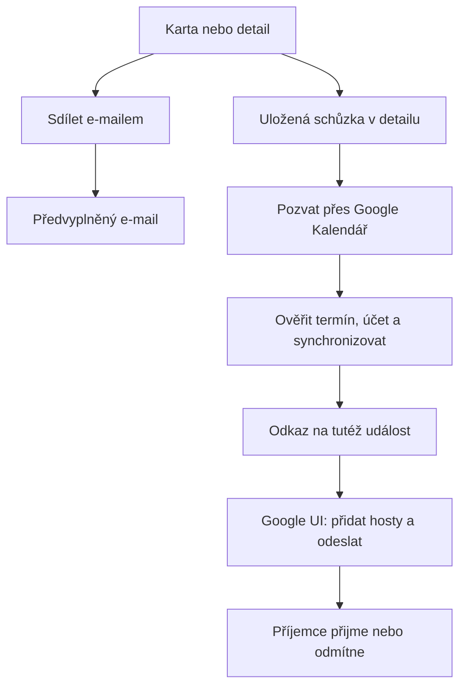

# Sdílení e-mailem a pozvánky na schůzky - Plan

## Goal Capsule

- **Objective:** Uživatel snadno pošle obsah úkolu nebo schůzky e-mailem a pozve hosty na schůzku s možností přijetí či odmítnutí.
- **Means:** Obnovit dostupnost stávajícího e-mailového exportu a otevřít propojenou událost v Google Kalendáři podle KTD1–KTD4.
- **Authority:** Výslovné volby uživatele, Product Contract, Planning Contract a pravidla repozitáře.
- **Execution profile:** Nejmenší řešení využívající současný `mailto`, editor, Google přihlášení a outbox. Bez nové knihovny, backendu nebo databáze hostů.
- **Stop conditions:** Změna požadavku na přímé rozesílání z BattlePlanu nebo nemožnost bezpečně zachovat existující Google událost vyžaduje revizi návrhu.
- **Delivery:** Tento dokument je návrh. Implementující agent následně provede U1–U3 a Verification Contract; nasazení se řídí zvláštním zadáním uživatele a pravidly repozitáře.

---

## Product Contract

### Summary

Zpřístupnit akci „Sdílet e-mailem“ na kartách a v detailu. Z týdenního kalendáře se k ní uživatel dostane otevřením detailu. Pro schůzky přidat „Pozvat přes Google Kalendář“: připravit jednu propojenou událost, otevřít ji a nechat uživatele přidat hosty a odeslat pozvánky v Google UI.

### Problem Frame

E-mailový export nezmizel celý: v prověřeném checkoutu 4.3.74 stále existuje na kartách. Chybí v týdenním kalendáři i editoru a samotná ikona obálky není dobře pojmenovaná. Historický export pouze připravoval textový e-mail; požadované kalendářové pozvánky jsou rozšíření této funkce.

### Ověřený stav a historie

| Oblast | Zjištění | Podklad |
|---|---|---|
| Výchozí stav | HEAD `3f5f2ea8`, lokální `package.json` 4.3.74; nasazená verze neověřena | `battle-plan/package.json` |
| Původní export | `mailto` a obálka na kartách i týdenních řádcích existovaly již 21. 1. 2026 | commit `181ac39d`, tehdejší `battle-plan/src/App.tsx` a `docs/PLAN-export-feature.md` |
| Odstranění z týdne | Commit `b5cc8518` dne 21. 1. 2026 odstranil týdenní tlačítko `handleExport(t)` | diff `battle-plan/src/App.tsx` |
| Karty | Export na hlavních kartách byl obnoven v `7cd78f0f`; extrakce komponent `ef8dca81` předala callback do TaskCard | git historie `handleExport(task)` |
| Současný export | `TaskCard` → `App` → `useTaskCommands.handleExport` → `window.location.href = mailto` | `TaskCard.tsx:87`, `App.tsx:938`, `useTaskCommands.ts:290` pod `battle-plan/src/` |
| Detail a týden | `FocusEditor` nemá export callback; `WeeklyCalendar` otevírá editor. Tlačítko se Share2 v detailu pouze synchronizuje do vlastního kalendáře | `FocusEditor.tsx:434`, `WeeklyCalendar.tsx:26` |
| Obsah | E-mail zahrnuje interní poznámky, ale ne čas a trvání schůzky. Také Calendar description zahrnuje interní poznámky | `useTaskCommands.ts:292`, `services/googleService.ts:742` |
| Google zápisy | Update používá plný PUT s objektem vytvořeným z Task. Hosté ani RSVP nejsou v tomto objektu a není nastavena politika `sendUpdates` | `services/googleService.ts:696`, `addToCalendar` |

Historické `package.json` mají verzi `0.0.0`, proto nelze poctivě přiřadit odstranění tlačítka konkrétní tehdejší produkční verzi. Starý exportní plán už v checkoutu není; dohledán v gitu. Graphify na něj stále odkazuje, proto sloužil pouze jako navigace. Kontrola je založená na kódu a historii, nikoli na klikání v nasazené aplikaci nebo na skutečně odeslaném e-mailu.

### Key Decisions

- **Skutečné kalendářové pozvánky.** Samotný textový e-mail nestačí. (session-settled: user-directed — chosen over pouze e-mailový obsah: uživatel chce také přijetí či odmítnutí pozvánky.) Governs R3.
- **Hosté se zadávají v Google Kalendáři.** (session-settled: user-directed — chosen over zadávání a rozesílání přímo v BattlePlanu: uživatel zvolil nejmenší spolehlivou úpravu.) Governs R3, R7.

### Requirements

**Dostupnost a obsah**

- R1. Akce „Sdílet e-mailem“ je dostupná na kartě i v detailu úkolu a schůzky, také při otevření detailu z týdne; má viditelný popisek, podporu klávesnice a dotyku. Zachovat dosavadní export Google Tasks, poznámek a myšlenek.
- R2. E-mail obsahuje název, popis a relevantní termín, čas, délku a podúkoly. Interní poznámky se nesdílejí; neexistující hodnoty se nevymýšlejí. U úkolu se `startTime` podle současné domény označí jako čas dokončení, u schůzky jako začátek.

**Pozvánky a synchronizace**

- R3. U uložené schůzky „Pozvat přes Google Kalendář“ zpřístupní tutéž propojenou událost. Uživatel v Google UI zkontroluje obsah, zadá hosty a potvrdí odeslání; příjemce může přijmout či odmítnout. BattlePlan samotným otevřením odkazu pozvánku neodesílá.
- R4. Připravení pozvánky vyžaduje uložený záznam a explicitní platné datum; časová schůzka také čas a kladné trvání. Rozepsané změny musí uživatel nejprve uložit. Neúspěšná synchronizace, chybějící oprávnění nebo změna účtu nesmí vést k otevření chybné události či hlášení „odesláno“.
- R5. Následné změny z BattlePlanu zachovají hosty a jejich odpovědi. Změny veřejného obsahu či termínu a smazání pozvané události informují hosty; opakování stejného zápisu nesmí záměrně rozesílat další oznámení. UI vysvětlí tento dopad při úpravě/smazání schůzky.
- R6. Google událost zpřístupněná přes R3 neobsahuje interní poznámky. Stejné pravidlo platí pro další Calendar zápisy včetně starších čekajících effectů. Lokální interní poznámky zůstávají beze změny.

**Provozní hranice**

- R7. Správa hostů a zobrazení RSVP zůstávají v Google Kalendáři. Úkoly mají textové sdílení; kalendářové pozvánky se vztahují na schůzky. Není potřeba Gmail oprávnění, vlastní SMTP, generátor ICS ani veřejný sdílecí odkaz na data BattlePlanu.
- R8. Když e-mailový klient není nastavený nebo nezpracuje dlouhý text, uživatel může z detailu zkopírovat tentýž obsah. Aplikace nepotvrzuje doručení a nesnaží se neúspěch `mailto` spolehlivě automaticky detekovat.

### Acceptance Examples

- AE1. Z týdenního bloku otevřu detail schůzky a zvolím sdílení: dostanu datum, začátek a délku bez interních poznámek. Covers R1, R2, R8.
- AE2. U uložené schůzky bez Google ID připravím událost, otevřu ji, v Google UI přidám testovacího hosta a odešlu. Druhý pokus otevře stejnou událost. Covers R3, R4.
- AE3. Host přijme pozvánku. Poté v BattlePlanu přesunu termín: host i jeho odpověď zůstanou zachováni a dorazí aktualizace stejné události. Covers R5.
- AE4. U staré propojené schůzky s interním zápisem v Google description se před otevřením pozvání úspěšně provede sanitizovaný update; při chybě se akce zastaví s vysvětlením. Covers R4, R6.
- AE5. Schůzka bez data nebo s neuloženou změnou nabídne konkrétní chybějící krok; nevytvoří událost na dnešek v 09:00. Covers R4.

---

## Planning Contract

### Key Technical Decisions

- KTD1. **Znovu použít stávající export.** Oddělit čisté sestavení subject/body do malého `utils/taskSharing.ts`; `handleExport` zůstane jedním callbackem. Subject bez CR/LF, hodnoty URI-kódované, textová zalomení CRLF. Přidat samostatné kopírování stejného veřejného textu dle R8; při odmítnutí Clipboard API zobrazit označitelný text přímo v editoru. Nepřidávat další modal ani detekci nainstalovaných mailových klientů.
- KTD2. **Pozvat přes serverem vrácený `htmlLink` stejného eventu.** Rozšířit `googleService` o čtení propojené události; odkaz držet jen přechodně v UI. `calendar.events` scope už existuje. Nevytvářet paralelní TEMPLATE událost ani konstruovat nedokumentované `eid`. Po přípravě zobrazit běžný odkaz „Otevřít Google Kalendář“ s `noopener`, aby asynchronní sync nenarazil na popup blocker. Přijmout pouze HTTPS odkaz na Google Calendar. Instantiates R3, R7 and their session-settled Key Decisions.
- KTD3. **Zachovat vlastnictví jednotlivých polí.** BattlePlan vlastní název, veřejný popis, termín a svá připomenutí; Google vlastní hosty, RSVP, konferenci, místo a další pole, která Task nezná. Změnit guarded PUT na GET + PATCH pouze vlastněných polí s `If-Match`; vynechat pole hostů. Zachovat guard, account binding, pořadí a rezervované ID z outboxu. Stejný princip platí pro obnovu po 409 a všechny další callers. Při změně all-day/timed explicitně odstranit protilehlá pole `date`/`dateTime`/`timeZone`; nespoléhat na pouhé vynechání při PATCH.
- KTD4. **Veřejný Calendar payload sestavovat až při doručení.** Adapter nikdy nepoužije `internalNotes` v description, ani ze starého effect snapshotu. Před otevřením podle R3 vždy zařadit bezpečný upsert aktuální uložené schůzky přes existující taskMutations/outbox a počkat na dokončení všech předchůdců. Teprve po úspěchu načíst event a htmlLink pro tentýž účet a ID. Není potřeba migrace Task ani replikace seznamu účastníků do Drive/protokolu.
- KTD5. **Oznámení podle rozdílu, ne podle kliknutí.** Před změnou porovnat veřejnou projekci aktuálního eventu s požadovanou. U skutečné veřejné změny eventu s hosty použít `sendUpdates=all`; u bezezměnového retry zápis přeskočit, změny samotných reminders neposílat hostům. DELETE pozvané události používá `sendUpdates=all`; 404/410 je dokončené smazání. Nezavádět vlastní e-mailovou frontu a neslibovat přesně jedno doručení e-mailu při nejistém výsledku vzdáleného požadavku.

### Uživatelský průchod

### Hranice a rizika

- Běžné pozvánky i odpovědi zajišťuje Google; zobrazení u příjemce závisí na jeho nastavení. Dokončený sync není důkaz doručení pozvánky.
- U existující události s 404/410 nabídnout opravu propojení jako explicitní krok; nevytvářet potichu druhou schůzku. Při 403, 412, jiném účtu nebo ztrátě ownership se nepokračuje otevřením odkazu.
- Pro odkaz kontrolovat čerstvý účet i na konci přípravy. Změna task revision, smazání nebo změna účtu během přípravy zneplatní rozpracovaný výsledek.
- Změny názvu/času/popisu provedené jen v Google UI může další BattlePlan sync přepsat podle KTD3; editace těchto polí patří do BattlePlanu. Hosté, RSVP a Google-only pole se zachovávají.
- Historicky synchronizované poznámky nelze vzít zpět z již doručených zpráv. Oprava vyčistí vybranou událost před pozváním a další synchronizované události při zápisu; neprovádí hromadné čištění kalendáře.
- Starý klient stále může poslat původní PUT i interní poznámky. Před používáním pozvánek aktualizovat všechny aktivní instance BattlePlanu; kompatibilitu se současně běžící starou verzí tento návrh nezaručuje.
- Zrušení pozvánky v tomto návrhu znamená smazání propojené schůzky přes existující delete cestu. Pouhé interní `status: cancelled` dnes neprovádí Google DELETE; nepřidávat nový slib ani tlačítko zrušení přes tento stav.
- Pouhé stažení ICS nebo odkaz TEMPLATE není náhradou R3: první vyžaduje samostatné řešení odeslání/aktualizací, druhý vytváří samostatnou kopii události.
- U nových schůzek před uložením není dostupné sdílení/pozvání. U rozepsané existující položky sdílení také vyžaduje nejprve uložit, aby příjemce dostal stejný stav jako aplikace.

---

## Implementation Units

### U1. Dostupné a srozumitelné sdílení e-mailem

**Goal:** Splnit R1, R2, R8 a AE1. **Dependencies:** žádné.

**Files:** `battle-plan/src/utils/taskSharing.ts` a `.test.ts` (nové), `battle-plan/src/hooks/useTaskCommands.ts`, `battle-plan/src/components/TaskCard.tsx`, `battle-plan/src/components/FocusEditor.tsx`, `battle-plan/src/App.tsx`.

**Approach:** KTD1; propojit existující callback s editorem, textový popisek na kartě a akce v editoru využijí současné styly. WeeklyCalendar pouze dál otevírá detail. Použít editorové `hasSavedIdentity`, `isDirty` a `isBusy` pro dostupnost akce a vysvětlení. Zobrazení začátku a času dokončení vychází ze stávajícího kalendářového významu polí, ne z jejich jména.

**Test scenarios:** Jeden tabulkový test formatteru pokryje češtinu, `&`, `#`, nové řádky, chybějící data, časovou a celodenní schůzku, task completion time, Google Task a vyloučení interního zápisu. Ručně ověřit cestu karta/týden → detail, klávesnici, šířku 375 px, odmítnutý clipboard a dlouhý obsah bez ořezu v kopírování.

**Done:** Stejný veřejný obsah pro e-mail a kopírování, žádná změna Task/Google dat po samotném sdílení.

### U2. Calendar synchronizace zachová hosty a soukromí

**Goal:** Splnit R5, R6, AE3 a AE4. **Dependencies:** žádné; musí být dokončeno před U3.

**Files:** `battle-plan/src/services/googleService.ts`, `battle-plan/src/services/googleService.test.ts`, `battle-plan/src/services/externalEffectOutbox.test.ts`; podle potřeby signatur guardu `externalEffectOutbox.ts`. Reuse `docs/solutions/architecture-patterns/durable-task-mutations-and-google-effects.md`.

**Approach:** KTD3–KTD5. Nejprve charakterizační test s existujícím eventem obsahujícím hosta, RSVP, konferenci a interní poznámky. Ošetřit guarded i případnou unguarded cestu podle zjištěných callers; neponechat druhou variantu plného update, která hosty smaže. Rozšířit DELETE o čtení hostů a notifikační parametr, zachovat současný retry/error kontrakt.

Současný test `durable Calendar creation reserves resource.id and preserves completed event details` v `googleService.test.ts` výslovně očekává `Private note` v popisu. Záměrně obrátit tento assertion podle R6 a zachovat jeho kontroly identity a reminders.

**Test scenarios:** RSVP a Google-only pole přežijí editaci; interní zápis není v insert/update ani starém outbox snapshotu; all-day ↔ timed neponechá konfliktní pole; změna termínu posílá `sendUpdates=all`, bezezměnový retry ne; 412, timeout a 409 zachovají fencing a jednu event identitu; delete po ztracené odpovědi skončí na 404/410 bez nové události.

**Done:** Všechny Calendar writes splňují KTD3–KTD5 a existující regresní testy outboxu projdou.

### U3. Připravit a otevřít tutéž schůzku pro pozvání

**Goal:** Splnit R3, R4, R7, AE2, AE4, AE5. **Dependencies:** U1, U2.

**Files:** `battle-plan/src/hooks/useTaskCommands.ts`, `battle-plan/src/components/FocusEditor.tsx`, `battle-plan/src/App.tsx`, `battle-plan/src/services/googleService.ts` a `.test.ts`; testovat orchestrace v nejmenším samostatně testovatelném helperu, pokud hook nelze ověřit stávajícím node runnerem.

**Approach:** KTD2, KTD4. Akce má stavy příprava / připravený odkaz / chyba a blokuje opakovaný klik po dobu přípravy. Reread uložené schůzky, explicitní validace termínu a uložené identity, zařazení upsertu a čekání na jeho skutečný výsledek. Nespoléhat na to, že `drainOnce(effectIds)` automaticky zpracuje starší effecty: současný kód skupinu při nevybraném předchůdci zastaví. Po čekání znovu ověřit revision/účet/ID, načíst htmlLink a nabídnout otevření. Pro offline/expired session zobrazit obnovitelnou chybu, zachovat editor. Popis u akcí schůzky vysvětlí R5 a vlastnictví polí dle KTD3.

Vysvětlení smazání patří do společného `handleDeleteTask`, nejen do editoru: potvrzení u propojené schůzky upozorní na zrušení Google události a oznámení případným hostům. Tím pokryje i mazání přímo z TaskCard. Dopad přesunu v týdnu vysvětlit u plánování propojené schůzky, bez dalšího potvrzení každého přetažení.

**Test scenarios:** existující versus nová propojená událost; dvojklik; starší effect před vybraným effectem; failed versus pending sync; změna účtu/revision během čekání; chybějící čas; 404 a nepovolený htmlLink. Skutečný Google smoke test s vlastními testovacími účty ověří vytvoření, pozvání, přijetí, následný přesun a zrušení téže události.

**Done:** Bez úspěšného bezpečného upsertu se odkaz nenabízí; otevření nikdy samo nehlásí pozvánku jako odeslanou.

---

## Verification Contract

- Z adresáře `battle-plan/`: `npm test`, `npm run lint`, `npm run build`.
- Formatter a Calendar mock testy mají kontrolovat výstup a dopad, ne text zdrojového souboru.
- Prohlížeč: karta i detail z týdne, mobilní šířka, klávesnice, neuložené změny, nefunkční mail handler a clipboard fallback. Ověřit také upozornění při smazání přímo z karty a informaci o oznámení hostům při přesunu v týdnu.
- Kontrolovaný test v Google Kalendáři podle U3 vyžaduje uživatelem určeného testovacího příjemce; neposílat pozvánky skutečným kontaktům bez zadání. Ověřit RSVP v Google UI, aktualizaci a zrušení u příjemce.
- Pokud přístup k testovacím účtům není dostupný, zaznamenat tuto mezeru a nepovažovat konečné ověření pozvánek za splněné. Samotné mocky nejsou důkaz doručení.

## Definition of Done

- U1–U3 mají splněné vlastní Done i relevantní AE1–AE5.
- Prošly příslušné automatické kontroly a ověření skutečného pozvání/aktualizace/zrušení.
- Nevznikla druhá událost, nezmizeli hosté ani jejich odpovědi a interní poznámky nejsou v nově sdíleném obsahu.
- Dokumentace popisuje rozlišení e-mailového obsahu, vlastní synchronizace a Google pozvánky. Neúspěšné experimenty a nepotřebný kód jsou odstraněny.
- Nevznikly nové závislosti, Gmail scope, vlastní mail server, databáze hostů ani nové protokolové schéma. Změna tohoto omezení vyžaduje doložený důvod.

---

## Sources

- `docs/solutions/design-patterns/weekly-task-history-and-rescheduling.md` — rozdílný význam času úkolu a schůzky.
- `docs/solutions/architecture-patterns/durable-task-mutations-and-google-effects.md` — transakce, account binding, stabilní event ID a ETag fencing.
- Historický `docs/PLAN-export-feature.md` z commitu `181ac39d`; nezaměňovat deklaraci completed za runtime ověření.
- [Google: invitations and propagation](https://developers.google.com/workspace/calendar/api/concepts/inviting-attendees-to-events) — hosté, odpovědi a omezení jednorázového TEMPLATE odkazu.
- [Google: event resource](https://developers.google.com/workspace/calendar/api/v3/reference/events) — htmlLink a pole události.
- [Google: update](https://developers.google.com/workspace/calendar/api/v3/reference/events/update), [patch](https://developers.google.com/workspace/calendar/api/v3/reference/events/patch), [delete](https://developers.google.com/workspace/calendar/api/v3/reference/events/delete) — sémantika změn a sendUpdates.
- [RFC 6068](https://www.rfc-editor.org/rfc/rfc6068.html) — textový obsah mailto a kódování.
