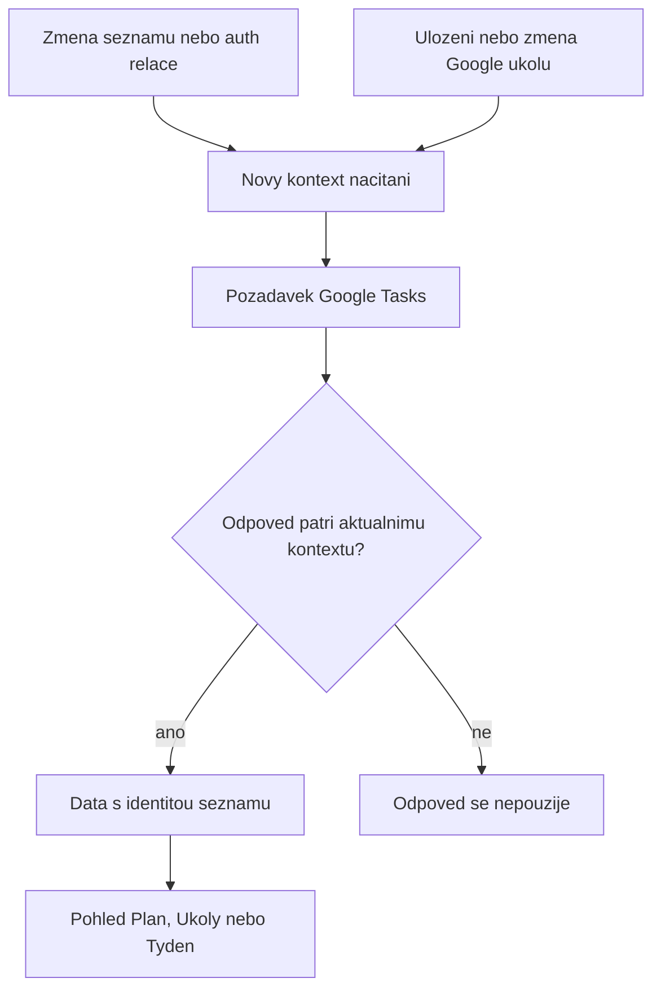

# Spolehlivost synchronizace a planovani - Plan

## Goal Capsule

- **Objective:** Uživatel může spolehlivě obnovit výkazy práce, upravit checklist a naplánovat úkoly bez množení záznamů, ztráty výběru seznamu nebo chybných časových údajů.
- **Means:** Opravit existující hranice importu, ukládání editoru a načítání seznamů podle KTD1–KTD4.
- **Authority:** Zadání uživatele a projektové instrukce mají přednost; R-ID vlastní chování, KTD-ID technický postup, U-ID konkrétní změny.
- **Execution profile:** Izolované opravy v aktuálním worktree od `7aa74ce87d7e788c2474d93cb589c37e76fbfa2d`. Původní checkout zůstává zachován.
- **Stop conditions:** Zastavit dotčenou změnu při potřebě destruktivní opravy existujících záznamů, nové migrace nebo změny externího protokolu; ostatní nezávislé opravy mohou pokračovat.
- **Completion owner:** Implementující agent provede lokální ověření a předá výsledek hlavnímu agentovi. Tento plán neobsahuje push ani deploy.

## Product Contract

### Summary

Opravy sjednotí chování editoru a karet úkolů, zabrání opakovanému importu legacy výkazů a zajistí, že Google seznam i termíny odpovídají aktuálnímu uživatelskému kontextu.

### Problem Frame

Výchozí pohled Plán zobrazuje Google úkoly, ale sám je nenačítá. Pozdní odpovědi mohou po přepnutí seznamu dostat nesprávné `googleListId`. Legacy výkazy při importu získávají náhodnou identitu a opakované načtení je může zdvojit; stejně čerstvé cloudové verze se navíc vybírají podle pořadí. Editor mění checklist bez odvozeného průběhu. Časové pomocné funkce používají UTC parsování civilního data a připouštějí neplatné časy.

### Requirements

**WorkLogs**

- R1. Opakované načtení stejných legacy výkazů nezmění počet uložených záznamů; úmyslně odlišné portable identity zůstanou odlišné.
- R2. Dvě nejnovější cloudové verze stejného výkazu se stejným časem a odlišným obsahem vyvolají existující chybový výsledek místo tichého výběru.

**Editor a kalendar**

- R3. Uložení checklistu přepočítá průběh a zbývající práci stejně jako změna checklistu z karty; neplatný vyplněný čas se neuloží.
- R4. Termín ve tvaru kalendářního data znamená místní den. Zobrazení termínu ani přesun dlouhé položky nevytvoří `NaN`, záporný čas nebo hodinu mimo civilní den.
- R5. Parser délky vyhodnotí celý podporovaný zápis nebo jej odmítne; nezmění záporný či částečně platný vstup na jinou kladnou hodnotu.

**Google Tasks**

- R6. Každý pohled, který zobrazuje Google Tasks, je načte při dostupné autorizaci. Odpověď patří pouze seznamu a relaci, pro které byla vyžádána; pozdní odpověď nesmí změnit aktuální seznam.
- R7. Opravy zachovají guard volitelného Tasks scope, lokální revize úkolů, outbox a tombstones. Nepřidají závislosti ani schéma databáze.

### Acceptance Examples

- AE1. Covers R1: Po dvou importech stejného legacy snapshotu jsou počet záznamů i součet hodin stejné jako po prvním importu.
- AE2. Covers R2: Snapshoty se stejným `syncId` a `updatedAt`, ale různými hodinami, vrátí chybu v obou pořadích souborů.
- AE3. Covers R3: Úkol se dvěma položkami a celkem 120 minutami po zaškrtnutí jedné položky v editoru uloží průběh 50 a zbývajících 60 minut.
- AE4. Covers R4: V America/New_York je dnešní termín v 15:00 při místním čase 10:00 vzdálen 5 hodin a má 300 dostupných pracovních minut.
- AE5. Covers R6: Při přepnutí A → B dorazí B první a A poslední; zobrazené úkoly i jejich cílový seznam zůstávají B.

### Scope Boundaries

Bez automatického mazání obsahově shodných WorkLogs, změn OAuth oprávnění, migrací, redesignu či plošného refaktoru. Již vzniklé historické duplicity s náhodnými `syncId` zůstávají k výslovně potvrzené opravě; prevence replay není hromadnou opravou jejich identity. Nové obecné retry mechanismy nejsou potřeba: opravy používají existující chybové výsledky a životní cyklus požadavků.

#### Deferred to Follow-Up Work

Obnova odvozeného dne po půlnoci a odstraňování mrtvého kódu zůstávají samostatnou prací.

## Planning Contract

### Key Technical Decisions

- KTD1. **Normalizovat legacy identitu na vstupu synchronizace.** Použít existující deterministickou identitu a occurrence pravidla v `battle-plan/src/utils/workLogSyncIdentity.ts` a `battle-plan/src/db.ts`; náhodný creating hook pak pouze obsluhuje skutečně nové záznamy. Konflikty R2 posuzovat na nejnovější verzi a porovnávat portable obsah se stejnými výjimkami pro lokální ID jako nynější publication verifier.
- KTD2. **Odvozený checklist normalizovat před uložením.** Sdílet malý výpočet mezi kartou a save hranicí `useTaskCommands`; zachovat revizní kontrolu a transakční uložení přes `taskMutations`. Nevázat správnost pouze na konkrétní klikací handler editoru.
- KTD3. **Civilní datum i hodiny validovat před aritmetikou.** Zachovat lokální kalendářní den a stávající rozdíl: čas schůzky je začátek, čas úkolu konec. Parser délky dostane ukotvenou gramatiku existujících podporovaných zápisů.
- KTD4. **Jeden vlastník přijetí Google odpovědi.** App nebo úzce zaměřený hook sváže načtená data se seznamem a auth relací, odmítne zastaralé požadavky a poskytne stejný bezpečný refresh také příkazům po save/delete/toggle. Pouhé vyčištění pole v efektu nestačí, protože mapování starých dat na nový seznam nastane už při renderu.

### Assumptions

Neověřené produktové předpoklady tohoto autonomního běhu: odstranění poslední položky checklistu zachová dosavadní odhad celkové práce a vrátí průběh na 0; změna ručního odhadu nesmí být přepsána starým `totalDuration`. U délky přesahující viditelný den zůstane odhad zachován a přesun použije platnou viditelnou hranici podle sémantiky začátku/konce, nikoliv záporný čas. Desetinné minuty nejsou nyní dokumentovaným formátem a mohou být odmítnuty, zatímco desetinné hodiny zůstanou podporované.

### High-Level Technical Design

### Sequencing and Sources

U1, U2 a U3 mají oddělené souborové oblasti a mohou běžet souběžně. U4 dokončit po U2, protože adaptuje rozhraní stejného command hooku; domluvit vlastnictví tohoto malého integračního úseku. Závěrečné ověření běží nad spojeným výsledkem.

Podklady: `docs/solutions/database-issues/cross-device-worklog-sync-duplicates.md`, `docs/solutions/integration-issues/worklogs-immutable-drive-snapshots.md` a `docs/solutions/architecture-patterns/durable-task-mutations-and-google-effects.md`. `docs/solutions/integration-issues/google-tasks-scope-403-background-fetch-2026-07-06.md` popisuje starší tasks-only gate; nynější `App.tsx` má další skutečné konzumenty, proto platí princip gate podle konzumenta a zůstává ochrana scope ve službě. Jde o lokální řízení existujících API volání; externí kontrakt se nemění.

## Implementation Units

### U1. Opakovatelny a jednoznacny import WorkLogs

**Goal:** Splnit R1, R2 a R7 na vstupu Drive → IndexedDB.

**Dependencies:** Žádné.

**Files:** `battle-plan/src/services/workLogsSync.ts`, `battle-plan/src/services/workLogsSync.test.ts`, `battle-plan/src/utils/workLogSyncIdentity.ts`, `battle-plan/src/utils/workLogSyncIdentity.test.ts`.

**Approach:** Dle KTD1 normalizovat legacy záznamy před identitním lookupem i add. Zachovat výskyty identických legacy řádků uvnitř jednoho snapshotu a sjednocovat opakované snapshoty. Před ztrátovou deduplikací v `loadAllDetailed` ověřit shodu nejnovějších variant; využít existující `comparableWorkLog` a chybový návrat služby.

**Patterns to follow:** Deterministický backfill v `db.ts`, `containsUnambiguousVersion` a tombstone-first import v `workLogsSync.ts`.

**Execution note:** Nejdříve zachytit replay proti skutečné fake IndexedDB včetně creating hooku; samotný test čistého merge helperu chybu neprokáže.

**Test scenarios:**

1. Covers AE1. Stejný legacy snapshot importovaný dvakrát nevytvoří další řádky a drží identitu napříč nezávislými DB.
2. Dva záměrně stejné legacy řádky v jednom snapshotu zůstanou dva i po replay; dva stejné záznamy s odlišným `syncId` se nesloučí.
3. Covers AE2. Rozporné nejnovější varianty vrátí chybu nezávisle na pořadí; shodné kopie se sjednotí a jednoznačně novější varianta vyhraje.
4. Rozdílné lokální `id`, `projectId` a `publicId` samy konflikt nevyvolají; tombstoned normalizovaná identita se neobnoví.
5. Konfliktní pull nevede k lokálním změnám ani k následnému publikování libovolně vybraného záznamu.
6. Legacy import i jeho replay zachovají existující `publicId` a neporuší unikátní index; již existující náhodné sync identity se automaticky nepřepisují ani neslučují.

**Verification:** Projdou identity a sync testy včetně dosavadní ochrany tombstones a immutable publication.

### U2. Konzistentni checklist a validace editoru

**Goal:** Splnit R3 a zachovat R7.

**Dependencies:** Žádné; předat U4 změny rozhraní hooku až po dokončení.

**Files:** `battle-plan/src/hooks/useTaskCommands.ts`, `battle-plan/src/hooks/useTaskCommands.test.ts`, `battle-plan/src/components/FocusEditor.tsx`; při potřebě sdílení malý nový helper `battle-plan/src/utils/taskProgress.ts` a `battle-plan/src/utils/taskProgress.test.ts`.

**Approach:** KTD2 uplatnit v uloženém snapshotu před mutation transakcí a na kartě. Neplatný vyplněný `startTime` odmítnout pomocí stávajícího `EditorSaveOutcome` a ponechat draft otevřený. Přizpůsobit editor pouze tam, kde je potřeba průběžně zobrazit odvozené hodnoty.

**Patterns to follow:** `handleSaveEdit`, `toggleSubtask`, `applySavedEditorStatus` a existující SSR command test probe.

**Test scenarios:**

1. Covers AE3. Uložení změněného checklistu a toggle na kartě uloží stejné odvozené hodnoty.
2. Přidání a odstranění položky, poslední položka, vše splněno a úkol bez checklistu zachovají konzistentní průběh a odhad.
3. Ruční změna délky s checklistem respektuje zadaný odhad; přejmenování beze změny checklistu nevynuluje ruční průběh.
4. `startTime: '1'`, `25:00` a `12:99` vrátí selhání bez zápisu úkolu či outboxu; prázdný čas a platné `9:05` jsou podporované.
5. Stará revize je nadále odmítnuta; dvojí souběžný save vytvoří jedinou mutaci.

**Verification:** Command testy prokážou uložená data a browser smoke potvrdí zachovaný draft s chybou i správné zobrazení checklistu po reopen.

### U3. Civilni terminy a platne casove vysledky

**Goal:** Splnit R4 a R5.

**Dependencies:** Žádné.

**Files:** `battle-plan/src/utils/calendarUtils.ts`, `battle-plan/src/utils/calendarUtils.test.ts`.

**Approach:** KTD3 uplatnit společně v `formatTimeLeft`, `getDeadlineColor` a `getAvailableWorkingMinutes`. Ošetřit neplatný čas před `setHours`. Opravit horní a dolní mez přesunu s délkou větší než den bez zkrácení odhadu; u úkolu zachovat sémantiku konce, u schůzky začátku.

**Patterns to follow:** Stávající místní konstrukce kalendářních dnů v `getWeekDays`; existující testy weekly reschedule a resize.

**Test scenarios:**

1. Covers AE4. Místní civilní termíny vyjdou stejně v UTC, Europe/Prague a America/New_York, včetně dne u přechodu letního času.
2. Neplatné datum nebo čas nevrátí `NaN`, zavádějící barvu ani neukončitelný výpočet.
3. Přesun schůzky i úkolu s délkou 1500 minut do 09:00 vytvoří platné `HH:mm` a zachová délku; běžné krátké položky zachovají stávající snap a sémantiku.
4. `2h 30m`, `2:30`, `2,5h`, `90m` a `90` projdou; `-2h`, `1.5m`, zbytkový text, nulová či nečíselná hodnota se nevyhodnotí jako náhodná kladná délka.

**Verification:** Časové testy běží také s explicitními timezone fixture/subprocess podmínkami, nikoliv pouze v timezone vývojáře.

### U4. Google Tasks pro aktualni seznam a relaci

**Goal:** Splnit R6 a zachovat R7.

**Dependencies:** U2 kvůli sdílenému `useTaskCommands.ts`; samostatný loader lze připravit předem.

**Files:** `battle-plan/src/App.tsx`, `battle-plan/src/hooks/useTaskCommands.ts`, `battle-plan/src/hooks/useTaskCommands.test.ts`, `battle-plan/src/services/googleService.ts`, `battle-plan/src/services/googleService.test.ts`; navržený loader `battle-plan/src/hooks/useGoogleTasks.ts` s testovatelnou pomocnou vrstvou a `battle-plan/src/hooks/useGoogleTasks.test.ts` podle možností současného Node test runneru.

**Approach:** KTD4 použít pro inicializační effect i refresh po mutacích. Načítat v `battle`, `tasks` a `week`, data mapovat s jejich původním list ID a nevystavit starý seznam během přepnutí. Cleanup a změna auth kontextu zneplatní staré odpovědi; zamítnutí promise zpracovat bez unhandled rejection. Ve čtecích metodách `getTasks` a `getTaskLists` po zajištění tokenu zachytit existující `authGeneration` a ověřit ji před přijetím stránky, dalším stránkováním a změnou auth/scope po chybě; starý request nesmí změnit novou relaci.

**Patterns to follow:** Auth generation guardy v `googleService.ts`; současný optional-scope guard zůstává ve službě. Testovat přijetí výsledku přes řízené promises, ne pouze source-string assertion.

**Test scenarios:**

1. Studený start do `battle` načte aktuální seznam; `week` a `tasks` rovněž, nesouvisející pohledy žádné volání nezahájí.
2. Covers AE5. Obrácené pořadí odpovědí A/B nezobrazí A jako B a následný příkaz míří na správný seznam.
3. Odhlášení, změna auth relace a unmount během requestu zabrání jeho pozdějšímu přijetí.
4. Opožděný refresh po save/delete/toggle starého seznamu nepřepíše nový seznam; novější request stejného seznamu vyhraje nad starším.
5. Zamítnutí načtení nezpůsobí unhandled rejection; chybějící volitelný Tasks scope nezpůsobí síťový request ani rozbití Drive sync.
6. Opožděné 401 a 403 ze starého `getTasks` i `getTaskLists` neodhlásí novou relaci ani nezmění její scope. Změna relace během stránkování zneplatní výsledek a nezahájí další stránku.

**Verification:** Řízené race testy a browser smoke výchozího pohledu s mockovanou službou; žádné změny skutečného Google účtu.

## Verification Contract

V adresáři `battle-plan` musí projít `npm test`, `npm run lint`, `npm run build` a `npm run check:theme`. Nejprve běží cílené regresní testy měněných oblastí, potom kompletní sada jednou nad spojenou změnou. Repo nemá `release:validate` a deploy do tohoto ověření nepatří.

Browser smoke používá lokální preview na odděleném originu a samostatná testovací IndexedDB data. Ověří vytvoření a reopen úkolu s checklistem, odmítnutí neplatného času, přesun běžné i dlouhé položky a základní navigaci Plán/Úkoly/Týden. Autorizovanou Google session nenahrazuje neověřeným tvrzením: load a race scénáře lze ověřit řízenou mockovanou službou; případný nedostupný živý test se uvede jako omezení.

## Definition of Done

Každá U1–U4 splňuje uvedené scénáře a globální ověření projde. Diff neobsahuje experimentální či opuštěné varianty, nové závislosti, schema migraci ani zásahy do uživatelských dat. U netriviálních oprav vznikne stručný dokument v `docs/solutions/` s příčinou, ochranou proti regresi a důvodem zachování identit. Výsledek jasně uvede, co bylo ověřeno, a nepředstírá nasazení.