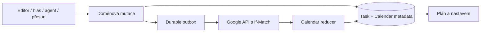
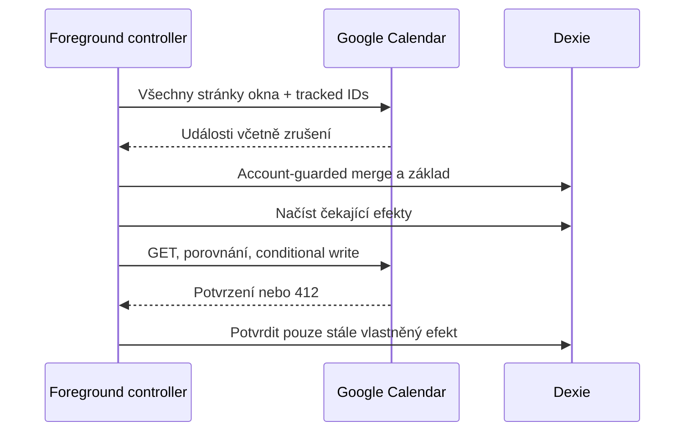
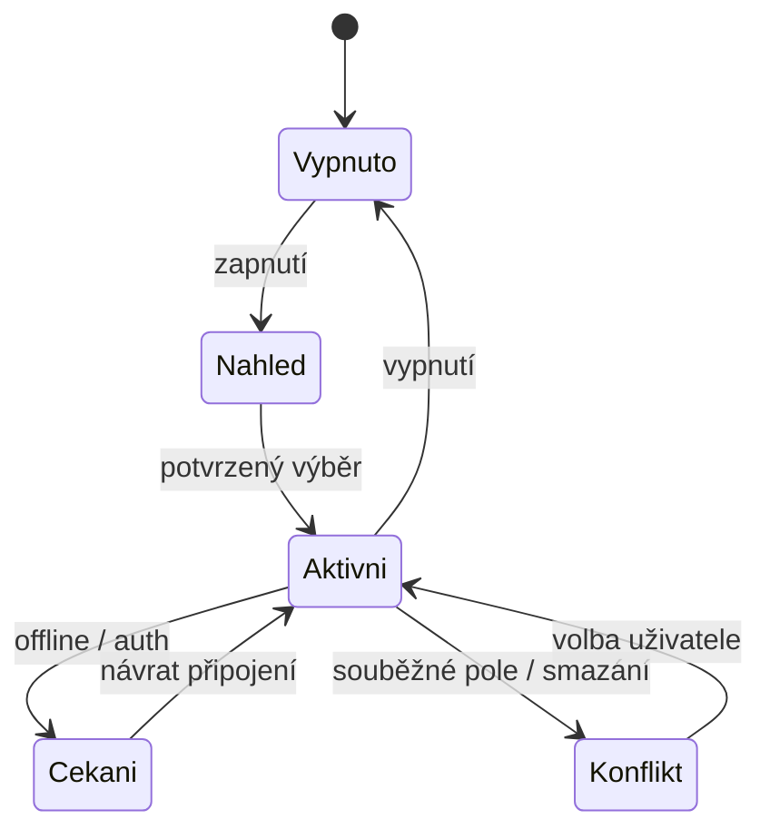

# Obousměrná synchronizace Google Kalendáře - Plan

## Goal Capsule

Objective: Uživatel upravuje svůj plán v Battleplanu i v Google Kalendáři a při používání Battleplanu vidí stejné schůzky a naplánované bloky práce.

Means: Browserová synchronizace primárního kalendáře navazující na současnou frontu zápisů (KTD1).

Autorita: Aktuální pokyny uživatele, projektové AGENTS.md, přijatá varianta A ze studie, tento plán. Hostitel provede implementaci, ověření, review a připraví PR. Sloučení do main není součástí této změny. Zastavit závislou práci pouze při neřešitelném riziku ztráty dat nebo potřebě nové produktové volby.

## Product Contract

### Summary

Battleplan načítá události z připojeného Google účtu a přenáší změny schůzek a naplánovaných úkolů zpět. Uživatel propojení zapne v nastavení a před prvním exportem vybere existující položky.

### Problem Frame

Dosavadní integrace zapisuje některé položky do Googlu, ale nevrací jeho změny. Dva nezávislé plány vyžadují ruční přepisování a mohou se rozcházet.

### Key Decisions

- **Varianta A.** Zachovat provoz současné PWA. Governs R1. (session-settled: user-directed — chosen over serverová varianta B: uživatel vybral první variantu studie.)
- **Primární kalendář a bloky práce.** Governs R2, R3. (session-settled: user-approved — chosen over více kalendářů a export úkolů přes Tasks API: doporučení první varianty zachovává přesný čas úkolů.)

### Requirements

#### Přenos a aktivace

- R1. Synchronizace běží při otevřené viditelné aplikaci a obnoví se po otevření, návratu na kartu, připojení k síti a ručním obnovení.
- R2. Synchronizuje se primární kalendář ověřeného Google účtu.
- R3. Naplánované lokální úkoly se přenášejí jako události; nativní Google Tasks zůstávají samostatnou integrací.
- R4. Nové běžné Google události se importují jako schůzky.
- R5. První zapnutí nabídne datumový rozsah a výběr existujících položek k exportu.
- R6. Nové a uživatelem upravené naplánované úkoly a schůzky se po zapnutí přenášejí automaticky.

#### Shoda a bezpečné změny

- R7. Přesun i délka bloku mají v obou aplikacích stejný význam, včetně celodenních dat a časů mimo pracovní viewport.
- R8. Opakovaný přenos a přenos ze druhého zařízení nevytvoří druhou kopii stejné položky.
- R9. Změny různých společných polí se sloučí; rozpor stejného pole čeká na explicitní volbu uživatele.
- R10. Import zachová interní poznámky, checklist, urgentnost a lokální dokončení.
- R11. Export zachová Google hosty, RSVP, Meet, místo a existující připomínky.
- R12. Zrušení schůzky se přenáší jako archivace, s konfliktem při souběžné úpravě.
- R13. Smazání bloku úkolu v Googlu ponechá úkol a potlačí automatické vytvoření jeho bloku.
- R14. Offline stav a změna přihlášeného účtu nesmějí zapsat cizí nebo opožděný výsledek.

#### Zobrazení

- R15. Opakované, vícedenní a cizím organizátorem spravované události se zobrazují jen pro čtení a otevírají v Googlu.
- R16. Nastavení ukazuje poslední kontrolu, čekající změny, konflikty a potřebu přihlášení.

### Acceptance Examples

- AE1. Úkol s koncem 15:00 a délkou 60 minut vytvoří 14:00–15:00. Posun v Googlu na 16:00–17:00 uloží v Battleplanu konec 17:00.
- AE2. Google mění název, Battleplan popis: obě změny zůstanou. Dva různé nové názvy nabídnou výběr a žádný se sám nezahodí.
- AE3. Smazání pracovního bloku v Googlu ponechá rozpracovaný úkol; další automatická kontrola blok neobnoví.
- AE4. Vícedenní událost má jednu identitu a zobrazí se ve všech dotčených dnech. Její otevření vede do Googlu.
- AE5. Opakovaný import ani ztracená odpověď po insertu nezvýší počet položek.

### Scope Boundaries

Bez serveru a bez garance běhu po zavření aplikace. Úpravy sérií, výběr více kalendářů a sjednocení s nativními Google Tasks nejsou součástí první varianty. Google oprávnění a případné obnovení přihlášení používají existující OAuth cestu.

### Sources

- Přijatá studie: `docs/research/2026-10-09-google-calendar-two-way-sync-feasibility.md`.
- [Google Events](https://developers.google.com/workspace/calendar/api/v3/reference/events), [list](https://developers.google.com/workspace/calendar/api/v3/reference/events/list), [conditional updates](https://developers.google.com/workspace/calendar/api/guides/version-resources), [recurring events](https://developers.google.com/workspace/calendar/api/guides/recurringevents).

## Planning Contract

### Key Technical Decisions

- KTD1. Použít stávající doménové mutace a account-bound durable outbox. Příjem změn dostane vlastní reducer bez echo efektů. Zachovává dosavadní lease/fence a protokolovou revizi; nový obecný synchronizační framework by nepřidal potřebnou záruku. Realizuje R1, R14. (session-settled: user-directed — chosen over backend s centrální frontou: přijatá varianta A funguje v PWA.)
- KTD2. Task rozšířit o Calendar metadata s účtem, kalendářem, posledním společným základem, přesným intervalem, readonly příznakem, potlačením exportu a konfliktem. Metadata patří stejnému záznamu, takže potvrzení importu nezávisí na další cache tabulce. Nezahrnovat je do veřejné protokolové projekce ani porovnání doménového obsahu Drive snapshotů.
- KTD3. Nový export odvozuje Google ID deterministicky ze suggestionOccurrenceKey u návrhů, jinak z portable publicId, vždy s účtem, kalendářem a generací. Původní přidělená ID zachovat. Soukromé extendedProperties přenášejí kanonickou identitu, původ a typ. Calendar import odvozuje publicId ze scoped event identity; neidentifikuje položky podle názvu ani sufixu.
- KTD4. Jediný čistý převod používá sémantický interval úkolu a schůzky. Přesný Google interval a pásmo zůstávají v metadatech; pro běžné editovatelné položky vzniká lokální plán. Celodenní konec je exkluzivní civilní datum. Nevyplněný čas není 09:00 a nevyplněné datum není dnešek.
- KTD5. Před PATCH/DELETE porovnat aktuální Google obsah s posledním základem a současným lokálním stavem. Přenášet jen vlastněná veřejná pole a používat If-Match. Konflikt uložit, odchozí efekt ponechat čekající a UI nabídne Google nebo Battleplan. Při 412 znovu načíst a vyhodnotit. Starší čekající snapshot nesmí přepsat novější lokální obsah ani příchozí sloučení.
- KTD6. Načítat všechny stránky konečného okna, standardně 30 dní zpět a 180 dní dopředu, s expanded recurring instances. Propojené položky mimo okno ověřit samostatným GET. Chyba, chybějící stránka nebo pouhá absence z výsledků není smazání. SyncToken není pro tuto první variantu potřebný.
- KTD7. Zapnutí uloží account-scoped aktivaci a výběr exportu. Historie nevzniká automaticky z prvního observer scanu; Drive/inbound import sám nezakládá nový export. Nové autorské změny sleduje společná doménová hranice, aby editor, hlas, agent, Suggestions a přesuny měly stejnou politiku.
- KTD8. Zrušený event ID nelze bezpečně znovu PATCH. Explicitní obnovení smazaného bloku vytvoří novou generaci stabilního cíle; automatický běh obnovu neprovádí. Konflikt smazání má význam podle R12 nebo R13.

### High-Level Technical Design

Následující schémata vyjadřují hranice a pořadí; konkrétní názvy pomocných funkcí zvolí implementace.

### Assumptions and Risks

- Běžný jednodeňový Google event lze editovat přes současný meeting model. Nezobrazit editaci u modelově nepodporovaného intervalu, recurring instance nebo foreign organizer.
- Obnovení legacy propojení vyžaduje první GET základ; bez historického základu přednostně přijmout Google nebo nabídnout konflikt, nikdy automaticky opravovat starý čas tasku přepsáním Googlu.
- Přenositelné párování přežije Drive backup; device-local přihlášení a aktivace se nezálohují. Timestamp merge se nesmí použít jako rozhodnutí o Calendar konfliktu.
- Živý test OAuth může vyžadovat origin povolený ve stávajícím Cloud projektu. Lokální API fixtures ověří chování; chybějící živý test se uvede jako konkrétní mezera, ne jako provedený test.
- Všechna zařízení musí používat novou verzi. Starý klient neposkytuje novou konfliktovou ochranu.

### Patterns to Follow

`taskMutations.ts`, `externalEffectOutbox.ts`, `googleService.ts`, `calendarUtils.ts`, `taskBackupSnapshots.ts` a `taskMerge.ts`; zejména `docs/solutions/architecture-patterns/durable-task-mutations-and-google-effects.md`, `docs/solutions/architecture-patterns/view-independent-task-backup.md`, `docs/solutions/integration-issues/tasks-immutable-drive-snapshots.md`.

## Implementation Units

### U1. Přesné mapování a atomická lokální politika

Goal: Všechny autorské změny vytvářejí správný, stabilně identifikovaný Calendar záměr.

Requirements: R3, R6–R8, R10, R13, R14; KTD2–KTD4, KTD7.

Files: Pod `battle-plan/src/`: `db.ts`, nové Calendar model/map helpers a testy, `services/taskMutations.ts`, `services/taskNormalization.ts`, `services/taskBackupSnapshots.ts`, `services/taskMerge.ts`, `services/taskDriveBackup.ts`, `hooks/useTaskBackup.ts`, `utils/taskBackupRevision.ts`, `utils/taskHistory.ts` a jejich testy.

Approach: Definovat společná pole a metadata, oddělit veřejný obsah od lokálních poznámek. Zachytit explicitní plán před fallback normalizací. Zapojit account-scoped export policy do transakční hranice bez účasti importu. Přidat typ a kanonickou identitu KTD3 do Calendar payloadu. Ochránit metadata před starými editor drafts a readonly záznamy před doménovými zápisy. Calendar tombstone zachovat při cleanupu, dokud nelze prokázat dokončené smazání bez konfliktu. Calendar-importované řádky a cizí Calendar metadata se smějí automaticky zálohovat pouze do jejich vlastnického Google účtu; stejná projekce určuje backup revision.

Execution note: Začít důkazem chybného časového exportu a charakterizací legacy párování.

Test scenarios: AE1; all-day přes DST; přes půlnoc a mimo viewport; nezadané datum; meeting versus task; stable ID na dvou DB včetně různých publicId stejného návrhu; vypnutý sync; vybraná historie versus nový authored task; Drive import bez efektů; readonly agent/editor mutace odmítnuta; více než 30 dní offline s čekajícím DELETE; přepnutí A→B nezálohuje importovaný Calendar obsah A do Drive B.

Verification: Čisté mapovací testy a Dexie mutation/backup testy.

### U2. Google čtení a zápisy s ochranou konfliktů

Dependencies: U1.

Goal: Google API poskytuje úplné ověřené čtení a bezpečně doručuje odchozí změny.

Requirements: R8, R9, R11–R14; KTD3, KTD5, KTD6, KTD8.

Files: `services/googleService.ts`, `services/externalEffectOutbox.ts`, nové reconciliation helpers a související testy.

Approach: Stránkovaný list a GET přes existující auth guard. Porovnání sdílených polí před conditional write; acknowledgement aktualizuje pairing/baseline, nikoli starý doménový snapshot. Připomínky a Google metadata zachovat. Legacy missing type payload zůstává kompatibilní. Retry starého insertu nesmí převzít cizí event se stejným ID.

Execution note: Rozšířit řízené HTTP fixture scénáře před změnou adaptéru.

Test scenarios: Neúplná pagination nedá částečný úspěch; account switch mezi stránkami; create response lost/409; Google-only změna a různá pole; conflict stejného pole; DELETE versus remote edit; 412; pořadí více queued edits; late acknowledgement; hosté/Meet/reminders/internal notes zachovány.

Verification: Google service a outbox scénáře v Node test runneru.

### U3. Příjem událostí a foreground koordinátor

Dependencies: U2.

Goal: Google změny se objeví v lokálních datech a stav synchronizace je dostupný UI.

Requirements: R1, R2, R4, R5, R9, R12–R16; KTD1, KTD2, KTD5–KTD8.

Files: Nová `services/googleCalendarSync.ts`, `hooks/useGoogleCalendarSync.ts`, testy a úprava koordinace `hooks/useExternalEffectOutbox.ts`.

Approach: Account-guarded import přes mutation layer s nulovými exportními efekty. Jedna foreground cesta deduplikuje timer/focus/online/manual trigger. První úspěšný pull před automatickým exportem. Preview je read-only a potvrzení vybírá export historii. Conflict resolution pracuje s aktuálními revizemi, ne snapshotem otevřeného dialogu. Nečíst native Tasks navíc.

Execution note: Testovat import a lifecycle pomocí injektovaného API a fake IndexedDB.

Test scenarios: AE2–AE5; tracked event přesunutý mimo okno; missing list versus explicit cancelled/404; offline edits; failed initial pull nepovolí export; focus burst/remount; account switch před commit; task block deletion a explicit recreation; recurring/multiday readonly metadata; lokální tombstone proti starému Google výsledku; přenos přes Drive bez echo.

Verification: Reducer, coordinator, settings activation a resolution testy.

### U4. Nastavení a zobrazení v plánu

Dependencies: U3.

Goal: Uživatel zapne propojení, vybere export, vidí stav a bezpečně řeší konflikty.

Requirements: R5, R9, R15, R16; AE4.

Files: Pod `battle-plan/src/`: `App.tsx`, `components/SettingsModal.tsx`, nová Calendar sync panel komponenta, `components/WeeklyCalendar.tsx`, `components/TaskCard.tsx`, `components/FocusEditor.tsx`, editor/command guards a calendar projection helpers.

Approach: Použít současné surface komponenty a téma. Preview s rozsahem dat a nezaškrtnutou historií. Konflikt nabídne obě verze a jejich konkrétní rozdíly. Readonly položka otevře Google link, nemá drag/resize ani lokální completion/delete. Vícedenní projekce používá jeden Task ve všech dotčených dnech. Editor potlačeného úkolu nabídne explicitní akci „Obnovit blok v Kalendáři“ podle KTD8.

Execution note: Ověřit skutečně vykreslené nastavení a plán; matematiku projection ověřit čistými testy.

Test scenarios: Zapnutí bez Google přihlášení; preview prázdného rozsahu; výběr a opakované potvrzení; nastavení při offline/auth expired; conflict resolution bez ztráty notes; readonly block na mobile i desktop; dvoudenní interval s exkluzivním koncem; nativní Google Tasks editor nezměněn.

Verification: UI smoke plus projection testy a celkové quality gates.

## Verification Contract

Z `battle-plan/`: `npm run lint`, `npm test`, `npm run build`, `npm run check:theme`, `npm run test:agent-protocol`. Nejprve relevantní Node testy, potom jeden úplný průchod po integraci. Výchozí stav zaznamenat před produkční změnou.

Browser smoke: Settings activation/preview, primary week import, readonly open, conflict choices, theme a narrow viewport. API mocks obsahují syntetická data, žádné soukromé Calendar události ani tokeny.

Živý Google test má zahrnout create/move/delete oběma směry a jedno task 14:00–15:00. Pokud není přístupné autorizované testovací přihlášení nebo povolený origin, uvést zbývající manuální scénář v PR.

## Definition of Done

- U1–U4 splní své Verification a acceptance examples.
- Nová funkce je opt-in; žádná historie se neposílá před potvrzeným výběrem.
- Neexistuje automatický overwrite stejného konfliktního pole ani resurrection zrušeného eventu.
- Testy, lint, build, theme a protokolové konformance projdou; případné výchozí nesouvisející selhání je konkrétně oddělené.
- Browser smoke je zaznamenán s jeho skutečným rozsahem.
- Review nálezy jsou vyřešené a nepoužitý experimentální kód odstraněný.
- Integrační rozhodnutí a limity jsou uloženy v `docs/solutions/integration-issues/`.
- PR obsahuje změnu, validaci a případnou mezeru živého OAuth testu. Předchozí nesouvisející pracovní soubory zůstávají mimo commity.
