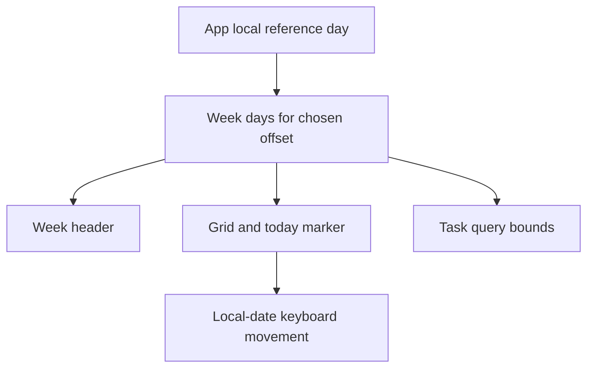

# Code Audit Reliability Fixes - Plan

## Goal Capsule

- **Objective:** Voice recording ends when users stop or leave it, saved work uses the intended local date, deleted tasks stay deleted, the weekly view stays consistent across midnight, and Drive operations cannot cross Google account sessions.
- **Means:** Repair existing behavior boundaries using current patterns (KTD1–KTD4) and verified account/session guards.
- **Authority:** User request to inspect and improve the code, repository instructions, then this plan.
- **Execution profile:** Small independent fixes with regression proof before production edits; the root agent owns integration and final verification.
- **Stop conditions:** An unexpected data migration or product change to local data ownership requires a separate scoped decision. The user's follow-up explicitly includes the confirmed Drive cache/account bug.
- **Delivery:** Local branch `codex/code-audit-2026-10-09`; no deployment in this work.

---

## Product Contract

### Summary

Close the confirmed recorder resource leaks, local-date mistakes, unsafe task deletion retention, weekly rollover mismatch, and Drive account cache reuse.
Preserve existing domain behavior and make each fix reviewable through focused regression coverage.

### Problem Frame

The app can keep the microphone active after navigation, save completed work under the wrong date, resurrect a task deleted while offline, and show a weekly header that disagrees with the grid.
These failures arise from resource ownership and date/data lifecycle boundaries that the current happy-path checks do not cover.

### Requirements

**Voice lifecycle**

- R1. Stopping, cancelling, failing to start, or leaving a voice recorder releases its microphone, recorder handlers, audio context, and pending work.
- R2. Within a recorder instance, concurrent start attempts cannot create a second live recorder or change the target of the recording already in progress.

**Local civil dates**

- R3. Manual WorkLogs default to the user's current local date and reject blank, impossible, or future dates at save time.
- R4. Task dictation context and legacy Calendar fallback use the same local civil-date interpretation as their local weekday/time context.

**Deleted tasks**

- R5. A task deleted while offline remains suppressed after restart and later merging with older immutable Drive snapshots, regardless of its age.

**Weekly view**

- R6. The weekly header, grid, task query, today marker, and keyboard movement agree on the local reference day, including Sunday-to-Monday rollover.

**Drive account sessions**

- R7. Folder IDs, JSON read caches, service file IDs and in-flight operations belong to the verified Google account/session. Logout, re-consent and A → B → A invalidate old operations before further remote writes or local/UI effects.
- R8. An account change inside a Drive import transaction rolls back that transaction; a newly signed-in account can initialize and fetch independently. Ordinary teardown in the same session still acknowledges already applied agent mutations.

### Scope Boundaries

- Included: the confirmed behavior areas, Drive account/session ownership and their solution documentation.
- Deferred to follow-up work: bundle optimization and broader redesign.
- Considered and not built: a tombstone compaction protocol. The existing merge semantics provide no safe acknowledgement boundary, so removal cannot satisfy R5.
- Dependency upgrades, external account operations, and deployment are outside this delivery.

---

## Planning Contract

### Key Technical Decisions

- KTD1. **Own one recorder attempt at a time.** Use an invalidatable attempt/session identity and explicit cleanup for both pending acquisition and active resources; stale callbacks cannot publish a blob or revive state (R1–R2). Repair the separate `SuggestionCard` recorder and preserve voice target ownership in its callers.
- KTD2. **Reuse local-date and row-validation helpers.** Prefer `toLocalIsoDate` from `battle-plan/src/utils/monthCalendar.ts`; strengthen `getWorkLogRowIssues` where needed and call it from the manual form with its existing optional-people behavior (R3–R4). Keep the manual 24-hour limit and existing crew metadata semantics.
- KTD3. **Retain task tombstones.** Remove the age-only startup purge and its unsafe selection helper, since snapshot absence is not deletion and no acknowledgement protocol proves compaction safe (R5). No schema migration or remote file deletion is needed.
- KTD4. **Anchor weekly calculations to the current local day.** Give `getWeekDays` an explicit reference date and drive header, query dependencies, and grid from the same App clock; avoid re-querying merely for each 30-second tick (R6). Keyboard date serialization uses the local civil-date helper.

### High-Level Technical Design

```mermaid
stateDiagram-v2
    [*] --> Idle
    Idle --> Acquiring: start
    Acquiring --> Recording: current attempt resolves
    Acquiring --> Idle: cancel or failure
    Recording --> Stopping: stop
    Recording --> Completed: browser stop
    Stopping --> Completed: final audio
    Completed --> Idle: consume or cancel audio
    Recording --> Idle: failure or cancellation
    Acquiring --> Discarded: cancellation or unmount
    Discarded --> Idle: release late acquired tracks
```

### Assumptions and Sequencing

The four audit findings are the initial improvement scope chosen by the orchestrator from the user's broad request.
U1–U4 have no functional dependency; integrate their shared App/date-helper edits sequentially.
Use existing Node source-rewriting hook-test conventions rather than introducing a new test framework.

### Risks and Evidence

Keeping tombstones increases retained local history; safe compaction remains deferred because deleting an unacknowledged marker loses an offline deletion.
Real microphone behavior and real authenticated Drive transport need browser/account verification beyond simulated unit tests.
Read `docs/solutions/integration-issues/tasks-immutable-drive-snapshots.md`, `docs/solutions/design-patterns/weekly-task-history-and-rescheduling.md`, `docs/solutions/ui-bugs/worklog-voice-proposal-cancel-reopen.md`, and `docs/solutions/best-practices/helper-extraction-test-rewriting-2026-07-04.md` before the relevant unit.
The weekly-history document currently claims stale tombstones can be cleaned; U3 corrects that claim under the immutable-snapshot contract.

---

## Implementation Units

### U1. Release and fence voice recording resources

**Goal:** Deliver R1–R2 using KTD1.

**Dependencies:** None.

**Files:** `battle-plan/src/hooks/useAudioRecorder.ts`, new `battle-plan/src/hooks/useAudioRecorder.test.ts`, `battle-plan/src/components/SuggestionCard.tsx`, new `battle-plan/src/components/suggestionRecorder.test.ts`, `battle-plan/src/components/TaskCard.tsx`, `battle-plan/src/components/FocusEditor.tsx`, affected callers in `battle-plan/src/App.tsx`.

**Approach:** Make recorder cleanup cover pending acquisition, partial initialization, active recording, and unmount; route the independent SuggestionCard recorder through equivalent ownership rules. Commit the caller's voice target only when the attempt is accepted, so rejected or duplicate starts cannot retarget live audio.

**Execution note:** First reproduce acquisition-after-unmount and double-start with controllable media promises; assert actual track stops and handler disposal rather than only a successful return value.

**Patterns:** Existing hook tests and the voice cancellation solution cited above.

**Test scenarios:**

- Unmount while microphone permission is pending; resolving it later stops every acquired track and publishes no blob/state.
- Issue two starts before acquisition resolves and again during recording; there is only one active acquisition/session and its target remains unchanged.
- Fail MediaRecorder or AudioContext initialization after acquiring a stream; tracks, recorder, context, timers, and callbacks are disposed.
- Stop a normal recording; it emits one blob and releases resources, while cancellation/navigation cannot reopen a proposal.
- Unmount SuggestionCard during recording and during acquisition; it releases the microphone and ignores stale callbacks.

**Verification:** Focused tests prove ownership/resource cleanup; desktop and mobile smoke confirm start, stop, cancel, and navigation behavior.

### U2. Validate manual dates and use local prompt dates

**Goal:** Deliver R3–R4 using KTD2.

**Dependencies:** None.

**Files:** `battle-plan/src/components/worklogs/WorkLogForm.tsx`, `battle-plan/src/utils/workLogBatch.ts`, new `battle-plan/src/utils/workLogBatch.test.ts`, new `battle-plan/src/components/worklogs/WorkLogForm.test.ts`, `battle-plan/src/services/geminiService.ts`, new `battle-plan/src/services/geminiService.test.ts`, `battle-plan/src/services/googleService.ts`, `battle-plan/src/services/googleService.test.ts`.

**Approach:** Replace UTC-derived today strings at the confirmed sites; validate date and existing form constraints before persistence via the shared row validator. Add civil-calendar validity without parallel validation rules; use a reference-date input where deterministic future-date checks need it.

**Execution note:** Test the real save boundary and actual `processAudio` prompt with stubs; helper-only checks do not prove callers use the helper.

**Test scenarios:**

- At Prague 00:30, the initial form date, maximum date, task prompt date, and undated Calendar fallback identify the local day.
- Save a valid current/past date and `2024-02-29`; reject empty input, `2026-02-29`, `2026-02-30`, and a date after local today without writing a WorkLog.
- Preserve manual project/hour validation, optional people, decimal comma input, and voice crew calculation metadata.

**Verification:** Focused tests and browser manual WorkLog creation prove the date is correct and invalid save attempts leave storage unchanged.

### U3. Preserve offline task deletion markers

**Goal:** Deliver R5 using KTD3.

**Dependencies:** None.

**Files:** `battle-plan/src/App.tsx`, `battle-plan/src/utils/taskHistory.ts`, `battle-plan/src/utils/taskHistory.test.ts`, `battle-plan/src/services/taskDriveBackup.test.ts`, `battle-plan/src/services/taskMerge.test.ts`, `docs/solutions/design-patterns/weekly-task-history-and-rescheduling.md`.

**Approach:** Remove startup age-based tombstone deletion and obsolete retention assertions. Prove a retained old deletion wins over an older live snapshot, and explain the compaction limitation in the existing solution document.

**Test scenarios:**

- Delete an ordinary task offline, advance more than 30 days and restart; its marker still exists before any upload.
- Merge that retained marker with an older live immutable snapshot; there is one deleted identity and no visible resurrected task.
- Preserve completed rows, calendar-linked deletion behavior, repeated imports, and existing identity conflict handling.

**Verification:** Regression checks cover startup retention plus the real merge reducer/import path; no age-only task purge remains.

### U4. Keep weekly state consistent across midnight

**Goal:** Deliver R6 using KTD4.

**Dependencies:** None; coordinate date-helper imports with U2.

**Files:** `battle-plan/src/utils/calendarUtils.ts`, `battle-plan/src/utils/calendarUtils.test.ts`, `battle-plan/src/components/WeeklyCalendar.tsx`, new `battle-plan/src/components/weeklyCalendarDate.test.ts`, `battle-plan/src/App.tsx`, new `battle-plan/src/appWeeklyRollover.test.ts`.

**Approach:** Derive week bounds from the explicit local day and include that day in memo/live-query dependencies. Reuse the same anchored days for both headers and the grid; replace keyboard UTC serialization.

**Test scenarios:**

- Advance Sunday `2026-10-11` 23:59 to Monday `2026-10-12` 00:01 without touching navigation; header, grid dates, today marker, and task query move to the new week together.
- Cross a weekday midnight; the today marker updates while query bounds remain consistent.
- Preserve past/future `weekOffset` navigation, year/month boundaries, and local civil-day behavior through DST.
- Move a task with the keyboard in UTC+14; persisted target is the chosen local day, including month/year rollover.

**Verification:** Regression tests exercise consumers and helper output; browser smoke checks weekly navigation and keyboard rescheduling.

---

## Unit 5 — Drive account cache and asynchronous ownership

**Approach:** Namespace persistent folder cache by verified account and use the existing OAuth generation for in-memory ownership. Ignore legacy ownerless folder cache. Guard the full read/merge/write chain in task backup, WorkLogs, suggestions, registry and legacy agent bridge; fence local transactions before commit and discard stale UI callbacks. Retain existing shared local data semantics and Drive readiness diagnostics.

**Test scenarios:** Account A → B, logout, same-account new login and A → B → A; overlapping initialization; late folder/media reads and late publication acknowledgement; new-session independent fetch with old cleanup; transactional rollback; UI hydration before settings writes, badge refresh and voice/decision continuations. Use controlled external I/O and actual source callbacks/database operations.

**Limit:** Already dispatched external requests cannot be undone. Tests must prove no subsequent request or success result is admitted under a replacement session. Live Google OAuth/account switching requires real credentials and is not simulated as a passing transport check.

## Verification Contract

Run from `battle-plan/` after focused regressions pass.

| Gate | Command or check | Required outcome |
|---|---|---|
| Lint | `npm run lint` | Zero errors; no new warnings |
| Full tests | `npm test` | Existing suite and added regressions pass |
| Build | `npm run build` | Typecheck and production build succeed |
| Theme | `npm run check:theme` | Theme contract passes |
| Protocol | `npm run test:agent-protocol` | Validator freshness and conformance pass |
| Browser | Desktop/mobile: navigation, WorkLog add, voice start/stop/cancel, weekly move, reload offline | No console failure, leaking recorder, incorrect local date, or visible deleted task |

The supplied baseline at `ac4ac34e7dc3bb170f19f3da626e6f4f0fa3672e` is 726 passing tests, zero lint errors with one existing warning, and a successful build with an 820.04 kB main bundle.
The baseline archive is `.codex-tmp/audit-2026-10-09-161350/baseline.zip`, with all 353 archived files verified by SHA256.
Do not stage or modify unrelated untracked `.pnpm-store/`, `battle-plan/pnpm-lock.yaml`, or `pnpm-workspace.yaml`.
State clearly if genuine microphone permission or authenticated multi-device Drive verification cannot run in this session; simulated proofs do not establish those transport/browser outcomes.

---

## Definition of Done

R1–R8 hold, the units have focused regression evidence, and every applicable verification gate passes.
The final diff contains only these fixes, meaningful tests, and their plan/solution documentation; abandoned experiments are removed.
Document the non-trivial lifecycle/deletion/date lessons in `docs/solutions/` and report exact verification limits.
The user receives a concise change summary and reviewable local result; deployment remains a separate action.
