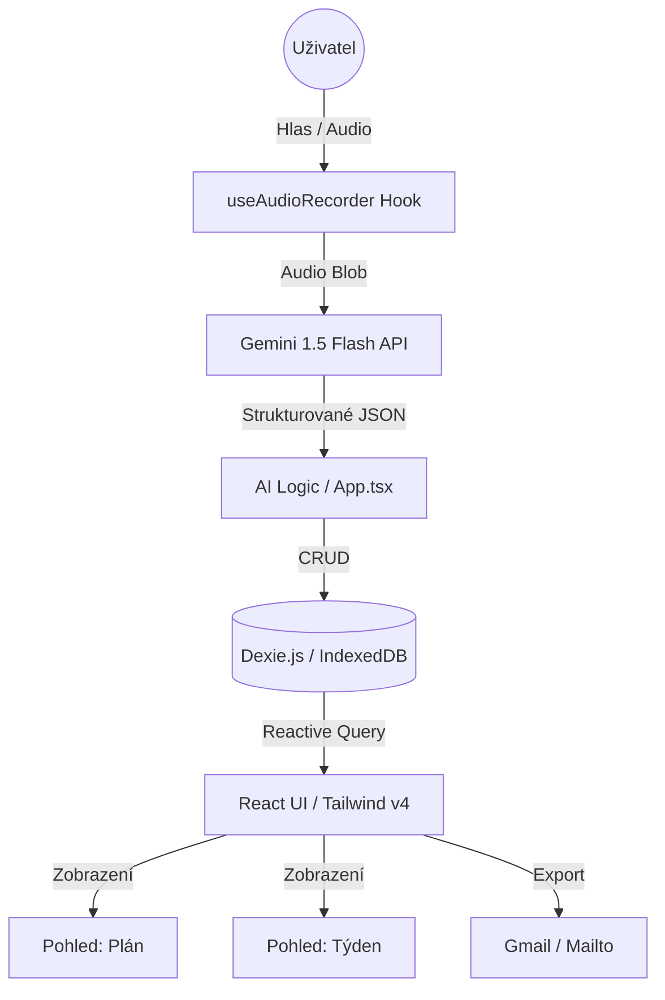
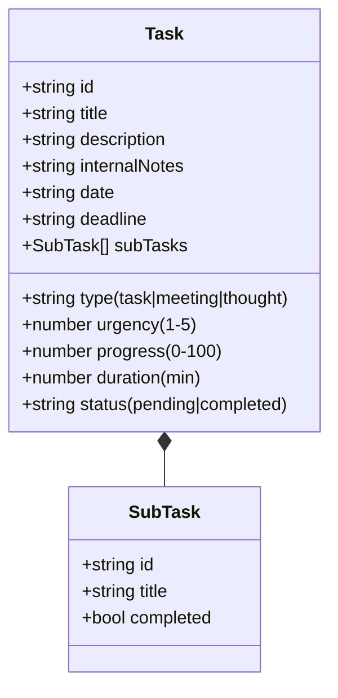

# BITEVNÍ PLÁN: Master Projektový Dokument

Tento soubor je jediným zdrojem pravdy pro projekt. Obsahuje zadání, architekturu i aktuální stav implementace.

---

## 1. ARCHITEKTURA SYSTÉMU

### 🛠️ Schéma proudění dat

### 🧠 Datový Model (Task Objekt)

---

## 2. ROADMAPA & PROGRES (Dashboard)

**Aktuální celkový progres: ~70%**

| Fáze | Modul | Stav | Klíčová Funkcionalita |
|-------|------|-------|-----------------------|
| **1** | **Základní Motor** | ✅ 100% | Audio recording, PWA základy, Tailwind v4. |
| **2** | **AI Mozek** | ✅ 100% | Proaktivní Gemini analýza, extrakce poznámek. |
| **3** | **Bitevní UI** | ✅ 100% | Bojový plán (list) vs. Týden (mřížka), Export. |
| **4** | **Google Prep** | ⏳ 0% | OAuth2, Integrace s Google Kalendářem. |
| **5** | **Cloud Sync** | ⏳ 0% | Synchronizace přes Google Drive. |

---

## 3. DETAILNÍ STAV IMPLEMENTACE

### ✅ Hotovo a Funkční
1.  **Hlasové vstupy:** Perfektní čeština, AI chápe i složitá zadání z auta.
2.  **Duální navigace:** 
    *   **Plán:** Časová fronta práce (seřazeno dle data a urgence).
    *   **Týden:** Čistá 7-denní mřížka s progres-bary (skrývá hotové věci).
3.  **Hybridní data:** Automatické generování podúkolů a interních zápisů pro schůzky.
4.  **Chytrý Export:** Jedním klikem vygenerovaný "hezky naformátovaný" email do Gmailu.
5.  **Plynulé UI:** Premium glassmorphism design, animace přes Framer Motion.

### 🚧 Aktuálně rozpracováno (Phase X - Polish)
- [ ] **Haptika:** Vibrace při dokončení úkolu (pro mobil).
- [ ] **Zvuky:** Decentní zvukové potvrzení "úkol uložen".
- [ ] **Notifikace:** Lokální upozornění prohlížeče na deadliny.

### 🎯 Příští velký milník: Fáze 4 - Google Integrace
- Realizace OAuth2 přihlášení.
- Automatické odesílání schůzek vytvořených hlasem do Google Kalendáře.

---

## 4. TECHNICKÝ STACK
- **Frontend:** React + Vite + TypeScript.
- **Styling:** Tailwind CSS v4 (Moderní, CSS-first).
- **Animace:** Framer Motion (Glassmorphism & Micro-interactions).
- **Databáze:** Dexie.js (Lokální, bezpečná, reactive).
- **AI:** Google Gemini 1.5 Flash (v1beta API).
- **Ikony:** Lucide React.
